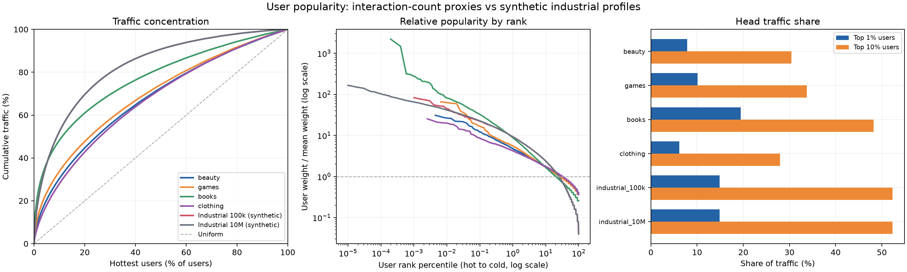
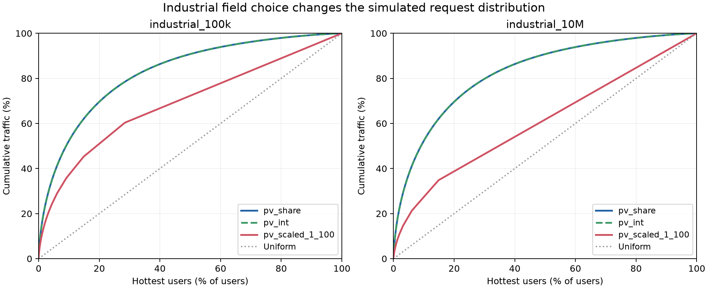

# 用户访问热度分布

统计对象是输入用户抽样的相对权重，所有数据均为全量统计；曲线绘制最多取 800 个排名点。



## 数据口径

- Beauty、Games、Books、Clothing：累加各自 `timestep_map.json` 中每个用户的交互次数。这是历史交互活跃度代理，不是线上请求日志；时间步是用户内部交互时间的排名，不是全局秒级时间。
- industrial：CSV 来自归档中的合成数据生成流程。`pv_share` 是构造的访问占比，`pv_int` 是整数化访问次数，`pv_scaled_1_100` 是再线性缩放、取整到 1–100 的值。原 input generator 使用最后一个字段。生成分布参数是否来自真实工业统计，归档脚本未说明。
- 主图使用 industrial 的 `pv_int`，下方单独比较全部三个字段。每个数据集内部将权重归一化后比较。

## 全量统计

头部用户按权重从高到低排列，人数向上取整。Gini 越大，热度越集中；“50% 流量所需用户”越少，集中程度越高。

| 数据集 | 热度字段 | 用户数 | Top 1% 流量 | Top 10% 流量 | Top 20% 流量 | Gini | 50% 流量所需用户 |
|---|---|---:|---:|---:|---:|---:|---:|
| beauty | interaction_count | 22,332 | 7.88% | 30.40% | 44.69% | 0.352 | 24.61% |
| games | interaction_count | 15,264 | 10.10% | 33.78% | 47.69% | 0.385 | 22.04% |
| books | interaction_count | 509,334 | 19.43% | 48.25% | 60.97% | 0.537 | 11.09% |
| clothing | interaction_count | 39,230 | 6.17% | 28.00% | 42.79% | 0.335 | 26.03% |
| industrial_100k | pv_share | 100,000 | 14.85% | 52.32% | 69.61% | 0.653 | 9.06% |
| industrial_100k | pv_int | 100,000 | 14.85% | 52.32% | 69.61% | 0.653 | 9.06% |
| industrial_100k | pv_scaled_1_100 | 100,000 | 10.10% | 37.21% | 50.98% | 0.379 | 19.11% |
| industrial_10M | pv_share | 10,000,000 | 14.89% | 52.28% | 69.60% | 0.653 | 9.07% |
| industrial_10M | pv_int | 10,000,000 | 14.89% | 52.28% | 69.60% | 0.653 | 9.07% |
| industrial_10M | pv_scaled_1_100 | 10,000,000 | 7.15% | 27.35% | 38.75% | 0.213 | 34.69% |

## 对 KV cache 实验的含义

按 Gini 排列，四个交互数据集的热度集中程度从高到低为：books → games → beauty → clothing。

- industrial_100k：采用 `pv_int` 时 Top 10% 用户占 52.32% 流量；采用原脚本的 `pv_scaled_1_100` 时为 37.21%。这些字段不能当作等价的热度权重。
- industrial_10M：采用 `pv_int` 时 Top 10% 用户占 52.28% 流量；采用原脚本的 `pv_scaled_1_100` 时为 27.35%。这些字段不能当作等价的热度权重。

`pv_scaled_1_100` 的 min-max 缩放依赖样本最大值，并带有向下取整和最小值 1。因此增加合成用户数量时，该字段归一化后的集中程度也可能改变；对比缓存策略时应固定热度字段，避免把缩放效应误认为用户规模效应。

这些图只描述用户边际热度。实际缓存命中还取决于复访时间、其他请求造成的复用距离、历史 KV 大小、缓存容量和淘汰策略。这里的用户热度排序不能直接解释为命中率。

对于“历史稳定、候选更新”的实验，可将热度权重归一化后分配每个用户的访问次数，再单独安排复访时间。若只选用户子集，应在子集内重新归一化，且记录选取方法。

## Industrial 字段对比



## 复现与产物

```bash
uv sync --group analysis  # 新环境安装分析依赖
.venv/bin/python -m GR.analyze_heat --output GR/analysis
```

- `heat_summary.csv` / `heat_summary.json`：完整统计，含频次分位数、Top 5%/50% 和有效用户数。
- `heat_curves.csv`：图中使用的排名曲线采样点。
- `heat_provenance.json`：输入路径、字节数、SHA-256、统计时间和工具版本。
- 两张图各提供 PNG、SVG、PDF。

有效用户数定义为 `1 / sum(p_u**2)`，衡量边际分布的集中程度，不代表实际去重用户数。归一化概率为 `p_u = w_u / sum(w)`；本次没有使用额外的热度指数变换（相当于 α=1）。
