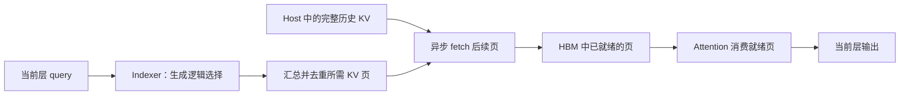

# 系统工程背景：固定 history 的 GR 候选方案

供系统编码与实验执行者维护。内容合并自 `1971047` 的工程材料，整理于 2026-10-02；
原实验日期、run ID 和测量边界保留，本次未运行新实验。固定 history、变化 candidate、
prefill-only 是候选方案，其代表性与模型、数据适配仍待确定。研究判断与任务取舍以
[四环节状态表](../../status.md)、[研究叙事](../../research.md)和[研究路线](../../roadmap.md)为准。

更新日期：2026-10-01。本文记录项目的研究问题、方案和待验证假设；实现与实验进度见
[系统状态](implementation-status.md)，候选开发方案见[后续计划](implementation-roadmap.md)。

## 场景与目标

这里保留一种待讨论的生成式推荐 KV cache offloading 方案。每个请求由 user history 和
candidate items 组成，只执行 prefill，不包含自回归 decode。同一用户会多次访问，
暂定 history 在这些请求之间保持不变，每轮只更新 candidate items。首次访问需要
计算 history；后续访问可以复用 history 的 KV，只计算新的 candidate 后缀。
代码中的 `extend` 指这段后缀的 prefill。

长 history 的重复计算代价很高，缓存复用因而有较大价值。但 HBM 能容纳的用户历史
有限：活跃用户增多或 history 变长后，系统必须在保留缓存、重新计算和从主存加载之间
取舍。我们的目标是在有限 HBM 预算下保留更多可复用的用户历史，同时降低复访请求
延迟，并提高系统可持续服务的吞吐。

[GR 请求生成器](../../../GR/README.md)已经提供固定 history、变化 candidate、用户热度和
模拟到达时间。当前输入主要是合成文本，没有真实推荐标签，适合构造系统负载；推荐
质量需要另行评价。

## 问题：计算稀疏，存储和搬运仍然昂贵

本项目考察的 sparse attention 根据当前 query 动态选择一部分历史 KV。它减少了
attention 的计算量，但不同请求、层和 query 可能选择不同位置，因此仍需保存完整
历史 KV，不能把当前未选中的记录永久丢弃。这里讨论的是这种动态选取、完整保存的
方案，不将结论推广到所有 KV 压缩或淘汰方法。

KV offloading 将历史移到 HBM 之外，扩大可保存的缓存容量。若每次请求都先搬回全部
历史，传输开销会抵消复用的收益。Sparse on-demand loading 只取回本次 attention
选中的 KV，可以减少搬运量；但在长 history 下，剩余的稀疏搬运仍可能成为瓶颈。

这里还有一个依赖限制：当前层的 indexer 需要先得到 query 并生成选择，系统才知道
本层应加载哪些 KV。当前层输出又影响下一层 query，准确的稀疏地址通常不能任意提前
获得。直接沿用“提前搬下一层完整 KV”的调度，难以充分利用这种按需访问。
在选块之后再串行执行 fetch 和 attention，仍会把两段开销都放在关键路径上。

## 核心方案：async sparse KV fetching attention

我们提出在当前层内部重叠 sparse KV fetching 与 attention。Indexer 给出逻辑选择
后，系统汇总本次 query batch 的稀疏访问，将相同 KV 页去重，再调度按需加载。
Attention 按数据依赖消费已经就绪的页；处理这些页时，fetch 继续搬运后续需要的 KV。
这样可以把部分加载时间隐藏在 attention 计算期间。

图中的 fetch 与 attention 是流水执行的两个工作阶段。我们不要求提前预测下一层
的准确选择，也不要求等本层全部选中 KV 到齐后才开始计算。系统必须保留原有 selection、
causal mask、CIS bias 和数值语义；加载调度不能通过少取 KV 或改变选块来获得收益。

可以用一个简化模型理解预期收益。令 `I` 为 indexer 开销，`F` 为选中 KV 的加载时间，
`A` 为 attention 时间。串行路径约为 `I + F + A`；理想流水路径接近
`I + max(F, A) + 调度与同步开销`。后者只是理想化估计：首批数据等待、末尾排空、
页依赖以及 fetch/compute 对 GPU 资源的竞争都会削弱收益。最终要用完整调用和请求
延迟验证，不能仅凭时间线存在交集判断方案有效。

按需加载和重叠执行解决两个不同问题：前者减少需要搬运的 KV，后者缩短搬运在关键
路径上的暴露时间。完整 history 仍保存在 host backing 中，HBM 用于当前工作集和
必要的常驻状态。跨请求历史复用负责避免重复计算，有限 HBM 管理负责约束 GPU 容量。

## 需要解决的具体问题

**稀疏并集有多大。** 单个 query 只读少量 KV，不代表整批 candidate 的并集也小。
需要量化 query、KV head、层和复访请求之间的选择重合度，并据此确定实际搬运量。
当前完整 staging 路径要求每层 attention fetch 对同一个历史 KV 向量只从 host
读取一次，后续共享通过 HBM 完成；未来有限页池若引入重复调入，需要单独统计其代价。

**加载与消费如何配合。** 过大的任务粒度会推迟首批数据就绪，过小的粒度会增加领取、
同步和调度成本。Fetch 还会占用线程、寄存器和访存资源。需要在数据及时到达与
attention 计算效率之间找到合适的安排，保证跨 CTA 的可见性和执行进度。

**有限 HBM 如何维持复用。** 历史 KV、indexer 派生记录和 staging 都占用容量。
需要明确哪些状态常驻、哪些可从 host 恢复，以及页何时可以被淘汰或覆盖。NOSA
目前的单层完整地址 staging 还没有解决有限页池问题，多用户常驻的派生状态也需要预算。

**复访如何保持语义一致。** 可复用对象是相同模型语义下的完整 token 前缀，包含固定
指令和 history。仅凭 `user_id` 相同不足以判定可复用；checkpoint、位置编码和 sparse
policy 等也必须兼容。每轮 candidate 是临时后缀，不能进入下一轮固定 history，
其 KV 和派生状态要一起隔离或回退。

## 研究假设与验证方式

下表是接下来需要回答的问题，不是已经得到的结论。

| 研究问题 | 需要观察的证据 |
| --- | --- |
| 按需加载能减少多少 offload 流量？ | 同一选择语义下，全历史加载量、精确稀疏并集大小和实际逻辑搬运量；覆盖不同 history/candidate 长度与层 |
| 层内重叠能否降低加载造成的延迟？ | 完整 query batch 的稀疏并集一次 fetch 后计算，与 async 方案的完整调用延迟；同时核验真实 copy/compute 工作区间和唯一读取 |
| 算子收益能否保留到完整模型？ | 从独立空 cache 构建 sparse prefix，比较 resident、串行 sparse offload 和 async sparse offload；计入 indexer、缓存更新及同步 |
| 更多缓存容量能否改善服务能力？ | 在相同 HBM 预算、请求序列和输出要求下，测量冷启动与复访、缓存命中、排队、请求延迟分位数和稳定吞吐 |

Resident sparse 是数据已在 HBM 时的计算对照；串行 sparse offload 是衡量 async
收益的主要对照。若候选方案拆分 query tiles，还应加入相同拆分的串行对照，避免把
任务划分变化误归因于 overlap。容量实验可另比较不保留历史而重新 prefill 的方案，
以及全历史加载方案，但应按各自回答的问题解释结果。

所有对照使用相同模型、输入和 sparse policy。完整 NOSA 含 CIS bias，与 dense 模式
的差别不止稀疏 mask；dense 可提供背景成本，不能直接当作只切换搬运策略的对照。
HBM 统计也要区分 cache 分配量和包含权重、激活、workspace 的进程峰值。

## 当前证据与论文主张的边界

当前优先在 NOSA、SM90/Hopper 上实现和验证，DeepSeek V3.2 用于检验另一种 KV
布局与稀疏访问方式。NOSA 已实现同一 cooperative CUDA kernel 内的唯一页 stripe
fetch 与 persistent FA3 attention；host backing 使用 pinned local DRAM。

已有完整 32 层 NOSA、64K prefix + 1K extend 的 resident/offload 数值验收。
2026-09-30 的固定单层输入回放也证明，在 L0/L15/L31 上，融合方案相对整批稀疏并集
串行方案降低了完整算子调用延迟。具体 run ID、测量范围和目录迁移后的复测状态见
[系统状态](implementation-status.md)与[offload 报告](../../../experiments/nosa_offload_overlap/README.md)。

这些证据支持继续研究层内异步加载。跨请求 history KV 复用、NOSA 有限 HBM 页池及其
完整模型 offload 性能、多用户 serving 性能仍未完成；CXL/RDMA 也未验证。
“提高容量后改善吞吐和请求延迟”目前是系统研究目标。与既有 sparse attention、
KV offloading 和 prefetch 工作的差异还需文献核对，本文不据此宣称首创或给出已有
文献尚未支持的比较结论。
