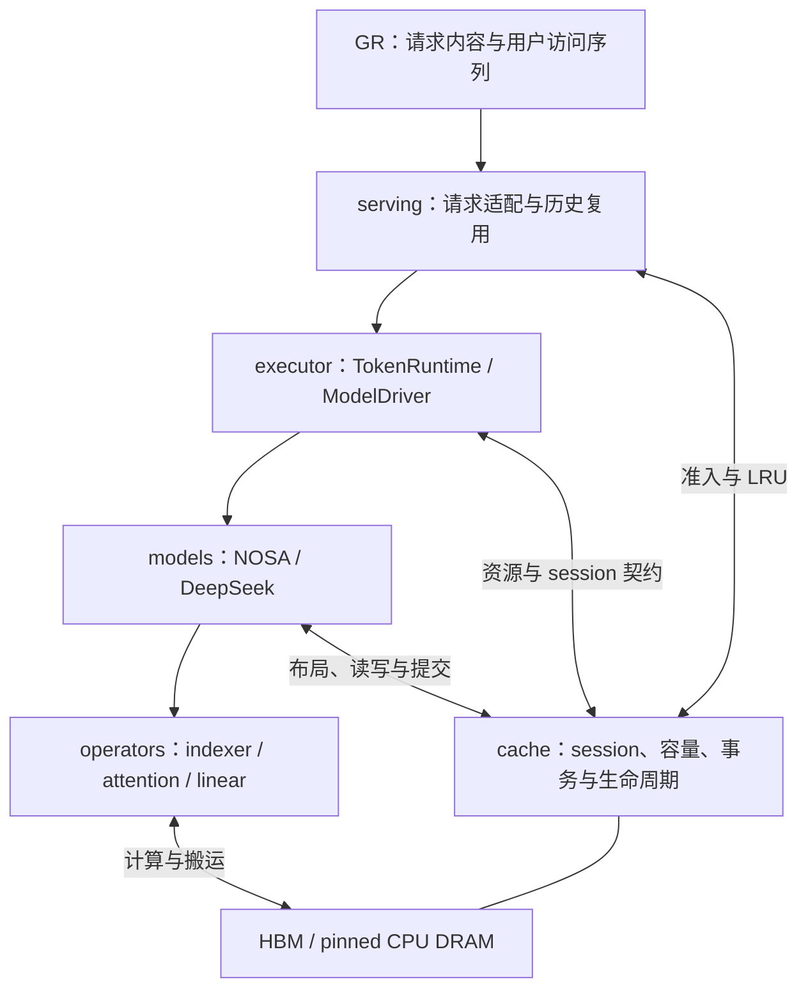
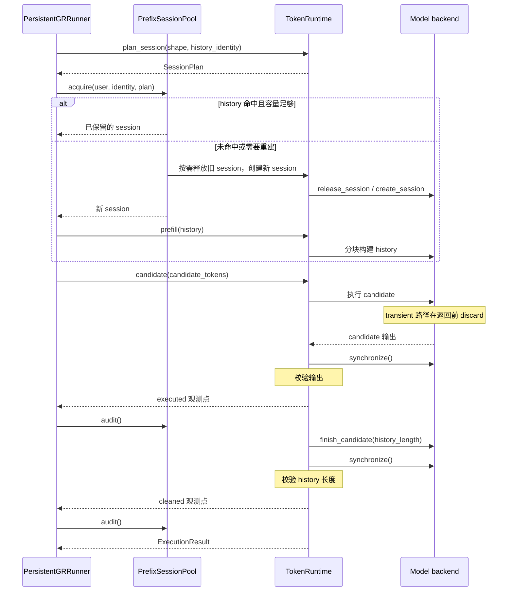

# 系统架构

系统面向 sparse attention offloading，使用 NOSA 和 DeepSeek V3.2 验证 HBM 与
CPU DRAM 之间的缓存管理和稀疏搬运。公共代码统一请求执行、容量计划和资源生命周期，
各模型保留自己的计算循环、稀疏选择、KV 布局与搬运调度。

当前运行方式是单进程、单 GPU 上的本地串行执行，主要平台为 SM90 / Hopper。
跨请求 serving 使用固定 history、变化 candidate 的负载；该负载对真实 GR 场景的
代表性仍待确定。本文说明实现结构与调用关系，性能和数值结果见文末的实验入口。

## 1. 模块与依赖

下图表示主要调用关系。缓存与资源管理贯穿请求执行和模型计算，实际分配与设备操作
由模型 backend 提供。

| 模块 | 职责 | 主要入口 |
| --- | --- | --- |
| `GR/` | 构造请求内容、history/candidate token 与用户访问顺序 | [GR 说明](../GR/README.md) |
| `serving/` | 解析用户身份和固定前缀，组织准入、历史复用、请求执行与关闭 | [persistent.py](../serving/persistent.py)、[runner.py](../serving/runner.py) |
| `executor/` | 提供 token 执行契约，校验输入、输出和 session 状态；提供普通分块执行入口 | [runtime.py](../executor/runtime.py)、[model_executor.py](../executor/model_executor.py) |
| `models/` | 模型结构、权重加载、位置编码、稀疏语义、KV 布局与执行循环 | [NOSA](../models/nosa/README.md)、[DeepSeek](../models/deepseek_v32/README.md) |
| `cache/` | 容量声明、用户池与 LRU、缓存事务、共享缓冲和资源生命周期 | [缓存说明](../cache/README.md) |
| `operators/` | 数学参考、GPU 计算、host record 搬运与融合 offload 算子 | [算子索引](../operators/README.md) |

普通层按模型组织：NOSA 的 decoder、RMSNorm、SwiGLU 和 attention 适配位于
`models/nosa/`，DeepSeek 的对应实现位于 `models/deepseek_v32/`。
轻量公共 attention 契约位于
[models/attention_contracts.py](../models/attention_contracts.py)，顶层没有 `layers/`。

`evaluation/` 提供共享验收、来源记录和内存审计工具；`experiments/` 保存实验入口与报告；
`tests/` 和各模块测试目录承担正确性回归。共享第三方依赖位于 `3rdparty/`，
权重与 tokenizer 使用独立本地路径。这些部分的入口见[项目 README](../README.md)。

## 2. 执行入口与公共契约

### 多用户请求

[PersistentGRRunner](../serving/persistent.py) 通过
`backend.runtime_driver(policy)` 取得 `ModelDriver`，再创建 `TokenRuntime`。
两个模型目前都使用 [BackendAdapter](../executor/adapters.py) 连接已有 backend。
构造 driver 时显式声明共享资源、candidate 策略、输出工作量、容量规划与分配方式。

[ModelDriver](../executor/contracts.py) 提供以下操作：

| 操作 | 含义 |
| --- | --- |
| `plan_resources` / `allocate_resources` | 规划并分配 backend 共享资源 |
| `plan_session` / `create_session` | 根据请求形状和 history 身份规划并创建用户 session |
| `prefill` | 从空 session 构建已提交的 history |
| `candidate` / `finish_candidate` | 计算变化后缀并结束临时状态，保留已提交的 history |
| `append` | 将新增 token 持久追加到 session |
| `session_usage` / `shared_usage` | 返回 session 与共享资源的用量 |
| `release_session` / `close` | 释放 session 或 backend 资源 |

`TokenRuntime` 校验资源计划身份、session 是否有效、token 输入、请求上限、输出形状
以及执行后的有效长度。`OutputSpec` 声明返回哪些 hidden/logits、是否执行 LM head
及输出所有权。当前 `BackendAdapter` 提供 owned 输出，两个模型的 serving prefill
默认都不返回 hidden。NOSA candidate 默认返回全部 normalized hidden；DeepSeek 还执行
末 token LM head，但默认只返回 hidden，显式请求 `logits="last"` 时才返回 logits。

实际的层循环、cache 事务和设备操作留在模型 backend 中。公共 adapter 转发这些调用，
runtime 保留请求边界上的同步和校验；模型在自己的执行 lease 中处理内部异步完成。
DeepSeek 的 block/replay 循环与 NOSA 的模型 forward 因此可以保持各自结构。

### 普通逐请求推理

[ModelExecutor](../executor/model_executor.py) 接收 token tensor，借助 `CacheManager`
分配 session，并用 `run_chunks` 执行 prefill 或 extend。它不读取 GR 请求，也不管理用户 LRU。
一次 forward 的所有层成功后由模型提交本次 cache step；某个后续 chunk 失败时，
已完成 chunk 的提交仍保留。

[GRRunner](../serving/runner.py) 使用这一入口，每个请求创建并释放 cache；
`serving.run_multi_user` 使用持久 runner 跨请求保留 history。
NOSA 固定 P/NH 实验通过独立的 `NosaFixedServingBackend` 接入持久 runner，
与公共多用户 CLI 的普通 NOSA budget 路径分开。

## 3. 一次持久请求怎样执行

runner 初始化时先生成 `ResourcePlan`，检查共享预留，再绑定唯一准入 owner 并分配共享资源。
随后创建 `PrefixSessionPool`，把 session 的创建、释放和计量委托给 runtime。

请求包含 `user_id`、`input_ids` 和 `stable_prefix_tokens`。
runner 校验 token 与长度，把输入分成固定 history 和变化 candidate，并计算 history
token 身份。相同用户的 history 身份变化或保留容量不足时，旧 session 会被替换。

candidate 策略由 driver 预先声明。transient 路径在 backend 返回前 discard 未提交
状态，早于图中的 `executed` 观测点；后续 `finish_candidate` 保留 truncate 检查和
清理边界。其他路径先持久 extend，再由 `finish_candidate` truncate 回固定 history。
成功返回时，runtime 检查 session 的有效长度仍等于原 history 长度，供后续请求复用。

首次访问和复访由用户访问次数决定，cache 命中是另一个独立指标。被 LRU 淘汰后再次
访问的用户仍属于复访，只是需要重建 history。`GR/` 生成相同前缀本身不代表 KV 已命中。

## 4. 资源所有权与容量

### 三种生命周期

| 资源 | 持有者与内容 | 生命周期 |
| --- | --- | --- |
| backend 共享资源 | 模型权重、按方案分配的 HBM pool、staging 和 workspace；权重单独计量 | 由 backend/model 持有，用户 session 只借用共享执行缓冲 |
| 用户 session | history KV、indexer 派生记录、映射、有效长度与资源注册信息 | 跨请求保留，整用户 LRU 淘汰或关闭时释放 |
| 请求临时状态 | candidate 数据与计算中间结果；其 storage 可来自 session 或 backend 预留 | 逻辑状态随本次操作结束，底层 buffer 可在安全完成后复用 |

共享资源先规划和分配，再创建独立 session。释放一个 session 不释放 backend 的共享缓冲。
runner 关闭时先关闭用户池，释放全部 session，再解绑 owner 并结束 runtime；
外层调用 `backend.close()` 释放共享资源。构造失败只回滚本次新建资源，保留此前已有的有效资源。

### 计划、计量与准入

[capacity.py](../cache/capacity.py) 中的主要类型为：

- `AllocationSpec`：模型声明的一项 storage 或 alias，包括形状、dtype、所有者和预留信息。
- `ResourcePlan`：backend 共享预留、容量策略和执行上限。
- `SessionPlan`：请求的 history 身份、保留长度、字节预留及页/token 配额；同一份计划用于准入和实际分配。
- `CacheFootprint`：HBM 与 DRAM 的字节数。
- `ResourceUsage`：模型返回的计费用量、可选 storage 用量、host 页数、HBM token 数及所有者类别。

[PrefixSessionPool](../cache/prefix_pool.py) 按用户 session 做 LRU，并核对各 session
及共享资源是否超过预留。它支持两种容量模式：

| 模式 | 准入依据 |
| --- | --- |
| 字节预算 | HBM / CPU DRAM cache 硬预算，同时核验实际用量与预留 |
| 固定 P/NH | 模型提供的 host 页或 HBM history-token 配额；字节预留仍接受审计 |

P 表示 HBM-only 的 history-token 配额，或 offload 每层的历史 HBM 槽数；
NH 表示 host history-token 配额，具体分配方式由模型决定。
这两种模式的容量和命中结果使用各自的计量口径。

cache 预算覆盖 KV、indexer 派生记录、映射、staging、cache scratch 和待提交 append。
模型权重与普通计算 activation 单独报告。PyTorch allocated、reserved 和设备已用量
也分别观测；`ResourceUsage` 的计费结果不能代表整个进程的设备内存峰值。

### 生命周期与异步完成

[ResourceLifecycle](../cache/lifecycle.py) 管理 backend 身份、资源代次、准入 owner、
session 注册和当前操作。执行、修改和释放通过 lease 协调，拒绝过期 session、
错误 owner 或互相冲突的操作。重新分配资源后，旧代次的 session 不能访问新 storage。

公共状态机调用模型提供的 `prepare` / `drain` 回调。实际 stream/event 等待、
allocator 检查和 storage 释放由相应模型或 provider 执行。
[staging.py](../cache/staging.py) 管理命名 record 双缓冲：写入前等待旧 consumer，
消费前等待 copy ready；其 session、generation 和 layer 身份随 lease 校验。

`cache/allocator/` 中的分配边界和新 snapshot 检查目前由 NOSA 显式调用。
这些工具位于公共目录，不表示 DeepSeek 也执行相同的 allocator 扫描。

## 5. 模型、选择与 offload

### 公共 attention 契约

[attention_contracts.py](../models/attention_contracts.py) 定义：

- `BlockSelection`：逻辑 block IDs、block size 和可选 `valid_mask`，NOSA 用 mask 排除不足预算时的填充项。
- `TokenSelection`：逻辑 `token_ids`，padding 解释及物理地址映射由消费模型负责。
- `AttentionContext`：层号、query 起点、query 长度及辅助状态。
- `Indexer` / `MainAttention`：选择与 attention 的调用接口。

这些类型传递逻辑访问语义，不展开或搬运 KV。`MainAttention` 接收 Q、selection、
cache access 和 context；cache access 可以提供 resident view，也可以提供 host 来源
与 device append，因此 attention 可以在调用内部安排 fetch 与计算重叠。

### NOSA

[layers.py](../models/nosa/layers.py) 组织投影、RoPE、CIS、indexer 和 main attention。
本次 K/V/CIS 先写入 cache 的待提交区，indexer 生成逻辑块选择，attention 读取同一
cache access，之后完成输出投影及 MLP。dense 模式不执行 indexer，使用 resident K/V。

完整 sparse policy 结合 query-aware 选择、query-agnostic CIS 与 attention bias。
resident attention 使用 SM90 native 或显式 Triton 对照；offload 算子可在同一主 kernel
中融合稀疏 host fetch 和 attention，搬运完成的块供后续计算复用。

普通 NOSA budget 的 sparse 路径使用覆盖一层完整逻辑地址的 staging，dense prefetch
使用双 staging，用户历史按 session LRU 管理。固定 P/NH 路径另有逐层 P 槽，
通过逻辑页偏移和 session tag 直接映射，host backing 随 session 分配；
当前要求 H≤P，history 和 prefill chunk 按 64 token 对齐。
固定路径可显式使用纯计算 CUDA Graph，indexer、attention 和 IO 留在图外。

模型入口为 [NosaServingBackend](../models/nosa/execution/adapter.py) 和
[NosaFixedServingBackend](../models/nosa/execution/fixed.py)。

### DeepSeek V3.2

[EchoAttentionRunner](../models/deepseek_v32/attention.py) 保留
indexer → ECHO 预取 → 精确 recall → sparse MLA 的流水线。
它使用 `TokenSelection` 传递精确 token 选择，indexer K/scales 保持 resident，
主 MLA record 可以位于 HBM 或 pinned CPU DRAM。

[SharedSparseTokenPool](../cache/sparse_token_pool.py) 提供共享 host arena 与逐层有限
HBM token pool；session 持有独立映射和索引状态。ECHO 将预取融合在 indexer 内，
消费前精确补取未命中的选择，再复用 device-only MLA kernel。多个 query 的完整并集
超过 pool 时拆分 query 消费，每个 query 的精确选择保持完整。

[DeepSeekServingBackend](../models/deepseek_v32/execution/adapter.py) 自己执行 chunk、
block/replay、final norm、末 token LM head 及 cache 提交或 discard。
[LocalPipeline](../models/deepseek_v32/execution/pipeline.py) 组织本地计算与 cache 访问。
旧本地官方 ECHO 适配已删除。[官方复现](../experiments/deepseek_v32_echo_official/README.md)
使用独立 SGLang，代码与环境位于本地 `3rdparty/ECHO/reproduction/cxldsagr/`，
不装配到本地 backend。ECHO 与 HBM-only 的真实前三层 performance-only 计时均已完成；
两种配置容量不同，不作为等容量对照，数值验收未通过。

两模型的数据布局与缓存能力如下：

| 项目 | NOSA | DeepSeek V3.2 |
| --- | --- | --- |
| 选择粒度 | 逻辑 block，带有效项 mask | 精确逻辑 token IDs |
| 主 KV 与派生状态 | 独立 K/V、CIS 和压缩 indexer 记录 | MLA record、独立 indexer K/scales |
| 融合搬运位置 | offload attention 内 | ECHO indexer 内，消费前保留精确 recall |
| 固定 host 容量实现 | NH 配额下按 session 分配 backing | 预分配共享 host arena，按 session 分配页 |
| HBM 缓存能力 | fixed 路径直接映射，要求完整 history 可放入 P | 有限 token pool、映射与淘汰 |
| 当前 serving 计算工作量 | 全部 candidate normalized hidden | 全部 candidate normalized hidden，加末 token LM head |

`dense_prefetch` 表示预取全部历史或其中的 miss；两模型的 serving 对照仍使用各自的
稀疏 attention 选择。NOSA 的 Full Attention 模式是另一个模型配置。

## 6. 缓存事务与候选语义

普通持久前向按 step 管理 cache：开始待提交写入，依次执行各层，全部层和输出成功后
统一推进有效长度；异常时撤销本次未完成 step。借用共享资源的写入、提交和回滚
均在相应 lease 内进行。

[CacheManager / ResidentCache](../cache/manager.py) 接收模型声明的 `CacheSpec` 或 allocator，
不固定假设 GQA 或 MLA 布局。模型专用 offload cache 管理实际 record 和事务，
[IndexerCache](../cache/indexer_cache.py) 管理派生记录与 scratch 的分配及提交游标，
派生状态随主 KV 一起提交、撤销和截短。

持久 runner 的 candidate 策略由 driver 在构造时确定：

| 模型与配置 | candidate 策略 |
| --- | --- |
| NOSA 普通 budget，全部方案 | `append_truncate`：extend 后截短至 history |
| NOSA fixed P/NH，全部方案 | `gpu_transient`：整批计算后 discard 临时状态 |
| DeepSeek 本地 budget，`echo` / `serial_sparse` | `gpu_transient` |
| DeepSeek 本地 budget，`hbm` / `dense_prefetch` | `append_truncate` |
| DeepSeek 本地 fixed P/NH，全部方案 | `gpu_transient` |

transient candidate 不向 host history 追加主 KV，也不推进已提交 history 长度。
候选 storage 的归属按实际存储方案区分：

- DeepSeek 使用共享 token pool 的 offload 主 KV 候选尾部属于 backend；fixed
  HBM-only 的主 KV 候选尾部属于 session。合并后的 indexer workspace 由 backend 共享。
- NOSA fixed offload 的主 K/V 候选尾部属于 backend，HBM-only 的候选 K/V 属于 session；
  两种路径的 CIS/indexer 候选尾部都属于 session。

driver 保留候选结束调用及同步，确保临时状态结束后 history 长度正确。
公共 adapter 的结束调用仍为 `truncate(history_length)`；transient 路径通过该调用
检查既有状态，不表示候选曾经持久提交。
直接调用普通模型或 `backend.extend` 时，新增 token 继续采用持久追加语义。

## 7. 错误处理与关闭

执行、初始化、编译、认证及 provider 调用失败时，异常向上传播。
系统不自动重试请求、恢复执行或切换 backend；显式 reference 与按支持条件进行的正常
分派保持可用。DeepSeek 的 query 拆分属于保持完整选择的容量调度。

失败后仍执行事务结束、CUDA drain 和安全释放所需的清理。执行与清理同时失败时，
保留原始异常对象及全部清理异常，使用异常组表达多重失败。
持久请求失败会使 runtime session 失效，runner 尝试释放该用户 session 后报错终止。
如果 drain 无法确认异步操作完成，资源会被标记为不可复用，owner、session 和 storage
继续保持可达，避免尚在使用的内存被重新分配。

## 8. 当前运行与验证范围

本地 serving 尚无网络接口、并发批调度或到达队列吞吐测量，存储路径使用 HBM 与 pinned
CPU DRAM；CXL/RDMA 尚未接入。NOSA fixed 的直接映射不提供任意容量下的 token LRU，
完整 offload 调用也未接入 CUDA Graph capture。

NOSA 当前 serving 实验使用完整 32 层 checkpoint。DeepSeek 模型代码保留完整 61 层与
grouped MoE 能力，非 GR benchmark 使用真实 checkpoint 前三层依次传播；GR 对照使用
前三层的独立副本组成十个 dense block，并复制对应 source block 输入，作为工作负载替身。
这些执行范围和输出工作量在各实验中分别记录。

| 阅读入口 | 内容 |
| --- | --- |
| [serving README](../serving/README.md) | 本地 CLI、Python 接口和请求语义 |
| [executor README](../executor/README.md) | token 执行接口与普通分块执行 |
| [cache README](../cache/README.md) | 缓存实现、容量与生命周期 |
| [两模型 cache 管理](../experiments/cache_management/README.md) | 静态 P/NH 规划、存储账本与完整请求内存观测 |
| [NOSA motivation](../experiments/nosa_motivation/README.md)、[DeepSeek motivation](../experiments/deepseek_v32_motivation/README.md) | 固定 history/candidate 的完整请求对照 |
| [NOSA offload overlap](../experiments/nosa_offload_overlap/README.md) | 单层稀疏搬运与 attention 重叠 |
| [DeepSeek 前三层](../experiments/deepseek_v32_mfu/README.md) | 本地真实三层四方法的验收和测量 |
| [独立 SGLang 复现](../experiments/deepseek_v32_echo_official/README.md) | 官方 SGLang 真实前三层的 performance-only 计时，数值验收未通过 |

数值验收、正式计时和 profile 使用独立入口，结果绑定各自源码与运行条件。
架构说明不替代这些测量，也不表示已经验证最大物理容量或真实 GR 任务质量。
全局正确性回归入口为 `bash scripts/run_tests.sh [cpu|gpu|all]`；
研究状态与下一步任务分别见 [status.md](status.md) 和 [roadmap.md](roadmap.md)。
