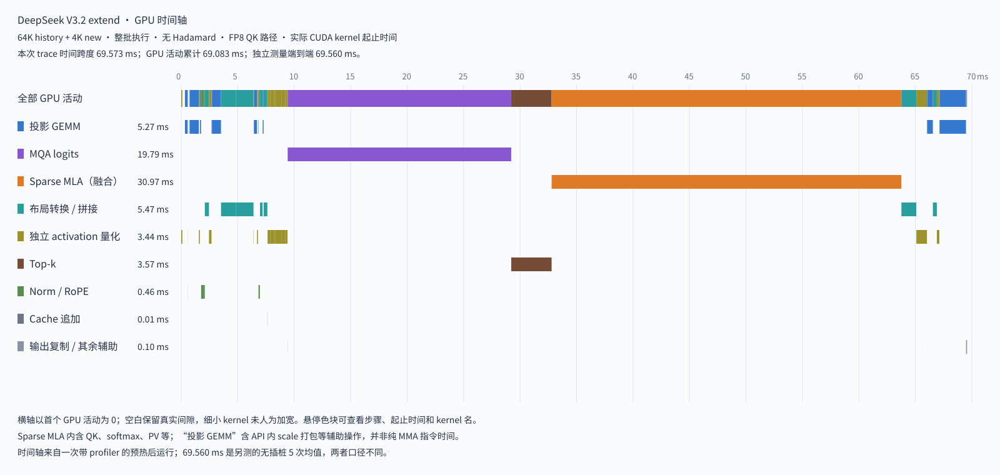

# DeepSeek V3.2 extend：计算步骤、形状与精度

本文描述当前 `model_run/deepseek_v32_extend.py` 的默认 `mode="fp8"` 路径，按源码核对于 2026 年 9 月 8 日。文中的 FP8/MXFP8 沿用本项目约定：E4M3 数据配任意 FP32 scale 称为 FP8；E4M3 数据配 UE8M0 可表达的 scale 称为 MXFP8。代码参数 `fp8` 是已有接口名称，其投影实际使用 MXFP8 量化和 MMA。

当前 runner 处理单条序列的一个 attention 子层。输入、权重和历史 cache 都是随机构造的，Norm 使用单位权重，LayerNorm 偏置为零。它没有执行 embedding、attention 前的整层 RMSNorm、残差相加、MLP/MoE、跨层计算或 LM head。因此，本文的输出是 attention 输出投影，不能直接理解为完整 Transformer 层输出。

## 形状约定

用 `L` 表示 history 长度，`T` 表示新增 token 数；默认关注 `L=4096～65536`、`T=1024～4096`。一个 chunk 覆盖新增输入的 `[s,e)`，有效行数 `m=e-s`，当前可用 cache 长度为 `S=L+e`。默认 chunk 为 512。

投影阶段实际使用 `p=ceil(m/128)×128` 行。下文主流程表写有效形状 `m`；如果是尾块，投影内核会先计算 `p` 行，再截回 `m` 行。这里的 token 轴不代表多条请求的 batch。

| 参数 | 数值 | 含义 |
|---|---:|---|
| hidden dim | 7168 | attention 子层输入、输出宽度 |
| MLA heads | 128 | attention head 数 |
| Q LoRA rank | 1536 | Q 的中间低秩维度 |
| KV LoRA rank | 512 | cache 中的压缩 latent 维度，也是 MLA 输出宽度 |
| NoPE head dim | 128 | 吸收 WK_B 前的 Q NoPE 宽度 |
| RoPE head dim | 64 | MLA 和 indexer 各自旋转的宽度 |
| V head dim | 128 | WV_B 后每个 head 的宽度 |
| Index heads | 64 | indexer 的 Q head 数 |
| Index head dim | 128 | indexer 的点积宽度 |
| top-k | 2048 | 每个 query 选取的 cache token 数上限 |
| cache page size | 64 | 每页 token 数 |

## 精度要分三层看

张量的存储 dtype、量化 scale 的取值范围和硬件指令类型不一定同名。

例如，activation 量化返回的 scale tensor 是 FP32，但每个 scale 已经取整为 2 的整数次幂。按本文约定，这属于 MXFP8 量化。随后 DeepGEMM 把这些 scale 打包成 UE8M0 字节，交给 block-scaled MMA。

Indexer 的 Q/K 也使用这种 power-of-two scale，却没有把 scale 传入 MMA；它在指令外恢复缩放。其量化格式属于本文约定的 MXFP8，执行指令仍是普通 FP8 MMA。

| 路径 | 操作数的量化格式 | MMA/计算类型 | 输出存储 |
|---|---|---|---|
| 8 个 DeepGEMM 投影 | MXFP8 A × MXFP8 W | block-scaled E4M3，FP32 累加 | BF16 |
| Index weights 投影 | BF16 A × BF16 W | BF16 GEMM | BF16，随后转 FP32 |
| Index logits | MXFP8 Q/K，scale 在外部处理 | 普通 E4M3 MMA，FP32 累加 | FP32 |
| MLA QK，当前默认 | latent Q 动态量化、K 使用量化 cache；RoPE 保留 BF16 | latent 用 MXFP8 MMA，RoPE 用 BF16 MMA；均 FP32 累加 | FP32 中间分数 |
| MLA PV，当前默认 | 内核量化的 attention 权重 × E4M3 latent V | 普通 FP8 MMA，FP32 累加及缩放 | BF16 |

这里的 MXFP8 不要求每 32 个元素独立求 scale。当前投影 activation 按 128 元素分组，在连续四个 K=32 的 MMA 块上复用 scale。不要据此把本文格式等同于所有库默认的原生 MXFP8 量化布局。

## 每个 GEMM 类操作的 MMA 精度

下表逐个列出默认 extend 路径中的矩阵乘法。A/B 指送入 MMA 的操作数，而非 Python 接口最初接收的张量。`FP32 → BF16` 表示 MMA 在 FP32 中累加，GEMM 写回时舍入到 BF16。

| 操作 | MMA 的 A × B | MMA scale | MMA 累加／结果寄存器 | 算子输出 | 指令类别 | 峰值参考（TFLOPS） |
|---|---|---|---|---|---|---:|
| WQ_A | E4M3 × E4M3 | 两侧 UE8M0 | FP32 | BF16 | MXFP8，`QMMA.SF` | 487 |
| WQ_B | E4M3 × E4M3 | 两侧 UE8M0 | FP32 | BF16 | MXFP8，`QMMA.SF` | 487 |
| WKV_A | E4M3 × E4M3 | 两侧 UE8M0 | FP32 | BF16 | MXFP8，`QMMA.SF` | 487 |
| WK_B，各 head 分组 | E4M3 × E4M3 | 两侧 UE8M0 | FP32 | BF16 | MXFP8，`QMMA.SF` | 487 |
| Index WQI | E4M3 × E4M3 | 两侧 UE8M0 | FP32 | BF16 | MXFP8，`QMMA.SF` | 487 |
| Index WKI | E4M3 × E4M3 | 两侧 UE8M0 | FP32 | BF16 | MXFP8，`QMMA.SF` | 487 |
| Index weights 投影 | BF16 × BF16 | 无 | FP32 | BF16，随后转 FP32 | BF16 Tensor Core | 123 |
| MQA logits 的 QK | E4M3 × E4M3 | 无；scale 在指令外处理 | FP32 | 加权归约后为 FP32 | FP8，`QMMA` | 247 |
| MLA QK latent，512 维 | E4M3 × E4M3 | 两侧 UE8M0 | FP32 | FP32 中间分数 | MXFP8，block-scaled `mma.m16n8k32` | 487 |
| MLA QK RoPE，64 维 | BF16 × BF16 | 无 | FP32 | 加入同一份 FP32 QK 分数 | BF16，`mma.m16n8k16` | 123 |
| MLA PV latent，512 维 | E4M3 × E4M3 | 无；内核另外量化、恢复缩放 | FP32 | 归一化后为 BF16 | FP8，`mma.m16n8k32` | 247 |
| WV_B，各 head 分组 | E4M3 × E4M3 | 两侧 UE8M0 | FP32 | BF16 | MXFP8，`QMMA.SF` | 487 |
| WO | E4M3 × E4M3 | 两侧 UE8M0 | FP32 | BF16 | MXFP8，`QMMA.SF` | 487 |

8 个投影的已核查 SASS 均为 `QMMA.SF.16832.F32.E4M3.E4M3.E8`；MQA logits 的 SASS 为 `QMMA.16832.F32.E4M3.E4M3`。前者把 UE8M0 scale 交给硬件，后者的 MMA 只接收 E4M3 数据和 FP32 累加器。两者都不是 FP16 accumulate。

Index weights 通过 PyTorch 的 BF16 linear 调用库内核；已有 trace 对应 CUTLASS 的 `cutlass_80_tensorop_bf16_s16816gemm...`，其 MMA 使用 FP32 累加。该路径的具体内核由库选择，本文没有把它标成已逐条核查 SASS 的 DeepGEMM 内核。

当前 runner 显式传入 `bf16_qk=False`。latent Q 在内核中量化成 E4M3，再与量化 cache 的 K 执行 MXFP8 block-scaled MMA；64 维 RoPE QK 仍执行 BF16 MMA，PV 仍执行普通 FP8 MMA。三个部分都使用 FP32 累加。V3.2 的 V 只有 512 维 latent，因此这里没有单独的 RoPE PV。

峰值使用本项目更新后的微基准口径。当前 MLA 的理想矩阵计算时间为：

\[
t_{ideal}=F_{QK,latent}/(487\times10^{12})+F_{QK,rope}/(123\times10^{12})+F_{PV}/(247\times10^{12}).
\]

再用 `t_ideal / t_MLA` 表示按三种峰值折算的有效算力利用率。它包含访存、softmax、量化及同步造成的损失，不等于硬件计数器报告的 Tensor Core 活跃比例。Norm、RoPE、top-k 和 scale 布局转换不是这里统计的 GEMM，也不应套用这三个 Tensor Core 峰值。

## 每次投影前的动态量化

`QuantizedLinear` 和 `GroupedLinear` 接收 BF16 张量，在每次调用时先执行 `quantize_activation`。对每行沿 K 维的一组 128 个元素，计算：

\[
a=\max(\max_i|x_i|,10^{-4}),\qquad
s=2^{\lceil\log_2(a/448)\rceil},\qquad
x_8=\operatorname{E4M3}(x/s).
\]

Triton 实现用 FP32 求最大值、除法及 scale，并通过指数位向上取整，最后把数据写成 `torch.float8_e4m3fn`。返回的数据形状为 `[M,K]`，scale 形状为 `[M,ceil(K/128)]`，scale 的存储 dtype 为 FP32。

默认模式的权重在 runner 初始化时完成量化。普通线性层按 `[N,K]` 的 `128×128` 块共享一个 scale；权重数据仍为 `[N,K]`，scale 为 `[ceil(N/128),ceil(K/128)]`。GroupedLinear 每个 head 分别采用同样的分块规则。权重量化不计入每次 extend 的运行时间。

DeepGEMM 在 GEMM API 内调整 scale 布局，并打包成 UE8M0。已经被截成 2 的整数次幂的正常有限 scale 在这一步不需要再次近似。MMA 计算缩放后的乘积，在 FP32 寄存器里累加，输出转换成 BF16。这一步仍有输入量化误差和输出舍入误差。

下面给出全部投影的逻辑矩阵形状。权重统一按 `[输出维,输入维]` 表示，计算为 `A @ W.T`。

| 投影 | A 的 BF16 形状 | W 的逻辑形状 | 输出 BF16 形状 | A scale / W scale 形状 |
|---|---|---|---|---|
| WQ_A | `[p,7168]` | `[1536,7168]` | `[p,1536]` | `[p,56]` / `[12,56]` |
| WQ_B | `[p,1536]` | `[24576,1536]` | `[p,24576]` | `[p,12]` / `[192,12]` |
| WKV_A | `[p,7168]` | `[576,7168]` | `[p,576]` | `[p,56]` / `[5,56]` |
| WK_B，128 groups | `[128,p,128]` | `[128,512,128]` | `[128,p,512]` | `[128,p,1]` / `[128,4,1]` |
| Index WQI | `[p,1536]` | `[8192,1536]` | `[p,8192]` | `[p,12]` / `[64,12]` |
| Index WKI | `[p,7168]` | `[128,7168]` | `[p,128]` | `[p,56]` / `[1,56]` |
| WV_B，128 groups | `[128,p,512]` | `[128,128,512]` | `[128,p,128]` | `[128,p,4]` / `[128,1,4]` |
| WO | `[m,16384]` | `[7168,16384]` | `[m,7168]` | `[m,128]` / `[56,128]` |

WO 在 WV_B 截回有效行后执行，输入为 `m` 行。内核自己的 tile 边界处理与 runner 对 grouped GEMM 显式补齐到 `p` 行是两回事。Index weights 不在此表中，因为它保留 BF16 权重，直接计算 `[p,7168] @ [64,7168].T`。

## 输入与分块

整次 extend 的输入 `x` 为 `[T,7168]` BF16，`position_ids` 为 `[T]` INT64，内容是 `L,L+1,…,L+T-1`。输出预分配为 `[T,7168]` BF16。

每个 chunk 都依次完成投影、cache 追加、indexer 打分、top-k、sparse MLA 和输出投影，然后进入下一个 chunk。历史 cache 常驻 GPU，只追加当前 token，不重新投影历史 token，也不把整个历史 cache 拼接复制一遍。

尾块投影前补零，并为补出的行提供位置 0。投影结束后逐个截回有效行，补出的 token 不会写入 cache 或参与后续索引。WV_B 前也按 128 行补齐，以满足当前 SM120 masked grouped GEMM 的使用约束。

## MLA 的 Q/K 投影、Norm 与 RoPE

| 顺序 | 计算 | 有效输出形状 | 精度 |
|---|---|---|---|
| 1 | `qr = RMSNorm(WQ_A(x))` | `[m,1536]` | GEMM 和 Norm 输出 BF16 |
| 2 | `WQ_B(qr)`，reshape | `[m,128,192]` | BF16 |
| 3 | 拆成 `q_nope`、`q_pe` | `[m,128,128]`、`[m,128,64]` | BF16 视图 |
| 4 | `WKV_A(x)`，拆分 | latent `[m,512]`、`k_pe [m,64]` | BF16 |
| 5 | 对 latent 做 RMSNorm | `[m,512]` | BF16 输出 |
| 6 | 对 `q_pe` 和 `k_pe` 做 RoPE | 形状不变 | BF16 输出，FP32 cos/sin cache |
| 7 | 拼接 latent 与旋转后的 `k_pe` | `kv_current [m,576]` | BF16 |
| 8 | `q_nope` 转 head-major，执行 WK_B | `[128,m,512]` | MXFP8 GEMM，BF16 输出 |
| 9 | 转回 token-major，拼接 `q_pe` | `q_attn [m,128,576]` | BF16 |

Q 与 KV latent 的 RMSNorm 调用 FlashInfer，沿最后一维归一化，使用各自的 BF16 affine 权重和配置中的 `norm_eps`。归约以 FP32 进行，结果存为 BF16。这里的 Norm 作用于低秩投影结果。

MLA RoPE 只旋转独立的 64 维部分，采用 interleaved 配对，即相邻两维组成一对。`k_pe` 在 128 个 MLA heads 间共享。位置使用全序列的绝对位置，包含 history 偏移。YaRN cos/sin cache 在初始化阶段用 FP32 构造，运行时调用 FlashInfer 查表旋转。

WK_B 把每个 head 的 128 维 NoPE query 映射到 512 维 latent 空间。这是把原本用于展开 K 的线性变换吸收到 Q 一侧。每个候选 token 的 attention 分数在数学上写成：

\[
u_{t,h,j}=q^{latent}_{t,h}\cdot c_j
             +q^{rope}_{t,h}\cdot k^{rope}_j.
\]

两项相加后才进行一次 softmax。RoPE 和 NoPE 没有各自独立的 softmax。内核接收拼好的 576 维 Q，但会按 cache 格式分别处理 latent 与 RoPE 部分。

转置后的 `.contiguous()` 和 `cat` 会分配或复制数据。它们是 profile 中布局操作的主要来源之一，不应只按 GEMM 计算量估算这一阶段时间。

## Indexer 的投影、旋转与 head weights

Indexer 复用经过 RMSNorm 的 `qr`，同时从原始 chunk 输入计算共享 K。

| 顺序 | 计算 | 有效输出形状 | 精度 |
|---|---|---|---|
| 1 | `Index WQI(qr)`，reshape | `[m,1,64,128]` | MXFP8 GEMM，BF16 输出 |
| 2 | `Index WKI(x)` | `[m,128]` | MXFP8 GEMM，BF16 输出 |
| 3 | K 的 LayerNorm | `[m,128]` | BF16 输入输出；affine 为 FP32 |
| 4 | Q/K 前 64 维做 RoPE | Q `[m,64,64]`，K `[m,64]` | BF16 输出 |
| 5 | 与后 64 维拼回，直接送后续量化 | Q `[m,1,64,128]`，K `[m,128]` | BF16 |
| 6 | `Index weights(x)` | `[m,64]` | BF16 GEMM 输出 |
| 7 | 转 FP32，乘 `64^(-1/2)` | `idx_weights [m,64]` | FP32 |

Indexer RoPE 采用 split-half/NeoX 配对：在前 64 维里，第 `i` 维与第 `i+32` 维组成一对。它与 MLA 的 interleaved 布局不同，后 64 维不做 RoPE。

当前已移除 indexer Q/K 的 Hadamard，RoPE 后直接拼回 BF16 向量，再按原来的 power-of-two scale 规则量化。共享投影代码同时用于 extend 和 decode，两条路径均不再执行 Hadamard。

## 追加两份 cache

一个融合 Triton kernel 同时写 MLA cache 和 indexer cache。写入位置是 `[L+s,L+e)`，只读取当前 chunk 的 `kv_current` 与 `idx_k`。

MLA cache 按 64 token 一页分配，物理张量为 `[ceil((L+T)/64),64,1,656]`，外层 dtype 为 UINT8。每个 token 的 656 字节布局如下：

| 字节区间，右端不含 | 内容 | 逻辑形状／精度 |
|---|---|---|
| `[0,512)` | 压缩 latent | 512 个 E4M3，按本文约定属于 MXFP8 |
| `[512,528)` | latent scales | 4 个 FP32 存储的 power-of-two scale，每组 128 维 |
| `[528,656)` | 已做 RoPE 的 K | 64 个 BF16 |

Indexer cache 分成两个连续张量：`index_keys [L+T,128]` 为 E4M3，`index_scales [L+T]` 为 FP32。每个 token 的 128 维共享一个 power-of-two scale，因此其数值量化格式也属于本文约定的 MXFP8。

这两份 cache 的 scale 都由 FP32 计算并向上取整到 2 的整数次幂，物理存储保留 FP32。MLA 的 64 维 RoPE K 不做 E4M3 量化。

当前 benchmark 的 `make_case` 直接随机生成历史 cache。真实前缀应来自先前计算，而这段准备工作不属于每次 extend 的计时范围。

## MQA logits：量化格式与指令精度分别记录

当前 chunk 的 index Q 去掉长度为 1 的轴，得到 `[m,64,128]`。`quantize_index` 对每个 token、每个 head 的 128 维向量求一个 power-of-two scale，得到：

- `q8 [m,64,128]`：E4M3；
- `q_scale [m,64,1]`：FP32 存储，数值满足 UE8M0 格式。

在调用 DeepGEMM 前，代码计算 FP32 的合并权重：

\[
\widetilde w_{t,h}=idx\_weights_{t,h}\,s_{Q,t,h}/\sqrt{128}.
\]

其中 `idx_weights` 已经包含上一节的 `1/sqrt(64)`。这两个缩放因子对应不同维度，不能漏掉其中一个。

`fp8_fp4_mqa_logits` 收到 `(q8,None)`、`(index_keys[:S],index_scales[:S])` 以及合并权重。这里 Q 的 `None` 表示 scale 已并入权重。每个位置的 logits 为：

\[
L_{t,j}=s_{K,j}\sum_{h=0}^{63}\widetilde w_{t,h}
\operatorname{ReLU}\left(\sum_{d=0}^{127}Q_{8,t,h,d}K_{8,j,d}\right).
\]

Q/K scale 为正，K 又在 heads 之间共享，所以这与在点积内恢复 Q/K scale 的数学表达一致。浮点运算的舍入顺序仍由具体实现决定。

这次 profile 对应的内核使用 `QMMA.16832.F32.E4M3.E4M3`，没有 `.SF`。点积以 FP32 累加，ReLU、head 加权、归约和 K scale 恢复也使用 FP32，输出 `logits [m,S]` 为 FP32。Q/K 的量化格式是 MXFP8，指令则是普通 FP8 MMA；当前没有保留恒等 scale 的实验改动。

## 因果边界与 top-k

chunk 内第 `r` 行的绝对位置为 `L+s+r`，其有效 key 范围是 `[0,L+s+r+1)`。`ends [m]` 为 INT32，内容就是这些右开边界，起点数组为全零 INT32。

整个 chunk 的 K 会先写入 cache，但每行只读取自己的有效范围，因此当前 query 可以看到自身，不能看到 chunk 内后续 token。MQA 内核可以按 tile 多做部分计算，但无效位置不参与 top-k。

DeepGEMM 返回的 logits 可能是带行 padding 的视图。当前代码通过 `as_strided` 暴露已分配的完整行宽，避免为了连续布局复制整个 logits；FlashInfer 使用 `ends` 限制有效列。没有请求清理无效 logits，因此未来列和 padding 列不能作为有效结果读取。

`top_k_ragged_transform(..., deterministic=True)` 输出 INT32 索引 `[m,2048]`，每个 query 的索引集合由所有 128 个 MLA heads 共享。常用的 history 至少为 4K，有效候选数足够；更短上下文的不足项用无效索引表示。这里的 top-k 是选择比较操作，不执行 GEMM，也没有把 logits 转成 BF16。

## Sparse MLA：MXFP8 latent QK、BF16 RoPE QK、FP8 PV

后端 Python 接口默认 `bf16_qk=True`，当前 extend runner 显式传 `False`。实际 V3.2 C++ 分派由 traits 固定为 FP8 QK，不受该参数影响；具体参数为：

| 参数 | 形状／类型 |
|---|---|
| `q_attn` | `[m,128,576]` BF16 |
| MLA cache | `[pages,64,1,656]` UINT8 容器，内部布局见前文 |
| `indices` | `[m,2048]` INT32 |
| `d_v` | 512 |
| `sm_scale` | Python 浮点数，由配置计算 |

每个 query 只访问选出的 cache token。latent Q 在内核中量化成 E4M3，Q/K scale 编码为 UE8M0，latent QK 调用 MXFP8 MMA。RoPE Q/K 保留 BF16，调用 BF16 MMA。两项都在 FP32 中累加。

分数缩放使用原始 Q head 宽度 `128+64=192`，不是吸收 WK_B 后的 576：

\[
\alpha=192^{-1/2}.
\]

启用当前 YaRN 长上下文修正条件时，再乘 `(1+0.1×mscale×log(rope_factor))²`。softmax 在每个 query/head 的选中集合内进行，内核维护 FP32 的最大值、指数权重、归一化量和输出累加器，不生成完整 `[m,128,2048]` attention 矩阵。

PV 阶段直接使用 cache 中的 E4M3 latent V。内核把 attention 权重与对应的 V scale 结合，动态求缩放并量化成 E4M3，再用普通 FP8 MMA 做 PV，以 FP32 累加并恢复缩放。这里内部 scale 由 FP32 最大值除以 448 得到，没有使用前面 activation 量化的 power-of-two 取整，因此不要把全部 PV 中间量也统称为 MXFP8。切换 QK 模式不会改变 PV 的 MMA 类型。

主输出 `attn_out [m,128,512]` 为 BF16。接口还返回 FP32 的 `max_logits [m,128]` 和 `lse [m,128]`，runner 只保留第一个返回值继续计算。

## WV_B、WO 与输出写回

`attn_out` 转置并复制成 `[128,p,512]`，按 head 调用 WV_B。每次仍先把 BF16 activation 量化成 MXFP8，然后执行 MXFP8 MMA，结果为 `[128,p,128]` BF16。

结果转回 `[p,128,128]`，截去尾块补出的行并整理连续布局，得到 `[m,128,128]`。展平 heads 后是 `[m,16384]`，再次动态量化成 MXFP8，与 WO 的 `[7168,16384]` 权重做 GEMM，输出 `[m,7168]` BF16。

最后将它复制到 `output[s:e]`。全部 chunk 完成后返回 `[T,7168]`。下一次 extend 若继续同一序列，需要沿用已更新的 cache，并提供正确的 history 长度；当前 benchmark 的 `make_case` 本身负责另建随机 case。

## 已有 profile：耗时、TFLOPS 与峰值利用率

本节为移除 indexer Q/K Hadamard 后的整批重测结果，显式设置 `bf16_qk=False`。核对新旧 trace 发现，两次实际启动的都是 `sparse_mla_prefill_mg_kernel<(ModelType)0,(ComputeMode)0,128,false>`。V3.2 的 C++ 入口不接收该开关，而是使用 traits 中固定的 `USE_BF16_QK=false`；Python 开关只影响 MODEL1 分支。此前把旧 profile 标为 BF16 QK 并按 123 TFLOPS 折算全部 QK，是对分派路径的误判，现已更正。

本次 RTX 5080 测量固定为 `T=4096`，整批处理，不拆分新增 token（运行参数 `chunk_size=4096`，主循环仅执行一次）；history 固定为 65536，处理结束后的 cache 长度为 69632。仅重测这一组，输出有限值检查通过；未做新的数值误差对比。耗时取本次逐步骤 CUPTI profile 的 GPU exclusive 时间，每份 profile 采集一次预热后的运行。端到端时间来自同一报告中另外进行的无插桩 5 次均值。

峰值分母更新为 BF16 123、FP8 247、MXFP8 487 TFLOPS。这是本项目采用的实测峰值参考；下文“利用率”表示实现了该参考算力的多少，不是厂商标称频率下的理论峰值比，也不是硬件计数器的活跃率。

形状均为整批 4096 个新 token 的实际输入形状，耗时覆盖整个批次。普通 GEMM 使用 `(M,N,K)`，grouped GEMM 使用 `G×(M,N,K)`。`S=69632`，每行仍受各自的因果边界约束。

### GPU 时间轴

[打开 SVG 查看完整时间轴](extend_timeline.svg)。图中展示全程及按算子类别拆分的轨迹；色块保留实际起止时间，悬停可查看 kernel 详情。全部 GPU 活动共 105 个，首尾跨度 69.573 ms，累计活动时间 69.083 ms。该 trace 的空白间隙不能全部归因为 launch bound。

### 矩阵计算及其所在算子

投影 GEMM 行包含 DeepGEMM API 内部的 scale 打包和必要的 split-K 归约，不包含外部 activation 量化。Index weights 行沿用原 scope，包含 BF16 GEMM 后的转 FP32 和缩放。Sparse MLA 是融合内核的总时间，现有 profile 无法把 QK、softmax、PV 的耗时拆开；表中不人为分摊。

| 操作 | 整批形状 | MMA 精度（FP32 累加） | ms | TFLOPS | 峰值利用率 |
|---|---|---|---:|---:|---:|
| WQ_A | `(4096,1536,7168)` | MXFP8 | 0.2438 | 369.89 | 76.0% |
| WQ_B | `(4096,24576,1536)` | MXFP8 | 0.8304 | 372.38 | 76.5% |
| WKV_A | `(4096,576,7168)` | MXFP8 | 0.0987 | 342.84 | 70.4% |
| WK_B | `128×(4096,512,128)` | MXFP8 | 0.8303 | 82.77 | 17.0% |
| Index WQI | `(4096,8192,1536)` | MXFP8 | 0.2796 | 368.72 | 75.7% |
| Index WKI | `(4096,128,7168)` | MXFP8 | 0.0353 | 213.14 | 43.8% |
| Index weights 投影及缩放 | `(4096,64,7168)` | BF16 | 0.0824 | 45.61 | 37.1% |
| WV_B | `128×(4096,128,512)` | MXFP8 | 0.5142 | 133.63 | 27.4% |
| WO | `(4096,7168,16384)` | MXFP8 | 2.3556 | 408.42 | 83.9% |
| MQA logits | Q `[4096,64,128]` × K `[S,128]` → `[4096,S]` | FP8 | 19.7871 | 229.22 | 92.8% |
| Sparse MLA（QK + softmax + PV） | Q `[4096,128,576]`，索引 `[4096,2048]` → `[4096,128,512]` | MXFP8 latent QK + BF16 RoPE QK + FP8 PV | 30.9654 | 75.45 | 25.3% |

TFLOPS 按有效矩阵乘加数计算，FMA 计 2 FLOPs：

- 普通投影为 `2×M×N×K`，grouped 投影再乘 group 数；这里 `M=4096`。
- Index logits 为 `2×64×128×[T×L+T×(T+1)/2]`，只计因果有效位置，不把 tile padding 和未来位置的额外运算算成有效 FLOPs。
- MLA QK 为 `2×T×128×2048×576`，PV 为 `2×T×128×2048×512`。当前 history 足以选满 2048 个 token。
- Softmax、ReLU、缩放、比较、量化及布局操作不计入矩阵 FLOPs。MLA 利用率按 `(F_QK_latent/487e12 + F_QK_rope/123e12 + F_PV/247e12)/耗时` 计算，不能把整个 MLA 归到一种精度。

### 量化、Norm、RoPE、布局与 cache

以下列出其余所有有 GPU 耗时的 scope，与上一表互斥。它们没有适用的 MMA 峰值，TFLOPS 和算力利用率记为“不适用”，不填 0%。父 scope 的名字只表示子操作之外的剩余工作，例如 `projection/layout` 不包含已经单列的投影 GEMM、Norm 或 RoPE。

| 操作 | 整批形状 | ms | MMA 精度 | TFLOPS／利用率 |
|---|---|---:|---|---|
| WQ_A activation 量化 | `[4096,7168]` | 0.0966 | 无 | 不适用 |
| Q RMSNorm | `[4096,1536]` | 0.0086 | 无 | 不适用 |
| WQ_B activation 量化 | `[4096,1536]` | 0.0086 | 无 | 不适用 |
| WKV_A activation 量化 | `[4096,7168]` | 0.0874 | 无 | 不适用 |
| KV RMSNorm | `[4096,512]` | 0.0102 | 无 | 不适用 |
| MLA RoPE | Q `[4096,128,64]`，K `[4096,64]` | 0.3123 | 无 | 不适用 |
| WK_B activation 量化 | `[128,4096,128]`，展平 `[524288,128]` | 0.2217 | 无 | 不适用 |
| WK_B wrapper 辅助操作 | 有效行数 `[128]`；分组布局 `[128,4096,128]` | 0.0009 | 无 | 不适用 |
| Index WQI activation 量化 | `[4096,1536]` | 0.0208 | 无 | 不适用 |
| Index WKI activation 量化 | `[4096,7168]` | 0.0862 | 无 | 不适用 |
| Index LayerNorm | `[4096,128]` | 0.0031 | 无 | 不适用 |
| Index RoPE | Q `[4096,64,64]`，K `[4096,64]` | 0.1273 | 无 | 不适用 |
| 投影中的转置、拼接及其余布局操作 | 多张量；主要输出 Q `[4096,128,576]`、KV `[4096,576]` | 3.8012 | 无 | 不适用 |
| MLA/index cache 融合量化与追加 | 输入 KV `[4096,576]`、index K `[4096,128]`；追加 4096 条记录 | 0.0124 | 无 | 不适用 |
| MQA Q 动态量化 | `[4096,64,128]` | 1.7612 | 无 | 不适用 |
| MQA 合并权重及因果边界准备 | 权重 `[4096,64]`，边界 `[4096]` | 0.0104 | 无 | 不适用 |
| FlashInfer top-k | `[4096,S]` → `[4096,2048]` | 3.5743 | 无 | 不适用 |
| WV_B activation 量化 | `[128,4096,512]`，展平 `[524288,512]` | 0.9406 | 无 | 不适用 |
| WV_B wrapper 辅助操作 | 有效行数 `[128]`；分组布局 `[128,4096,512]` | 0.0009 | 无 | 不适用 |
| WV_B 前后转置与连续化 | `[4096,128,512]` ↔ head-major；输出 `[4096,128,128]` | 1.6646 | 无 | 不适用 |
| WO activation 量化 | `[4096,16384]` | 0.2196 | 无 | 不适用 |
| 最终输出复制 | `[4096,7168]` | 0.0910 | 无 | 不适用 |

GPU exclusive 时间为零的 wrapper 不再占一行；其子操作已分别计入上面两张表。这里的零只表示没有单独归因的 GPU 活动，不表示没有 CPU 工作。

### 非 GEMM 操作汇总

移除 Hadamard 后，可单独归因的非 GEMM 时间为 **13.060 ms，占 GPU 活动总时间 18.90%**。

| 操作 | GPU ms |
|---|---:|
| 投影布局转换与拼接 | 3.8012 |
| FlashInfer top-k | 3.5743 |
| MQA Q 量化 | 1.7612 |
| WV_B 前后布局转换 | 1.6646 |
| 8 个投影的 activation 量化 | 1.6815 |
| MLA 与 Index RoPE | 0.4396 |
| 输出复制 | 0.0910 |
| Cache 融合量化与追加 | 0.0124 |
| 三个 Norm | 0.0219 |
| MQA 权重及边界准备 | 0.0104 |
| Grouped GEMM wrapper 辅助操作 | 0.0018 |
| **合计** | **13.0599** |

这个合计不包含 Sparse MLA 内部的 softmax、量化、归约和访存，也不包含 GEMM API 内部的 scale 打包、split-K 归约，或 Index weights scope 内的输出缩放。因此它是可单独归因的非 GEMM 时间，不是全部非矩阵计算成本。

### 算子分类占比

64K history + 4K new，整批执行、无 Hadamard。以本次 GPU exclusive 总时间为分母，Indexer logits 单独分类。

| 分类 | GPU 耗时（ms） | 占比 |
|---|---:|---:|
| 投影 GEMM（含 Index weights 投影） | 5.270 | 7.63% |
| Indexer logits | 19.787 | 28.64% |
| Sparse MLA | 30.965 | 44.82% |
| 独立 Non-GEMM | 13.060 | 18.90% |
| **合计** | **69.083** | **100%** |

按算子 scope 分类；GEMM API 内部的 scale 打包、归约等仍计入投影 GEMM，MLA 内部的 softmax、量化等仍计入 Sparse MLA。各项占比四舍五入后可能不恰好相加为 100%。

### 整次 extend

| 指标 | 64K cache + 4K new |
|---|---:|
| 两表 GPU 耗时合计（ms） | 69.083 |
| 无插桩端到端（ms） | 69.560 |
| 有效矩阵 FLOPs（TFLOP） | 8.519 |
| 端到端有效吞吐（TFLOPS） | 122.472 |
| 按各精度峰值折算的端到端利用率（%） | 42.545 |

端到端利用率将每个矩阵操作的 `FLOPs/对应峰值` 相加，再除以端到端耗时。它把量化、布局、softmax、访存、同步和发射等待都计入开销。GPU profile 与端到端是分开采样的，两者差值不能精确归因为 CPU 发射开销。

本次 MQA logits 为 19.7871 ms，Sparse MLA 为 30.9654 ms，cache 追加为 0.0124 ms。删除 Hadamard 前的同形状端到端为 77.800 ms，本次为 69.560 ms，减少 8.241 ms（10.59%），速度为原来的 1.118 倍。这是两次独立测量的对比。

本次分步报告见 [no_hadamard_summary.md](no_hadamard_summary.md)，原始 trace 和 JSON 保存在本地 `no_hadamard/` 目录。本节更新了峰值口径；历史 [launch_flops.md](launch_flops.md) 中的 225.1/112.6 峰值讨论及 415.65 TFLOPS 参考比只记录当时分析过程，不作为本节利用率分母。

## 初始化、临时操作与可选模式

预先执行的工作包括权重构造和量化、Norm affine 构造、YaRN cos/sin cache 构造、历史 cache 和输入准备。每次 extend 内则包括 activation 量化、scale 布局转换、所有投影、Norm/RoPE、cache 追加、indexer、top-k、MLA、转置拼接、临时张量分配及输出复制。GroupedLinear 还构造 `[128]` INT32 的有效行数数组，供 masked GEMM 使用。

`--cuda-graph` 捕获同一条计算路径，不改变张量精度或计算公式。以上形状也不依赖是否启用步骤计时；计时用的 CUDA events 不是模型计算。

可选 `mode="fp8_fp4w"` 会把 8 个投影的权重改成 E2M1 FP4，按每行 32 元素共享 UE8M0 scale，两个 FP4 数据打包进一个字节。Activation 仍使用本文的 128 元素 MXFP8 量化，GEMM 改走混合 FP8×FP4 路径。Index weights、indexer Q/K cache 和 MLA 的上述配置不随这个开关改变。本文的 SASS 核查结果和主表针对默认 `fp8` 模式。

## 源码与核查记录

- [extend 主循环、cache 追加、logits 与 top-k](../../model_run/deepseek_v32_extend.py)
- [投影、GroupedLinear 和输出投影](../../model_run/deepseek_v32_decode.py)
- [Norm、RoPE 和 indexer 量化](../../model_run/deepseek_v32_ops.py)
- [融合 activation 量化和 cache 写入](../../model_run/deepseek_v32_extend_kernels.py)
- [DeepGEMM scale 布局转换](../../DeepGEMM/csrc/apis/layout.hpp)
- [SM120 MMA 指令封装](../../DeepGEMM/deep_gemm/include/deep_gemm/mma/sm120.cuh)
- [MQA logits 内核](../../DeepGEMM/deep_gemm/include/deep_gemm/impls/sm120_fp8_mqa_logits.cuh)
- [Sparse MLA prefill 内核](../../sparse_mla_sm120/csrc/kernel/prefill/prefill_kernel.cuh)
- [各投影和 logits 的模板、缓存路径、SASS 记录](gemm_precision.json)

文中精度描述以当前源码、默认参数和已有 SASS 核查为依据。后续微基准已确认 MXFP8 MMA 的吞吐约为普通 FP8 MMA 的两倍；本项目采用 BF16 123、FP8 247、MXFP8 487 TFLOPS 作为对应精度的实测峰值参考，见 [5080 微基准](../5080_microbench.md)。

上面链接的 profile JSON、trace 和缓存产物仅保留在本地，不随 Git 提交；仓库保留计算说明、Markdown 报告和复跑脚本。

## GR 实际文本的 cache 需求

用真实 checkpoint 第 0 层 indexer 测得，一份 GR 64K 前缀 + 4K extend 输入的 8,388,608 次 top-k 引用，去重后涉及 16,018 个 MLA cache token，其中历史 12,427 个、新增 3,591 个。它们覆盖全部 1,088 个 64-token page。输入边界、权重来源、字节量与复现方法见 [专项统计](gr_cache_union_64k_4k.md)。该统计独立于前面的随机输入性能 profile。

### 4K–64K history × 1K–4K new 的 offload 汇总

15 组 GR 输入均已用真实第 0 层 indexer 测量，new query 整批执行。**在这些场景下，MLA 历史 cache 适合 offload**：按 token 去重搬运时，理想 PCIe 时间仅占混合精度理想 MLA 计算时间的 0.7%–6.9%。这里假设 indexer K 常驻 GPU，选中的历史 MLA cache 每轮只搬一次，并在整批 query 间复用。

下表为 MLA cache 的去重总量，括号内是其中需要从 CPU 搬入的历史部分，单位 MiB；新增 cache 已在 GPU。

| History | 1K new：总量（历史） | 2K new：总量（历史） | 4K new：总量（历史） |
|---|---:|---:|---:|
| 4K | 3.169（2.528） | 3.813（2.532） | 5.097（2.534） |
| 8K | 3.361（2.721） | 4.071（2.790） | 5.447（2.884） |
| 16K | 4.796（4.156） | 5.548（4.267） | 6.935（4.373） |
| 32K | 6.190（5.553） | 7.192（5.930） | 9.216（6.707） |
| 64K | 7.059（6.473） | 7.980（6.834） | 10.021（7.774） |

整个 MLA 的 QK+PV 相对于总去重 KV 的计算强度为 **78,910–437,177 FLOP/B**；只以历史搬入字节为分母时，为 **86,064–879,210 FLOP/B**。采用 MXFP8 487 TFLOPS，GDDR 800 GB/s 与 PCIe 50 GB/s 的 roofline 拐点分别为 **608.75 和 9,740 FLOP/B**，15 组均位于这个理想模型的 compute-bound 一侧。

所有组合都覆盖全部历史 64-token page，因此整页搬运会加载整个历史。最不利的 64K + 1K，整页需要搬 41 MiB，理想 PCIe 时间 0.860 ms；MLA 即使全部按 MXFP8 也需要 1.199 ms，按实际 MXFP8/BF16/FP8 混合精度则为 1.957 ms。整页方案仍有计算与传输重叠的空间，但搬运预算达到混合计算的 43.9%，明显高于按 token 去重的 6.9%。

这些是 cache 并集与理想预算，尚未计入 CPU gather、索引重映射、DMA 发起等成本，也不是现有 kernel 的实际 GDDR 访存量。完整的 15 组 token/page 数、三种计算强度、传输时间、公式和复现命令见 [GR cache offload 扫描报告](gr_cache_offload_sweep.md)。原始输入与测量结果留在被 Git 忽略的 `GR/generated/cache_union_sweep/`。

### 历史与 new 都 offload：精确位置输入

已补测相同 15 份输入的第 0、1、2 层：前两层执行完整 attention、残差与 dense FFN，为后续 indexer 生成真实层间输入。分层覆盖率、搬入量、热力图和精度说明见 [三层 KV 命中对比](gr_multilayer_kv_hits.md)。

数值复核后已修正残差 Norm、SwiGLU 和 indexer head-weight 的精度，并重跑 45 组。当前分层结果使用 revision 2；全部历史 offload 预算、独立参考误差和 CPU 搬运逐位一致性见 [三层 offload 与正确性报告](gr_multilayer_offload_validation.md)。理想计算强度支持 offload，但尚未用异步流水线实测端到端性能无损。

已从上述 15 组实验导出逐 query 的原始 top-k、历史与 new 合并后的去重 token、656 B 记录的源字节偏移、紧凑 cache 重映射及连续片段，供后续碎片搬运实验直接加载。数据位于 `GR/generated/kv_hit_replay/`；[命中位置与碎片分布报告](gr_kv_hit_distribution.md)包含分布图、输入格式和复现命令。此处搬入量包含 new，与上一节仅 offload 历史的预算口径不同。
