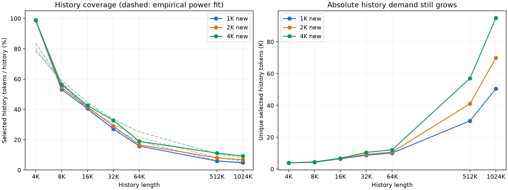

# 历史 KV 命中率与历史长度的经验关系

> 本页保留旧版单内容样本的实验口径；新的 315 份输入、945 组层级结果见 [三层内容组合报告](gr_multilayer_kv_hits.md)。

这里的命中率指整批 new query 的 top-k 并集覆盖率：`p_history = unique_history / history`，不是单个 query 的 top-k 比例，也不是硬件 cache hit rate。数据来自已有 21 组 GR 第 0 层实验，top-k=2048。



## 实测覆盖率

| History | 1K new：历史 / new | 2K new：历史 / new | 4K new：历史 / new |
|---|---:|---:|---:|
| 4K | 98.66% / 100.00% | 98.80% / 100.00% | 98.90% / 100.00% |
| 8K | 53.09% / 100.00% | 54.43% / 100.00% | 56.27% / 100.00% |
| 16K | 40.55% / 99.90% | 41.63% / 99.95% | 42.66% / 99.98% |
| 32K | 27.09% / 99.51% | 28.92% / 98.54% | 32.72% / 97.90% |
| 64K | 15.79% / 91.60% | 16.67% / 89.40% | 18.96% / 87.67% |
| 512K | 5.92% / 88.67% | 8.02% / 86.23% | 11.14% / 84.69% |
| 1024K | 4.93% / 79.69% | 6.82% / 75.78% | 9.27% / 71.90% |

历史覆盖率随 history 增长而下降，但命中的历史 token 绝对数仍在增加。新增 512K/1024K 数据后，不能继续把原先 4K–64K 的拟合直接外推；这里重新拟合全部七个 history 档位。

## 幂律近似

分别固定 new 长度，对七个点做自然对数空间的普通最小二乘：

`p_history ≈ A × (history / 4096)^β`

p 使用 0–1 比例。这是同一批数据上的描述性拟合，没有独立验证集；4K 点接近覆盖率上限，也参与拟合，没有剔除。

| New | A | β | log 空间 R² | 最大相对拟合误差 |
|---|---:|---:|---:|---:|
| 1K | 0.8371 | -0.5362 | 0.9880 | 19.9% |
| 2K | 0.8028 | -0.4731 | 0.9762 | 29.7% |
| 4K | 0.7865 | -0.4103 | 0.9648 | 33.0% |

这是 4K–1024K 当前样本内的描述性拟合。各条曲线的 β、R² 与最大误差见表；512K 和 1024K 仍然各只有一份输入，拟合不能替代实测，也不能证明覆盖率按固定幂律变化。

## New 长度与复用

固定 history 时，增加 new 通常会增加历史 KV 并集，但其增幅不等于 query 数的增幅。不同 new 长度对应不同完整输入，不能把这些点当成同一次请求追加 query 的严格增量过程。New 是否全命中也须逐组读取表格，不能把短 history 的近全覆盖结论沿用到长 history。

这些经验关系可用于当前输入的搬运容量估算：历史字节量为 `656 × history × p_history`。密度不包含具体地址间隙，碎片访问性能仍应使用已导出的精确地址测量。

512K/1024K 沿用 checkpoint 的 YaRN 参数扩展 RoPE 缓存，超出原配置的 163840 位置上限；indexer logits 每 128 query 分批，统计仍是完整 new 的并集。

## 适用范围与复现

每个形状只有一份 seed=42 的 GR 合成商品文本，使用真实 checkpoint 第 0 层 indexer、无 Hadamard。不同形状不保证是同一文本的截断，history 长度与文本内容的影响尚未分离。这里不能给出总体置信区间，也不能把拟合当作多层或真实业务的通用规律；验证需要多文本、多 seed，并用同一长前缀的不同截断控制内容差异。

```bash
.venv/bin/python -m model_run.analyze_gr_kv_coverage
```

输入为 `GR/generated/kv_hit_replay/summary.json`，只重新统计和绘图，不运行模型。
