# 三层 KV 命中位置：九种内容组合

本页对应 **315 份输入、945 组层级结果**，详见 [三层覆盖率与校验](gr_multilayer_kv_hits.md)；[交互页](gr_content_matrix.html) 和 [CSV](gr_content_matrix.csv) 保留九种组合的独立数值。

每格覆盖连续 64 个 KV token，颜色表示九种内容组合的平均命中密度：对每份输入先按整批 new 的 top-k 去重，再计算该格的命中比例，最后对九份输入等权平均。**没有把不同文本的命中位置合成一次请求的并集。** 复现时，每份输入精确位置写入各层 `selected_indices.pt` 和 `unique_token_ids.json`。横轴是绝对 KV 位置，青色虚线是 history/new 边界；长 history 下的短 new 区域在总览中很窄，具体 new 覆盖率请看交互页。

Top-k=2048；new 为 64/128/256/512/1K/2K/4K，history 为 4K/16K/64K/256K/1024K。覆盖率是选中 KV 的并集比例，不是硬件 cache hit rate。分箱只用于展示，不表示必须按 64-token 整页搬运。

## Layer 0

### 64 new

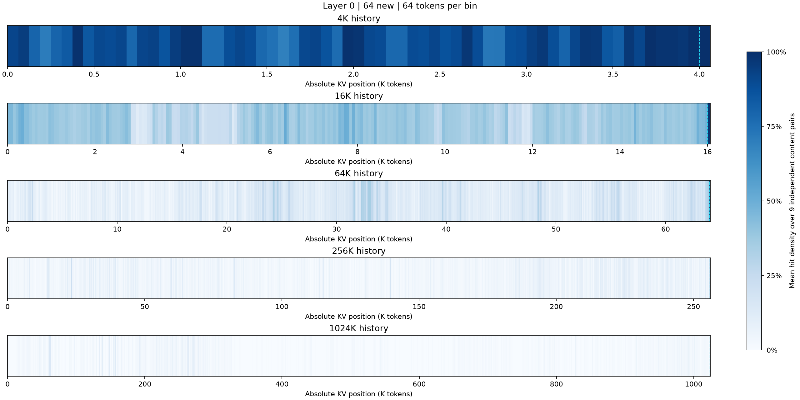

[SVG](gr_content_positions_layer0_n64.svg)

### 128 new

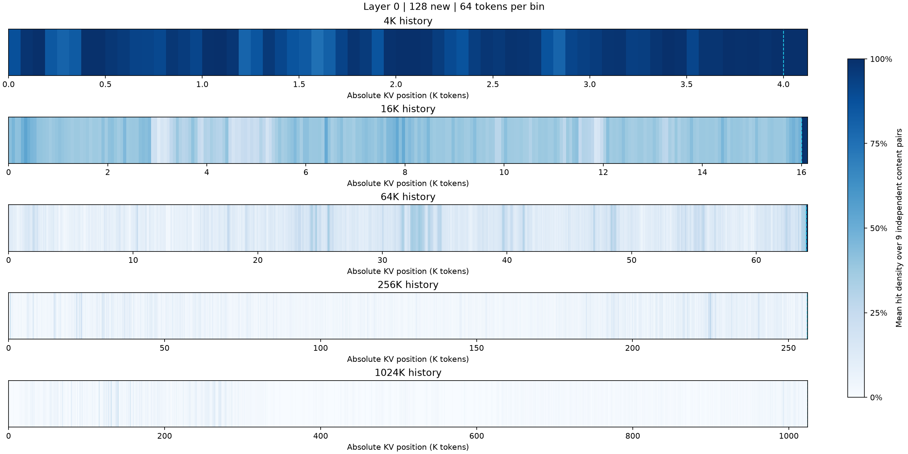

[SVG](gr_content_positions_layer0_n128.svg)

### 256 new

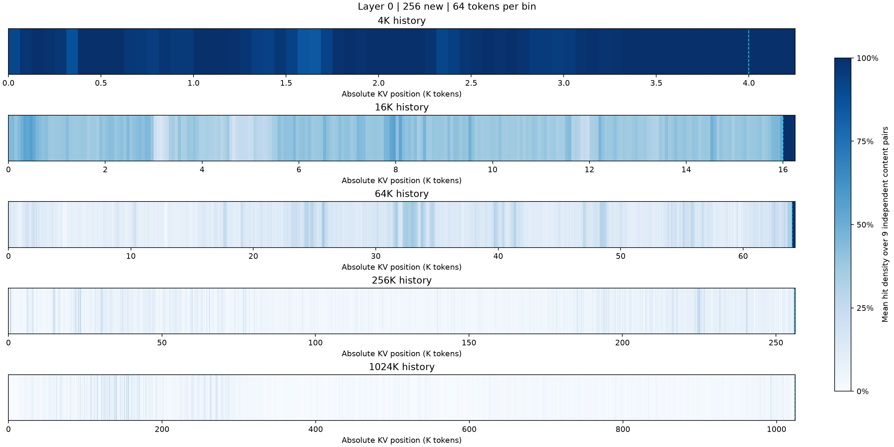

[SVG](gr_content_positions_layer0_n256.svg)

### 512 new

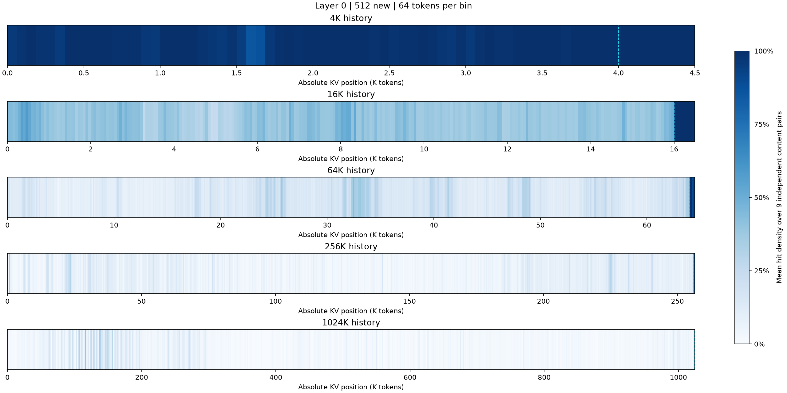

[SVG](gr_content_positions_layer0_n512.svg)

### 1K new

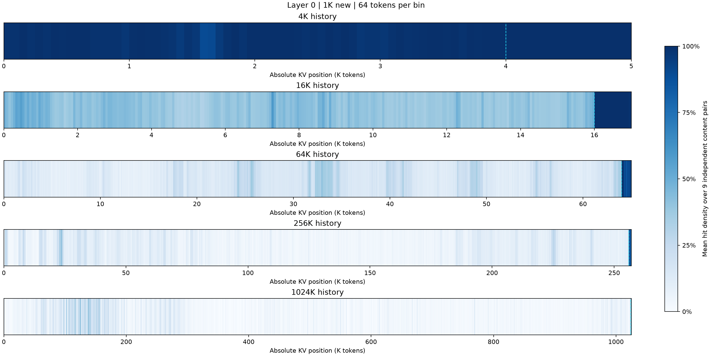

[SVG](gr_content_positions_layer0_n1024.svg)

### 2K new

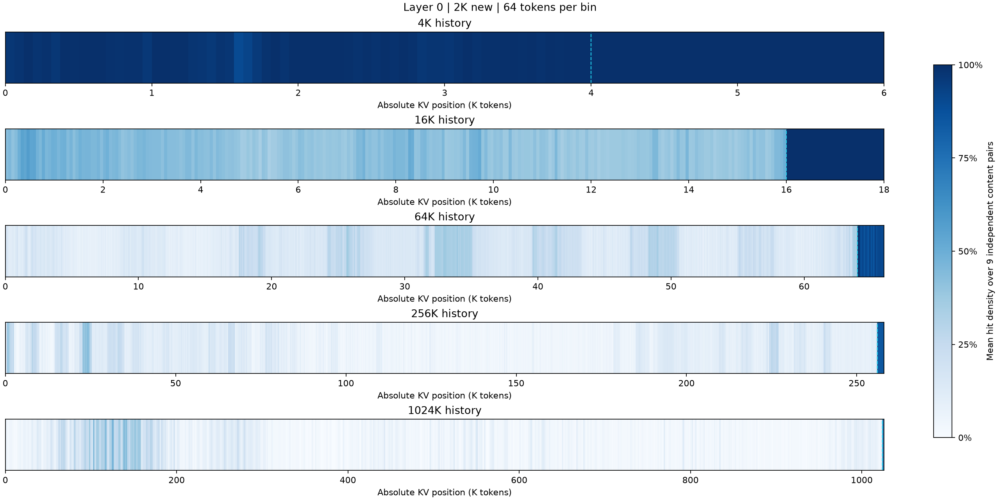

[SVG](gr_content_positions_layer0_n2048.svg)

### 4K new

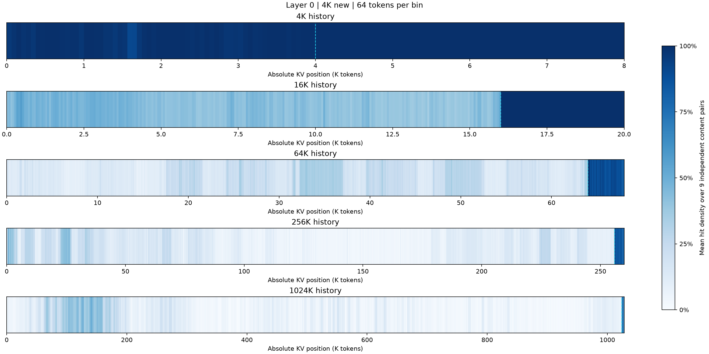

[SVG](gr_content_positions_layer0_n4096.svg)

## Layer 1

### 64 new

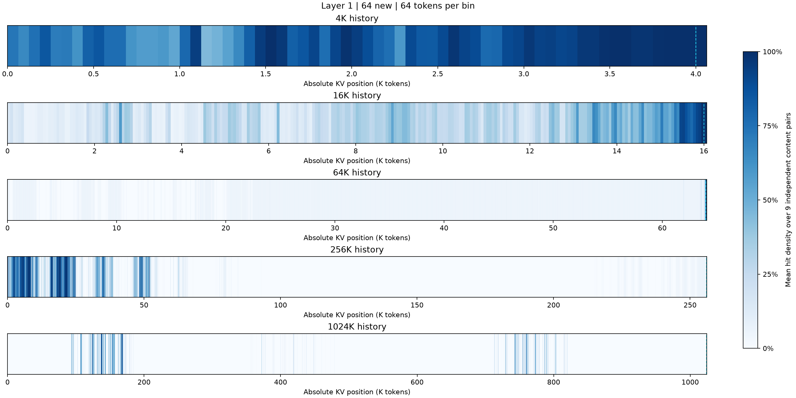

[SVG](gr_content_positions_layer1_n64.svg)

### 128 new

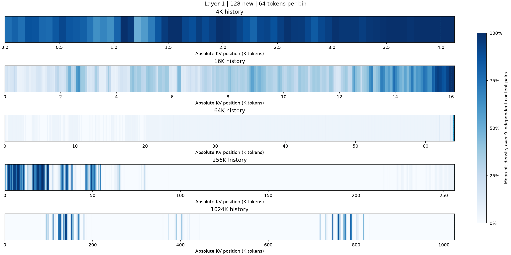

[SVG](gr_content_positions_layer1_n128.svg)

### 256 new

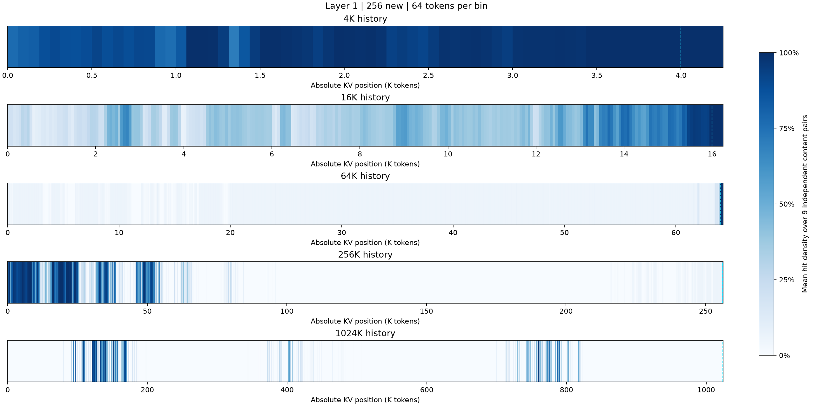

[SVG](gr_content_positions_layer1_n256.svg)

### 512 new

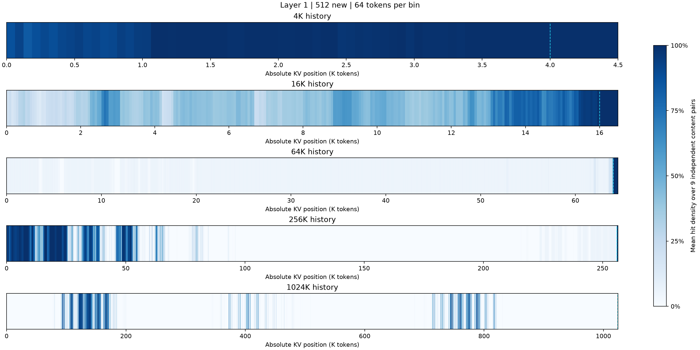

[SVG](gr_content_positions_layer1_n512.svg)

### 1K new

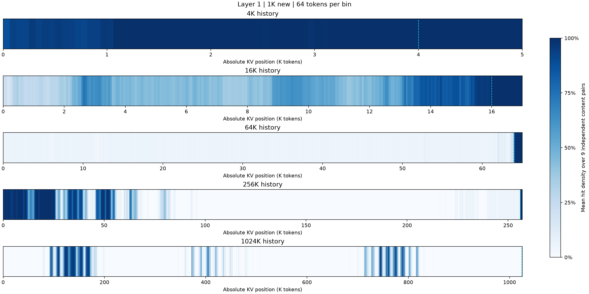

[SVG](gr_content_positions_layer1_n1024.svg)

### 2K new

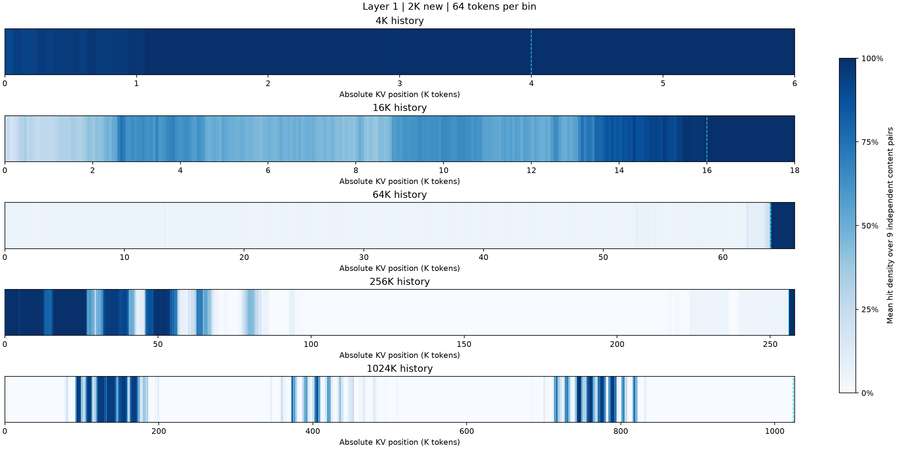

[SVG](gr_content_positions_layer1_n2048.svg)

### 4K new

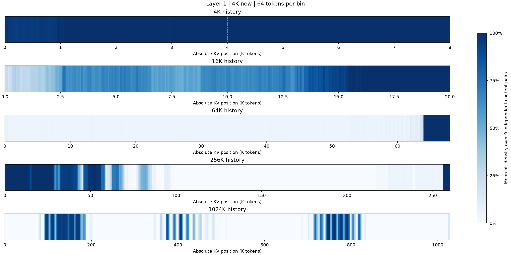

[SVG](gr_content_positions_layer1_n4096.svg)

## Layer 2

### 64 new

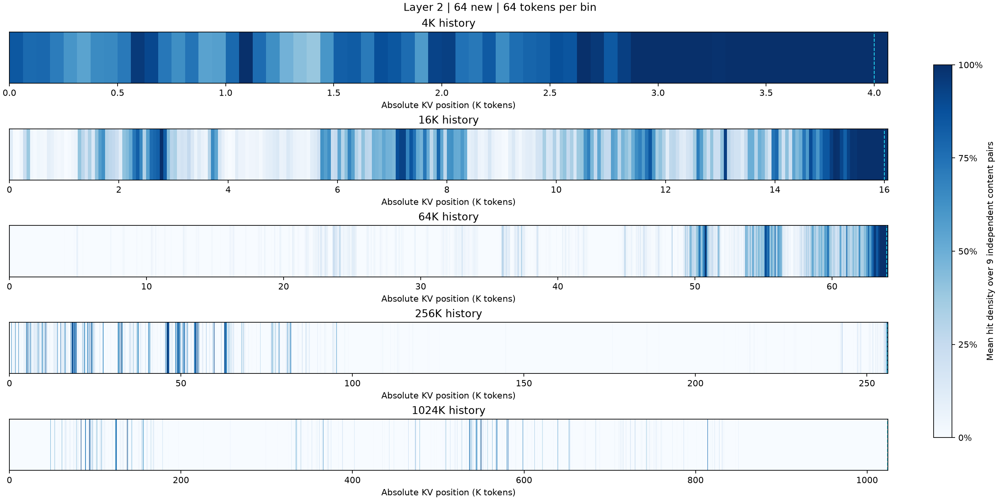

[SVG](gr_content_positions_layer2_n64.svg)

### 128 new

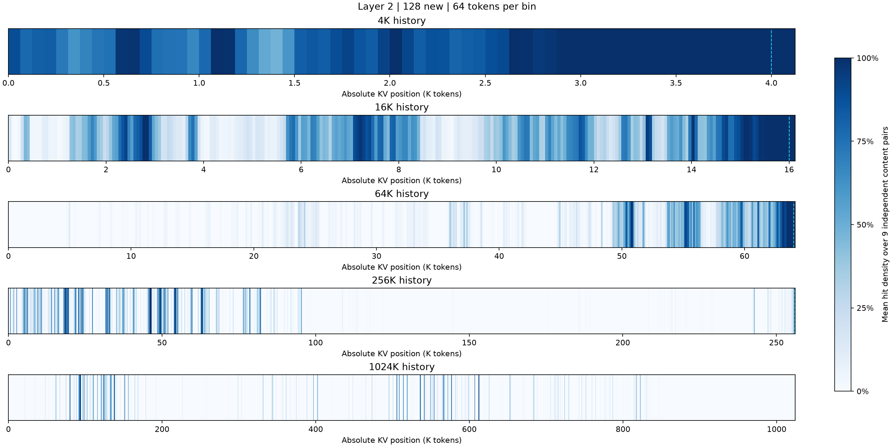

[SVG](gr_content_positions_layer2_n128.svg)

### 256 new

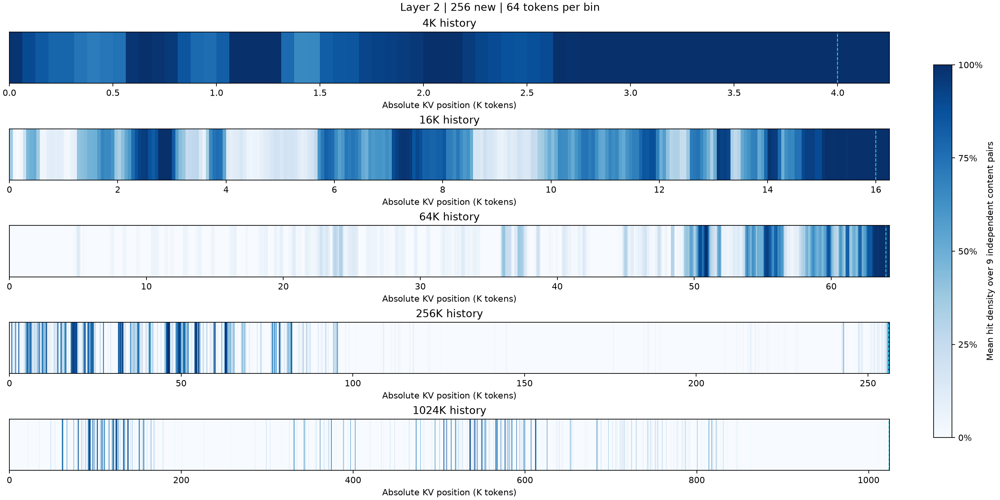

[SVG](gr_content_positions_layer2_n256.svg)

### 512 new

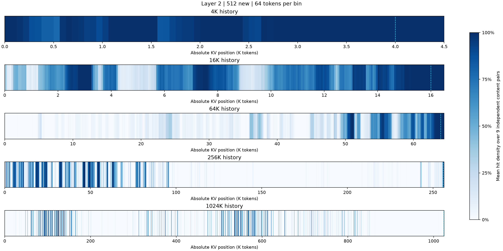

[SVG](gr_content_positions_layer2_n512.svg)

### 1K new

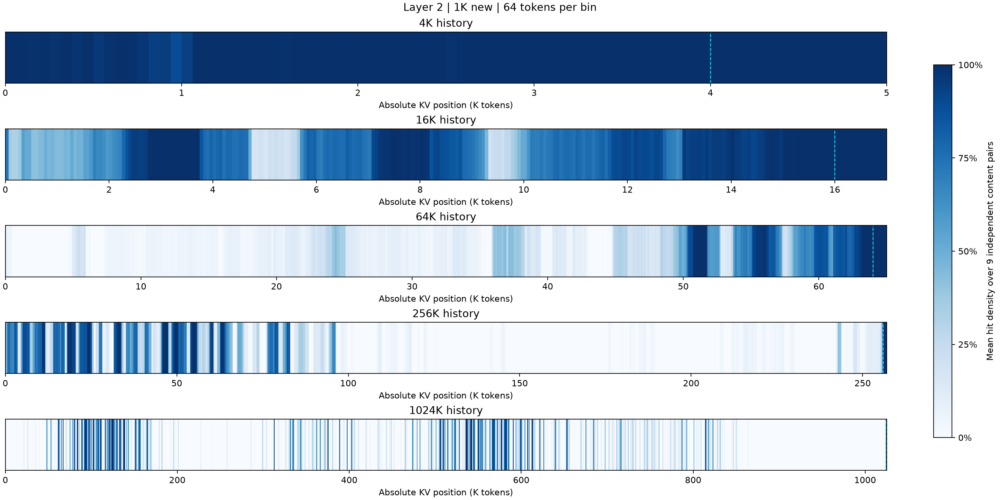

[SVG](gr_content_positions_layer2_n1024.svg)

### 2K new

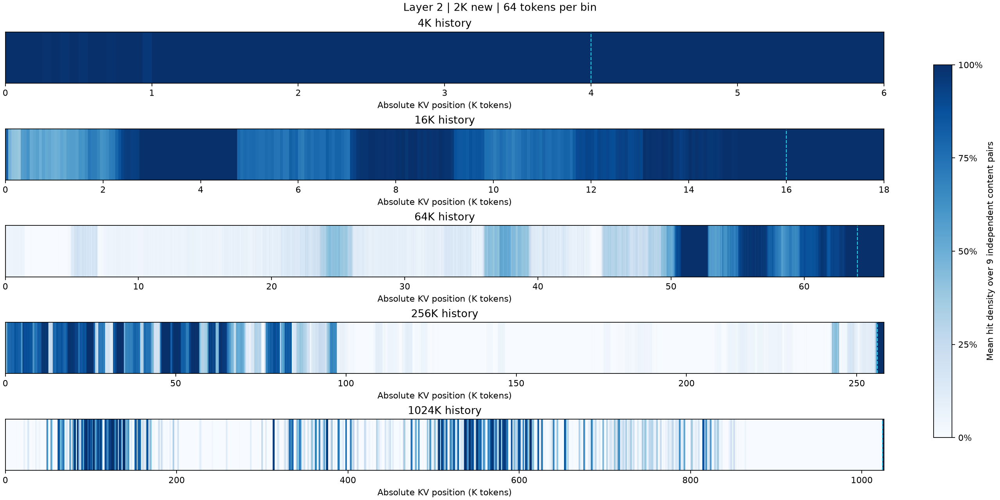

[SVG](gr_content_positions_layer2_n2048.svg)

### 4K new

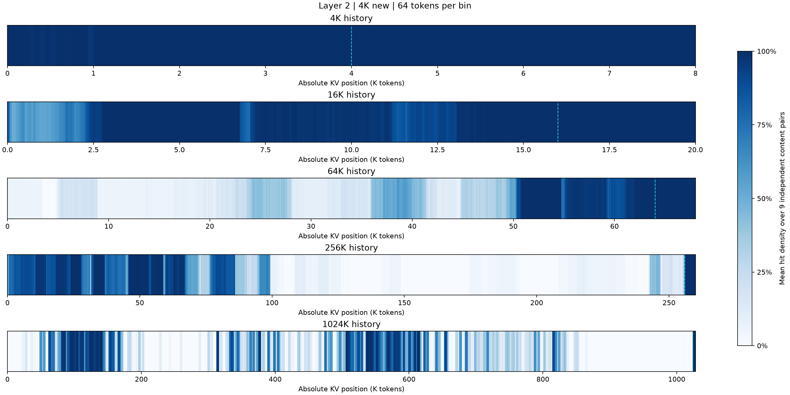

[SVG](gr_content_positions_layer2_n4096.svg)
