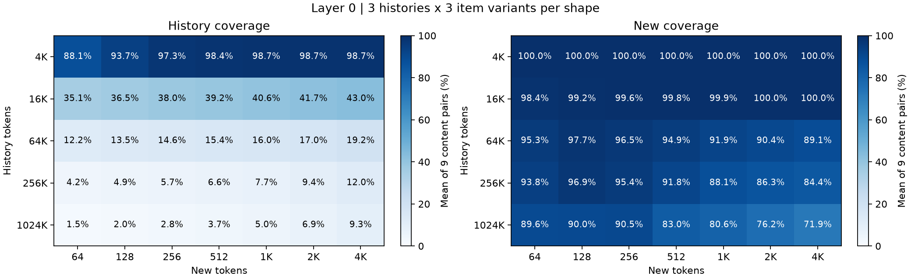
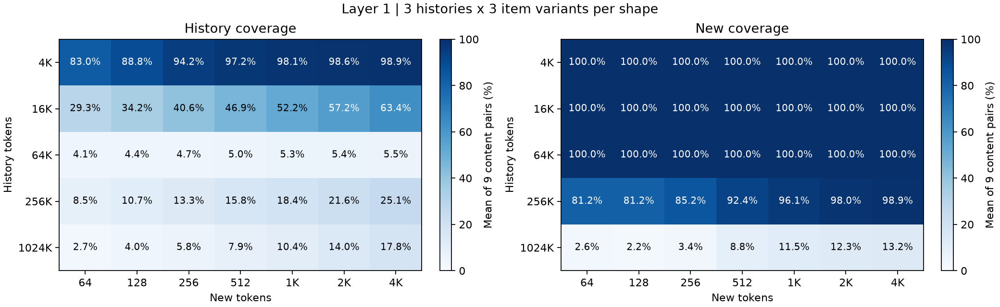
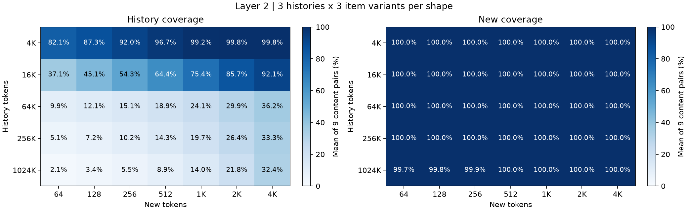

# 第 0、1、2 层：九种内容组合的 KV 命中

**315 份输入 × 3 层 = 945 组层级结果**：history = 4K/16K/64K/256K/1024K；new = 64/128/256/512/1K/2K/4K。每个形状使用 3 份 history 和 3 份独立 item 内容，完整交叉成九种组合。

[交互对比九种组合](gr_content_matrix.html) · [全部 945 行 CSV](gr_content_matrix.csv) · [位置密度图](gr_kv_hit_distribution.md)

## 输入与执行口径

同一 history 长度下，history 样本 0/1/2 的文本分别固定，不随 new 长度或 item 样本变化。同一 new 长度下，item 样本 0/1/2 的候选后缀分别固定，在所有 history 长度与内容样本间复用。SHA-256 检查确认 history 与 item 的独立组合，以及每种内容确实有三份不同文本。固定 seed=42；这里的三份样本不提供总体置信区间。

History 包含固定指令，new 是其后的候选区块，KV 边界精确为 H 与 H+N。Generator 对完整 prompt 重新编码并检查精确 token 数。短 new 自动减少完整候选条目，最多保留 20 个；没有通过随机 token 或截断半句凑预算。

真实 checkpoint embedding → 第 0 层 → 第 1 层 → 第 2 层。第 0、1 层执行 attention、输出投影、残差、RMSNorm 和 dense SwiGLU；第 2 层记录 indexer top-k，并执行 attention 数值与搬运校验。共享同一 history 的 21 个分支复用其因果 prefill，各分支只覆盖自己的 new cache，保留独立的 new hidden states。已将 new 顺序反转（先 4K 后 64）复跑，18 组层级 top-k 集合完全一致，检查分支间无后缀污染。

Top-k=2048，不做 Hadamard。Indexer 每 128 个 query 分批，但每个 query 都搜索完整因果可见 KV；命中覆盖率按整批 new query 的 top-k 并集计算，MLA 的 new 仍整批执行。历史以 512-token chunk 前向，层间 hidden states 暂存在 CPU。第 2 层历史仅准备完整 K/MLA cache，并执行首末 chunk 的抽样校验。

沿用 revision 2 的混合精度路径：checkpoint FP8 权重 / MXFP8 activation，FP32 Norm affine、残差归一化及 SwiGLU 中间计算；K/V 拆分和 O 使用 checkpoint 反量化 BF16。256K/1024K 超出 checkpoint 的 163840 位置上限，只扩展 RoPE 缓存，沿用原 YaRN 参数。长位置 RoPE 通过独立 float64 参考检查（NRMSE < 1%、cosine > 0.9999）；不代表长上下文任务质量或与官方完整模型逐位一致。

## 九种组合的覆盖率范围

每格为“历史均值 [最小–最大] / new 均值 [最小–最大]”，单位为百分比；九个样本等权。完整单组合值见交互页或 CSV。

| History + new | Layer 0 | Layer 1 | Layer 2 |
|---|---:|---:|---:|
| 4K + 64 | 88.08 [87.26–88.99] / 100.00 [100.00–100.00] | 82.98 [82.45–83.74] / 100.00 [100.00–100.00] | 82.07 [81.59–82.52] / 100.00 [100.00–100.00] |
| 4K + 128 | 93.67 [93.24–94.09] / 100.00 [100.00–100.00] | 88.79 [88.33–89.26] / 100.00 [100.00–100.00] | 87.29 [86.52–87.65] / 100.00 [100.00–100.00] |
| 4K + 256 | 97.28 [97.05–97.63] / 100.00 [100.00–100.00] | 94.19 [93.97–94.38] / 100.00 [100.00–100.00] | 92.03 [91.55–92.31] / 100.00 [100.00–100.00] |
| 4K + 512 | 98.36 [98.14–98.54] / 100.00 [100.00–100.00] | 97.24 [97.09–97.39] / 100.00 [100.00–100.00] | 96.73 [96.58–96.92] / 100.00 [100.00–100.00] |
| 4K + 1K | 98.69 [98.46–98.93] / 100.00 [100.00–100.00] | 98.10 [97.83–98.32] / 100.00 [100.00–100.00] | 99.22 [99.07–99.39] / 100.00 [100.00–100.00] |
| 4K + 2K | 98.71 [98.49–98.95] / 100.00 [100.00–100.00] | 98.59 [98.44–98.75] / 100.00 [100.00–100.00] | 99.76 [99.68–99.83] / 100.00 [100.00–100.00] |
| 4K + 4K | 98.75 [98.54–98.93] / 100.00 [100.00–100.00] | 98.92 [98.78–99.10] / 100.00 [100.00–100.00] | 99.77 [99.71–99.83] / 100.00 [100.00–100.00] |
| 16K + 64 | 35.10 [34.98–35.27] / 98.44 [98.44–98.44] | 29.27 [29.03–29.45] / 100.00 [100.00–100.00] | 37.10 [36.88–37.36] / 100.00 [100.00–100.00] |
| 16K + 128 | 36.45 [36.40–36.54] / 99.22 [99.22–99.22] | 34.19 [33.88–34.52] / 100.00 [100.00–100.00] | 45.13 [44.82–45.31] / 100.00 [100.00–100.00] |
| 16K + 256 | 38.05 [37.85–38.27] / 99.61 [99.61–99.61] | 40.63 [40.36–40.96] / 100.00 [100.00–100.00] | 54.26 [54.08–54.56] / 100.00 [100.00–100.00] |
| 16K + 512 | 39.23 [38.94–39.40] / 99.80 [99.80–99.80] | 46.87 [46.63–47.11] / 100.00 [100.00–100.00] | 64.41 [64.22–64.65] / 100.00 [100.00–100.00] |
| 16K + 1K | 40.60 [40.33–40.88] / 99.90 [99.90–99.90] | 52.16 [51.95–52.50] / 100.00 [100.00–100.00] | 75.36 [75.08–75.67] / 100.00 [100.00–100.00] |
| 16K + 2K | 41.69 [41.49–41.85] / 99.95 [99.95–99.95] | 57.21 [56.93–57.50] / 100.00 [100.00–100.00] | 85.75 [85.55–85.99] / 100.00 [100.00–100.00] |
| 16K + 4K | 42.96 [42.74–43.15] / 99.98 [99.98–99.98] | 63.40 [62.93–63.79] / 100.00 [100.00–100.00] | 92.15 [92.00–92.35] / 100.00 [100.00–100.00] |
| 64K + 64 | 12.19 [12.00–12.39] / 95.31 [95.31–95.31] | 4.14 [4.11–4.17] / 100.00 [100.00–100.00] | 9.87 [9.78–9.95] / 100.00 [100.00–100.00] |
| 64K + 128 | 13.51 [13.37–13.71] / 97.66 [97.66–97.66] | 4.36 [4.30–4.40] / 100.00 [100.00–100.00] | 12.12 [11.99–12.27] / 100.00 [100.00–100.00] |
| 64K + 256 | 14.56 [14.44–14.75] / 96.53 [95.70–97.27] | 4.67 [4.58–4.76] / 100.00 [100.00–100.00] | 15.11 [15.04–15.26] / 100.00 [100.00–100.00] |
| 64K + 512 | 15.36 [15.20–15.60] / 94.90 [94.73–95.12] | 5.00 [4.93–5.06] / 100.00 [100.00–100.00] | 18.88 [18.77–19.02] / 100.00 [100.00–100.00] |
| 64K + 1K | 16.01 [15.84–16.28] / 91.87 [90.92–93.26] | 5.25 [5.20–5.29] / 100.00 [100.00–100.00] | 24.08 [24.04–24.20] / 100.00 [100.00–100.00] |
| 64K + 2K | 16.95 [16.77–17.19] / 90.38 [89.75–90.87] | 5.39 [5.34–5.43] / 100.00 [100.00–100.00] | 29.86 [29.79–29.95] / 100.00 [100.00–100.00] |
| 64K + 4K | 19.23 [18.93–19.59] / 89.05 [88.38–90.21] | 5.51 [5.44–5.56] / 100.00 [100.00–100.00] | 36.16 [36.07–36.25] / 100.00 [100.00–100.00] |
| 256K + 64 | 4.18 [4.15–4.22] / 93.75 [93.75–93.75] | 8.49 [8.44–8.55] / 81.25 [79.69–82.81] | 5.09 [5.05–5.17] / 100.00 [100.00–100.00] |
| 256K + 128 | 4.90 [4.83–4.96] / 96.88 [96.88–96.88] | 10.71 [10.69–10.74] / 81.25 [79.69–83.59] | 7.17 [7.09–7.23] / 100.00 [100.00–100.00] |
| 256K + 256 | 5.71 [5.66–5.75] / 95.44 [95.31–95.70] | 13.27 [13.26–13.31] / 85.16 [84.38–86.72] | 10.18 [10.10–10.25] / 100.00 [100.00–100.00] |
| 256K + 512 | 6.61 [6.55–6.67] / 91.75 [90.82–92.38] | 15.82 [15.80–15.85] / 92.36 [91.80–92.97] | 14.29 [14.25–14.34] / 100.00 [100.00–100.00] |
| 256K + 1K | 7.74 [7.69–7.77] / 88.09 [87.60–88.96] | 18.45 [18.42–18.48] / 96.15 [95.80–96.48] | 19.66 [19.59–19.69] / 100.00 [100.00–100.00] |
| 256K + 2K | 9.38 [9.33–9.44] / 86.32 [86.08–86.47] | 21.57 [21.53–21.60] / 97.98 [97.71–98.24] | 26.40 [26.36–26.43] / 100.00 [100.00–100.00] |
| 256K + 4K | 12.00 [11.94–12.05] / 84.45 [83.54–85.40] | 25.06 [25.03–25.10] / 98.93 [98.78–99.07] | 33.27 [33.21–33.33] / 100.00 [100.00–100.00] |
| 1024K + 64 | 1.50 [1.48–1.53] / 89.58 [89.06–90.62] | 2.71 [2.68–2.75] / 2.60 [1.56–3.12] | 2.11 [2.06–2.15] / 99.65 [98.44–100.00] |
| 1024K + 128 | 2.03 [2.00–2.05] / 90.02 [89.06–91.41] | 3.99 [3.97–4.00] / 2.17 [1.56–3.12] | 3.39 [3.35–3.42] / 99.83 [99.22–100.00] |
| 1024K + 256 | 2.78 [2.75–2.81] / 90.49 [89.84–91.41] | 5.76 [5.71–5.82] / 3.39 [2.73–3.91] | 5.52 [5.46–5.55] / 99.91 [99.61–100.00] |
| 1024K + 512 | 3.66 [3.63–3.69] / 83.03 [82.62–83.59] | 7.88 [7.83–7.93] / 8.83 [8.59–9.18] | 8.89 [8.82–8.93] / 99.96 [99.80–100.00] |
| 1024K + 1K | 5.01 [4.98–5.04] / 80.56 [79.98–81.25] | 10.42 [10.39–10.46] / 11.49 [10.74–11.91] | 13.96 [13.91–13.99] / 99.98 [99.90–100.00] |
| 1024K + 2K | 6.92 [6.90–6.95] / 76.22 [75.44–77.44] | 14.00 [13.98–14.02] / 12.30 [12.06–12.55] | 21.83 [21.78–21.88] / 99.98 [99.95–100.00] |
| 1024K + 4K | 9.35 [9.26–9.40] / 71.90 [71.26–72.61] | 17.81 [17.79–17.85] / 13.21 [13.04–13.50] | 32.37 [32.34–32.40] / 99.99 [99.98–100.00] |

## 三层均值热力图







## 校验

945 组 new 的 CPU token gather、GPU staging 与索引重映射回放均与 resident MLA 输出逐位一致。每份输入每层抽查历史首末 chunk 和 new，检查 index logits、MLA 与 FFN 的独立 FP32 参考；复用的历史校验不会算作新的独立样本。全部组的峰值 PyTorch allocated 显存为 **7.122 GiB**，不等于驱动进程占用。

| 参考项 | 最大 NRMSE | 最小 cosine |
|---|---:|---:|
| index | 0.000000 | 1.000000 |
| attention | 0.007519 | 0.999972 |
| ffn | 0.005709 | 0.999984 |

## 输出与复现

仓库保留报告、引用图片、CSV 和交互页。原始输入、top-k/NPY 回放及日志属于可再生成的大型输出，清理后需先运行测量命令重建，再重新生成报告；小型统计与校验 JSON 留在本地 `GR/generated/`。以下路径描述复现时生成的产物。

- `GR/generated/content_matrix/inputs/h{H}_u{U}_n{N}_i{I}/`：315 份精确输入。
- `GR/generated/content_matrix/layer{L}/h{H}_u{U}_n{N}_i{I}/`：945 份原始 INT32 top-k、历史与 new 并集、统计和输入哈希。
- `summary.json` / `validation_summary.json`：完整统计与校验摘要；每份输入另有 `_validation.json`。
- 每条压缩 MLA KV 为 656 B；CSV 的 `history_mib` 只计历史，`all_mib` 包含历史和 new，均按本批 query 去重。

```bash
env PATH="$PWD/.venv/bin:$PATH" .venv/bin/python -m model_run.sweep_gr_content_matrix
.venv/bin/python -m model_run.report_gr_content_matrix
# 可选：导出全部精确 NPY 搬运回放数组
.venv/bin/python -m model_run.report_gr_content_matrix --export-replay
```

调度按 15 个 history 内容组保存完成标记，重跑会跳过完整组。旧版单内容实验使用 `GR/generated/cache_union_sweep/`、`GR/generated/multilayer_hits_validated/`，不混入本次内容矩阵。
