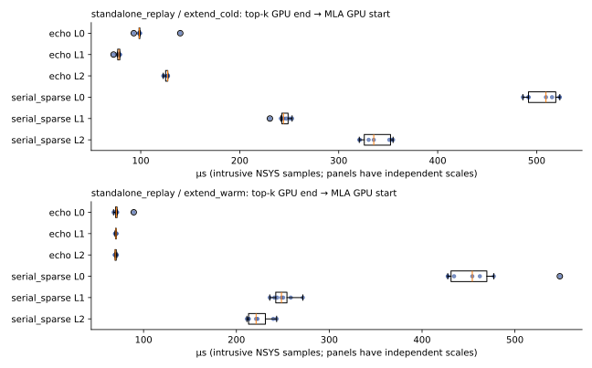
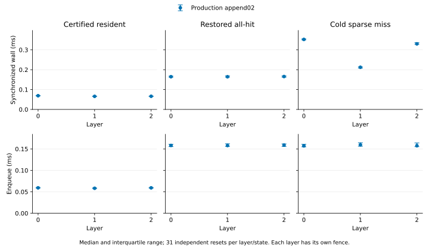

# Cache Manager Performance

本实验属于 baseline 实现性能合理性实验，只测量 extend 中 **exact top-k 最后一个
GPU 活动结束，到首个 MLA 计算 kernel 开始**的区间，关注 ECHO 和 serial sparse
的 cache 管理开销。生产 indexer、top-k 和 MLA 均实际执行，但它们的计算不计入
这个指标。测量保留 hint 更新、KV append、精确 recall、映射、MLA 准备及启动延迟。

独立验收 `cache_posttopk_check_20261006_01` 和 profile
`cache_posttopk_profile_20261006_01` 已完成，覆盖两个方案的 cold/warm extend。
执行身份为 `1f1658e376ab17d28b1ad7fe96ae03c597f39b8c5b02160972bd9467990bab55`。
当前入口只提供独立 `check` 和 NSYS `profile`，不再报告整段 cache/indexer 同步墙钟。

本轮调整了独立重放和测量范围，生产模型、cache、indexer 与 MLA 实现未改动。
独立 recall `_04` 和 native append `_01` 保留原始数据、收据及 native 身份；
[范围核对](report/retained_scope.json)说明保留依据，不代表这两项重新运行。

## 测量对象

H=65,536、A=128、history chunk=1,024，使用三个独立 layer pool，P=NH=65,664 tokens。
主 KV 为 BF16 512 latent + 64 RoPE，每 record 1,152 B。输入来自
`deepseek_v32_mfu` 的 `kernel_inputs_layer_0.pt` 至 `kernel_inputs_layer_2.pt`，
使用实际捕获的 query、indexer K/scales 和完整 KV，并记录源 run ID 与逐文件 SHA-256。
固定输入及原接受记录保存在 `output/data/input_fixture_20261006_02/`，
[归档映射](report/input_archives.json)保留原路径和文件哈希。

重放直接调用生产 `EchoAttentionRunner`、`SharedSparseTokenPool` 和
`SparseTokenCache`，保留 source reservation、index cache write、prefetch
prepare/finalize、indexer、exact top-k、ECHO hint 更新、主 KV append、精确 recall
及真实 MLA consumer。Projection 由捕获输入提供；不执行模型 projection、MLP、
embedding 或 LM head。`hbm` 只在测量区间外提供独立的逻辑 KV 和 attention 输出参考。
本实验不测量合成 prefill、dense prefetch、GR 临时候选 discard、多用户准入或容量填满轨迹。

两个阶段均从 H-token prefix 持久追加 A：

- `extend_cold`：恢复 prefix 后清除主 KV 的 HBM 驻留，保留 host KV 与 indexer。
- `extend_warm`：恢复 prefix 构建后的映射，不清除主 KV；CPU 驻留证明按生产
  snapshot 接口保守失效。Warm 没有主 KV H2D，但仍有持久 append 的 D2H。

Prefix 只通过生产 append 构建，不重放此前的模型选择。每个独立样本的 ECHO hint
从零开始，当前样本按生产顺序更新 hint。因此，重放使用真实输入，但没有恢复原请求
完整的 cache 访问轨迹，不能用它与完整模型的时长差估算 MLA wrapper 成本。

## 当前结果

### 完整模型单次 CUDA Graph：top-k 结束到 MLA 开始

[逐层诊断](report/transition/results.md)来自新 profile
`deepseek_full_graph_cold_profile_20261006_02`，分析 ID 为
`cache_full_graph_transition_20261006_03`。真实 checkpoint 的前三层使用 H=65,536、
A=128、P=65,664、cold 主 KV 驻留，执行普通持久 append。ECHO 和 serial sparse
均以一次 CUDA Graph replay 执行完整 extend；图内阶段由捕获节点及其 lineage 验证。
每方案在 capture 内预热一次、测量一次，六个逐层区间均为侵入式 profile 数据。
运行环境、完整模型验收和无 profiler 计时见 [MFU 实验](../deepseek_v32_mfu/README.md)。

起点以 exact top-k 的无效 ID mask 完成为准，终点为首个实际 MLA 计算 kernel
开始。下表单位为 µs；实际 IO 包括追加 KV 的 D2H 和 recall 的 host 读取。

| 方案 | 层 | 总区间 | 实际 IO | 暴露的 GPU control | GPU idle | 非 IO gap |
| --- | ---: | ---: | ---: | ---: | ---: | ---: |
| ECHO | 0 | 135.872 | 68.256 | 43.008 | 24.608 | 67.616 |
| ECHO | 1 | 68.992 | 16.448 | 40.032 | 12.512 | 52.544 |
| ECHO | 2 | 99.936 | 44.544 | 39.744 | 15.648 | 55.392 |
| Serial sparse | 0 | 271.839 | 220.991 | 31.872 | 18.976 | 50.848 |
| Serial sparse | 1 | 116.832 | 78.336 | 31.744 | 6.752 | 38.496 |
| Serial sparse | 2 | 245.151 | 199.711 | 32.064 | 13.376 | 45.440 |

三层区间之和分别为 ECHO 304.800 µs、serial sparse 633.822 µs，不是完整请求时延。
区间保留 ECHO hint 更新、当前 KV append 及 D2H、精确选择并集、miss 识别、缺页搬运
与映射发布，以及这些 GPU 活动间的空闲。Serial sparse 不执行 ECHO hint 更新。
实际 IO、暴露的 control 与 idle 按时间并集统计，三者之和等于各层总区间。

两种方案均在各层 top-k 结束前完成整张 graph 的提交，以上 GPU idle 全部发生在
`cudaGraphLaunch` 返回之后。重放时没有逐阶段 CPU scope，也没有独立的 MLA launch；
对应 JSON 字段为 `null`，CSV 留空，不能当作零耗时。单独记录的 graph launch offset
描述整张图的提交时间，不能据此把图内 idle 归因于逐 kernel 的 Python 提交、设备调度
或某个硬件原因。

[区间表](report/transition/windows.csv)、[阶段表](report/transition/stages.csv)及
[独立审查](report/transition/audit.json)保留核验依据；来源、分析 ID 和
发布文件哈希见[清单](report/transition/publication.json)。独立审查直接读取原始 SQL，
核对六个边界、GPU 活动及整数纳秒的 IO/control/idle 分解。本诊断复用新 profile 的
实现身份与验收收据，不额外证明各个 live JIT/CUBIN 文件。

### 独立 top-k 结束到 MLA 开始的计时

测量平台为 NVIDIA H200，物理 GPU 3；CPU 绑定 24–31，内存绑定 NUMA 0。
环境为 PyTorch 2.12.1+cu130，其报告的 CUDA 版本为 13.0；native 编译使用 CUDA
Toolkit 13.2。另使用 Triton 3.7.1、FlashInfer 0.6.18、TVM FFI 0.1.13.post3 和
FlashMLA 1.0.0。

`cache_posttopk_profile_20261006_01` 每个方案、每个阶段预热 2 次，测量 7 个样本，
共 28 个样本、84 个逐层区间。下表先对同一样本的三个 layer 区间求和，再计算中位数
和 Q1/Q3，单位为 µs；Q1/Q3 使用 inclusive quantile。这些和不包含层间计算，也不
是完整请求时延。数值取自 [latency.csv](report/post_topk/latency.csv)。

| 阶段 | 方案 | 三层区间之和中位数 | Q1 | Q3 |
| --- | --- | ---: | ---: | ---: |
| Extend cold | ECHO | 301.886 | 299.8075 | 304.8315 |
| Extend cold | Serial sparse | 1,087.324 | 1,073.804 | 1,095.3885 |
| Extend warm | ECHO | 210.751 | 209.774 | 212.671 |
| Extend warm | Serial sparse | 916.094 | 905.309 | 940.077 |



本轮通过 NSYS 的 GPU 时间戳直接截取上述边界，没有从整段墙钟中扣除 indexer、top-k
或 MLA 的耗时，也没有在两端插入额外同步。区间内不含 indexer、top-k 或 MLA 计算；
实际 IO、暴露的 GPU control 与 idle 的区间并集之和等于总区间。零搬运 gather
归入 control，Warm 的 append D2H 仍计入 IO。MLA wrapper 的准备操作和提交延迟
按实际落入区间的部分计入，不能把整个 CPU wrapper 时长加到 GPU 区间上。

当前输入下，ECHO 的 cold/warm post-top-k 区间均短于 serial sparse。这一结论仅
适用于上述独立重放及测量边界；NSYS 的侵入开销仍在，不能据此推断完整 indexer、
attention 或模型的性能。MFU 为 N/A。

[报告](report/post_topk/results.md)、[逐样本区间](report/post_topk/windows.csv)和
[阶段数据](report/post_topk/stages.csv)记录 IO、control、idle 与主机提交。
[发布审查](report/post_topk/audit.json)核对独立收据、源码、原始 SQLite、区间分解，
并重新读取每份 profile selection 和真实 MLA 输出，与收据绑定的 HBM 输出逐位比较。
选中 KV、映射、free bitmap 与 clock 由执行时的验收器检查；保存的输出不能用来独立
重建完整 cache 前后态。[独立审查](report/post_topk/independent_audit.json)复核全部
84 个原始区间及 16 组统计；来源、发布文件哈希与报告 helper 修正见
[发布清单](report/post_topk/publication.json)。运行环境观测及采样边界见
[观测记录](report/post_topk/observer_summary.json)。

原始数据、源码快照、selection/attention 输出和分析保存在
`output/data/cache_posttopk_profile_20261006_01/`，原始 NSYS 保存在
`output/profile/cache_posttopk_profile_20261006_01/`。本轮绑定源码、加载的 native 库
及 FlashMLA 接口，没有单独归档 resident mask 的 live Triton JIT/CUBIN；该限制
适用于本轮 check 和 profile。

### 保留的 native append 验收

[生产 native append 检查](report/native_append.md)使用 0、8,192 和 65,536 个驻留
record 的实际 GPU 前态，核对每次追加选取的 128 个 slot 均为空槽且互不重复。CPU
重建逐字节验证 record、双向映射、free bit、优先级和 clock；history 与 sentinel 保持
不变，clock 从 17 推进到 18，eviction 为零。Scratch 只绑定实际保存的字节，未独立
重算。原验收保存在 `/tmp/cache_append_production_state_20261006_01/`。这些 native
fixture 与本轮 post-top-k 样本相互独立，不是同一状态的连续执行，也不构成独立性能实验。

该检查的 ECHO ELF SHA-256 为
`d888ee0cb2aa864ed1dcde9dee5e814a2468ce57c643b19dc138141106f2568e`；
本轮 post-top-k profile 使用的 ECHO ELF SHA-256 为
`09165f76c0ef4a75067939afa1c071bb68b9e8bf28e229d27681cbefdb2e0a11`，与原 `_07`
manager 相同。保留的 [CUDA payload 比较](report/native_payload_comparison.json)确认
两份 ELF 的 `.nv_fatbin` 共 1,206,848 B，逐字节一致。它只证明 native CUDA payload
相同，不证明 host wrapper 二进制等价，也不覆盖 resident mask CUBIN。该检查不验收
完整模型、逐层 gap 或实际显存预算，本轮没有重新运行 native append 验收。

## ECHO GPU cache manager 的借鉴范围

参考 checkout 为 `3rdparty/ECHO` 的 `bc1b75c1000010d0ac6f032ebaac283255c050b1`。
`memory_pool_host.py` 保存逐层 GPU 映射和 FIFO，`allocator.py` 的
`CudaGraphTokenToKVPoolAllocator` 使用 GPU free bitmap、stack、available count 与
固定输出 buffer，`recall_ops.py` 使用 GPU miss count 驱动召回。本实验检查项目实现
对应的映射、分配、优先级和精确 recall，执行本地 ECHO 融合 indexer/prefetch，
不将这些时间称为上游完整 ECHO 性能。

当前实现只在独占操作中确认单 session 且 H<=P 时使用空槽分配快路径，GPU 另行
检查空槽数；其他情况保留原 FIFO 分配器。同优先级 slot 可任意选取，仍须先用空槽、
再按较低优先级淘汰，并保护当前精确选择。这不改变 indexer exact top-k。

## 验收、计时与 profile

`check` 在独立进程运行 HBM、ECHO 和 serial sparse 的 cold/warm extend，比较
完整 exact selection、全部选中 record、双向映射、free bitmap、CPU/GPU FIFO
clock，以及真实 MLA 输出与 HBM 参考的逐位一致性。输出保存在系统临时目录，并签发
绑定源码、native 库、FlashMLA、输入及环境的收据。

`profile` 必须使用匹配收据。HBM 参考在 capture 前准备；分配、prefix 构建、snapshot
恢复、冷驻留设置、JIT、预热、计数读取和数值检查均在测量区间外。各层按生产接口提交，
必要同步和事务保留，计时边界不延伸到 MLA 计算、后续层或最终同步/commit。

NSYS 保存 CUDA API、kernel、memcpy 和 NVTX，使用 node tracing，关闭 CPU sampling
和 context-switch tracing。分析器通过 launch correlation 找到 top-k 完成点与实际
MLA kernel 起点，并拒绝未归属或越出同步 capture window 的活动。统计范围只保留
所需的 post-top-k 区间，不再输出 indexer 到 top-k 的耗时或空 consumer readiness。
CPU scope/API 数据只解释提交过程，与 GPU 执行区间分开。

本实验不评估完整模型 gate。完整 extend 和每层的非 IO gap 均须严格低于 10%，
offload prefill 的绝对 gap 须不超过 HBM-only 的 1.2 倍；这些门槛仍由
[DeepSeek MFU](../deepseek_v32_mfu/README.md)验收，再重测
[motivation](../deepseek_v32_motivation/README.md)。

## 运行入口

从仓库根目录运行，环境准备见[第三方说明](../../3rdparty/README.md)。`CAPTURE_DIR`
指向含三个捕获 `.pt` 的实际 MFU profile 数据目录。以下命令使用保留的固定输入；
每次运行使用新的 run ID。

```bash
export PATH="$PWD/.venv/bin:/usr/local/cuda/bin:$PATH"
export CUDA_VISIBLE_DEVICES=3
export OMP_NUM_THREADS=8 MKL_NUM_THREADS=8 OPENBLAS_NUM_THREADS=8
export PYTORCH_ALLOC_CONF=backend:native,pinned_use_cuda_host_register:True,pinned_num_register_threads:8
export CAPTURE_DIR="$PWD/experiments/cache_manager_performance/output/data/input_fixture_20261006_02"

numactl --membind=0 taskset -c 24-31 bash experiments/cache_manager_performance/scripts/run.sh \
  --mode check --run-id cache_posttopk_check_new --capture-dir "$CAPTURE_DIR" --warmup 2

numactl --membind=0 taskset -c 24-31 bash experiments/cache_manager_performance/scripts/profile.sh \
  --run-id cache_posttopk_profile_new --capture-dir "$CAPTURE_DIR" --warmup 2 --repeats 7 \
  --validation-receipt /tmp/cxldsagr-checks/cache_manager_performance/data/cache_posttopk_check_new/receipt.json
```

Profile 数据、SQLite、源码和自动生成的 `analysis/` 保存在 `output/data/<run_id>/`，
NSYS 保存在 `output/profile/<run_id>/`，日志保存在 `output/log/<run_id>/`。脚本先在
系统临时目录运行，成功后才移入这些目录；失败日志留在临时目录，不发布为实验结果。
Check 默认保存在 `/tmp/cxldsagr-checks/cache_manager_performance/`。

重读实际 MLA profile 时可调用 `src.transition`；`--manager-run` 接受本轮执行真实
MLA 的新格式，`--model-run` 用于单独分析完整模型。以下命令重读完整 graph capture：

```bash
CUDA_VISIBLE_DEVICES= .venv/bin/python -m experiments.cache_manager_performance.src.transition \
  --model-run experiments/deepseek_v32_mfu/output/data/deepseek_full_graph_cold_profile_20261006_02 \
  --run-id cache_full_graph_transition_new \
  --output-dir experiments/cache_manager_performance/output/data/cache_full_graph_transition_new
```

通过 `python -m experiments.cache_manager_performance.src.report --help` 查看发布入口。
它检查 profile、独立收据、源码快照、全部样本的保存输出和区间分解，并通过
`--check-observer`、`--profile-observer` 读取两次运行的外部观测。没有完成环境观测
时不能声称独占测量。分析器复用 `deepseek_v32_mfu.src.analyze_nsys` 的相关 ID 解析
和区间并集；输入校验复用 `kernel_profile.load_inputs`；收据复用
`evaluation.validation`。本实验不另实现 cache 分配、FIFO、召回、KV 搬运或 MLA kernel。

## 独立 exact recall 入口

[recall.sh](scripts/recall.sh) 调用 [recall.py](src/recall.py)，用
[recall_workload.py](src/recall_workload.py) 构建生产 cache 状态，单独检查精确召回。
输入为上述固定 fixture 中各层实际捕获的 int32 `[128,2048]` exact top-k ID；
H=65,536、A=128、chunk=1,024、P=NH=65,664，KV 布局与前文相同。
三个 layer 分别使用独立 pool。此入口直接消费原选择，不执行或修改 indexer 算术与
exact top-k；前述 post-top-k 实验另行覆盖 hint、append、recall 到实际 MLA 启动的区间。

| 状态 | 每个样本的准备方式 |
| --- | --- |
| `certified_resident` | truncate 到零，经生产 append 重建 history，再追加 candidate，保留 CPU 驻留证明。 |
| `restored_all_hit` | 恢复生产 prefix snapshot 后追加 candidate；GPU 映射全命中，CPU 驻留证明未认证。 |
| `cold_sparse_miss` | 恢复 prefix 后释放 history GPU ID，再追加 candidate；每次独立重置 miss 状态。 |

计时覆盖生产 `_ensure_from_topk` 和 device synchronize，分别记录 enqueue 与同步
墙钟。重置、prefix/snapshot、begin/append、host drain、统计清零、commit 和验收均在
计时外。墙钟减去 enqueue 不是纯 GPU 计算时间，也未扣除 IO。

生产验收 `cache_recall_check_20261006_04` 已在 H200 GPU 3、CPU 24–31 上通过
18 项检查，即三种状态 × 三层 × 两次独立重置；与公开 `cache.ensure` 及独立逻辑
oracle 核对选中 KV、双向映射、free bitmap、分配优先级、clock 和计数。
Cold 三层每次分别产生 8,909、2,875、8,007 个 miss，其余状态均为零。
当前 P=H+A，没有 live eviction；并列分配只覆盖空槽，不能据此宣称已验收并列淘汰。
收据保存在
`/tmp/cxldsagr-checks/cache_manager_recall/data/cache_recall_check_20261006_04/receipt.json`。
正式生产计时 `cache_recall_bench_20261006_04` 已完成，每状态、每层预热 2 次、计时
31 次，使用上述匹配收据。下表为每层同步墙钟中位数，单位 ms；各层独立同步，不能
将三层中位数相加作为完整请求时间。

| 状态 | L0 | L1 | L2 |
| --- | ---: | ---: | ---: |
| `certified_resident` | 0.069001 | 0.065852 | 0.066244 |
| `restored_all_hit` | 0.164676 | 0.164513 | 0.165667 |
| `cold_sparse_miss` | 0.352424 | 0.212160 | 0.330120 |



[报告](report/recall/results.md)同时给出 enqueue、Q1/Q3 和完整测量边界。
[独立审查](report/recall/independent_audit.json)核对了 279 个正式样本、18 项验收、
输入、源码与 native 身份，执行身份为
`56f9478139ba8f581e29b93201fa2e867dfe9e5a70f4f9d6adab7219adb0ea35`。
Check 与 bench 分别保留 6、5 次 GPU 观测，未发现外来 GPU 进程或监控错误。
Bench 包含一次终止阶段的退出竞态：PID 4189485 在
2026-10-06 01:31:36.483134 UTC 的 GPU 查询后已从 `/proc` 消失。前两次观测中的
子进程身份与 `start_ticks=68861815` 一致，该次 GPU UUID 和显存记录与前一次相同，
下一次观测已无进程。[独立核对](report/recall/observer_reconciliation.json)保留原竞态记录；
该采样点的身份依据相邻观测推断。最大间隔为 2.272866 s，不能称为无竞态或连续独占。
报告由 `src.recall_report` 生成，源码归档位于
`output/data/cache_recall_bench_20261006_04/publication_sources_v07/recall_report_sources/`。
该版本在独占操作期间确认只有一个 session 且 H<=P 后，使用无需稳定排序的空槽
分配；GPU 另外检查空槽数足够。其他情况保留原 FIFO 分配器。分配、gather 和映射
发布通过生产 C++ 桥接提交，现有 lease 与 capture 检查保留。此入口不执行融合
indexer，不能用它衡量 scale stage 修正的性能影响。

沿用上文环境与 `CAPTURE_DIR`，从仓库根目录运行：

```bash
taskset -c 24-31 bash experiments/cache_manager_performance/scripts/recall.sh \
  --mode check --run-id cache_recall_check_new --capture-dir "$CAPTURE_DIR"

taskset -c 24-31 bash experiments/cache_manager_performance/scripts/recall.sh \
  --mode bench --run-id cache_recall_bench_new --capture-dir "$CAPTURE_DIR" \
  --validation-receipt /tmp/cxldsagr-checks/cache_manager_recall/data/cache_recall_check_new/receipt.json
```
