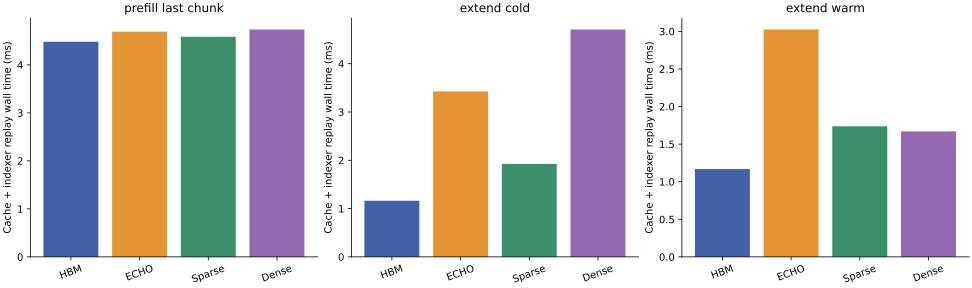

# Cache manager standalone replay

Benchmark `cache_manager_bench_20261006_07`; profile `cache_manager_profile_20261006_07`.

The production cache/indexer stages execute with captured extend inputs. Prefill uses explicitly synthetic repeated extend queries. No MLA, model projection, MLP, embedding or LM head executes. Prefill prefixes are rebuilt with actual uninterrupted appends before each sample; extend uses production snapshot restoration. MFU and whole-model gap gates are N/A.

| Phase | Scheme | Median wall ms | Samples |
| --- | --- | ---: | ---: |
| extend_cold | dense_prefetch | 4.708200 | 7 |
| extend_cold | echo | 3.426455 | 7 |
| extend_cold | hbm | 1.162050 | 7 |
| extend_cold | serial_sparse | 1.926094 | 7 |
| extend_warm | dense_prefetch | 1.669608 | 7 |
| extend_warm | echo | 3.025691 | 7 |
| extend_warm | hbm | 1.168217 | 7 |
| extend_warm | serial_sparse | 1.738209 | 7 |
| prefill_last_chunk | dense_prefetch | 4.738095 | 7 |
| prefill_last_chunk | echo | 4.692034 | 7 |
| prefill_last_chunk | hbm | 4.482903 | 7 |
| prefill_last_chunk | serial_sparse | 4.585457 | 7 |

Profile details retain actual timestamp intervals in activities.csv. Host IO, indexer compute, fused compute+IO, selection, cache metadata and D2D/control are separate. Nonzero fused internal IO is unresolved; wall minus known IO is not a complete no-IO latency measurement. Individual interval unions can overlap and must not be summed. Profile timing is invasive and separate from clean timing.

| Phase | Scheme | Window ms | Indexer union ms | Known IO union ms | Management + selection/control union ms | Idle ms | Outside indexer/IO ms |
| --- | --- | ---: | ---: | ---: | ---: | ---: | ---: |
| extend_cold | dense_prefetch | 4.799636 | 0.800029 | 4.131537 | 0.245696 | 0.306852 | 0.400676 |
| extend_cold | echo | 3.945680 | 2.523640 | 0.109920 | 0.371166 | 0.953082 | 1.312120 |
| extend_cold | hbm | 1.543038 | 0.796285 | 0.000000 | 0.199583 | 0.547170 | 0.746753 |
| extend_cold | serial_sparse | 2.507002 | 0.800925 | 0.501118 | 0.293184 | 0.912799 | 1.204959 |
| extend_warm | dense_prefetch | 2.256157 | 0.800029 | 0.017824 | 0.231616 | 1.210688 | 1.438304 |
| extend_warm | echo | 4.832882 | 2.132025 | 0.018432 | 0.379839 | 2.307162 | 2.682425 |
| extend_warm | hbm | 1.464761 | 0.798205 | 0.000000 | 0.198399 | 0.468157 | 0.666556 |
| extend_warm | serial_sparse | 2.501289 | 0.798045 | 0.017376 | 0.293983 | 1.392365 | 1.685868 |
| prefill_last_chunk | dense_prefetch | 5.288324 | 3.127988 | 0.083680 | 1.213404 | 0.922164 | 2.077712 |
| prefill_last_chunk | echo | 5.013443 | 3.134805 | 0.082335 | 1.231675 | 0.619379 | 1.799855 |
| prefill_last_chunk | hbm | 4.990521 | 3.129173 | 0.000000 | 1.151291 | 0.710057 | 1.861348 |
| prefill_last_chunk | serial_sparse | 4.719667 | 3.122580 | 0.081568 | 1.199548 | 0.377155 | 1.522815 |

The outside-indexer/IO metric above includes exact selection. The separate diagnostic gap below excludes indexer and exact top-k mathematical compute, known host IO, and fused indexer/IO from the complete replay window. Same-dtype score packing, cache metadata and FIFO sorting remain GPU control. All categories and interval metrics use checked per-layer record counters: zero-record gather calls are control, and zero-record fused kernels are retained whole as compute, without inventing an internal metadata split. Nonzero or ambiguous fused transport retains compute/IO bounds. activities.csv records the counter field, layer, record count, bytes and empty-IO annotation. This corrects transport classification in earlier analyses; original activity timestamps and launch attribution are unchanged. Exposed control plus idle equals this diagnostic gap; overlapping compute/IO is counted once. Non-IO percentages use the shared MFU formula: the lower bound retains fused intervals; the upper bound removes IO/fused time outside standalone compute. These are standalone diagnostics with no complete-model acceptance threshold. Pure recall has no model compute, so its absolute wall/enqueue latency is the useful measure; its gap percentage cannot establish the complete-model 10% requirement.

| Phase | Scheme | Diagnostic gap ms | Exposed control ms | Idle ms | Non-IO gap lower % | Non-IO gap upper % |
| --- | --- | ---: | ---: | ---: | ---: | ---: |
| extend_cold | dense_prefetch | 0.342052 | 0.035200 | 0.306852 | 26.030 | 26.030 |
| extend_cold | echo | 1.145818 | 0.192736 | 0.953082 | 29.872 | 84.684 |
| extend_cold | hbm | 0.573922 | 0.026752 | 0.547170 | 37.194 | 37.194 |
| extend_cold | serial_sparse | 1.031839 | 0.119040 | 0.912799 | 51.441 | 51.441 |
| extend_warm | dense_prefetch | 1.268768 | 0.058080 | 1.210688 | 56.684 | 56.684 |
| extend_warm | echo | 2.516698 | 0.209536 | 2.307162 | 52.274 | 52.274 |
| extend_warm | hbm | 0.494909 | 0.026752 | 0.468157 | 33.788 | 33.788 |
| extend_warm | serial_sparse | 1.513997 | 0.121632 | 1.392365 | 60.952 | 60.952 |
| prefill_last_chunk | dense_prefetch | 0.958996 | 0.036832 | 0.922164 | 18.422 | 18.422 |
| prefill_last_chunk | echo | 0.681523 | 0.062144 | 0.619379 | 13.811 | 13.811 |
| prefill_last_chunk | hbm | 0.739496 | 0.029439 | 0.710057 | 14.818 | 14.818 |
| prefill_last_chunk | serial_sparse | 0.405827 | 0.028672 | 0.377155 | 8.736 | 8.736 |

All three processes completed with no foreign process or monitor error observed. Discrete observations cannot exclude activity between samples or unrelated CPU work; observer_summary.json records every maximum sample gap and binds the raw observations.
