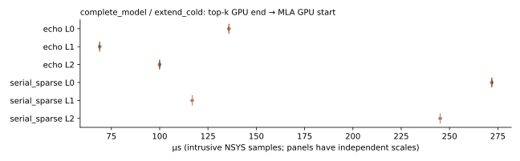

# Top-k completion to MLA compute start

Analysis ID: `cache_full_graph_transition_20261006_03`. Values come from actual NSYS GPU timestamps.

The sole measured interval starts after the last exact-top-k GPU activity, including invalid-ID masking, and ends at the first actual MLA compute kernel. Indexer, top-k and MLA computation are outside it. No stage-duration subtraction or extra mid-path synchronization is used. The interval retains hint updates, KV append/writeback, exact recall, mapping, GPU control, idle, and MLA preparation/launch delays.

The independent replay executes the production MLA consumer. Complete-model captures, when supplied, are a separate workload. These are intrusive profile measurements, not unprofiled wall-clock benchmarks; profiler overhead remains.

## complete_model

Source run: `deepseek_full_graph_cold_profile_20261006_02`.

Times are µs. `all` first sums the separate layer windows within each sample, then takes the median; it is not a complete request duration. Q1/Q3 use inclusive sample quantiles.

| Method | Phase | Layer | Samples | Median | Q1 | Q3 |
|---|---|---:|---:|---:|---:|---:|
| echo | extend_cold | 0 | 1 | 135.872 | 135.872 | 135.872 |
| echo | extend_cold | 1 | 1 | 68.992 | 68.992 | 68.992 |
| echo | extend_cold | 2 | 1 | 99.936 | 99.936 | 99.936 |
| echo | extend_cold | all | 1 | 304.800 | 304.800 | 304.800 |
| serial_sparse | extend_cold | 0 | 1 | 271.839 | 271.839 | 271.839 |
| serial_sparse | extend_cold | 1 | 1 | 116.832 | 116.832 | 116.832 |
| serial_sparse | extend_cold | 2 | 1 | 245.151 | 245.151 | 245.151 |
| serial_sparse | extend_cold | all | 1 | 633.822 | 633.822 | 633.822 |

## Accounting

`windows.csv` retains every sample's endpoint timestamps, IO union, exposed GPU control, idle, and signed MLA launch offset. IO + exposed control + idle equals each window. Zero-record gathers remain control; persistent append D2H is IO even for warm history. `stages.csv` retains only hint, append, recall and MLA wrapper stages. CPU scope time is a separate submission view and must not be added to GPU execution intervals.

A negative launch offset means MLA was already submitted when top-k completed on GPU. Idle-before-launch counts only idle ending at a unique main-stream kernel, before its correlated launch API begins. Other-stream endings remain unassigned. This does not attribute host residual time to Python, C++ checks, allocation or scheduling.

For complete CUDA Graph replay, stage ownership is verified through captured node lineage. All stages share the one graph launch. CPU stage times and the separate MLA launch offset are absent (blank CSV cells / null JSON), not zero. The signed graph-launch offset and idle before/after its return refer to submission of the entire graph; they do not measure a per-kernel Python or wrapper launch.

Replay inputs use an append-built/restored prefix and zero initial hint. This differs from the full model's cache trajectory; differences between workloads are not wrapper-cost estimates. No GR transient candidate, H>P split query, model speedup or complete-model gap gate is claimed.
