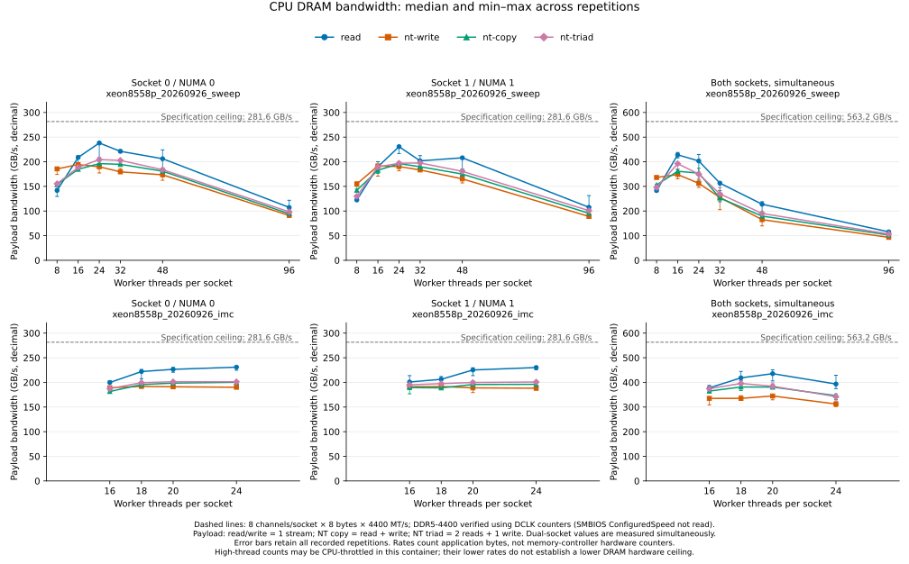

# 当前平台 CPU DRAM 带宽

## 实验目的与边界

为 sparse attention 的主机内存访问成本提供平台带宽参考，计算当前实际装条配置的
DRAM 理论带宽，并测量 NUMA 本地顺序读、非临时写、复制及 triad 的可持续吞吐。
双路结果来自同一个进程的同时执行。这里不测随机稀疏访问、跨 NUMA 远端访问、
GPU DMA、PCIe、CXL 或 NOSA offload，也不据此证明 offload 已实现。

## 硬件与理论上限

2026-09-26，Supermicro SYS-821GE-TNHR：

| 项目 | 当前配置 |
| --- | --- |
| CPU | 2 × Intel Xeon Platinum 8558P，48 物理核 / socket，SMT2 |
| NUMA | 2 节点；节点 0 物理核 0–47，节点 1 物理核 48–95；SMT sibling 为 CPU +96 |
| 内存 | EDAC 显示 32 × 64 GiB DDR5，共 2 TiB |
| 通道 | 每路 8 通道均已装条，每通道 2 DIMM（2DPC） |
| 实际速率证据 | 两路全部 8 个 IMC PMU 的 DCLK 约 2.2 GHz，即 DDR5-4400 |
| LLC | 每路 260 MiB，共 520 MiB |
| CPU governor | `performance`，本实验未修改 |
| 编译器 | GCC 13.3.0；`-O3 -march=native -std=c11 -pthread -Wall -Wextra -lm` |

[服务器官方规格](https://www.supermicro.com/en/products/system/gpu/8u/sys-821ge-tnhr)
列出 1DPC 最高 5600 MT/s、2DPC 最高 4400 MT/s。
本机的实际速率由 perf 计数进一步核验：
[Intel EMR 事件定义](https://raw.githubusercontent.com/intel/perfmon/main/EMR/events/emeraldrapids_uncore.json)
中 `UNC_M_CLOCKTICKS` 为 `event=0x01,umask=0x01`，读取 DCLK；DDR 每周期传输两次。
`umask=0x00` 是约 1.1 GHz 的 HCLK，不能把 sysfs `clockticks` 别名当作 DCLK。
容器内未读取 SMBIOS `ConfiguredSpeed`；这里使用的是直接时钟计数证据。

```text
单路：8 channels × 8 data bytes × 4400 MT/s = 281.6 GB/s
双路：2 × 281.6 = 563.2 GB/s = 524.52 GiB/s
```

GB/s 使用十进制。64-bit 数据通道的 8 B 不计 ECC；两条 DIMM 共享一个通道，
DDR5 子通道也不能再额外乘二。上述是读写共享的原始传输上限，不能把读、写各算一份。

## 测量方法

`src/dram_bench.c` 是本实验的 native 测量内核，使用 pthread 持久线程和 AVX-512。
每个 worker 先固定到 CPU，再初始化自己的匿名数组；使用 `numactl --membind`、
first-touch 和 `MADV_HUGEPAGE`，通过 `/proc/self/numa_maps`、`smaps` 记录页分布。
线程数不超过物理核数时，在对应 socket 上分散选择物理核；超过后才使用 SMT。
每个配置的分配、初始化、页分布检查、数值校验均在计时外。
所有 worker 使用同一个主线程 `CLOCK_MONOTONIC_RAW` 墙钟，计入启动/完成屏障；
每轮 NT store 结束使用 `sfence`。

| 操作 | FP64 计算 | 有效字节数 / pass | 实际参与访问的工作集 |
| --- | --- | --- | --- |
| read | 对 B 累加，8 个独立向量累加器 | N | B |
| nt-write | A = 4 | N | A |
| nt-copy | A = B | 2N | A + B |
| nt-triad | A = B + 3C | 3N | A + B + C |

N 为全部 worker 的单个数组字节数；分配始终包含 A/B/C 三个数组。
每轮重复遍历 `passes` 次。read 结果使用独立解析 checksum 校验，写操作逐元素校验。
`payload_GBps` 为有效字节数 / 墙钟时间；**复制的单向数据量 / 时间只有该值的一半**。
这是类似 STREAM 的自有内核，没有把它标称为标准 STREAM 分数。

`--imc` 额外采集所选 socket 的全部 8 组 IMC CAS 计数，使用 sysfs 核验的
`cas_count_read=0xcf05`、`cas_count_write=0xf005`，每事件 64 B。
保存原始事件数、enabled/running 时间以及缩放后的 read/write/total GB/s。
计数快照包围同一个计算区间，包含的墙钟窗口略宽于 payload 计时，并以各自窗口为分母。
这些是所选 socket 的控制器实际流量，包含其他进程的背景访问。
大工作集、NT store 与 CAS 计数共同用于区分应用吞吐、缓存贡献和 DRAM 流量。

### 容器限制

允许使用 CPU 0–191，当前可见 cgroup 的 `cpu.cfs_quota_us=-1`。
但 `cpu.stat.local` 的 `throttled_time` 在高并发期间明显增加；
该项包含父 cgroup 节流传递给本子树的时间。cgroup mount 只暴露 `user-container`
子树，无法读取父级配额，因而不能宣称获得了全部物理 CPU 资源，或推断某个固定核数上限。
[Linux CFS bandwidth 文档](https://www.kernel.org/doc/html/latest/scheduler/sched-bwc.html)
说明子组也会因父级 quota 耗尽而被节流。

结果表示**当前容器、当前背景负载下可达到的带宽**。高线程数下降保留为有效环境对照，
不能把该下降解释成 DRAM 硬件本身的峰值下降。低并发峰值配置另用更长计时及 IMC 复测。
每个复测 case 保存节流计数前后值；该差值覆盖整个进程的 setup、warmup、计算和校验，
并非某个单独操作的节流时间，也不能跨操作相加。

## 运行方式与调用模块

从仓库根目录执行；无需安装本仓库或额外第三方 benchmark。
需要 Linux x86 AVX-512、GCC、pthread、numactl、Python 3；绘图使用现有 analysis 依赖中的
matplotlib。`--imc` 还要求 Intel EMR PMU 和当前用户可访问 perf 事件，缺少时明确失败。

```bash
bash experiments/cpu_dram_bandwidth/scripts/run.sh --help

# 第一轮：每节点 8/16/24/32/48/96 线程，单独节点0、节点1、双节点同时运行。
bash experiments/cpu_dram_bandwidth/scripts/run.sh xeon8558p_20260926_sweep

# 第二轮：扩大数组、增加重复，核对 IMC 流量和容器节流。
bash experiments/cpu_dram_bandwidth/scripts/run.sh xeon8558p_20260926_imc \
  --threads 16,18,20,24 --mib-per-thread 256 --warmup 3 --reps 11 --passes 8 --imc

# 只读时钟核验；输出必须使用新路径。
python3 -m experiments.cpu_dram_bandwidth.src.probe_imc \
  --output /tmp/dram_clock_new.json

# 离线生成图表和数据。
.venv/bin/python -m experiments.cpu_dram_bandwidth.src.report \
  --data-dir experiments/cpu_dram_bandwidth/output/data/xeon8558p_20260926_sweep \
             experiments/cpu_dram_bandwidth/output/data/xeon8558p_20260926_imc \
  --output-dir experiments/cpu_dram_bandwidth/output/data/xeon8558p_20260926_imc/analysis
```

重跑请更换 run ID。脚本拒绝覆盖现有目录，串行编排所有配置并保留子进程失败状态。
`src/measure.py` 负责硬件元数据、单次 native 后端调用和汇总；`src/probe_imc.py`
负责只读 DCLK/HCLK 测量；`src/report.py` 负责离线图表及 IMC 对照。
`scripts/run.sh` 负责编译、参数组合和独立 stdout/stderr 日志。
完整 JSON、CSV、源码快照和二进制位于 `output/data/<run_id>/`，日志位于
`output/log/<run_id>/`；`output/profile/<run_id>/` 预留，本次无 profiler trace。

## 结果与报告来源

第一轮 `xeon8558p_20260926_sweep`：128 MiB / array / worker，预热 2 次，计时 7 次，
每次 4 passes；18 个 NUMA/线程配置、4 种操作，均通过数值校验。
第二轮 `xeon8558p_20260926_imc`：256 MiB / array / worker，预热 3 次，计时 11 次，
每次 8 passes；12 个配置、4 种操作，均通过数值校验，IMC 计数的 running fraction 全为 1，
没有事件复用。两轮共 30 个配置、120 个操作记录；页分布均符合 NUMA 绑定，数组均使用 THP。

**当前装条配置的理论上限为 563.2 GB/s；当前容器中，双路可持续顺序读的控制器实际
读流量约 428 GB/s，读写总流量约 433 GB/s，应用有效吞吐约 435 GB/s。**
下面采用第二轮各范围最佳顺序读配置的 11 次中位数，单位均为 GB/s：

| 范围 | 物理线程数 | read 工作集 | 理论上限 | 应用 read | IMC read | IMC read + write |
| --- | ---: | ---: | ---: | ---: | ---: | ---: |
| NUMA 0 | 24 | 6 GiB | 281.6 | 230.93 | 224.41 | 225.86 |
| NUMA 1 | 24 | 6 GiB | 281.6 | 230.15 | 225.11 | 226.41 |
| 双路同时 | 20 + 20 | 10 GiB | 563.2 | **435.43** | **427.93** | **432.57** |

双路 IMC 总流量约为理论传输上限的 **76.8%**。同配置的单次最大应用 read 为
450.91 GB/s，正文使用中位数描述持续表现。应用与 IMC 差额符合部分缓存复用及背景访问的
可能量级；计数快照开销不足以解释全部差额，不能将应用 read 直接等同于物理 DRAM read。
各列分别取中位数，不用中位数之差推导精确缓存命中率。

第二轮双路其他操作的最佳中位数：NT write **344.86 GB/s**（20 + 20 线程）；
NT copy **381.41 GB/s**（18 + 18，读写合计，单向复制 **190.71 GB/s**）；
NT triad **395.79 GB/s**（18 + 18，2 读 + 1 写）。
这些值按有效字节统计；IMC 对照另列在数据表中，NT write 同样可观测到额外读流量，
不将这些额外流量计成 benchmark 的有效写吞吐。

第一轮 128 MiB 数组的最佳应用 read 中位数为 NUMA 0 **238.04**、NUMA 1 **230.61**、
双路 **427.95 GB/s**；全部较低线程/较高线程的有效结果也保留。
第二轮双路 18 + 18 配置整个 case 的 local throttling 增量为 0；20 + 20 为约
4.79 秒累计 runqueue 节流时间，24 + 24 为约 192.27 秒。
这些是跨 CPU 累计、包含 setup 的计数，不能作为墙钟停顿直接相减。
因此本次测得的是当前运行环境的可达吞吐，尚不能证明无父级 CPU 限额时的裸机持续极限。



报告素材均来自上述两个 run，按前面的 `src.report` 命令生成完整分析到第二轮的
`output/data/xeon8558p_20260926_imc/analysis/`，再选取以下文件复制到 `report/`：

- [完整配置与重复统计](report/all_measurements.csv)、[各操作最佳中位数配置](report/selected_peaks.csv)。
- [IMC 对照及 case 级节流计数](report/imc_crosscheck.csv)。
- [图表输入与 SHA256](report/provenance.json)。
- [硬件配置、官方来源与理论计算证据](report/hardware_evidence.json)，从第二轮数据目录复制。
- [正式 DCLK/HCLK 原始计数](report/clock_counters.json)，由运行脚本的 `src.probe_imc` 生成后复制。

完整逐轮数据、原始日志、二进制与源码快照仍保留在对应 `output/` 目录。
native 内核通过 `-Werror` 编译与独立 checksum / 逐元素验证，CLI、Ruff 和图表生成检查通过；
这些正确性检查不作为带宽实验结果。
