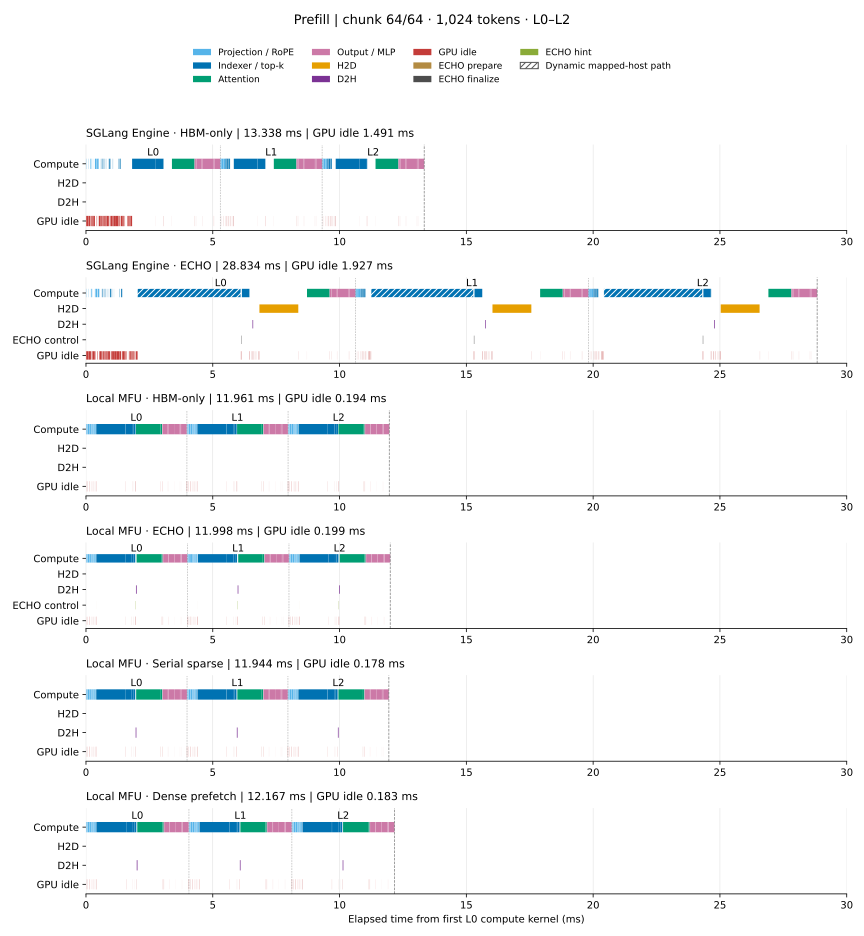
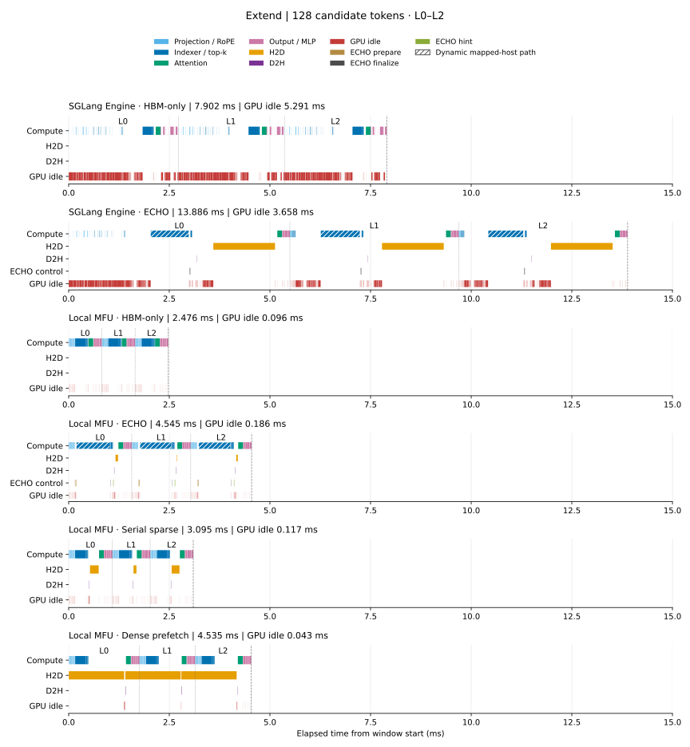
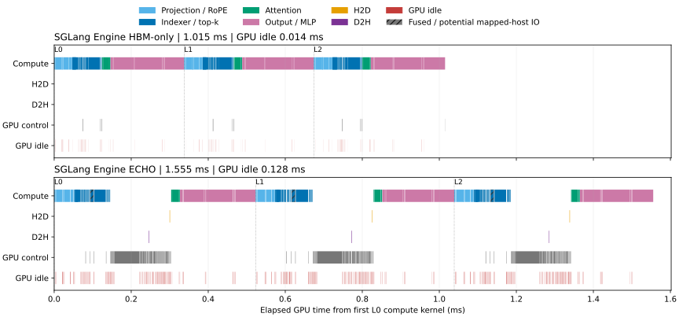
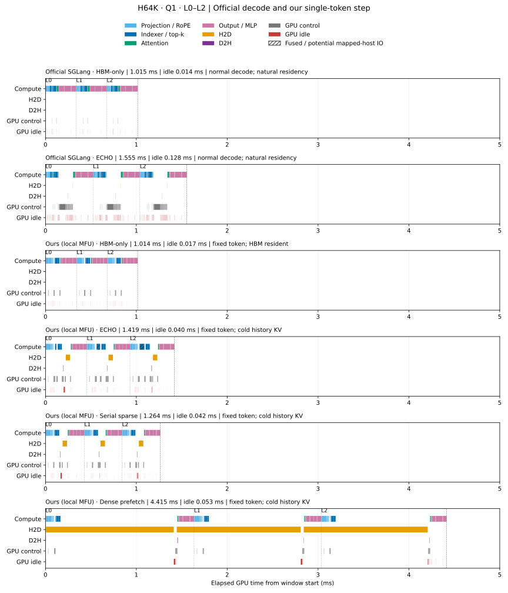

# DeepSeek V3.2 官方 SGLang 性能复现

本地 Q1 已优先采用固定版本 ECHO 的官方 paged 融合 indexer/prefetch 内核，
完整模型补测与对比图已更新。官方 SGLang 复现保持原环境、输入与自然驻留；
本地 offload 测量每次恢复冷缓存，两组的性能边界分别报告。

Q1 的 page64、页表与暂存区准备融合已完成生产验收和正式补测，当前合图使用
`deepseek_h64k_a1_fused_prepare_20261009_01` 的本地结果。四种方法分别使用独立进程完成
正确性检查、正式计时、阶段 profile 和逐算子 profile，每个进程只准备与预热本方法。
本轮 ECHO 完整同步 step 中位数为 2.562300 ms；它与旧混合预热流程的跨批次差值
不能用来估计某项优化的收益。各项优化的收益仍由下文独立配对计时支持。
官方测量、原始报告及 `numerical_acceptance=false` 保持原样。

本实验属于 baseline 性能合理性检查，使用 ECHO 发布的 SGLang，分别测量固定 history、
变化 candidate 的负载，以及 H64K prefill 后的正常自回归 decode，对比 offload 与
HBM-only。模型取真实 DeepSeek V3.2
checkpoint 的第 0–2 层，依次传播 hidden/residual，包含 embedding、final norm 和
末 token LM head；沿用原始 FP8 权重，不使用 AWQ，也不复制成十层。

按用户要求，官方 SGLang 结果仅报告性能，数值验收未通过。本地官方内核适配
已完成独立数值与 cache 事务验收；这不代表 SGLang 与本地模型数值等价。
下文同时给出本地完整 CUDA Graph 的计时与 MFU。HTTP 复现代码、独立环境、权重及原始 HTTP 运行产物留在
本地 `3rdparty/ECHO/reproduction/cxldsagr/`，不进入父项目 Git。
新 Engine 入口、profile hooks 和绘图代码位于本实验的 `src/`、`scripts/`，只读复用
已有 ECHO 环境；新运行产物和缓存全部写入本实验 `output/`。

## 直接 Engine

[执行入口](src/engine_run.py)直接调用 `sglang.Engine.generate`，请求不经过 HTTP。
正式输入先为 H=65,536 的 history，再为同一 history 加 A=128 的 candidate；
两次调用的 `cached_tokens` 分别为 0 和 65,536，因此第二次只计算新增的 128 tokens。
Prefill 包含全部 64 个 1,024-token chunk。两次调用均贪心采样一个 token，没有后续
decode forward。完整 Engine 请求的独立计时如下：

| 方案 | Prefill 样本数 | Prefill 中位数 ms | Extend 样本数 | Extend 中位数 ms |
| --- | ---: | ---: | ---: | ---: |
| SGLang Engine HBM-only | 3 | 1142.339 | 5 | 23.684 |
| SGLang Engine ECHO | 3 | 1830.076 | 5 | 30.164 |

数据见[逐样本表](report/sglang_engine/benchmark_samples.csv)、
[统计表](report/sglang_engine/benchmark_statistics.csv)、
[完整报告](report/sglang_engine/report.json)和[发布清单](report/sglang_engine/publication.json)。
独立结构检查、缓存命中、输出形状与有限性、容量和进程释放检查通过；
**官方数值验收仍为 `false`**，这些检查不代表跨实现数值等价。

两组都在 GPU 7（PyTorch 识别为 H200 / SM90）上运行，CPU 72–79、NUMA 1，
OMP/MKL 线程数均为 8。使用相同的原始 workload request 0、TP=DP=1、page size=64。
HBM-only 有 131,072 个 device token 槽；ECHO 有 65,664 个 device 槽和
16,777,216 个 host 槽，不是等容量或等 HBM 字节预算对照。

每组正式样本使用五个新 Engine。每个 Engine 先执行两个不相交前缀的 H→H+A
预热：只将原输入的首 token 分别改为 `(token+1)%129280`、`(token+2)%129280`，
其余 token 不变。然后测量未改动的原始输入，保留官方 radix 和自然淘汰行为。
前三个 Engine 的 prefill 纳入统计，后两个只用于准备 history；五次 extend 均纳入。
另有一个独立 Engine 预热组，其请求也不计入正式样本。

计时从 `generate` 调用开始，到完整 Python 结果返回，包含 TokenizerManager、
scheduler、IPC、模型、采样和 detokenization；构造、预热、控制初始化、输出检查
及文件保存均在计时外。正式 prefill 是已预热 Engine 中的逻辑前缀 miss，allocator
中已有预热数据。不调用 `flush_cache`，也不执行本地 MFU 的 cold reset。
HTTP 旧实验使用 16 用户的访问轨迹，不能用它与本表相减来估计 HTTP 开销。

### GPU timeline

Prefill 将 SGLang Engine 的 HBM-only、ECHO 与本地 MFU 的四种方法画在同一张图中，
六组共用 0–30 ms 时间轴，均取最后一个 chunk（64/64，位置 64,512–65,535）。
Extend 同样比较这六组方法，取完整 128-token batch，共用 0–15 ms 时间轴。
窗口从 L0 首个计算 kernel 开始，到 L2 最后计算 kernel 结束；本地 dense extend
若有更早开始的 L0 历史 H2D，也完整保留。本次 dense 的计算比 H2D 早 4.384 µs。
图中时间来自独立 NSYS 采集，包含 profiler 影响，不能代替上面的 Engine 独立计时。



Prefill 的[六组窗口数据](report/combined_prefill/windows.csv)与
[来源记录](report/combined_prefill/provenance.json)保存精确时长和输入哈希。



Extend 的[六组窗口数据](report/combined_extend/windows.csv)与
[来源记录](report/combined_extend/provenance.json)保存对应来源。
两张合图沿用已发布的活动区间和 GPU idle，不重新测量。图中保留标题、图例和
坐标标注，底部不加说明小字。

| SGLang Engine 方案 | Prefill 窗口 ms | Prefill GPU idle ms | Extend 窗口 ms | Extend GPU idle ms |
| --- | ---: | ---: | ---: | ---: |
| HBM-only | 13.338 | 1.491 | 7.902 | 5.291 |
| ECHO | 28.834 | 1.927 | 13.886 | 3.658 |

红色只表示窗口内没有 kernel、memcpy 或 memset 的区间；控制操作本身不算 GPU idle。
原始窗口见[窗口表](report/sglang_engine/windows.csv)，活动明细见
[选定 GPU 活动](report/sglang_engine/selected_activities.csv)。各窗口的活动均已归属，
busy 与 idle 的区间并集覆盖整个窗口。

两组 profile 在阶段结束时的驻留快照显示，三层 history 都在 HBM 中，extend 后新增的
128 tokens 也驻留。ECHO 每个显示窗口有三次明确指向 host 的 D2H 写回。
融合 indexer 在 Compute 行保留斜线；recall kernel 在 H2D 行使用橙色实心条，
条宽保留 kernel 的实际执行时长。两种动态路径都可能搬运零条记录，mapped-host
的实际传输字节仍未知。没有观测到 CUPTI host memcpy，不能据此声称 H2D 为零。
这组自然驻留状态与本地 MFU 的 cold offload 条件不同。

2026-10-07 的[recall 诊断](report/recall_diagnosis.md)进一步定位了橙色长条：官方
kernel 每层扫描全部 16,777,216 个 host 槽位的 HBM 标记。使用相同二进制的独立
零 miss 实验测得 1.530 ms，与原 trace 的约 1.533 ms 接近；NCU 显示整数与逻辑
ALU 利用率约 84%，HBM 读吞吐仅为峰值的 0.23%。这段耗时主要来自标记扫描，
不能作为纯 H2D 时间。诊断未修改官方实现，也不改变原性能报告与数值验收状态。

### 来源与复现

| 阶段 | HBM-only run ID | ECHO run ID |
| --- | --- | --- |
| 独立检查 | `first3_engine_warm_hbm_check_20261006_01` | `first3_engine_warm_echo_check_20261006_01` |
| 正式计时 | `first3_engine_warm_hbm_bench_20261006_01` | `first3_engine_warm_echo_bench_20261006_01` |
| NSYS | `first3_engine_warm_hbm_profile_20261006_02` | `first3_engine_warm_echo_profile_20261006_01` |

SGLang 图表来源为 `first3_engine_warm_timeline_20261006_01`，选定报告由
`first3_engine_warm_report_20261006_01` 按原字节发布。完整数据、源码归档、日志和
NSYS 文件分别保存在本实验的 `output/data/<run_id>/`、`output/log/<run_id>/`
和 `output/profile/<run_id>/`，不随 Git 分发。各次运行保存入口、helper 和观测脚本的
源码副本，并记录上游、native 与权重身份。复用独立检查时精确比较 worker、执行
依赖、输入、配置、硬件与环境，进程观测和清理代码的差异
单独记录。GPU 离散观测未见外来进程，各组退出后均确认释放；这不证明全机独占。

Prefill、extend 合并图分别由 `engine_mfu_prefill_20261006_04`、
`engine_mfu_extend_20261006_03` 生成。本地四组统一使用
`deepseek_dense_late_wait_profile_20261006_01` 的阶段 profile 与
`deepseek_dense_late_wait_timeline_20261006_02` 的窗口数据。
[合并绘图入口](src/compare_timeline.py)读取已发布的 SGLang 报告和本地 MFU 的
`window_rows.json`，按发布凭据定位当前数据并核对窗口；分类复用
`experiments.deepseek_v32_mfu.src.compact_timeline` 与
`experiments.deepseek_v32_mfu.src.timeline` 的绘图辅助函数。
recall 的展示位置和颜色单独记录在来源文件中，原始分类与 IO 证据保持不变。
使用新 run ID 可绘制当前发布的数据：

```bash
PYTHONDONTWRITEBYTECODE=1 \
MPLCONFIGDIR=experiments/deepseek_v32_echo_official/output/runtime/cache/matplotlib \
.venv/bin/python -B -m experiments.deepseek_v32_echo_official.src.compare_timeline --phase prefill \
  --output-dir experiments/deepseek_v32_echo_official/output/data/engine_mfu_prefill_20261006_05

PYTHONDONTWRITEBYTECODE=1 \
MPLCONFIGDIR=experiments/deepseek_v32_echo_official/output/runtime/cache/matplotlib \
.venv/bin/python -B -m experiments.deepseek_v32_echo_official.src.compare_timeline --phase extend \
  --output-dir experiments/deepseek_v32_echo_official/output/data/engine_mfu_extend_20261006_04
```

入口只读复用本地 ECHO 复现目录的 `src.preflight`、`src.capacity`、
`src.workload_client`、`scripts.run` 和 `scripts.lifecycle`，以及已有独立环境、
权重和输入。这些本地依赖不随父仓库分发。新代码、缓存及运行产物都留在本实验目录。
从仓库根目录运行，替换 run ID 后缀以免覆盖已有结果：

```bash
set -euo pipefail
export OMP_NUM_THREADS=8 MKL_NUM_THREADS=8
engine_repro_id=engine_repro_new
for engine_repro_case in resident_reference echo; do
  numactl --physcpubind=72-79 --membind=1 \
    bash experiments/deepseek_v32_echo_official/scripts/run_engine.sh \
    --run-id "${engine_repro_id}_${engine_repro_case}_check" \
    --case "$engine_repro_case" --mode check --gpu 7 --performance-only \
    --numerical-diagnostic 3rdparty/ECHO/reproduction/cxldsagr/output/acceptance/diagnostic_first3_triplet_20261006_01.json
  for engine_repro_mode in bench profile; do
    numactl --physcpubind=72-79 --membind=1 \
      bash experiments/deepseek_v32_echo_official/scripts/run_engine.sh \
      --run-id "${engine_repro_id}_${engine_repro_case}_${engine_repro_mode}" \
      --case "$engine_repro_case" --mode "$engine_repro_mode" --gpu 7 --performance-only \
      --check-run "experiments/deepseek_v32_echo_official/output/data/${engine_repro_id}_${engine_repro_case}_check" \
      --numerical-diagnostic 3rdparty/ECHO/reproduction/cxldsagr/output/acceptance/diagnostic_first3_triplet_20261006_01.json
  done
done
```

[NSYS 导出脚本](scripts/export_nsys.py)通过 `--input` 接收 `.nsys-rep` 并保存带哈希的
SQLite 导出记录。[绘图入口](src/engine_timeline.py)接收两组 `--capture CASE=SQLITE`
和 `--benchmark CASE=RUN_JSON`，其中 CASE 为 `hbm`、`echo`；
[报告入口](src/report_engine.py)核验六组运行及图表后导出选定素材。两个 Python 入口
分别使用 `python -m experiments.deepseek_v32_echo_official.src.engine_timeline` 和
`python -m experiments.deepseek_v32_echo_official.src.report_engine`，均支持 `--help`。
绘图使用项目 `.venv` 中的 Matplotlib，并将 `MPLCONFIGDIR` 指向本实验
`output/runtime/cache/matplotlib/`；执行模型使用已有 ECHO 独立环境。

## H64K 正常 decode

[执行入口](src/decode_run.py)以 H=65,536 的原始 history 调用一次 `Engine.generate`，
`sampling_params={"max_new_tokens": 2, "temperature": 0, "ignore_eos": True}`。
64 个 1,024-token prefill chunk 完成后，官方 scheduler 消费首个采样 token 57841，
执行一次 `DECODE`，query=1、sequence length=65,537，再采样 token 39556。
这与上文 H+A 的候选 extend 是两种请求。默认官方 CUDA Graph 保持开启，三层 decode
位于一次 graph launch 中；不清空 radix、不重置 history 驻留。

两组仍使用真实 checkpoint 第 0–2 层、FP8 权重和 BF16 主 KV，GPU 7 为 H200 / SM90，
CPU 72–79、NUMA 1，OMP/MKL 线程数均为 8。输入取同一 workload request 0 的前
65,536 tokens，TP=DP=1、page size=64。每组独立计时使用三个新 Engine；每个 Engine
先运行两次正常请求预热，仅将原始首 token 分别改为 `(token+1)%129280` 和
`(token+2)%129280`，然后测量原始请求。三次正式请求的 `cached_tokens` 均为 0，
因此每次都包含完整 prefill 和一次 decode。

完整请求计时从 `generate` 调用开始，到 Python 结果返回，包含 prefill、decode、
两次采样、调度、IPC 和 detokenization。Engine 初始化、同进程预热、输出检查和
保存均在计时外。独立检查、正式计时与 profile 使用不同进程；计时不安装 profile
hooks，不返回完整 hidden 或词表分布。

| 方案 | 完整请求样本数 | 完整请求中位数 ms |
| --- | ---: | ---: |
| HBM-only | 3 | 1157.594 |
| ECHO | 3 | 1842.270 |



| 方案 | Decode L0–L2 窗口 ms | GPU busy ms | GPU idle ms | 完整 decode graph 的 GPU 节点数 |
| --- | ---: | ---: | ---: | ---: |
| HBM-only | 1.014975 | 1.000701 | 0.014274 | 141 |
| ECHO | 1.555390 | 1.427742 | 0.127648 | 297 |

图中两组共用时间轴，窗口从 L0 首个计算 kernel 开始，到 L2 最后计算 kernel 结束。
这些时间来自独立、侵入式 NSYS 采集，不能当作完整请求或无 profiler 的单 token
延迟。GPU idle 是窗口内没有 kernel、memcpy 或 memset 的区间；控制操作计入 busy。
每个 GPU 节点先通过同进程的原生 CUDA Graph clone lineage 绑定到 capture 时的
节点，再读取其层号和阶段，不按 kernel 名称或重复次序推测层号。

ECHO 的融合 indexer 在 Compute 行用斜线标出潜在 mapped-host IO。三次 decode
recall 自定义 kernel `_recall_update_with_prefetch_kernel` 共 3.136 µs，按功能显示为
H2D 行的橙色条，保留真实宽度。该 kernel 包含映射更新，并可能从 GPU 暂存区做 D2D
或从 mapped host 做 H2D；也可能不搬运记录。实际字节未知，整段时长不等于纯拷贝时间。
三次明确指向 host 的写回 kernel 共 3.200 µs，显示在 D2H 行。未观测到 CUPTI host
memcpy，不能据此声称 H2D 或实际传输量为零。

驻留快照在 `generate` 返回后同步读取，位于正式请求和 forward 窗口之外。两组的
三层 history 均有 65,536 tokens 驻留；HBM-only 的 decode 输入 token 仍驻留，
ECHO 的该 token 未驻留。这个后置快照不证明 decode 开始时的完整驻留状态。
HBM-only 配置 131,072 个 device 槽，ECHO 配置 65,664 个 device 槽和 16,777,216
个 host 槽；这不是等容量或等 HBM 字节预算比较。

独立检查通过输出结构、有限性、词表分布归一化，以及采样 token 与分布 argmax
一致性检查。保存的 hidden 与 logprobs 形状分别为 `(1025, 7168)` 和 `(2, 129280)`。
**官方数值验收仍为 `false`**，这些检查不代表跨实现数值等价。两组 NSYS 均保留
“Not all NVTX/CUDA events might have been collected” 的进程级警告。本轮逐项核验了
全部 65 个正式 forward 的范围、64×3 个 prefill 层范围，以及唯一 decode graph
的完整 GPU 节点集合；不据此宣称 setup、warmup 或整个进程的 trace 均完整。

数据见[完整报告](report/sglang_decode/report.json)、
[独立计时样本](report/sglang_decode/timing_samples.csv)、
[窗口数据](report/sglang_decode/windows.json)、
[活动明细](report/sglang_decode/activities.json)和
[发布清单](report/sglang_decode/publication.json)。
本次仅重绘展示，run ID 为 `h64k_decode_recall_display_20261009_01`；原始分类、
活动时间、窗口、idle、独立计时和数值验收状态保持原样，发布清单另记显示映射。
本地 [H64K+A1 MFU](../deepseek_v32_mfu/README.md) 使用固定输入的单 token 持久追加，
offload 方法在 cold 条件下执行；这里使用自回归采样输入和官方自然驻留。两组的
输入、缓存状态和计时边界不同，分别报告，不据此计算跨框架加速倍数。

### 与本地 H64K+A1 的 timeline 对比

下图将官方 HBM-only、ECHO 与本地 MFU 的四种方法放在同一张图中，六组共用
0–5 ms 时间轴，均显示 H64K 后一个 token 的 L0–L2 GPU 活动。



官方两组执行正常自回归 decode，保留自然驻留；本地输入是固定 token，三个
offload 方法的 history 主 KV 从 DRAM 冷状态开始，indexer 保留在 HBM。
两侧的单 token 输入、容量及软件环境不同，分别使用 GPU7 和 GPU0。
图中保留各自已发布的 NSYS 窗口、完整 IO 和 idle；官方 recall 按完整自定义 kernel
显示在 H2D 行，沿用上文的混合工作与未知字节边界。斜线仍表示融合 indexer 的潜在
mapped-host IO，不能据条宽推算传输量。
这些 profile 窗口不替代独立计时，也不建立等工作量下的加速比或数值等价。

[六组窗口数据](report/combined_decode/windows.csv)与
[来源记录](report/combined_decode/provenance.json)保存精确端点、原 profile run ID 和
输入哈希。合图 run ID 为 `combined_decode_recall_display_20261009_01`，复用上文官方 decode
与本地 `deepseek_h64k_a1_fused_prepare_20261009_01` 的四个独立阶段 profile，合图本身
未新增 GPU 测量。各方法的 result、SQLite、benchmark 和验收记录绑定保存在
[面板数据](report/combined_decode/panels.json)中；没有为四种方法合成一个 profile run ID。
[绘图入口](src/compare_decode_timeline.py)复用本实验 `src.compare_timeline`
的发布校验和本地活动转换，支持独立方法报告，也保留旧矩阵报告的嵌套 receipt 读取。

从仓库根目录使用新的输出目录重绘：

```bash
PYTHONDONTWRITEBYTECODE=1 \
MPLCONFIGDIR=experiments/deepseek_v32_echo_official/output/runtime/cache/matplotlib \
CUDA_VISIBLE_DEVICES= .venv/bin/python -B \
  -m experiments.deepseek_v32_echo_official.src.redraw_decode_timeline \
  --source-report experiments/deepseek_v32_echo_official/report/sglang_decode \
  --output-dir experiments/deepseek_v32_echo_official/output/data/h64k_decode_display_new

PYTHONDONTWRITEBYTECODE=1 \
MPLCONFIGDIR=experiments/deepseek_v32_echo_official/output/runtime/cache/matplotlib \
CUDA_VISIBLE_DEVICES= .venv/bin/python -B \
  -m experiments.deepseek_v32_echo_official.src.compare_decode_timeline \
  --official-report experiments/deepseek_v32_echo_official/output/data/h64k_decode_display_new \
  --mfu-report experiments/deepseek_v32_mfu/report/h64k_a1 \
  --output-dir experiments/deepseek_v32_echo_official/output/data/combined_decode_new \
  --publish-dir experiments/deepseek_v32_echo_official/report/combined_decode_new

CUDA_VISIBLE_DEVICES= .venv/bin/python -B \
  -m experiments.deepseek_v32_echo_official.src.diagnose_decode_gap \
  --comparison experiments/deepseek_v32_echo_official/output/data/combined_decode_new \
  --local-report experiments/deepseek_v32_mfu/report/h64k_a1 \
  --output-dir experiments/deepseek_v32_echo_official/output/data/decode_gap_new
```

### Q1 瓶颈与优化结果

Q1 准备融合已通过生产验收及四方案补测；hint 均值融合、64 空槽准备、
预取写回的并行校验和 CUB top-k 后处理继续保留。
ECHO 官方融合内核保持原样。

Q1 的融合 indexer/prefetch 现在直接调用 ECHO 固定提交的官方 paged 内核，保留
官方阈值更新和 64 条预取上限。本地适配负责 cache 槽、映射与生命周期，未改写
官方融合算法。优化还覆盖 K/scales 打包、staging 发布和 top-k 输入布局。

普通持久 append 满足独占 pool、唯一 session、`H=query_start` 且 `P−H≥64` 时，
适配器只准备前 64 个合法空槽；容量条件不代表 history 驻留。完整 journal、计数、
统计和映射校验保留。100 组平衡 AB/BA 的独立三层模型计时中，完整同步 step 中位数
从 2.7214065 降至 2.641556 ms，降低 2.934%，91 组更快。每次计时外恢复相同冷状态；
这项配对收益来自 `q1_free_prepare_model_bench_20261008_01`，不外推到官方正常 decode。

本次均值融合保留 Torch FP32 归约树、非有限值和 subnormal 处理，只改写
`offset[0]`。私有独立双模型使用 100 组平衡 AB/BA，完整
`forward(return_hidden=True)` 加同步的 wall 中位数从 2.6486815 降至
2.6053275 ms，87 组更快，成对差值中位数为 −45.828 µs。每次计时外恢复相同
cold prefix 与 hint。来源为 `q1_hint_model_bench_20261008_01`；每层均值由三个
kernel 减为一个，decode EMA 仍独立更新。生产入口另行通过全部 offset 位、变化
输入的 graph replay、非默认 stream 和 Q1→A2 的实际消费验收。完整 ECHO graph
在本轮独立阶段 profile 中有 257 个 GPU 节点，所选 L0–L2 窗口包含 250 个 GPU 活动；
节点计数不能代替正式完整 step 的计时结论。

当前准备融合把 page64 打包、block table 与 host-token/staging 准备合并。
独立三层模型的 500 对 AB/BA 计时中，完整同步 step 中位数从 2.646831 降到
2.6119945 ms，413 对更快；配对中位数下降 34.6505 µs，两种顺序及全部五个连续
100 对区段的中位数均下降。但部分均值与 p99 变差，不能声称长尾改善。三层 H2D
的配对中位数增加 2,304 B，graph private reserved 均为 62,914,560 B。
该配对结果来自私有双模型；默认路径现已通过 151 项 GPU 检查及 16 个独立进程的
四方法补测。新生产 profile 确认每层一次融合准备，三层合计 18.656 µs；其余
254 个节点的归属和完整执行配置多重集与原图一致。详见
[准备融合对照](report/q1_fused_prepare/report.md)，组件与模型 run ID 分别为
`q1_fused_prepare_bench_20261008_02`、`q1_fused_prepare_model_bench_20261008_02`。
独立完整图 profile 另确认准备节点从 9 个减到 3 个，耗时合计 23.744→18.592 µs，
其余 254 个节点的归属与执行配置一致。它解释了局部准备变化，不能把完整 wall
差值全部归因于这 5.152 µs；原始 profile 为 `q1_fused_prepare_model_profile_20261009_01`。


| 独立 CUDA Graph 计时边界 | 原实现 µs | 当前实现 µs |
| --- | ---: | ---: |
| K/scales 打包，真实 L0–L2 输入 | 20.328–20.405 | 4.308–4.587 |
| Resident MQA 完整适配，不含 exact top-k | 28.107–28.261 | 12.841–12.993 |
| Staging promotion 完整调用，六种 map/记录数条件 | 13.088–13.696 | 10.720–11.408 |
| Official scores 的完整 exact top-k，真实 L0–L2 | 50.976–51.680 | 49.280–49.680 |

Promotion 的两个对照都按 record 并行复制；新版本将校验 CTA 从 64 线程改为
256 线程，并行检查重复记录，保留全部映射检查，600 组配对均更快。Top-k 保留
FlashInfer SMALL 精确选择，用官方 CUB 合并排序与无效 ID mask，149/150 组配对更快。
打包、排序的值和索引逐位一致，promotion 的字节、映射、graph replay、非默认流
与非法输入均独立验收。表中包含各自完整 API，不能将收益相加推算完整模型加速。
硬件、原始样本及源码/native 身份见
[官方路径报告](report/q1_official_path/report.md)，报告 run ID 为
`q1_official_path_report_20261008_06`。


Attention 使用 16 分片调用官方 sparse prefill，再用 FP32 LSE 合并 BF16 partial。
完整 Graph API 从 54.92–54.99 µs 降至 15.37–15.55 µs，计入 Q repeat、主 kernel
与合并；eager 约 55 µs，基本持平。主 kernel 从 2 个 CTA 增到 32 个，NCU 证据
支持原路径并行度不足。最大绝对差异为 `4.88e-4`，通过原 `atol=4e-3, rtol=2e-2`，
没有放宽容差。见[attention 报告](report/q1_optimization/report.md)。本次制图 run ID
为 `q1_attention_report_20261008_04`，复用仍有效的 attention 独立测量，未新增 GPU 计时。

当前三层完整路径已重新验收、计时和 profile。下表为六组 timeline 的侵入式
profile 窗口，单位 ms，不能代替完整请求延迟。

| 方法 | 官方正常 decode | 本地单 token step |
| --- | ---: | ---: |
| HBM-only | 1.014975 | 1.014466 |
| ECHO | 1.555390 | 1.419011 |
| Serial sparse | — | 1.263747 |
| Dense prefetch | — | 4.415209 |

本轮本地 HBM 的 GPU 窗口比官方参考短 0.509 µs，两个窗口的长度接近。
这不代表完整请求延迟或数值等价。Projection 与 indexer 的合并区间为本地
405.120 µs、官方 360.318 µs，两侧分类边界不同，不能单看某一色块判断瓶颈。
GPU busy 为本地 0.997729 ms、官方 1.000701 ms，idle 分别为 16.737 / 14.274 µs。

此前 FREE 批次的独立 A1/B1/B2/A2 对照中，先执行四方案预热影响了后续 HBM 窗口：
两个仅做 HBM 准备的进程 idle 为
17.312–18.146 µs，两个加入四方案预热的进程为 67.361–68.064 µs。两组 GPU
计算节点相同，各自实际观察到的算子身份均与当时的正式实现匹配；每组只有两个独立
进程，具体机制仍在排查。对照来源为 `q1_replay_prelude_abba_20261008_01`，
见 MFU 实验的测量边界说明。当前四种方法分别在独立进程中测量，只运行本方法的
准备与预热；该流程不保证清空 GPU 的硬件状态。新旧批次没有构成平衡配对，不能把
窗口差值归为进程隔离或某项内核优化的收益。图中本地 Q repeat 归入 GPU control，
完整 attention API 的计时还须包含 query 准备和合并，见
[逐算子报告](../deepseek_v32_mfu/report/h64k_a1/operator_mfu.csv)。

单方法对照也都在预热后重建 HBM cache，再测量 HBM：`dense_prefetch` 完整预热
后的六个窗口间隙中位数均为 416 ns，`serial_sparse` 或 `echo` 预热后均为 96 ns。
每项只有一个独立计时进程和一个 profile 进程；dense 预热足以在本次控制中复现
长间隙，具体硬件机制尚未确认。已复核证据汇总为
`q1_replay_single_methods_20261008_01`，位于 MFU 实验的
`output/data/q1_replay_single_methods_20261008_01/`。这些对照单独保留；上表和对比图
使用新的四方法独立进程结果。

本地 ECHO 的官方融合内核三层合计 95.488 µs，每层实际预取 64 条；官方参考
为 25.664 µs，但保留自然驻留，不能将两者差值全部归为纯计算。独立原始内核
测量中，含打包和 metadata 的冷 map/零阈值调用为 21.712–56.528 µs，resident
map 为 18.544–18.704 µs；该边界不含 promotion、top-k 和 residual recall，
resident map 也不代表完整模型的 warm 请求。

64 条是成功预取的上限，并非预约计数的上限。正式计时的逐层记录显示，L0、L1、L2
的预约计数分别为 567–619、3,097、33,471，而三层每次都只预取 64 条。
精确 top-k 仍单独召回缺失记录，各次计时的实际流量见
[本地汇总](../deepseek_v32_mfu/report/h64k_a1/summary.json)中的 `cache_samples`。保存的本地
Q1 验收状态中，初始 `offset[1]` 均为 0；官方 SGLang 没有保存该次 decode 的阈值。
因此，两侧融合内核的时长差不能全部归为本地计算开销，也不能据此分离纯 IO 时间。

新增的同输入 L2 冷／热驻留对照进一步定位了这段开销：保持 Q/K/scales/weights
与正零阈值一致，官方融合 core 的 NCU 时长为冷态 55.008 µs、完全驻留 10.880 µs，
最慢 SM 的活跃周期从 78,125 降到 12,448，平均值则接近。冷态实际暂存 64 条、
73,728 B，完全驻留时不搬运；有效聚合计数显示原子指令为 1,048 / 0。
官方已经按 warp 聚合预约，不能把 33,464 条预约尝试当成同等数量的原子指令。
这支持 miss／预取路径存在长尾，但两项工作同时消失，尚不能分离原子与搬运开销。
每个 full capture 使用 45 次 kernel replay、cache flush 和 base clock control，
时长不能代替正式 API 计时。Per-PC 和 PM 实例的可用性标志为 false，未用于耗时归因。
测量、源码与警告见[冷态预取诊断](report/q1_prefetch_diagnosis/report.md)，原 run ID
为 `q1_official_core_ncu_20261008_01`，报告由 `q1_prefetch_diagnosis_report_20261009_02` 发布。

将窗口内重叠的 GPU 活动区间合并后，官方 ECHO 的 idle 为 127.648 µs，
本地 ECHO 为 40.388 µs。这里保留全部没有 GPU 活动的窗口区间。两组仍是输入、驻留和环境不同的侵入式 profile，
间隙差异的机制尚未确认。原始 SQLite 的 CPU 复核见本轮
[分解记录](report/decode_gap/report.json)与[窗口数据](report/combined_decode/panels.json)，
预约计数来自前述本地计时样本；
此前的独立内核 map 对照仍使用原 run ID，未重新计时。

本地完整同步 step 中位数为 HBM 1.803 ms、ECHO 2.562 ms、serial sparse
2.401 ms、dense prefetch 5.540 ms。ECHO 在本轮 cold 条件下仍慢于 serial sparse，
64 条预测预取与适配开销尚未带来整体收益。
[分解数据](report/decode_gap/gap_decomposition.csv)、[核对结果](report/decode_gap/report.json)
和[来源记录](report/decode_gap/provenance.json)来自
`decode_gap_fused_prepare_20261009_01`。诊断按方法核验原 result、SQLite、捕获顺序和 OS PID，
保留各自的计时与验收绑定；完整计时与 MFU 见
[完整路径报告](../deepseek_v32_mfu/README.md#h64k--a1单-token-step)。
官方输入、驻留、容量与环境仍不同，跨实现数值验收仍为 `false`。

### Decode 来源与复现

| 阶段 | HBM-only run ID | ECHO run ID |
| --- | --- | --- |
| 独立检查 | `h64k_decode_hbm_check_20261008_03` | `h64k_decode_echo_check_20261008_01` |
| 正式计时 | `h64k_decode_hbm_bench_20261008_01` | `h64k_decode_echo_bench_20261008_01` |
| NSYS | `h64k_decode_hbm_profile_20261008_05` | `h64k_decode_echo_profile_20261008_02` |

选定素材由 `h64k_decode_report_20261008_01` 发布到 `report/sglang_decode/`。
原始运行、日志和 trace 分别位于本实验 `output/data/<run_id>/`、
`output/log/<run_id>/` 和 `output/profile/<run_id>/`。报告核验独立检查、输入、执行
身份、源码归档、输出、容量、JIT 清单、进程释放、hooks、NSYS 和 SQLite 导出凭据。
容量原凭据对 Python 换行规范化后的文本计算日志哈希；发布记录另保存原始日志
字节的 SHA256，原日志与原凭据均未改写。

[编排入口](scripts/run_decode.py)复用本实验的 `scripts.run_engine`、`src.engine_run`
及已有 ECHO 独立环境中的 preflight、capacity、workload 和 lifecycle 工具。
[Graph 观测](src/decode_graph_inspector.py)显式复用
`experiments.deepseek_v32_motivation.src.graph_instrumentation.GraphInspector`；
[分析入口](src/decode_timeline.py)复用本实验 `src.engine_timeline` 的 CUPTI/NVTX
读取、归属和区间统计。官方源码和原复现环境只读，新产物均写入本实验。

从仓库根目录执行，使用新的 run ID：

```bash
set -euo pipefail
export OMP_NUM_THREADS=8 MKL_NUM_THREADS=8
decode_repro_id=decode_repro_new
for decode_repro_case in resident_reference echo; do
  numactl --physcpubind=72-79 --membind=1 \
    bash experiments/deepseek_v32_echo_official/scripts/run_decode.sh \
    --run-id "${decode_repro_id}_${decode_repro_case}_check" \
    --case "$decode_repro_case" --mode check --gpu 7 --performance-only \
    --numerical-diagnostic 3rdparty/ECHO/reproduction/cxldsagr/output/acceptance/diagnostic_first3_triplet_20261006_01.json
  for decode_repro_mode in bench profile; do
    numactl --physcpubind=72-79 --membind=1 \
      bash experiments/deepseek_v32_echo_official/scripts/run_decode.sh \
      --run-id "${decode_repro_id}_${decode_repro_case}_${decode_repro_mode}" \
      --case "$decode_repro_case" --mode "$decode_repro_mode" --gpu 7 --repeats 3 --performance-only \
      --check-run "experiments/deepseek_v32_echo_official/output/data/${decode_repro_id}_${decode_repro_case}_check" \
      --numerical-diagnostic 3rdparty/ECHO/reproduction/cxldsagr/output/acceptance/diagnostic_first3_triplet_20261006_01.json
  done
  python3 -B -m experiments.deepseek_v32_echo_official.scripts.export_nsys \
    --input "experiments/deepseek_v32_echo_official/output/profile/${decode_repro_id}_${decode_repro_case}_profile/decode.nsys-rep"
done

PYTHONDONTWRITEBYTECODE=1 \
MPLCONFIGDIR=experiments/deepseek_v32_echo_official/output/runtime/cache/matplotlib \
.venv/bin/python -B -m experiments.deepseek_v32_echo_official.src.decode_timeline \
  --hbm-check "experiments/deepseek_v32_echo_official/output/data/${decode_repro_id}_resident_reference_check" \
  --hbm-bench "experiments/deepseek_v32_echo_official/output/data/${decode_repro_id}_resident_reference_bench" \
  --hbm-profile "experiments/deepseek_v32_echo_official/output/data/${decode_repro_id}_resident_reference_profile" \
  --hbm-sqlite "experiments/deepseek_v32_echo_official/output/profile/${decode_repro_id}_resident_reference_profile/decode.sqlite" \
  --echo-check "experiments/deepseek_v32_echo_official/output/data/${decode_repro_id}_echo_check" \
  --echo-bench "experiments/deepseek_v32_echo_official/output/data/${decode_repro_id}_echo_bench" \
  --echo-profile "experiments/deepseek_v32_echo_official/output/data/${decode_repro_id}_echo_profile" \
  --echo-sqlite "experiments/deepseek_v32_echo_official/output/profile/${decode_repro_id}_echo_profile/decode.sqlite" \
  --output "experiments/deepseek_v32_echo_official/output/data/${decode_repro_id}_report"
```

分析入口的 `--publish` 可将通过核验的报告复制到新的选定素材目录；既有目录拒绝覆盖。

## HTTP 固定历史结果

两组均在 GPU 7（PyTorch 识别为 NVIDIA H200 / SM90）上运行，CPU 绑定 72–79，
内存绑定 NUMA 1，OMP/MKL 线程数均为 8。每组独立预热 3 条请求，然后在新服务
进程中顺序执行 16 个用户的两轮访问，共 32 条正式请求。

| 方案 | 访问 | 请求数 | 完整 history 命中 | 平均延迟 ms | 中位延迟 ms | p95 ms |
| --- | --- | ---: | ---: | ---: | ---: | ---: |
| SGLang HBM-only | 首次 | 16 | 0/16 | 1238.838 | 1216.973 | 1311.721 |
| SGLang HBM-only | 复访 | 16 | 0/16 | 1222.878 | 1222.715 | 1229.755 |
| SGLang ECHO offload | 首次 | 16 | 0/16 | 1930.418 | 1906.806 | 2021.202 |
| SGLang ECHO offload | 复访 | 16 | 16/16 | 74.499 | 73.663 | 80.046 |

HBM-only 与 ECHO 的 32 条请求计时总和分别为 **39.387 s / 32.079 s**。
复访吞吐分别为 **0.818 / 13.423 请求/秒**，分母为该组 16 条复访请求的计时总和。
ECHO 每次复访均命中 65,536-token 历史；HBM-only 的复访均重建历史。
因此复访耗时差包含历史复用的影响，不能解释为 attention kernel 的加速。
分位数采用排序样本位置 `(n-1)*0.95` 的线性插值，只描述本轮轨迹。

| 报告 | run ID | 分组统计 | 逐请求数据 | 完整数据与来源 |
| --- | --- | --- | --- | --- |
| [HBM-only](report/sglang_fixed_history/hbm/report.md) | `first3_hbm_perfonly_20261006_01` | [CSV](report/sglang_fixed_history/hbm/summary.csv) | [CSV](report/sglang_fixed_history/hbm/requests.csv) | [JSON](report/sglang_fixed_history/hbm/report.json) |
| [ECHO offload](report/sglang_fixed_history/echo/report.md) | `first3_echo_perfonly_20261006_04` | [CSV](report/sglang_fixed_history/echo/summary.csv) | [CSV](report/sglang_fixed_history/echo/requests.csv) | [JSON](report/sglang_fixed_history/echo/report.json) |

## 与本地完整 CUDA Graph MFU 对比

下表引用 [deepseek_v32_mfu](../deepseek_v32_mfu/README.md) 最新发布的 MFU 补测，
本地计时使用 `cold` 设置，extend 每次执行一张完整 CUDA Graph。官方 HTTP、Engine
与本地均执行真实 checkpoint 第 0–2 层，H=65,536、A=128、history chunk=1,024，使用
FP8 权重和 BF16 主 KV。表中为中位延迟，单位 ms；官方 HTTP 每个访问分组有
16 条请求，Engine 和本地每种方法各有 3 次 prefill 和 5 次 extend 样本。

| 实现 | 首次完整请求 ms | 复访完整请求 ms | 完整 Prefill ms | 完整 Extend ms |
| --- | ---: | ---: | ---: | ---: |
| 官方 SGLang HTTP HBM-only | 1216.973 | 1222.715 | — | — |
| 官方 SGLang HTTP ECHO offload | 1906.806 | 73.663 | — | — |
| 官方 SGLang Engine HBM-only | — | — | 1142.339 | 23.684 |
| 官方 SGLang Engine ECHO | — | — | 1830.076 | 30.164 |
| 本地完整图 `hbm` | — | — | 644.938 | 3.326 |
| 本地完整图 `echo` | — | — | 648.375 | 5.716 |
| 本地完整图 `serial_sparse` | — | — | 640.701 | 4.265 |
| 本地完整图 `dense_prefetch` | — | — | 645.800 | 5.706 |

本地 prefill 覆盖全部 64 个 history chunk，extend 覆盖完整 128-token 追加，
均包含阶段内的启动、计算、同步和提交。Prefill 继续使用 v4 计算图；extend 将
embedding、三层计算与 cache/IO、final norm 和 LM head 放入一次完整 graph replay，
输入准备、事务开始、同步和主机提交仍在图外并计入 wall time。这里不使用侵入式
NSYS 的三层窗口时长。
官方 HTTP 首次请求同时处理 history 和 candidate，本地两个阶段分别计时，不能把两个
中位数之和当作实测首次请求中位数。

Engine 也分两个阶段计时，已排除 HTTP，但仍包含 SGLang 调度、IPC 和采样等工作。
它使用同进程预热，extend 保留 prefill 后的自然 HBM 驻留；本地三个 offload 方法
每次 cold extend 前清除历史主 KV 的 HBM 驻留。Engine 的详细条件和来源见上文，
尚未完成跨框架数值等价验收，且缓存状态、容量和软件环境不同，不据此报告 kernel
加速倍数。
下表列出原 HTTP 对照与本地 MFU 的条件。

| 对比条件 | 官方 SGLang HTTP | 本地 MFU（完整 extend 图） |
| --- | --- | --- |
| 计时范围 | HTTP 序列化至完整响应接收、JSON 解码，包含服务端执行和末 token 采样 | 进程内同步 wall time，包含 embedding、三层、final norm 和末 token LM head；加载、编译、graph setup、prefix 恢复在计时外 |
| 历史状态 | 16 用户两轮访问；ECHO 复访均命中完整历史，HBM-only 复访均重建历史 | 每次 extend 恢复同一 prefix；`hbm` 保留主 KV，三个 offload 方法清除历史主 KV 的 HBM 驻留，保留 DRAM 与 resident indexer，即 `cold` |
| 容量与生命周期 | ECHO 为 65,664 device / 16,777,216 host token 槽；HBM-only 为 131,072 device 槽；radix 保留 H+A | 每层 pool 和 host arena 均为 65,664 tokens；普通持久追加，下一样本前恢复 prefix，未运行多用户容量轨迹 |
| Indexer 与数值状态 | 保留 Hadamard；数值验收未通过 | RoPE 后直接量化，不执行 Hadamard；本轮 cold check 的 13 项标准比较、44 项完整图检查通过，未完成跨框架数值等价验收 |
| 运行环境 | GPU 7，H200 / SM90；CPU 72–79，NUMA 1；Torch 2.8.0+cu128 | GPU 3，H200 SXM / SM90；CPU 24–31；Torch 2.12.1+cu130、Triton 3.7.1 |
| 预热 | 独立服务预热 3 条请求，再启动空 cache 的正式服务；模型与算子首次使用开销仍计入请求 | 每种方法的 prefill/extend 各预热 1 次；prefill 使用 `deepseek-compute-islands-v4-bound-inputs`，extend 使用 `deepseek-full-extend-graph-v2-dense-late-wait` |

官方 HTTP ECHO 的 73.663 ms 复访与本地 `echo` 的 5.716 ms cold extend 只能作为
各自测量条件下的耗时对照，不能据此归因于 attention kernel 或报告等价实现的
加速倍数。官方 HTTP HBM-only 的复访仍包含历史重建，也不能与本地 `hbm` extend 视为
相同工作量。两组没有完成跨框架数值等价验收，也不是等容量或等字节预算实验。

本地同轮补测的整段 MFU 如下，官方尚未测量相同口径的 MFU。

| 本地方法 | Prefill MFU | Extend MFU |
| --- | ---: | ---: |
| `hbm` | 44.90% | 20.30% |
| `echo` | 44.66% | 11.81% |
| `serial_sparse` | 45.19% | 15.83% |
| `dense_prefetch` | 44.84% | 11.83% |

整段 MFU 为 `100 × Σ精度(有效矩阵 FLOPs / 对应 dense 峰值) / 独立同步 wall-time`。
H200 的 FP8/BF16/FP32 dense 峰值分别为 1979/989.5/67 TFLOP/s；非矩阵操作、IO、
控制与空闲保留在耗时分母中。Prefill 覆盖全部 64 个 chunk，extend 覆盖完整阶段，
不使用裁剪后的三层窗口，也不表示 NCU 测得的 Tensor Core 活跃率。
原始数值见[整段 MFU 表](../deepseek_v32_mfu/report/full_extend_graph/mfu/final_mfu.csv)，
逐算子结果见[本地报告](../deepseek_v32_mfu/README.md#当前版本-mfu)。

本地独立计时 run ID 为 `deepseek_dense_late_wait_bench_20261006_01`，对应 check 为
`deepseek_dense_late_wait_cold_check_20261006_01`，profile 为
`deepseek_dense_late_wait_mfu_profile_20261006_01`，报告为
`deepseek_dense_late_wait_mfu_report_20261006_01`。8 个延迟由
[计时样本](../deepseek_v32_mfu/report/full_extend_graph/mfu/timing_samples.csv)按 method/phase
分组取中位数，并与[汇总](../deepseek_v32_mfu/report/full_extend_graph/mfu/summary.json)核对。
[来源记录](../deepseek_v32_mfu/report/full_extend_graph/mfu/provenance.json)与
[发布清单](../deepseek_v32_mfu/report/full_extend_graph/mfu/publication_manifest.json)绑定本轮数据。

[Check 复核](../deepseek_v32_mfu/report/full_extend_graph/mfu/audit/check.json)中的 31 项
保存输出比较、[profile 复核](../deepseek_v32_mfu/report/full_extend_graph/mfu/audit/profile.json)
中的 8 项保存输出比较均逐位一致；运行时 cache 检查及未保存输出仍只属于运行时证据。
四种 extend 均核验为一次 graph launch、43 个矩阵 API。本轮将 dense 的同步点移至
本层 top-k 之后、append 和主 attention 之前；等待完成后发起下一层预取。其他方法
的图节点清单与保存输出保持一致；native 库路径虽变化，实际内容相同，见
[源码影响核对](../deepseek_v32_mfu/report/full_extend_graph/mfu/audit/check_scope.json)。
本地主 timeline 使用同轮阶段 profile；本节没有将其窗口时长用作独立延迟或 MFU 分母。
官方 HTTP 原始报告与发布签名保持不变。

本地计时的硬件、依赖和预热参数另由运行目录
`experiments/deepseek_v32_mfu/output/data/deepseek_dense_late_wait_bench_20261006_01/`
中的 `hardware.json`、`result.json` 核对；这些原始文件不随 Git 分发。

## HTTP 负载与容量

H=65,536、A=128、history prefill chunk=1,024，16 用户按同一顺序访问两轮，seed=42。
TP=1、DP=1，串行请求，page size=64，context length=131,072。
每请求向 `/generate` 传入完整 H+A token IDs，计算全部 candidate hidden，再从
末 token 的完整词表 logits 采样一个 token；没有后续 decode forward。

| 方案 | device 可用 token 槽 | host token 槽 | allocator padding |
| --- | ---: | ---: | ---: |
| SGLang ECHO offload | 65,664，即 64K+128 | 16,777,216 | device 额外 1 槽 |
| SGLang HBM-only | 131,072 | 无 host KV pool | device 额外 64 槽 |

容量由实际 allocator 日志及 scheduler 状态核验。ECHO 的 device pool 由 history
与 candidate 共同使用，NH 是共享逻辑 host token 配额。HBM-only 调度器还会从总池
扣除 6 个 prompt 位置，65,664 槽无法接收本次完整请求，因此采用已跑通的 131,072
槽配置。**两组不是等容量或等 HBM 字节预算对照。** 本轮也未填满 ECHO 的 NH。

官方 radix cache 保留完整 H+A。ECHO 会将 candidate 写入 host，HBM-only 将缓存
保留在 HBM；这里不加入项目本地的 candidate discard 或 session LRU。
Indexer 沿用官方 Hadamard 和量化路径，主 KV 使用 BF16。上述语义与本地 C10
工作负载不同，不能将其数值结果或计时直接拼入本次比较。

## HTTP 计时与数值状态

每请求计时从 HTTP 序列化开始，覆盖服务器执行、完整响应接收和 JSON 解码。
输出检查、文件保存与请求间记录不计时；计时请求不返回完整 hidden/logprobs。
模型加载、环境核验和服务控制初始化在请求计时之外。独立预热服务关闭后，正式
服务从空 radix 和 allocator 开始；JIT 磁盘缓存可复用，正式服务中的模型与算子
首次使用开销仍包含在请求中。

服务就绪检查使用 `/get_model_info`，再通过一次无延迟 `/slow_down` 控制请求启动
正常的 tokenizer 接收循环，随后从 `/get_server_info` 核验容量。这些步骤不执行
推理，也不操作缓存。不使用会执行推理的 `/health` 或不能清除 ECHO 映射的
`/flush_cache`。

此前三个独立数值检查保存了 96 份输出：resident 重跑的 16/32 条比较、ECHO 的
19/32 条比较未通过预定门槛，全部 greedy token 一致。用户明确要求继续测量性能；
本轮不调整门槛、不签发数值通过记录，也不把差异归因于已经证实的单一根因。
检查原件留在本地 `3rdparty/ECHO/reproduction/cxldsagr/output/acceptance/diagnostic_first3_triplet_20261006_01.json`。
两份报告均记录 `numerical_acceptance=false`。

正式运行、请求完成状态、容量、报告签名和逐请求统计已核对。GPU 离散观测中未见
所选设备上的外来计算进程，关闭后已确认释放；离散观测不能证明采样间隙内没有其他
工作。主服务阶段观测到的本进程显存最大值为 HBM-only 13,532 MiB、ECHO 20,068 MiB，
包含初始化；它不是连续峰值、PyTorch allocated/reserved 或 cache 字节预算验收。

## 环境与来源

ECHO 固定提交为 `bc1b75c1000010d0ac6f032ebaac283255c050b1`，上游已跟踪源码保持
原样。独立环境使用 SGLang 0.5.3.post3、Torch 2.8.0+cu128、ECHO DeepGEMM 2.1.1、
sgl-kernel 0.3.16.post2、FlashInfer 0.4.0 和 Transformers 4.57.1；FlashMLA 固定到
ECHO CI 使用的 `1408756a88e52a25196b759eaf8db89d2b51b5a1`。

两组的模型字节、负载、官方源码、native 构建、GPU、CPU/NUMA、精度和客户端计时
边界一致。后补 HBM 运行增加了显式计时入口，因此 driver 与容量说明文件的源码
身份不同；模型计算、请求客户端和生命周期实现不变。各自的实际身份保存在报告
JSON 中，完整文件 SHA256 与发布签名见[发布清单](report/sglang_fixed_history/publication.json)。
选定报告由 ECHO 目录中的 `src.report` 生成后按原字节复制到本目录，未改写原报告签名。

原始数据分别位于本地
`3rdparty/ECHO/reproduction/cxldsagr/output/data/first3_echo_perfonly_20261006_04/` 和
`3rdparty/ECHO/reproduction/cxldsagr/output/data/first3_hbm_perfonly_20261006_01/`，
日志在同一复现目录的 `output/log/<run_id>/`。这些路径不随项目 Git 分发。

## HTTP 复现

以下从仓库根目录进入已有的独立复现目录，使用新的 run ID。代码和环境不复制到
本实验目录，也不通过项目的模型或 serving 入口执行。

```bash
cd 3rdparty/ECHO/reproduction/cxldsagr
export OMP_NUM_THREADS=8 MKL_NUM_THREADS=8

numactl --physcpubind=72-79 --membind=1 \
  bash scripts/run.sh --run-id sglang_echo_new \
  --case echo --mode bench --gpu 7 --performance-only \
  --numerical-diagnostic output/acceptance/diagnostic_first3_triplet_20261006_01.json

numactl --physcpubind=72-79 --membind=1 \
  bash scripts/run.sh --run-id sglang_hbm_new \
  --case resident_reference --mode bench --gpu 7 --performance-only \
  --numerical-diagnostic output/acceptance/diagnostic_first3_triplet_20261006_01.json

source env/activate.sh
python -B -m src.report --run output/data/sglang_echo_new
python -B -m src.report --run output/data/sglang_hbm_new
```
