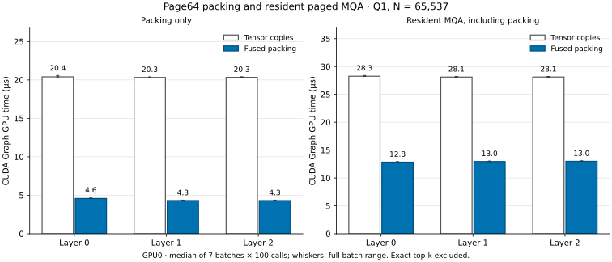
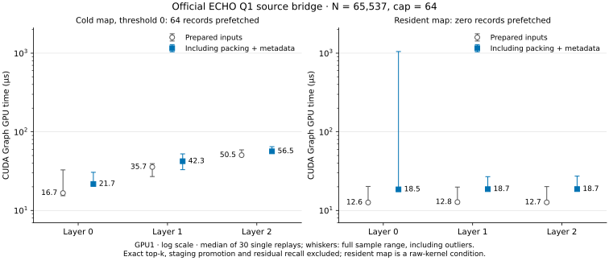
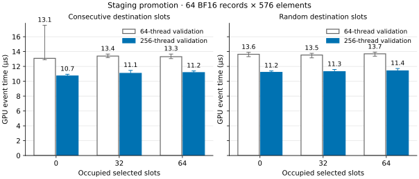
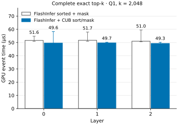

# 官方 ECHO Q1 组件计时

单 kernel 打包减少了本地 resident paged MQA 的准备开销；官方 ECHO 的 raw Q1 路径已在独立验收后完成计时。两项实验使用同一组 L0–L2 输入，Q=1、N=65,537；输入来自真实 checkpoint 的额外 eager 诊断 forward。

图中完整 resident MQA 包含每次 K/scales 打包、页表、调度 metadata 和 causal mask，排除 exact top-k。GPU0、CPU 0–7，20 次预热，7 组样本，每组 100 次调用。柱高为 CUDA Graph 的 GPU event 时间中位数，误差线为全部样本的最小值至最大值。

官方路径直接编译固定版本 ECHO 的 paged fused decode kernel。Prepared inputs 预先准备打包、页表和 metadata；另一组将这些准备计入调用。两组均包含官方 fused kernel、causal clean 和实际最多 64 条记录的 stage 预取，排除 exact top-k、stage promotion 与 residual recall。GPU1、CPU 8–15，10 次预热，30 个单次调用样本；每次调用前在计时外恢复映射、stage 与计数。Cold map 的 threshold 为 0，每个样本预取 64 条记录，共 73,728 B。

官方图使用对数纵轴；圆点与方点为中位数，误差线覆盖全部样本，包括离群值，未删除样本。

Resident map 将全部 history 标为已驻留，用于测量 raw kernel 不预取时的开销。该 kernel 不消费 device pool 的 KV，这组条件不代表完整模型的 warm 请求。两张图也不能相加推算完整模型延迟，或与官方 SGLang 自然驻留的 decode 窗口计算等负载加速比。

官方 check / bench：`q1_official_prefetch_check_20261008_04` / `q1_official_prefetch_bench_20261008_02`。打包 check / bench：`packing_check_20261008_03` / `q1_packing_bench_20261008_01`。本次 CPU 报告 run ID：`q1_official_path_report_20261008_06`。

[汇总](summary.json)保存环境、边界与验收身份；[计时表](latency.csv)和[全部样本](latency_samples.csv)保留 eager/graph、两种计时边界及各次实际 reservation、prefetch、H2D 计数。[来源记录](provenance.json)绑定原结果、源码快照、输入和官方 native 字节，[发布清单](publication_manifest.json)绑定本报告素材。独立验收中的逐位检查是运行时证据，报告生成不会重新执行 GPU 数值比较。

## Promotion 并行校验

完整 API 中位数从 13.088–13.696 µs 降至 10.720–11.408 µs，600/600 组配对更快。

校验 CTA 从 64 线程改为 256 线程，并行检查重复记录；保留范围、owner、journal、映射和唯一性检查，官方 ECHO 融合内核及后续复制 kernel 不变。两组都使用既有并行 record copy。输入为 N=65,537、P=65,600、64 条 BF16 record，每条 576 个元素；六组条件覆盖连续/随机槽及 0/32/64 个已占槽。

GPU3 / SM90、CPU 24–31，每组预热 20 次，交替测量 100 对。图内 event 包围完整 promotion 的两个 kernel，metadata 恢复和主机 dispatch 在计时外。84 个逐位案例、22 项 adapter 测试、72 次变化输入 replay、24 次非默认流调用及 8 个非法状态均通过验收。

独立验收 `q1_validation_check_20261008_02`；计时 `q1_validation_bench_20261008_02`。柱高为中位数，误差线覆盖所有样本的最小值至最大值，不删除离群值。数据见[汇总](validation_latency.csv)和[全部配对样本](validation_samples.csv)。这些组件时间不代表完整模型或官方 SGLang 的请求延迟。

## CUB exact top-k 后处理

完整 API 中位数从 50.976–51.680 µs 降至 49.280–49.680 µs，149/150 组配对更快。

保留 FlashInfer SMALL 的精确选择核心，使用官方 CUB BlockRadixSort 合并排序和 nonfinite ID mask，输出值与 ID 逐位不变。输入为真实 L0–L2 的 Q1 分数及已有 padding，k=2,048。图中每个样本只 replay 一次；表格另保存 20 次 replay 的确认测量。

GPU1 / SM90、CPU 8–15，每组预热 10 次，再测量 50 组 AB/BA 配对，外部 CUDA event 包围完整 graph API。115 项 oracle/逐位比较、20 次变化输入 replay 通过；验收保存的 DSOs 与本次计时 native 身份一致。

独立验收 `q1_topk_check_20261008_02`；计时 `q1_topk_bench_20261008_02`。柱高为中位数，误差线覆盖所有样本的最小值至最大值，不删除离群值。数据见[汇总](topk_latency.csv)和[全部配对样本](topk_samples.csv)。这些组件时间不代表完整模型或官方 SGLang 的请求延迟。
