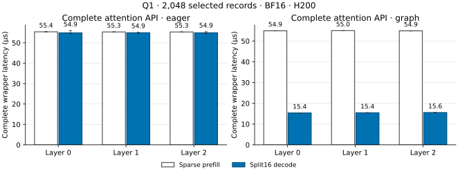

# Q1 sparse attention 算子诊断

16 分片 decode 的完整 Graph API 约为 15.4 µs，相对官方 sparse prefill API
加速 3.53–3.57 倍。图中为 7 个批次的中位数，每批 100 次调用；误差线为批次全范围。

数据来自仍有效的 `q1_attention_bench_20261008_01`；本轮只重新整理图表，未将其
记作新的 GPU 测量。当前 MQA 打包与官方 ECHO 融合路径见
[官方路径报告](../q1_official_path/report.md)，完整模型见
[MFU 报告](../../../deepseek_v32_mfu/README.md)。

输入为真实 L0–L2 的 BF16 Q=[1,128,576]、KV=[65537,576]，selection=[1,2048]，
value dimension=512；GPU2 H200/SM90，CPU16–23，Torch 2.12.1+cu130、Triton 3.7.1。
计时包含 selection/layout 适配、Q repeat、官方 sparse MLA、FP32 LSE combine 和输出
分配。两种 API 启动时预热20次，每种 eager/Graph 方式又预热20次；验收、计时和
NCU 分进程执行。输入来自一次额外 eager 诊断 forward，并由该验收独立绑定。

两条 API 按原 atol=4e-3、rtol=2e-2 与 FP32 oracle 比较，也直接相互比较。每层每种
API 验证4次固定输入 Graph replay，并验证空 selection 输出全零及恢复后逐位一致。
Decode 与 prefill 的最大绝对差异为4.8828125e-4/2.44140625e-4/1.220703125e-4；
BF16 partial 与 FP32 LSE 合并改变舍入路径，不能表述为与 prefill 逐位一致。
详见[误差表](attention_rounding.csv)、[完整计时](api_timing.csv)。

独立 NCU 中，核心 grid 从2增到32，SM throughput 从0.98%增到6.74%，DRAM 读取
峰值比例从0.79%增到9.34%。每 CTA 使用384 threads、168 registers/thread 和
231,888 B shared memory，限制每 SM 驻留一个 CTA；原小 grid 留下大量空闲 SM。
NCU 的71.520→10.976 µs 只含核心 kernel，使用 cache flush 和 base clocks，不能
替代完整 API 计时。Source sampling 较少，不据此精确排序 stall 原因。

[workspace](workspace.csv) 是该次运行的 allocated/reserved/device-used 观测差值，
不能代替完整 cache 预算或 graph private reserved；decode capture 的 allocated 峰值
增量为4,604,928 B，prefill为133,120 B。当前模型的预算与完整请求验收另行报告。
[来源记录](provenance.json)绑定原 receipt、源码快照、输入和 NCU 文件，
[汇总](summary.json)记录本次报告整理的 run ID。
