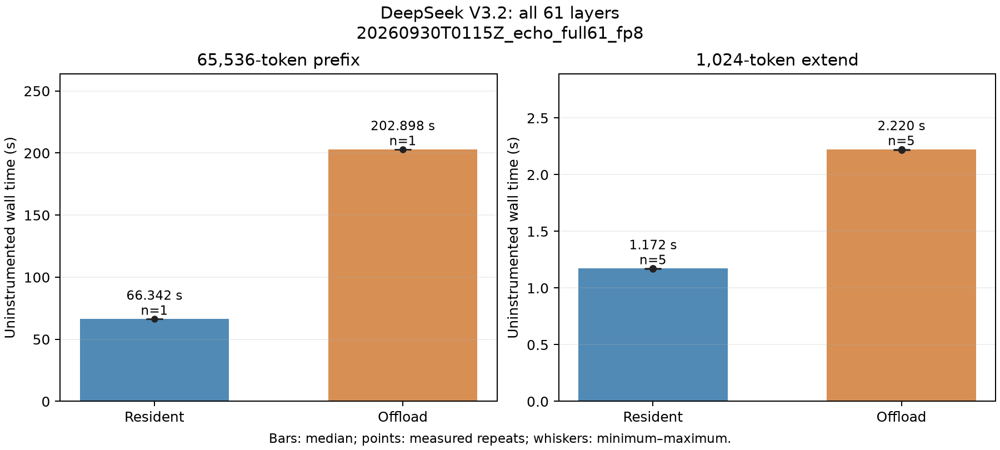
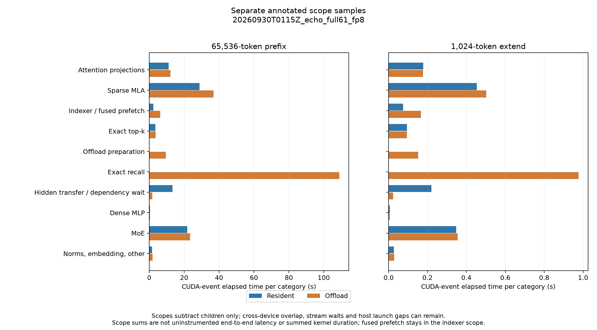

# DeepSeek V3.2 ECHO prefill/extend

本实验复刻 ECHO 的 extend indexer 内融合 KV prefetch，比较完整 DeepSeek V3.2
的 65,536-token prefix prefill + 1,024-token extend，在 resident 与 local DRAM
offload 两种模式下的端到端延迟、attention 时间和实际 KV 搬运量。

**现有报告对应修复前版本；2026-10-01 的 KV gather 对齐修复后，完整模型性能尚未补测。**
旧版完整 61 层、64K + 1K 的 resident/offload 测量已验收，最终 logits 逐位一致。
Run ID：`20260930T0115Z_echo_full61_fp8`。本次 offload 降低主 KV 的 HBM 分配，
但增加端到端延迟；具体数值与测量边界见下文。旧 SM120 实验不受新增路径影响。

旧 run 的 `kv_transfer.cu` SHA256 为
`b776b40a1ceb83be864cc210ef26e73cf4bacec45c3f4f2b3f0e8af355a39742`，完整源码身份保留在
[summary.json](report/summary.json)。该运行的 cache 自行分配对齐 record buffers，
没有触发本次发现的非对齐 storage-offset 问题；其结果只说明旧实现和原测量边界，
不能用于证明修复后延迟。修复后的 gather 会检查源、目标行地址，非对齐视图使用逐字节复制。
旧报告及对应运行产物保留到补测验收并发布完成；NOSA overlap 不调用此 gather，结果不受影响。
当前补测受环境准备阻塞：项目 `.venv` 的目标不存在，按锁文件恢复依赖时镜像下载超时。
本次使用可用的 Torch 2.10.0+cu132 / TVM FFI 0.1.12 在 H200 上通过了 12 项 gather
对齐/非对齐检查及 4 项缓存回归；这些是代码正确性检查，不是新一轮性能实验。

ECHO 参考提交为 `bc1b75c1000010d0ac6f032ebaac283255c050b1`，上游
`DeepGEMM/deep_gemm/include/deep_gemm/impls/sm90_fp8_mqa_logits.cuh` 的 extend 分支。
本地 kernel 只复用共享 CUTLASS 头文件，不导入 SGLang 或 ECHO Python runtime。
源码中保留所提取 MIT 代码的许可与出处。

## 测量边界

- 完整 checkpoint 的 61 层，包含 embedding、三个 dense MLP、58 个 MoE、final norm
  和末 token LM head；不把单层结果外推成整模型。
- 真实 GR 可读输入，稳定历史与候选后缀的边界严格为 65,536 + 1,024 tokens。
- 原始 FP8 checkpoint 权重在分配到的 GPU 上常驻；普通投影使用 block FP8 GEMM，
  吸收的 MLA K/V 投影使用 checkpoint 反量化 BF16。
- Indexer 使用 RoPE、normalized Hadamard、FP8 Q/K、64 heads、top-2048。
  主 KV 按 ECHO 使用 512 latent + 64 RoPE BF16，共 1152 B/token。
- Offload 使用 pinned local DRAM backing、有限 HBM token pool、融合 coarse histogram
  预取、精确 top-k 的 residual recall 和物理 ID remap。过大的 query union 分批消费，
  每 query 的精确选择不变。该实现不包含 CXL/RDMA。
- Prefix 从空 cache 构建。Extend 每次恢复同一 prefix 的 HBM residency，防止测成
  重复请求的热缓存。计时包含 CPU 调度、GPU 计算、KV 写入、搬运和等待；不包含加载
  权重、编译和恢复基准状态。带事件/NVTX 的拆分采样与无插桩延迟分开记录。
- 使用串行层放置，每个 1024-token chunk 遍历全部 61 层，然后处理下一个 chunk；
  层边界传递 hidden/residual。该结果对应单请求执行器，不代表 tensor parallel 或
  continuous batching serving 吞吐。分词、请求生成和 logits 的 CPU 验收在计时外。

## 本次运行条件

5 张 NVIDIA H20Z（SM90、每张 132 SM，PyTorch 可见显存 143167 MiB），物理 GPU
`0,1,2,6,7`；层放置依次为 `0–13 / 14–24 / 25–36 / 37–48 / 49–60`。权重在这些
设备常驻，主机 pinned DRAM 只承载主 MLA KV。主机还有其他 GPU 任务，未锁定 GPU 频率。

依赖：PyTorch `2.12.1+cu130`、Triton `3.7.1`、safetensors `0.8.0`、TVM FFI
`0.1.13.post3`；共享 CUTLASS `f3fde583`；Nsight Systems `2025.6.3`、Nsight Compute
`2026.1.1`。权重来自 `/mnt/user-ssd/chenkaiqi/DeepSeek-V3.2/`，checkpoint metadata、
请求及 14 个运行源码文件的 SHA256 随本次数据保存。

每种模式各做 1 次 prefix 预热、1 次正式 prefix、1 次独立 annotated prefix；从所得
prefix 状态做 1 次 extend 预热、5 次正式 extend 和 1 次 annotated extend。正式计时
不创建事件/NVTX scope，Nsight 注入库仍加载、capture 关闭。Nsight trace 仅捕获两种
模式各自的 annotated extend；prefix 分项来自 CUDA events。额外保存第 0/30/60 层
kernel 输入的运行不参与计时。仅一个 GR 请求、一个 seed，prefix 无重复方差估计。

<!-- BEGIN ECHO GENERATED RESULTS -->
## 已验收结果

来源 run ID：`20260930T0115Z_echo_full61_fp8`。完整 61 层 checkpoint，65,536-token prefix 从空 cache 构建，随后执行 1,024-token extend；只输出最后 token 的完整词表 logits。
设备：cuda:0, cuda:1, cuda:2, cuda:6, cuda:7；chunk=1024；每层 offload pool=16384 tokens；预热 1 次。硬件详情、依赖版本、源码 SHA256 与逐阶段数据见 [summary.json](report/summary.json)。

| 阶段 | Resident 中位延迟 (ms) | Offload 中位延迟 (ms) | Offload / resident | 重复次数 |
| --- | ---: | ---: | ---: | ---: |
| Prefix prefill | 66342.000 | 202897.830 | 3.0584× | 1 |
| Extend | 1171.554 | 2220.250 | 1.8951× | 5 |

主 MLA KV 的 HBM record allocation 总计从 4.3561 GiB 降至 1.0723 GiB；该数字不含权重、indexer cache、映射、scratch 或激活。

prefill 的独立 annotated 采样合计 H2D 235.9967 GiB、D2H 4.2891 GiB，来自 61 层实际 record 计数，每 record 为 1152 B。
extend 的独立 annotated 采样合计 H2D 2.5065 GiB、D2H 0.0670 GiB，来自 61 层实际 record 计数，每 record 为 1152 B。

H2D 统计包含融合预取与全部 gather；`recalled_records` 同时包含 `offload_prepare` 对当前 chunk 的 staging 与后续 exact recall，不能全部解释为 residual recall。D2H 统计为新 KV 写入 host backing。

Resident/offload 保存的末 token logits 已逐元素核验 bitwise 相同（max_abs=0，NRMSE=0），next token 相同。





延迟表来自无插桩完整 forward。Scope 图来自独立带事件采样，各类别分别对照，CUDA-event elapsed time 仅扣除嵌套子 scope；仍可能包含 CPU 提交空隙、stream 依赖等待与跨 GPU 重叠。这些区间不等价于 nsys 的实际 kernel duration，不能相加作端到端分解或加回无插桩 wall time。`hidden_transfer` 包含等待源 GPU 计算完成的时间，不能当成独立 NVLink copy 耗时或据此推算带宽。

`indexer_prefetch` 同时包含 indexer 计算与融合预取，不能解读为独立搬运耗时；`offload_prepare` 与 `offload_exact_recall` 分别呈现。Prefix 与 extend 分别测量；输入准备、权重加载、编译及每次恢复 prefix residency 均在计时外。

图表、[CSV](report/summary.csv) 与 JSON 由 `python -m experiments.deepseek_v32_echo_prefill.src.report --result experiments/deepseek_v32_echo_prefill/output/data/20260930T0115Z_echo_full61_fp8/result.json --publish` 生成。完整原始产物保留在 `experiments/deepseek_v32_echo_prefill/output/data/20260930T0115Z_echo_full61_fp8/`；原始 trace 位于对应 `output/profile/20260930T0115Z_echo_full61_fp8/`。
<!-- END ECHO GENERATED RESULTS -->

## Attention / offload 拆分

下表来自同一 run 的两份 Nsight Systems **annotated extend**，是 61 层实际 GPU
kernel duration 之和，单位 ms。与上方 CUDA-event 区间和无插桩端到端时间分别呈现；
各设备计算、CPU API 及传输可以重叠，不将这些数字相加解释端到端 wall time。

| GPU 工作 | Resident | Offload | 范围 |
| --- | ---: | ---: | --- |
| Attention/indexer 投影 | 120.975 | 121.081 | Q/K/V、RoPE、Hadamard、量化等 |
| Sparse MLA | 453.055 | 441.590 | Attention 核心，61 / 484 次 launch |
| Attention 输出投影 | 40.093 | 40.182 | MLA 输出恢复与输出投影 |
| Native indexer / fused indexer+prefetch | 67.438 | 140.961 | 61 次 native kernel；融合预取无法独立计时 |
| Exact top-k scope | 81.821 | 81.849 | 精确选择及该 scope 内辅助 kernel |
| Offload preparation | 0 | 19.986 | 当前 chunk staging、LRU/映射与预留 slots |
| Exact recall scope | 0 | 209.811 | 去重、容量判断、驱逐、补取与 remap |
| 其中：mapped-host KV gather | 0 | 43.658 | 已包含在前两行 offload scope 中，不能再相加 |
| 整模型全部 kernel | 1135.785 | 1437.772 | 包含 MoE、norm 等及少量范围外输入/输出检查 |

Offload 的 preparation / recall CUDA-event 区间分别为 **152.403 / 976.584 ms**。
这些区间包含提交间隙和依赖等待，不能把 976.584 ms 全部归因于 KV 传输。实际 gather
为 preparation 的 1.589 ms 加 exact recall 的 42.069 ms。全部 H2D KV 还包含融合
kernel 内预取，实际搬运量仍使用 cache counter，不使用 CUDA Memcpy 事件估算。

Offload trace 中有 75,893 次 kernel（resident 为 19,205 次），907 次 exact recall
尝试对应 484 个可装入 HBM pool 的 MLA 批次，满足 `907 = 2 × 484 − 61`。完整
1K query 的选择并集超过 16K slots 时才拆分；本次最小叶批次为 16 query，没有
裁剪单 query 的 top-2048。额外 423 个拼接 kernel 合计 8.813 ms。

`cudaStreamSynchronize` 从 resident 的 4 次 / 0.028 ms 增至 offload 的
8,907 次 / 713.430 ms。该 API 时间包含等待 GPU 的时间，并与 GPU 工作重叠；
它支持“缓存控制和同步是主要额外开销”的判断，不代表可直接从 wall time 扣除的
独立 CPU 时间。当前 chunk 先写 host 再回读 HBM、每次预取前预留至多 8192 slots，
以及递归失败节点重复执行 GPU unique/sort，是后续应针对性减少的工作。

两份 trace 各有 12 个范围外活动，合计仅 0.035 / 0.036 ms，均有 API correlation，
属于输入检查、输出检查或小拷贝，已计入 capture 总量。Annotated wall 为
1186.285 / 2550.058 ms；offload 插桩开销约 14.9%，性能结论使用正式测量的
1171.554 / 2220.250 ms。逐阶段表和指标来源见 [nsys_stages.csv](report/nsys_stages.csv)
及 [profile_summary.json](report/profile_summary.json)。

## 真实第 30 层的 NCU 诊断

三个独立 run 分别为 `20260930T0151Z_ncu_indexer_resident`、
`20260930T0149Z_ncu_indexer_offload`、`20260930T0153Z_ncu_mla`。它们读取完整模型
run 捕获的第 30 层输入，在物理 GPU 6 上预热 2 次，然后对一次目标 launch 收集
`full + PmSampling + PmSampling_WarpStates` 和独立 `SourceCounters`；NCU 2026.1.1
没有 `source` set。全部 kernel 保留行号，使用 kernel replay、`cache-control all`、
`clock-control none`；表中 duration 是 profiler replay 数据，不能替代完整模型计时。

Indexer 输入为 FP8 Q `[1024,64,128]`、K `[66560,128]`；MLA 为 BF16 Q
`[1024,128,576]`、KV `[66560,576]`、int32 selection `[1024,2048]`。Offload replay
采用**冷历史 HBM pool**和零 histogram offset，实际预取 8192 records / 9 MiB；
它没有重建原模型 cache hit 状态。MLA replay 使用完整 resident KV 和逻辑选择，
不代表原 offload 物理 pool 布局。独立 `recall` replay 入口本次未采集。

| NCU 指标 | Resident indexer | Fused indexer/prefetch | Sparse MLA |
| --- | ---: | ---: | ---: |
| Duration (ms) | 1.123 | 1.854 | 7.439 |
| SM throughput (% peak) | 51.81 | 38.06 | 20.50 |
| DRAM throughput (% peak) | 5.37 | 3.83 | 1.56 |
| Tensor pipe active (% elapsed) | 51.81 | 30.57 | 12.11 |
| Achieved / theoretical occupancy (%) | 14.06 / 18.75 | 26.56 / 31.25 | 12.49 / 12.50 |
| Registers/thread | 112 | 96 | 163 |
| Grid blocks / threads per block | 132 / 384 | 132 / 640 | 8192 / 256 |
| Waves/SM | 1.00 | 1.00 | 62.06 |
| L1 / L2 hit rate (%) | 63.83 / 88.56 | 90.41 / 96.67 | 5.47 / 96.58 |
| Local spilling requests | 0 | 14,507,576 | 0 |

精确 metric 名、单位、native report SHA、PC 热点和 PM 采样摘要保存在
[ncu_metrics.csv](report/ncu_metrics.csv) 与 [profile_summary.json](report/profile_summary.json)。
这些数字来自 `ncu_report` API，未将不存在的 metric 当作零。

融合 indexer 的 long-scoreboard 占平均发射间隔约 51.5%，同时 DRAM 利用率仅
3.83%，不能称为 HBM 带宽饱和。SourceCounters 中，CUTLASS `barrier.h:424` 的
`mbarrier.try_wait` 对应 62,127 个 long-scoreboard samples；
`echo_logits.cuh:906` 的候选 logits 读取为 5,494 samples。加上 14.51M 次 spilling
requests，证据指向融合后的同步、寄存器压力与访存延迟。NCU 对 local-memory
开销给出的 kernel 层估计改善空间为 20.34%，不是已实现收益或端到端加速预测。

MLA 的 grid 足够大，62.06 waves/SM；每 SM 仅一个 block，约 149.5 KB 动态 shared
memory 和 163 registers/thread 将 occupancy 限制为 12.5%。L1/TEX throughput 为
67.85%，DRAM 仅 1.56%；源码 `deepseek_mla.py:75–76` 的 KV load 合计 177,245 个
long-scoreboard samples，`:79` 的 QK dot 对应 113,971 个 short-scoreboard samples。
应先评估稀疏 KV staging、shared-memory 布局及 pipeline，而非直接认定是 HBM 带宽瓶颈。

负载与时间序列也不同：两个 indexer 都是 132 个 persistent CTA，resident 的
每 SM active cycles 最小/平均比为 0.771，fused 为 0.819，末段存在不均衡；MLA
该比值为 0.992。PM tensor 活跃率的中段采样中，resident 约 54%，MLA 约 12.2%；
fused 有明显中段下降后恢复。PM 来自多次 replay、不同 metric 采样序列，保留原始
correlation IDs 和样本顺序，不用这些曲线推导单次执行的精确 prefetch overlap。

后续优化优先级：先减少整模型 cache ensure/unique 与同步次数；再降低 fused
indexer 的寄存器溢出和 barrier 等待；最后针对 MLA 的 shared-memory/寄存器占用
改进 pipeline。这里给出证据支持的方向，本次未进行这些优化，未声称已获得收益。

## 运行

从仓库根目录，在已准备好基础环境及共享 CUTLASS 的 Hopper 上执行：

```bash
bash experiments/deepseek_v32_echo_prefill/scripts/run.sh --help
bash experiments/deepseek_v32_echo_prefill/scripts/run.sh \
  --model /mnt/user-ssd/chenkaiqi/DeepSeek-V3.2 --devices 0,1,2,6,7 \
  --prefix 65536 --extend 1024 --chunk-size 1024 --slots 16384 \
  --warmups 1 --prefill-repeats 1 --repeats 5 --chrome-trace

# Nsight Systems：分别捕获 resident/offload 的 annotated extend
ECHO_NSYS=1 bash experiments/deepseek_v32_echo_prefill/scripts/run.sh \
  --devices 0,1,2,6,7 --save-kernel-inputs

# 真实模型第 30 层激活上的单 kernel Nsight Compute 诊断
CUDA_VISIBLE_DEVICES=6 bash experiments/deepseek_v32_echo_prefill/scripts/ncu.sh \
  --input experiments/deepseek_v32_echo_prefill/output/data/<run_id>/kernel_inputs_layer_30.pt \
  --kernel indexer-offload --run-id <ncu_run_id>
```

调用模块：`models.deepseek_v32.echo_infer`、`echo_block`、`echo_attention`、
`echo_model`；`cache.sparse_token_cache`；`operators.sm90.echo_indexer`、
`deepseek_mla`、`deepseek_linear`、`kv_transfer`；共享 `GR.input_generator`。

运行参数、输入、完整结果、源码 SHA256 在 `output/data/<run_id>/`，stdout/stderr
分别在 `output/log/<run_id>/`，Chrome/Nsight 原始 trace 在 `output/profile/<run_id>/`。
运行脚本先在 `${TMPDIR:-/tmp}` 暂存，全部成功后才发布 data/log/profile；失败退出码
原样保留，诊断目录打印到 stderr，正式 `output/` 不留下失败 run。运行脚本拒绝已有
run ID，避免覆盖数据与日志；完整模型 run ID 用 `ECHO_RUN_ID` 指定。
下方命令从有效 run 生成 `report/`
数据与图表，并更新本页的结果区段。

`src/report.py --result output/data/<run_id>/result.json` 在同一 data 目录生成汇总和图表，
`--publish --report-dir experiments/deepseek_v32_echo_prefill/report` 发布精选素材；实际
命令须使用从仓库根目录起的完整相对路径。图表生成使用已有 `analysis` 依赖组。
Nsight 导出使用 `nsys export --type sqlite --output <data_path>/<mode>.sqlite
<profile_path>/extend.<1或2>.nsys-rep`，随后调用
`python -m experiments.deepseek_v32_echo_prefill.src.analyze_nsys --sqlite <sqlite>
--output <analysis.json> --result <result.json> --mode <resident或offload>`。

NCU 原始报告用 `python -m experiments.deepseek_v32_echo_prefill.src.analyze_ncu
--report <full.ncu-rep> --report <source.ncu-rep> --run-id <ncu_run_id>` 提取，默认写入
对应 `output/data/<ncu_run_id>/ncu_analysis.json`；再次分析须用 `--output` 选择新的
JSON 路径。API 的逐实例读取经过 PC sample 总和与 aggregate 对照，保留零值及原始
correlation IDs。精选 profile 数据由以下命令生成，输入均来自本次已验收运行：

```bash
python -m experiments.deepseek_v32_echo_prefill.src.profile_summary \
  --full-run-id 20260930T0115Z_echo_full61_fp8 \
  --ncu-run-id 20260930T0151Z_ncu_indexer_resident \
  --ncu-run-id 20260930T0149Z_ncu_indexer_offload \
  --ncu-run-id 20260930T0153Z_ncu_mla --publish
```

NCU 的 `indexer-resident`、`indexer-offload`、`mla`、`recall` 入口均读取捕获激活；
其中 offload 使用冷 HBM pool，recall 为独立 cold-union 传输诊断，不等同于整模型的
残余搬运时间。整模型搬运量来自 cache 计数，mapped host 读取不能通过 CUDA Memcpy
事件缺失解释为零传输。融合 indexer/prefetch 时间作为整体呈现，不拆成可相加的两项。
