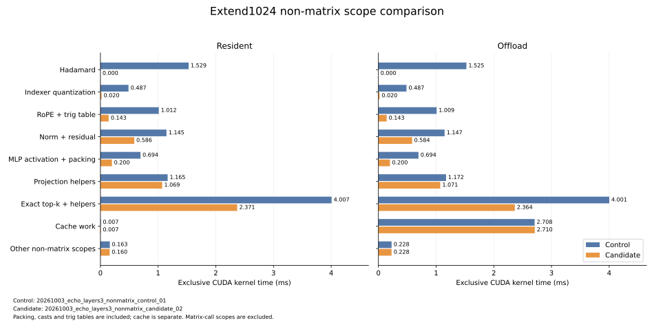

# DeepSeek V3.2 前三层：非矩阵优化与计算效率

2026-10-04 的 motivation 优化正在修改本实验共用的 attention、block 和 cache。
以下数据仍对应各自记录的源码版本，新实现改动后未运行本实验；保留旧报告及原始
产物，待补测验收后替换。详见[优化记录](../../docs/agents/system/deepseek_motivation_optimization_plan.md)。

本轮已完成 FlashInfer 非矩阵替换、移除 indexer Hadamard，以及 KDA 量化优化。
真实 checkpoint 第 0–2 层在同一 H200 上重新测量：resident extend 中位数由
24.300 ms 降到 18.344 ms，offload 由 51.511 ms 降到 36.245 ms。
各版本内部 resident/offload 与插桩检查逐位一致；**跨版本输出并非逐元素等价**，
选择变化和完整数值差异见下文。

## 实验目的与边界

比较同一计算与 cache 基础上的非矩阵实现成本。非 GR benchmark 只执行真实
checkpoint 第 0–2 层，依次传播 hidden/residual，包含 embedding、三个 dense MLP、
末 token 的 final norm 与 LM head。全部 extend hidden 在独立正确性调用中验证。
这不是独立训练的三层模型，不代表完整 61 层、GR serving 或推荐任务质量。

两版本使用相同请求、矩阵后端及同一份共享 cache 测量快照。Prefix=65,536，extend=1,024，
prefill chunk=1024，每层可用 HBM pool=16,384 tokens；host arena=66,560 tokens，
cache 预算为每设备 5 GiB HBM / 总计 64 GiB DRAM。主 KV 为 BF16 512 latent + 64 RoPE，
indexer FP8 K/scales resident。权重和普通 activation 不计入 cache 预算；这里不是
进程峰值显存或多用户硬预算验收。每种模式从独立空 cache 构建 prefix，重复 extend
前恢复相同 prefix residency；超容量时保留完整选择并拆分消费。

该单用户、固定 chunk 的计算对照只验证本页的共享 cache 测量快照。Chunk 扫描与
多用户四方案对照的独立源码、数值和预算边界见 [ECHO cache 实验](../deepseek_v32_echo_cache/README.md)。

## 本轮变更与对照

- RoPE、RMSNorm、残差 RMSNorm、SiLU 与 exact top-k 复用 FlashInfer 0.6.18。
  RoPE 保留模型 YaRN 频率及两种配对；norm 保留 checkpoint FP32 权重和舍入前 residual。
  dtype 转换、packing、trig table 和辅助操作均计入各自范围。
- Indexer RoPE 后直接量化，运行路径不再执行 Hadamard。vLLM v0.11.2 的
  [Indexer.forward](https://github.com/vllm-project/vllm/blob/v0.11.2/vllm/model_executor/models/deepseek_v2.py#L828)
  使用同样的直接量化顺序；本实验没有据此假定任务质量等价。
- Indexer BF16/D128 量化使用 KDA 接受的单 Triton kernel q2，保持 FP8 bytes 与 FP32
  scale bits，包括 UE8M0、普通 FP32 scale、NaN/Inf 和舍入边界。与已编译官方
  DeepGEMM helper 的直接对照、NCU 和 30 项测试见
  [KDA 检查点](../../docs/agents/kda/deepseek_quantization/checkpoint.md)。
- 矩阵继续使用 DeepGEMM main `057ca596`（2.8.1）和 FlashMLA `ba89a346`
  （Hopper/V3.2 兼容提交）；线性激活量化仍编译官方 DeepGEMM helper。
  两个库以顶层 Git submodule 管理。Torch=2.12.1+cu130，Triton=3.7.1。

控制 run 为 `20261003_echo_layers3_nonmatrix_control_01`，优化 run 为
`20261003_echo_layers3_nonmatrix_candidate_02`。控制组保留原 PyTorch 非矩阵操作和
Hadamard，两组 cache 源码、预算、输入及矩阵后端一致。它们在物理 GPU 5 顺序运行：
H200 SXM / SM90 / 132 SM，默认时钟。每模式 prefix 预热 1 次、测量 3 次；
extend 预热 1 次、测量 5 次。加载、编译、快照恢复及数值诊断不计入正式 wall time。

| 模式 / 阶段 | 控制中位 ms | 优化中位 ms | 中位延迟比 |
| --- | ---: | ---: | ---: |
| resident / prefix | 1176.202 | 850.664 | 1.383× |
| resident / extend | 24.300 | 18.344 | 1.325× |
| offload / prefix | 2025.688 | 1773.963 | 1.142× |
| offload / extend | 51.511 | 36.245 | 1.421× |

Offload extend 控制样本为 51.511、51.716、52.287、43.995、41.430 ms，
优化样本为 36.352、36.245、36.289、36.165、36.165 ms。控制组存在明显波动；
这里报告单请求顺序测量的中位数比值，未给出总体置信区间。全部样本、UUID、源码、
输入身份和 cache 工作量见[完整对照](report/backend_comparison/comparison.json)。

## 非矩阵 GPU 开销

下图和表格只加总最内层 scope 的实际 kernel 时间，不将 inclusive API、搬运、
GPU busy union 与 wall time 相加。旧/新 norm 分别合并对应 residual scope，
RoPE 包含 trig table，SiLU 包含 packing，避免因改名或范围变化制造收益。
矩阵调用内部的 activation quantization 等 helper 仍留在矩阵调用行，本表没有
声称已分离每一个非 GEMM kernel。



以 offload extend 三层合计为例：

| 范围 | 控制 kernel ms / 个数 | 优化 kernel ms / 个数 |
| --- | ---: | ---: |
| Hadamard | 1.525 / 144 | 0 / 0 |
| Indexer 量化 | 0.487 / 72 | 0.020 / 6 |
| RoPE + trig | 1.009 / 138 | 0.143 / 21 |
| Norm + residual | 1.147 / 117 | 0.584 / 47 |
| SiLU + packing | 0.694 / 15 | 0.200 / 6 |
| Exact top-k + helpers | 4.001 / 129 | 2.364 / 81 |
| Projection helpers | 1.172 / 39 | 1.071 / 33 |
| 其他非矩阵范围 | 0.228 / 15 | 0.228 / 15 |
| Cache 辅助范围 | 2.708 / 724 | 2.710 / 724 |

除 cache 外的非矩阵范围合计从 10.263 ms / 669 个 kernel 降到
4.610 ms / 209 个 kernel，kernel 时间下降 55.1%。Cache 辅助时间基本不变；
fused indexer 内预取仍在矩阵调用范围。选择变化还会改变 cache 访问，因此不能把
全部 offload wall 收益归因于非矩阵 kernel，也不能称为 cache 策略优化。
完整四组分解、互斥映射和源码身份见
[JSON](report/nonmatrix_comparison/comparison.json)及
[CSV](report/nonmatrix_comparison/comparison.csv)。主要剩余非矩阵成本是 exact top-k
及 projection helpers；MFU 分母与 kernel/端到端指标见下面完整结果。

## 数值与测量验收

两 run 各自八项检查全部逐位一致，包括独立 prefix 后的全部 1024×7168 hidden、
末 token logits，以及插桩与普通执行。新实现三层全部 201,326,592 个 MLA 输出
通过独立 FP32 QK/softmax/PV 检查，TF32 关闭，沿用 atol=0.004 / rtol=0.02；
三层最大绝对误差为 3.194e-4、2.836e-4、2.228e-4，零超差。
见[独立数值证据](report/mla_reference/summary.json)。

跨版本全部 hidden 的相对 L2=0.015052，50,532 / 7,340,032 个元素超过原
atol=0.02 / rtol=0.01；logits 相对 L2=0.007925，9,129 / 129,280 个元素超差。
Argmax 相同不构成任务质量证据。三层 top-2048 集合的平均交集比例为
98.556%、98.857%、94.210%，最低为 95.947%、98.242%、91.895%。这反映整组
非矩阵改动后各自真实传播的差异，不单独归因 Hadamard；未放宽阈值或声称跨版本等价。
逐 query 交集、两模式输出差异和实际 prefetch/recall/流量见完整对照。

控制/优化 run 的 140,628 / 81,314 个 kernel 均完整归因，两 run 各四 capture 的
kernel/memcpy/memset 计数与时间守恒，所有源码身份已核验。优化 run 另核验了
实际加载的 FlashInfer 原生库与 CuTe 编译项。见[优化 run 审计](report/layers3/postrun_audit.json)、
[控制 run 审计](report/backend_comparison/control_audit.json)和
[源码与运行时审计](report/nonmatrix_comparison/source_runtime_audit.json)。

全局 CPU 回归为 2,202 passed；本轮 norm/RoPE/模型/插桩针对检查 49 passed，
模型与量化检查 40 passed，top-k 关联 GPU 回归 69 passed。共享 GR 调用的真实
checkpoint 四方案回归另有 1 passed：2304 prefix、16/23 candidate、10 个独立
dense block 的全部 candidate hidden 精确一致，包含驱逐复访；执行了 LM head，
该测试未单独比较 logits，也不是 GR 性能实验。

以下素材来自优化 run，由 `src.publish_layers` 生成；原始日志、源码快照、
SQLite、数值张量和 NCU 文件保留在各新 run 的 `output/{log,data,profile}/`。

<!-- BEGIN LAYERS3 PROFILE RESULTS -->

## 前三层重新测量：`20261003_echo_layers3_nonmatrix_candidate_02`

完整 checkpoint 的第 0–2 层依次传播 hidden/residual，包含 embedding、final norm 和最后 token LM head。Prefix=65,536，extend=1,024，chunk=1,024，offload pool=16,384 tokens/层。仅代表前三层。

| 阶段 | Resident 中位延迟 (ms) | Offload 中位延迟 (ms) | 每种模式重复次数 |
| --- | ---: | ---: | ---: |
| prefix | 850.664 | 1773.963 | 3 |
| extend | 18.344 | 36.245 | 5 |


端到端精度归一化利用率 = 100 × Σ精度（useful matrix FLOPs / 对应精度 dense peak）/ 无插桩同步 wall time。分子使用同一 run、同一阶段完整 annotated 调用账本中的逻辑矩阵工作量，按 FP8/BF16/FP32 分别换算理想计算时间；分母包含整个请求阶段的CPU 调度、非矩阵计算、搬运、等待和 launch gap。它是当前 absorbed-MLA 实现的三层工作负载指标，不外推完整 61 层，也不等于单一峰值 MFU 或 Tensor pipe active。

| 阶段 | 理想矩阵计算时间 (ms) | Resident 端到端利用率 (%) | Offload 端到端利用率 (%) |
| --- | ---: | ---: | ---: |
| prefix | 289.549 | 34.04 | 16.32 |
| extend | 5.400 | 29.44 | 14.90 |

表中利用率由中位 wall time 计算；每次重复的比率、分精度 FLOPs 与理想计算时间见 [summary.json](report/layers3/summary.json) 的 `end_to_end_utilization`。

下面保留 `operator_mfu` 数据字段名；其含义是算子 kernel 利用率 = useful matrix FLOPs /（同算子实际 GPU kernel duration 之和 × 对应精度 dense peak）。FMA 计 2 FLOPs；FP8/BF16/FP32 分母分别为 1979.0/989.5/67.0 TFLOPS；TF32 关闭。前缀汇总全部 chunk 与三层，extend 汇总三层的一次完整 query batch（含实际 offload leaf 拆分）。LM head 每个阶段仅执行最后一个 token。非矩阵算子的 MFU 为 N/A。

每种模式、每个阶段各采集一次独立 annotated profile；算子 MFU 没有重复采样置信区间。FP8Linear 的分母包含量化和 GEMM，indexer 包含 logits API 的辅助 kernel；这些是按完整算子口径计算的 MFU，与单 GEMM 或 Tensor pipe active 指标不同。算术与归因检查不证明计算实现或 cache 策略合理，MFU 及性能解释须独立验收。


### Prefix 矩阵算子

| 算子 | 精度 | Resident kernel ms | MFU (%) | Offload kernel ms | MFU (%) |
| --- | --- | ---: | ---: | ---: | ---: |
| q_a_proj | FP8 | 5.364 | 40.78 | 5.362 | 40.80 |
| q_b_proj | FP8 | 12.559 | 59.72 | 12.612 | 59.47 |
| q_absorb | BF16 | 9.952 | 33.49 | 9.885 | 33.72 |
| kv_a_proj | FP8 | 5.131 | 15.99 | 5.083 | 16.14 |
| index_q_proj | FP8 | 5.315 | 47.04 | 5.323 | 46.97 |
| index_k_proj | FP8 | 3.623 | 5.03 | 3.609 | 5.05 |
| index_weights_proj | FP32 | 7.570 | 35.57 | 7.566 | 35.59 |
| indexer | FP8 | 141.957 | 37.57 | 301.530 | 17.69 |
| mla_qk_pv | BF16 | 169.396 | 65.86 | 170.405 | 65.47 |
| v_expand | BF16 | 9.754 | 34.18 | 9.760 | 34.16 |
| o_proj | FP8 | 40.428 | 57.72 | 40.424 | 57.73 |
| mlp_gate | FP8 | 43.951 | 59.73 | 44.094 | 59.54 |
| mlp_up | FP8 | 43.647 | 60.15 | 43.643 | 60.15 |
| mlp_down | FP8 | 45.164 | 58.12 | 45.195 | 58.09 |
| lm_head | BF16 | 0.423 | 0.44 | 0.424 | 0.44 |

Indexer 行在 offload 中包含融合 prefetch；MLA 行共同计入 QK/PV。

下表按最内层 scope 归因；attention_projection、dense_mlp 等父 scope 仅保留未归入子算子的剩余 kernel。这里只列 kernel 时间，cache_write 的 memcpy、CPU API 等另见完整数据，0 ms kernel 不表示没有搬运或同步开销。

| 非矩阵 scope（MFU N/A） | Resident kernel ms | Offload kernel ms |
| --- | ---: | ---: |
| apply_rope_pair | 7.874 | 7.901 |
| attention_output | 8.167 | 8.164 |
| attention_projection | 68.688 | 68.658 |
| cache_write | 0.459 | 29.413 |
| dense_mlp | 0.000 | 0.000 |
| embedding | 0.427 | 0.424 |
| exact_topk | 99.580 | 99.444 |
| final_norm_lm_head | 0.012 | 0.012 |
| forward_misc | 0.022 | 0.021 |
| hidden_transfer | 0.000 | 0.000 |
| index_cache_write | 0.000 | 0.000 |
| index_layer_norm | 0.715 | 0.714 |
| indexer_aux | 0.000 | N/A |
| indexer_prefetch_aux | N/A | 0.000 |
| input_residual_norm | 0.000 | 0.000 |
| layer_misc | 0.000 | 1.998 |
| offload_exact_recall | N/A | 103.462 |
| offload_finalize | N/A | 0.818 |
| offload_prepare | 0.000 | 10.943 |
| offload_source_reservation | 0.000 | 0.000 |
| post_attention_residual_norm | 0.000 | 0.000 |
| prepare_rotary_cache | 1.173 | 1.174 |
| quantize_index | 1.279 | 1.281 |
| residual_rms_norm | 33.683 | 33.631 |
| rms_norm | 3.619 | 3.629 |
| silu_mul | 12.800 | 12.782 |
| sparse_mla_aux | 0.000 | 0.000 |

### Extend 矩阵算子

| 算子 | 精度 | Resident kernel ms | MFU (%) | Offload kernel ms | MFU (%) |
| --- | --- | ---: | ---: | ---: | ---: |
| q_a_proj | FP8 | 0.084 | 40.91 | 0.084 | 40.77 |
| q_b_proj | FP8 | 0.197 | 59.59 | 0.196 | 59.81 |
| q_absorb | BF16 | 0.159 | 32.77 | 0.154 | 33.71 |
| kv_a_proj | FP8 | 0.078 | 16.39 | 0.079 | 16.22 |
| index_q_proj | FP8 | 0.083 | 47.04 | 0.083 | 47.17 |
| index_k_proj | FP8 | 0.056 | 5.09 | 0.055 | 5.14 |
| index_weights_proj | FP32 | 0.118 | 35.57 | 0.117 | 35.85 |
| indexer | FP8 | 4.408 | 38.11 | 9.366 | 17.93 |
| mla_qk_pv | BF16 | 2.660 | 66.57 | 2.685 | 65.95 |
| v_expand | BF16 | 0.153 | 34.15 | 0.152 | 34.33 |
| o_proj | FP8 | 0.630 | 57.85 | 0.632 | 57.71 |
| mlp_gate | FP8 | 0.686 | 59.78 | 0.689 | 59.56 |
| mlp_up | FP8 | 0.682 | 60.11 | 0.680 | 60.30 |
| mlp_down | FP8 | 0.706 | 58.14 | 0.705 | 58.18 |
| lm_head | BF16 | 0.423 | 0.44 | 0.425 | 0.44 |

Indexer 行在 offload 中包含融合 prefetch；MLA 行共同计入 QK/PV。

下表按最内层 scope 归因；attention_projection、dense_mlp 等父 scope 仅保留未归入子算子的剩余 kernel。这里只列 kernel 时间，cache_write 的 memcpy、CPU API 等另见完整数据，0 ms kernel 不表示没有搬运或同步开销。

| 非矩阵 scope（MFU N/A） | Resident kernel ms | Offload kernel ms |
| --- | ---: | ---: |
| apply_rope_pair | 0.124 | 0.124 |
| attention_output | 0.127 | 0.128 |
| attention_projection | 1.069 | 1.071 |
| cache_write | 0.007 | 0.472 |
| dense_mlp | 0.000 | 0.000 |
| embedding | 0.006 | 0.006 |
| exact_topk | 2.371 | 2.364 |
| final_norm_lm_head | 0.012 | 0.012 |
| forward_misc | 0.004 | 0.004 |
| hidden_transfer | 0.000 | 0.000 |
| index_cache_write | 0.000 | 0.000 |
| index_layer_norm | 0.011 | 0.011 |
| indexer_aux | 0.000 | N/A |
| indexer_prefetch_aux | N/A | 0.000 |
| input_residual_norm | 0.000 | 0.000 |
| layer_misc | 0.000 | 0.067 |
| offload_exact_recall | N/A | 2.055 |
| offload_finalize | N/A | 0.013 |
| offload_prepare | 0.000 | 0.170 |
| offload_source_reservation | 0.000 | 0.000 |
| post_attention_residual_norm | 0.000 | 0.000 |
| prepare_rotary_cache | 0.018 | 0.018 |
| quantize_index | 0.020 | 0.020 |
| residual_rms_norm | 0.527 | 0.525 |
| rms_norm | 0.059 | 0.059 |
| silu_mul | 0.200 | 0.200 |
| sparse_mla_aux | 0.000 | 0.000 |

GPU kernel 时间、CPU API 时间、NVTX host 区间、无插桩 wall time 分别保存，不相加为端到端分解。Padding 工作另列 `executed_matmul_flops`，不计入 useful MFU；cuBLAS 内部 padding 未知，保留空值。

正确性与覆盖验收、硬件 identity、源码及输入 SHA256、完整 NCU full/source 的验证记录见 [summary.json](report/layers3/summary.json)。逐层及 pooled 数据见 [operator_mfu.csv](report/layers3/operator_mfu.csv)、[operator_mfu_by_layer.csv](report/layers3/operator_mfu_by_layer.csv)、[nonmatrix.csv](report/layers3/nonmatrix.csv)。

NCU 是同 run 对应真实层激活的独立 replay，不替代 NSYS 实际调用的 MFU 或正式 wall 延迟；其 cache 状态、排除项和报告 SHA256 单独保存。NCU run IDs：`20261003_echo_ncu_nonmatrix_mla_02`, `20261003_echo_ncu_nonmatrix_indexer_resident_02`, `20261003_echo_ncu_nonmatrix_indexer_offload_02`。

生成命令：

```bash
python -m experiments.deepseek_v32_echo_prefill.src.publish_layers --run-id 20261003_echo_layers3_nonmatrix_candidate_02 --ncu-run-id 20261003_echo_ncu_nonmatrix_mla_02 --ncu-run-id 20261003_echo_ncu_nonmatrix_indexer_resident_02 --ncu-run-id 20261003_echo_ncu_nonmatrix_indexer_offload_02 --publish
```

<!-- END LAYERS3 PROFILE RESULTS -->

## 复现与调用模块

从仓库根目录运行。依赖准备见 [3rdparty](../../3rdparty/README.md)。
正式测量使用新 run ID，不能覆盖现有数据：

```bash
CUDA_VISIBLE_DEVICES=5 ECHO_RUN_ID=my_layers3_rerun \
  bash experiments/deepseek_v32_echo_prefill/scripts/profile_layers.sh \
  --physical-device 5 --model /preset-models \
  --request experiments/deepseek_v32_echo_prefill/output/data/20261003_echo_layers3_nonmatrix_candidate_02/request.json
```

当前源码执行优化版本；相对测量快照，`echo_infer.py` 随后增加了构造阶段的
query/workspace 容量检查。本次 query=1024、usable slots=16384 不触发该检查，
该检查不改变此配置的计时执行路径；精确复现仍使用各 run 的源码快照及相同依赖。

上述 control_01 / candidate_02 的源码已包含 shared-cache 迁移，但早于后续
**pinned allocation 按实际 bin 计费与 40 B CPU execution scratch 预留修正**。
原报告的 cache resource plan 保留当时的逻辑 tensor 容量，不能用作修正后的完整硬预算
验收；后续修正也不改变这些旧 run 的源码身份。这里的非矩阵、MFU 和数值结果继续对应
原测量快照，不以新 chunk/GR run 代替，也不将旧数字重新标为新实现结果。
具体保留与替换范围见[发布范围清单](../../docs/agents/system/echo_cache_publication_scope.md)。

重建控制组不能用当前代码配旧 run ID。`src.profile_layers` 调用 `models/deepseek_v32/echo_infer.py`、
`echo_block.py`、`echo_model.py`、`echo_attention.py` 与共享 cache；算子入口为
`operators/flashinfer.py`、`indexer/{echo,selection,quantization}.py`、
`attention/device_only/mla.py` 和 `linear/fp8.py`。

`src.operator_instrumentation` / `src.operator_report` 生成调用账本及 NSYS 分解；
`src.backend_provenance` 记录静态依赖与执行结束后的实际 FlashInfer JIT 身份。
`src.postrun_audit` 重算测量守恒，`src.compare_backends` 比较两 run 的全部输出、
选择与 cache 工作量，`src.compare_nonmatrix` 按互斥 scope 生成上述 CSV/SVG。
比较工具及独立 FP32 检查脚本的精确版本随优化 run 的 data 保存。

新 NCU 三个 run 各有 full+PM sampling 与 source/SASS 采集，使用同一优化 run 的
layer-0 输入。调用 `scripts/ncu.sh`，再由 `src.analyze_ncu` 通过 `ncu_report` API
提取指标；这些 replay 不包含完整模型的 launch gap、状态恢复或流水线开销。

本轮发布用当前 shared-cache 下的新对照替换了此前的 official/control 及三份 NCU
结果；受影响旧报告与运行产物已在新结果验收后清理。此前 Hadamard 版本的耗时不能
作为当前实现数字；当前报告也不继承旧 GR 或跨模型排名。

## 共享 cache 容量实验

十 block GR 工作负载的固定 P/NH 容量检查见
[ECHO cache 实验](../deepseek_v32_echo_cache/README.md)，联合容量边界尚未测得。
原 4 GiB / W / chunk 对照已按用户要求撤回并清理。本页的前三层 64K+1K
非矩阵优化、MFU 和 NCU 结果独立保留。
