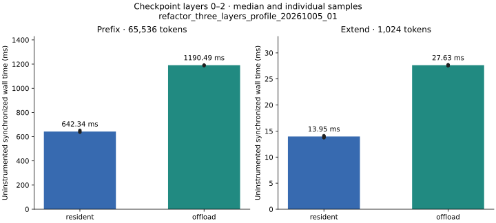
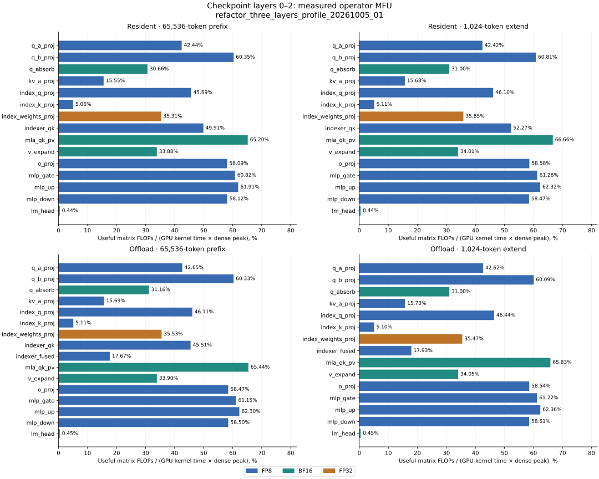

## 前三层重新测量：`20261003_echo_layers3_nonmatrix_candidate_02`

完整 checkpoint 的第 0–2 层依次传播 hidden/residual，包含 embedding、final norm 和最后 token LM head。Prefix=65,536，extend=1,024，chunk=1,024，offload pool=16,384 tokens/层。仅代表前三层。

| 阶段 | Resident 中位延迟 (ms) | Offload 中位延迟 (ms) | 每种模式重复次数 |
| --- | ---: | ---: | ---: |
| prefix | 850.664 | 1773.963 | 3 |
| extend | 18.344 | 36.245 | 5 |



端到端精度归一化利用率 = 100 × Σ精度（useful matrix FLOPs / 对应精度 dense peak）/ 无插桩同步 wall time。分子使用同一 run、同一阶段完整 annotated 调用账本中的逻辑矩阵工作量，按 FP8/BF16/FP32 分别换算理想计算时间；分母包含整个请求阶段的CPU 调度、非矩阵计算、搬运、等待和 launch gap。它是当前 absorbed-MLA 实现的三层工作负载指标，不外推完整 61 层，也不等于单一峰值 MFU 或 Tensor pipe active。

| 阶段 | 理想矩阵计算时间 (ms) | Resident 端到端利用率 (%) | Offload 端到端利用率 (%) |
| --- | ---: | ---: | ---: |
| prefix | 289.549 | 34.04 | 16.32 |
| extend | 5.400 | 29.44 | 14.90 |

表中利用率由中位 wall time 计算；每次重复的比率、分精度 FLOPs 与理想计算时间见 [summary.json](summary.json) 的 `end_to_end_utilization`。

下面保留 `operator_mfu` 数据字段名；其含义是算子 kernel 利用率 = useful matrix FLOPs /（同算子实际 GPU kernel duration 之和 × 对应精度 dense peak）。FMA 计 2 FLOPs；FP8/BF16/FP32 分母分别为 1979.0/989.5/67.0 TFLOPS；TF32 关闭。前缀汇总全部 chunk 与三层，extend 汇总三层的一次完整 query batch（含实际 offload leaf 拆分）。LM head 每个阶段仅执行最后一个 token。非矩阵算子的 MFU 为 N/A。

每种模式、每个阶段各采集一次独立 annotated profile；算子 MFU 没有重复采样置信区间。FP8Linear 的分母包含量化和 GEMM，indexer 包含 logits API 的辅助 kernel；这些是按完整算子口径计算的 MFU，与单 GEMM 或 Tensor pipe active 指标不同。算术与归因检查不证明计算实现或 cache 策略合理，MFU 及性能解释须独立验收。



### Prefix 矩阵算子

| 算子 | 精度 | Resident kernel ms | MFU (%) | Offload kernel ms | MFU (%) |
| --- | --- | ---: | ---: | ---: | ---: |
| q_a_proj | FP8 | 5.364 | 40.78 | 5.362 | 40.80 |
| q_b_proj | FP8 | 12.559 | 59.72 | 12.612 | 59.47 |
| q_absorb | BF16 | 9.952 | 33.49 | 9.885 | 33.72 |
| kv_a_proj | FP8 | 5.131 | 15.99 | 5.083 | 16.14 |
| index_q_proj | FP8 | 5.315 | 47.04 | 5.323 | 46.97 |
| index_k_proj | FP8 | 3.623 | 5.03 | 3.609 | 5.05 |
| index_weights_proj | FP32 | 7.570 | 35.57 | 7.566 | 35.59 |
| indexer | FP8 | 141.957 | 37.57 | 301.530 | 17.69 |
| mla_qk_pv | BF16 | 169.396 | 65.86 | 170.405 | 65.47 |
| v_expand | BF16 | 9.754 | 34.18 | 9.760 | 34.16 |
| o_proj | FP8 | 40.428 | 57.72 | 40.424 | 57.73 |
| mlp_gate | FP8 | 43.951 | 59.73 | 44.094 | 59.54 |
| mlp_up | FP8 | 43.647 | 60.15 | 43.643 | 60.15 |
| mlp_down | FP8 | 45.164 | 58.12 | 45.195 | 58.09 |
| lm_head | BF16 | 0.423 | 0.44 | 0.424 | 0.44 |

Indexer 行在 offload 中包含融合 prefetch；MLA 行共同计入 QK/PV。

下表按最内层 scope 归因；attention_projection、dense_mlp 等父 scope 仅保留未归入子算子的剩余 kernel。这里只列 kernel 时间，cache_write 的 memcpy、CPU API 等另见完整数据，0 ms kernel 不表示没有搬运或同步开销。

| 非矩阵 scope（MFU N/A） | Resident kernel ms | Offload kernel ms |
| --- | ---: | ---: |
| apply_rope_pair | 7.874 | 7.901 |
| attention_output | 8.167 | 8.164 |
| attention_projection | 68.688 | 68.658 |
| cache_write | 0.459 | 29.413 |
| dense_mlp | 0.000 | 0.000 |
| embedding | 0.427 | 0.424 |
| exact_topk | 99.580 | 99.444 |
| final_norm_lm_head | 0.012 | 0.012 |
| forward_misc | 0.022 | 0.021 |
| hidden_transfer | 0.000 | 0.000 |
| index_cache_write | 0.000 | 0.000 |
| index_layer_norm | 0.715 | 0.714 |
| indexer_aux | 0.000 | N/A |
| indexer_prefetch_aux | N/A | 0.000 |
| input_residual_norm | 0.000 | 0.000 |
| layer_misc | 0.000 | 1.998 |
| offload_exact_recall | N/A | 103.462 |
| offload_finalize | N/A | 0.818 |
| offload_prepare | 0.000 | 10.943 |
| offload_source_reservation | 0.000 | 0.000 |
| post_attention_residual_norm | 0.000 | 0.000 |
| prepare_rotary_cache | 1.173 | 1.174 |
| quantize_index | 1.279 | 1.281 |
| residual_rms_norm | 33.683 | 33.631 |
| rms_norm | 3.619 | 3.629 |
| silu_mul | 12.800 | 12.782 |
| sparse_mla_aux | 0.000 | 0.000 |

### Extend 矩阵算子

| 算子 | 精度 | Resident kernel ms | MFU (%) | Offload kernel ms | MFU (%) |
| --- | --- | ---: | ---: | ---: | ---: |
| q_a_proj | FP8 | 0.084 | 40.91 | 0.084 | 40.77 |
| q_b_proj | FP8 | 0.197 | 59.59 | 0.196 | 59.81 |
| q_absorb | BF16 | 0.159 | 32.77 | 0.154 | 33.71 |
| kv_a_proj | FP8 | 0.078 | 16.39 | 0.079 | 16.22 |
| index_q_proj | FP8 | 0.083 | 47.04 | 0.083 | 47.17 |
| index_k_proj | FP8 | 0.056 | 5.09 | 0.055 | 5.14 |
| index_weights_proj | FP32 | 0.118 | 35.57 | 0.117 | 35.85 |
| indexer | FP8 | 4.408 | 38.11 | 9.366 | 17.93 |
| mla_qk_pv | BF16 | 2.660 | 66.57 | 2.685 | 65.95 |
| v_expand | BF16 | 0.153 | 34.15 | 0.152 | 34.33 |
| o_proj | FP8 | 0.630 | 57.85 | 0.632 | 57.71 |
| mlp_gate | FP8 | 0.686 | 59.78 | 0.689 | 59.56 |
| mlp_up | FP8 | 0.682 | 60.11 | 0.680 | 60.30 |
| mlp_down | FP8 | 0.706 | 58.14 | 0.705 | 58.18 |
| lm_head | BF16 | 0.423 | 0.44 | 0.425 | 0.44 |

Indexer 行在 offload 中包含融合 prefetch；MLA 行共同计入 QK/PV。

下表按最内层 scope 归因；attention_projection、dense_mlp 等父 scope 仅保留未归入子算子的剩余 kernel。这里只列 kernel 时间，cache_write 的 memcpy、CPU API 等另见完整数据，0 ms kernel 不表示没有搬运或同步开销。

| 非矩阵 scope（MFU N/A） | Resident kernel ms | Offload kernel ms |
| --- | ---: | ---: |
| apply_rope_pair | 0.124 | 0.124 |
| attention_output | 0.127 | 0.128 |
| attention_projection | 1.069 | 1.071 |
| cache_write | 0.007 | 0.472 |
| dense_mlp | 0.000 | 0.000 |
| embedding | 0.006 | 0.006 |
| exact_topk | 2.371 | 2.364 |
| final_norm_lm_head | 0.012 | 0.012 |
| forward_misc | 0.004 | 0.004 |
| hidden_transfer | 0.000 | 0.000 |
| index_cache_write | 0.000 | 0.000 |
| index_layer_norm | 0.011 | 0.011 |
| indexer_aux | 0.000 | N/A |
| indexer_prefetch_aux | N/A | 0.000 |
| input_residual_norm | 0.000 | 0.000 |
| layer_misc | 0.000 | 0.067 |
| offload_exact_recall | N/A | 2.055 |
| offload_finalize | N/A | 0.013 |
| offload_prepare | 0.000 | 0.170 |
| offload_source_reservation | 0.000 | 0.000 |
| post_attention_residual_norm | 0.000 | 0.000 |
| prepare_rotary_cache | 0.018 | 0.018 |
| quantize_index | 0.020 | 0.020 |
| residual_rms_norm | 0.527 | 0.525 |
| rms_norm | 0.059 | 0.059 |
| silu_mul | 0.200 | 0.200 |
| sparse_mla_aux | 0.000 | 0.000 |

GPU kernel 时间、CPU API 时间、NVTX host 区间、无插桩 wall time 分别保存，不相加为端到端分解。Padding 工作另列 `executed_matmul_flops`，不计入 useful MFU；cuBLAS 内部 padding 未知，保留空值。

正确性与覆盖验收、硬件 identity、源码及输入 SHA256、完整 NCU full/source 的验证记录见 [summary.json](summary.json)。逐层及 pooled 数据见 [operator_mfu.csv](operator_mfu.csv)、[operator_mfu_by_layer.csv](operator_mfu_by_layer.csv)、[nonmatrix.csv](nonmatrix.csv)。

NCU 是同 run 对应真实层激活的独立 replay，不替代 NSYS 实际调用的 MFU 或正式 wall 延迟；其 cache 状态、排除项和报告 SHA256 单独保存。NCU run IDs：`20261003_echo_ncu_nonmatrix_mla_02`, `20261003_echo_ncu_nonmatrix_indexer_resident_02`, `20261003_echo_ncu_nonmatrix_indexer_offload_02`。

生成命令：

```bash
python -m experiments.deepseek_v32_echo_prefill.src.publish_layers --run-id 20261003_echo_layers3_nonmatrix_candidate_02 --ncu-run-id 20261003_echo_ncu_nonmatrix_mla_02 --ncu-run-id 20261003_echo_ncu_nonmatrix_indexer_resident_02 --ncu-run-id 20261003_echo_ncu_nonmatrix_indexer_offload_02 --publish
```
