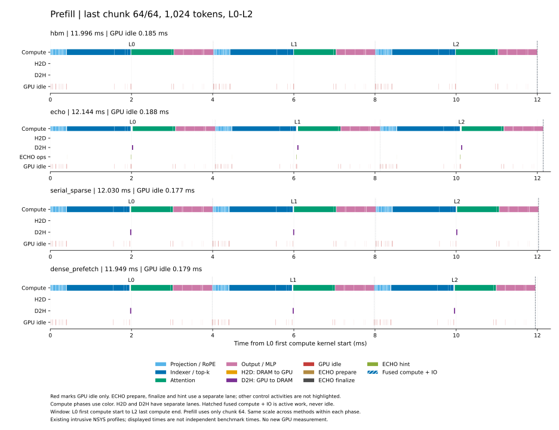
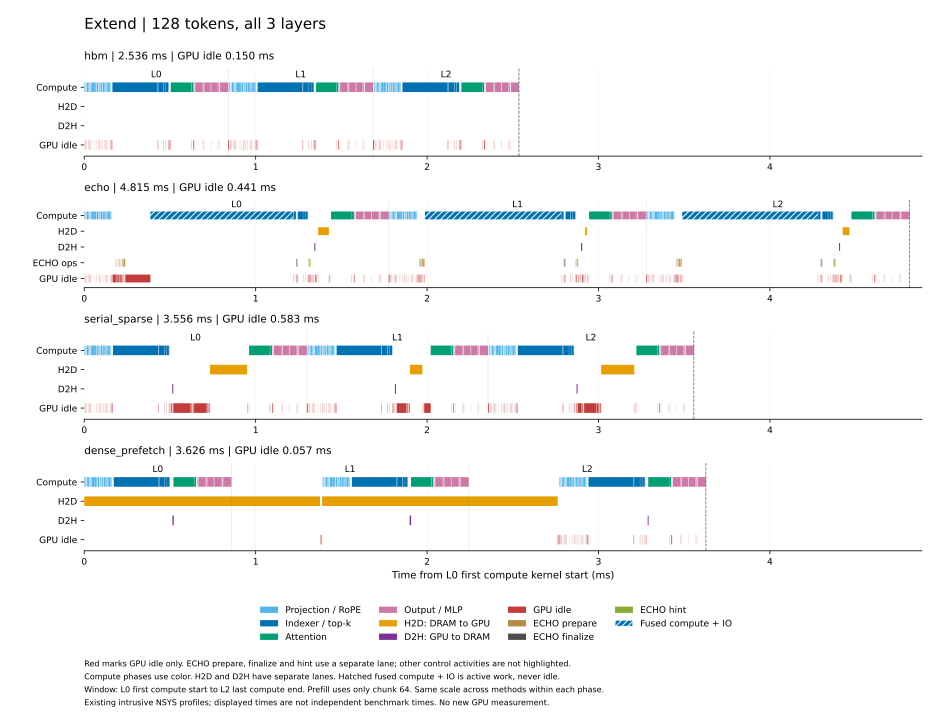
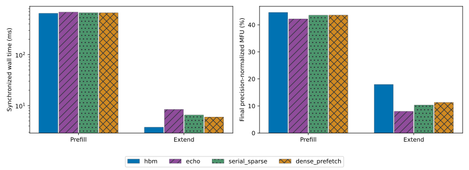
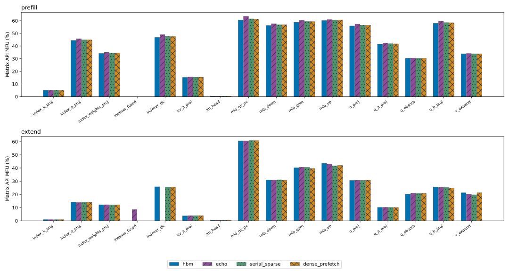

# DeepSeek V3.2 MFU

V10 已完成独立正确性、正式计时和最小 node profile，并通过数据完整性审计。
Resident indexer 的尾部 causal mask 已合并为一次 Triton 调用。优化已按用户要求暂停；
下文 v3 正式逐算子 MFU 图表保留原测量身份，新实现的正式 MFU 补测尚未完成。

本页只展示一组最终 timeline：prefill 为最后一个 chunk 的三层，extend 为
128-token batch 的三层。两张图及对应 gap 均从 **L0 首个计算 kernel 开始，到
L2 最后一个计算 kernel 结束**。层编号为 L0、L1、L2；prefill 取第 64/64 个 chunk，
即位置 64,512–65,535 的 1,024 个 token。

每个面板的计算集中在一行，只用颜色区分投影/RoPE、indexer/top-k、attention 和
输出/MLP，阶段名称放在图例中。H2D（DRAM→GPU）用橙色，D2H（GPU→DRAM）用紫色，
分别占一行；融合计算与 IO 保留斜线。四种方法在同一张图中使用相同时间尺度。
图中红色只标 GPU 空闲；ECHO 另设一行，用棕色、深灰色和绿色分别标 prepare、
finalize、hint 的 GPU 活动。其他控制操作不着色。最后一个 prefill chunk 没有
finalize 的 GPU 活动，因此不画该阶段的色块。





图中的 GPU idle 是窗口内没有任何 GPU 活动的时间。下表仍报告完整 gap：
即上述窗口减去计算与实际 IO 的区间并集。层内和层间未被覆盖的 metadata、
D2D/layout、空 gather 和空闲均计入 gap；窗口外的启动、embedding、final norm、
LM head、同步和提交不计入。所有活动按窗口裁剪，不能将重叠区间的 duration 相加。
融合计算/IO 段整体视为有效工作，不计入 gap，并完整保留在比例的分母中；分母只
扣除独立 IO 覆盖且没有计算的时间，因此各方案均报告确定值。下表来自侵入式 NSYS
profile，并非独立 benchmark 时延。

| 方法 | Prefill 窗口 ms | Prefill gap ms | Prefill gap 比例 | Extend 窗口 ms | Extend gap ms | Extend gap 比例 |
| --- | ---: | ---: | ---: | ---: | ---: | ---: |
| `hbm` | 11.996 | 0.316 | 2.64% | 2.536 | 0.256 | 10.10% |
| `echo` | 12.144 | 0.368 | 3.04% | 4.815 | 0.734 | 15.67% |
| `serial_sparse` | 12.030 | 0.313 | 2.61% | 3.556 | 0.778 | 25.45% |
| `dense_prefetch` | 11.949 | 0.328 | 2.76% | 3.626 | 0.110 | 4.59% |

当前三层 extend 窗口中，只有 dense prefetch 的 gap 比例低于 10%。该窗口不包含
L0 计算前的历史预取等工作，不能用它代替完整请求时间。原始纳秒端点和未舍入数据见
[窗口表](report/gap_v10/with_gap/windows.csv)，来源与重画命令见
[绘图说明](report/gap_v10/with_gap/README.md)。本次只重读已有数据并调整窗口，没有
启动新的 GPU 测量，也没有修改模型、cache 或算子。

Extend 图中标出的 GPU 空闲与 ECHO 操作如下，单位为 µs。三类 ECHO 操作只统计
实际 GPU 活动，不包含外层 CPU scope，也不包含它们前后的空闲。

| 方法 | GPU idle | ECHO prepare | ECHO finalize | ECHO hint |
| --- | ---: | ---: | ---: | ---: |
| `hbm` | 150.368 | — | — | — |
| `echo` | 441.310 | 65.536 | 15.712 | 26.784 |
| `serial_sparse` | 583.040 | — | — | — |
| `dense_prefetch` | 57.152 | — | — | — |

具体的 scale/布局、cache 写入、召回、预取管理开销，以及空闲与对应提交 API 的
时间关系见[Extend gap 来源](report/gap_v10/with_gap/extend_gap_sources.md)。

后续 scale-layout 候选已通过正确性检查，首次完整计时有小幅收益，但 dense cold
存在顺序效应，尚未接入，也没有对应的新 gap profile。

V10 保存了精确源码、实际加载的 native 动态库和 profile 中的 mask kernel 活动，
但通用 runtime collector 未单独保存新 mask 的 live JIT/CUBIN。此前私有候选的
完整模型验收和生产算子验收提供补充证据，不能视为本轮 production run 的独立
mask CUBIN 身份记录。这一限制随诊断结果保留。

本轮使用真实 checkpoint 第 0–2 层，H=65,536、A=128、history chunk=1,024、
完整 extend chunk=128，offload 为 `cold` 驻留。计算图策略为
`deepseek-compute-islands-v4-bound-inputs`，包含已接入的主机 recall 分派桥接、
普通 append 的单 session 空槽 mask 分配和 resident indexer 尾部 causal mask。
slot 优先级并列时允许任意合法选取；indexer 精确 top-k 及其并列规则不变。

独立 check、bench、profile run ID 分别为
`deepseek_gap_v10_a128_check_20261006_01`、
`deepseek_gap_v10_a128_bench_20261006_01` 和
`deepseek_gap_v10_a128_minimal_20261006_01`。下表延迟为独立同步 wall-time 中位数，
每种方法保留全部 3 次 prefill 和 5 次 extend 样本。这里的计时仍覆盖完整阶段：
prefill 包含全部 64 个 chunk，extend 包含启动和同步/提交尾部；与上图三层窗口分开解释。

| 方法 | V10 完整 Prefill ms | V10 完整 Extend ms |
| --- | ---: | ---: |
| `hbm` | 645.067 | 3.461 |
| `echo` | 647.961 | 5.433 |
| `serial_sparse` | 646.863 | 3.906 |
| `dense_prefetch` | 644.243 | 5.827 |

原始计时见[计时样本](report/gap_v10/timing_samples.csv)。原 profile 的完整阶段诊断
保留在[V10 数据](report/gap_v10/summary.json)及[诊断说明](report/gap_v10/results.md)，
沿用原测量边界；本页 timeline 与 gap 使用上文明确的三层窗口。

原始 bench/profile 位于 `output/data/<run_id>/`；check 位于
`/tmp/cxldsagr-checks/deepseek_v32_mfu/data/deepseek_gap_v10_a128_check_20261006_01/`。
独立审计位于 `/tmp/deepseek_gap_v10_independent_audit_20261006_01/`。原发布文件与来源哈希见
[来源记录](report/gap_v10/provenance.json)和[文件清单](report/gap_v10/publication_manifest.json)。
Check 的 13 项比较标志均通过；另行重读 12 个保存 tensor，完成 9 项跨方法逐位比较，
并重读核对 8 个 profile/control hidden/logits tensor。四项 default-forward 对照没有
单独保存默认输出，因此不计入独立 tensor 重读。审计核验了 3,855 条执行源码记录、
58,395 个阶段 GPU 活动和 788 个分区窗口。三次运行实际加载的 ECHO、recall bridge
与通用 record-transfer 动态库身份一致，测量前后哈希不变。Check/bench/profile 分别
记录 12/17/36 次干净的离散 GPU 观测；采样不能证明连续隔离或 CPU 独占。

独立 cache 优化与补测见 [cache manager 实验](../cache_manager_performance/README.md)。
后续仍优先独立优化 cache manager 操作，再考虑模型；优化结果完成独立正确性与
性能验收后，再补测并替换正式 MFU 图表，随后重测 motivation。


原 v3 报告的 ECHO 实现还包含后来确认的 scale stage 提前释放问题：融合 indexer
复用 stage 时可能读到被覆盖的 scale。原报告保存的输出对照仍记录当次检查结果，
但旧 ECHO 性能及其派生 simulation 须在修正后补测，不能用于修正后实现的结论。

本实验检查 baseline 实现的性能合理性，比较 `hbm`、`echo`、`serial_sparse` 和
`dense_prefetch` 在 prefill 与 extend 中的逐算子 MFU、阶段最终 MFU，以及三层
计算、IO 与 gap timeline。真实 checkpoint 第 0–2 层依次传播 hidden/residual，
执行包含 embedding、三个 dense MLP、final norm 和末 token LM head。
结果只覆盖这三层，不外推为完整 61 层性能，也不替代 C10 GR serving 验收。

## 保留的 v3 正式结果

Dense 已改用连续 Host DRAM/HBM 与 `cudaMemcpyAsync`，四方法均完成新的独立
正确性、正式计时和 profile。正式结果使用 H=65,536、A=128、history chunk=1,024、
完整 extend chunk=128，每层 pool=65,664，
开启计算图，extend 采用下文定义的 `cold` 驻留设置。

| 方法 | Prefill 中位延迟 ms | Prefill MFU | Extend 中位延迟 ms | Extend MFU |
| --- | ---: | ---: | ---: | ---: |
| `hbm` | 649.381 | 44.59% | 3.761 | 17.95% |
| `echo` | 686.327 | 42.19% | 8.434 | 8.01% |
| `serial_sparse` | 665.076 | 43.54% | 6.534 | 10.33% |
| `dense_prefetch` | 664.751 | 43.56% | 5.986 | 11.28% |



在此设置下，`hbm` 的两个阶段延迟最低。四种方法的 useful matrix 工作量相同，
对应的理想计算时间为 prefill 289.549 ms、extend 0.675 ms。
Dense extend 的下一层完整历史 DMA 与当前层计算实际重叠；完整阶段延迟低于
`serial_sparse` 和 `echo`，仍高于 `hbm`。单段重叠比例不能替代完整阶段延迟。



完整数据见[逐算子表](report/four_methods/operator_mfu.csv)、
[按层逐算子表](report/four_methods/operator_mfu_by_layer.csv)、
[最终 MFU 表](report/four_methods/final_mfu.csv)和[结果说明](report/four_methods/results.md)。
柱状图同时使用颜色和纹理区分方法。

## 工作负载与测量边界

输入由共享 GR 生成器和 checkpoint tokenizer 构造，seed=42；本实验执行真实前三层
的普通持久追加路径。每种方法从独立空 cache 构建 prefill，每次 extend 先恢复同一
prefix，再设置主 KV 驻留状态。默认 `cold` 清除三个 offload 方法的历史主 KV HBM
驻留，保留 DRAM 与 resident indexer；`hbm` 保留主 KV。`warm` 保留各方法构建
prefix 后的驻留，当前发布结果未测量该设置，两种设置须分别验收和汇总。

每层 pool 和 host arena 均为 65,664 tokens，workspace query=1,024。
Pool 按 H+A 向上对齐到 64 token，满足持久追加 dense prefetch 的完整主 KV 容量。
主 KV 为 BF16 512 latent + 64 RoPE，每 record 1,152 B；indexer FP8 K/scales
留在 HBM。模型 projection 使用 checkpoint FP8 权重和 FP8 activation GEMM；
indexer 在 BF16 RoPE 后直接量化，不执行 Hadamard。

Dense 按 session 分配连续 pinned host 区间，history 使用连续 HBM 槽位，独立
stream 通过 `cudaMemcpyAsync` 搬入未驻留历史；调用者消费前等待完成。其 ticket
借用已有 span，不新增 ID/count tensor，计入本轮资源计划的 ticket workspace 为 0 B。
本实验执行持久追加：cold extend 每层 H2D 为 75,497,472 B，新增 128 token 的
D2H 为 147,456 B。它不同于 C10 的临时候选 discard 语义。Prefill 历史已驻留，
三个 offload 方法的该阶段主 KV H2D 均为 0，每层 D2H 为 75,497,472 B。

Cache HBM 预算为 24 GiB，CPU DRAM 预算为 64 GiB，权重和普通 activation 另计。
计算图 static storage 为 195,863,088 B，对应实际 allocated 197,275,136 B，
private pool reserved 为 1,684,013,056 B；12 GiB 是选择的 private pool 规划上限，
不是实测固定开销。完整分配观测见[汇总](report/four_methods/summary.json)。
本实验没有运行多用户容量填满轨迹，不能据此验收完整 serving 的物理硬预算。

计算图策略为 `deepseek-compute-islands-v3-indexer-bounds`，捕获 projection 与
finish 的纯计算；cache 事务、选择、召回和 IO 留在图外。Q=128 与 Q=1,024 两种形状在
三个层分别有 projection/finish，共 12 个图模板；每个 prefill capture 包含 384 次
replay，每个 extend capture 包含 6 次。报告用 capture 时的 matrix
API 节点账本和 NSYS clone lineage 核验归属，没有把 eager 耗时分摊给 replay。
`--no-compute-graphs` 可选择 eager，但须使用匹配的独立数值验收记录。

运行使用 GPU3，PCI device ID `2335` 与 SM90 核验为 H200 SXM；`nvidia-smi` 的
名称字段为 `NVIDIA M403`，原始查询和 PCI 依据保留在汇总中。GPU UUID 为
`GPU-80ff95c3-176e-fd8a-728f-9c5577c4a779`，驱动 570.124.06，CPU 亲和性 24–31，
PyTorch 线程数为 8。依赖为 PyTorch 2.12.1+cu130、Triton 3.7.1、safetensors 0.8.0、
apache-tvm-ffi 0.1.13.post3；DeepGEMM、FlashMLA、FlashInfer 和 native 构建身份见
[源码与依赖记录](report/four_methods/summary.json)。Checkpoint 身份包含 metadata
哈希与 shard stat 清单，未 hash 全部权重。

每种方法的 prefill/extend 各预热 1 次，正式 prefill 测量 3 次，extend 测量 5 次。
Check、bench、profile 分别在独立进程运行。Bench 只复用匹配的数值验收记录，
样本间不重跑完整参考比较或保存全部输出。加载、编译、graph setup、snapshot
恢复和数值诊断不计入同步 wall time；运行时事务与必要同步计入。

## MFU 与 timeline 的含义

逐算子 MFU 为 useful matrix FLOPs 除以对应精度的名义 dense peak 和该 API
独占归属的 GPU kernel duration sum，FMA 计 2 FLOPs。量化和辅助 kernel 计入
对应 API，ECHO 融合 indexer/prefetch 的完整耗时计入融合 API；非矩阵操作的
FLOPs/MFU 为 N/A。因此该值不能解释为单个 GEMM 的效率。

最终 MFU 将各精度的 useful FLOPs 换算为理论计算时间后求和，再除以独立 bench
的同步 wall time。分母包括非矩阵计算、搬运、CPU 调度、等待和 GPU 空隙。
FP8、BF16、FP32 的 H200 SXM 名义 dense peak 分别为 1,979、989.5、67 TFLOP/s，
来源为 [NVIDIA H200 规格](https://www.nvidia.com/en-us/data-center/h200/)；
FP8/BF16 的公布稀疏峰值除以 2，FP32 保持原值。这些指标不是 Tensor Core
活跃率、SM occupancy 或 NCU 实测硬件利用率；本轮未采集 NCU。

## 验收与来源

| 用途 | Run ID |
| --- | --- |
| 独立正确性 | `deepseek_mfu_dma_a128_check_20261006_01` |
| 正式计时 | `deepseek_mfu_dma_a128_bench_20261006_01` |
| 独立 profile | `deepseek_mfu_dma_a128_profile_20261006_01` |

独立 check 的 13 项比较和 profile 的 25 项比较均逐位一致。报告额外重新读取
四方法保存的 hidden/logits，与 check control 的 8 个 tensor 逐位比较，全部通过。
八组阶段 capture 的 kernel count/time、matrix API 归属、graph 节点与逐层 query
覆盖均通过守恒检查；graph setup 加八组阶段共九份原生 NSYS capture。

验收记录位于 `/tmp/cxldsagr-checks/deepseek_v32_mfu/data/deepseek_mfu_dma_a128_check_20261006_01/receipt.json`，canonical SHA256 为
`94f396fde2c4dca6bab58b0baf7b0b2b0726e4af09882a77021d933d5111aa02`。
三次运行绑定的 canonical execution identity SHA256 为
`bc72b3bf8ec9a2daa2996f705d5a537ee87b66aeb542358f1b1e4a635df4b310`。
[运行验收](report/four_methods/run_acceptance.json)保存 result 哈希、独立输出复核、
来源一致性和 native 身份边界；[汇总](report/four_methods/summary.json)分别记录
测量时源码与实际报告生成器的哈希。

Check、bench、profile 分别有 13、18、32 次 GPU 离散观测，最大采样间隔分别为
2.199、2.202、2.846 秒。三个测量子进程与 observer wrapper 均退出 0，未观测到
目标 GPU 或其他 GPU 的外来进程，也没有退出竞态或查询错误。三份原始监测和
独立复核均保留；离散观测不能证明连续 GPU 隔离、全机独占或 CPU 独占。

原始数据、日志和 NSYS 文件保留在
`experiments/deepseek_v32_mfu/output/{data,log,profile}/<run_id>/`；check 产物保留在
上述临时目录。正式报告由 profile 的 `output/data/<run_id>/report/` 发布至
`report/four_methods/`，18 个选定文件由[发布清单](report/four_methods/publication_manifest.json)
逐项绑定。README 的引用和哈希另见[文档绑定](report/readme_binding.json)。

## 运行方式与调用模块

从仓库根目录运行，依赖准备见 [3rdparty](../../3rdparty/README.md)。三个运行入口
须使用相同输入、源码、硬件、依赖、CPU 亲和性和执行参数；更换配置后使用新的
run ID 和匹配的 check receipt。以下示例使用脚本默认的 H64K+A128、history chunk=1024、完整 extend chunk=128、cold 和计算图设置：

```bash
export CUDA_VISIBLE_DEVICES=3
export CXLDSAGR_SM90_BACKEND=native
export OMP_NUM_THREADS=8 MKL_NUM_THREADS=8 OPENBLAS_NUM_THREADS=8
export PYTORCH_ALLOC_CONF=backend:native,pinned_use_cuda_host_register:True,pinned_num_register_threads:8

MFU_RUN_ID=mfu_a128_check_new taskset -c 24-31 \
  bash experiments/deepseek_v32_mfu/scripts/run.sh --mode check \
  --physical-device 3 --model /preset-models

MFU_RUN_ID=mfu_a128_bench_new taskset -c 24-31 \
  bash experiments/deepseek_v32_mfu/scripts/run.sh --mode bench \
  --physical-device 3 --model /preset-models \
  --validation-receipt /tmp/cxldsagr-checks/deepseek_v32_mfu/data/mfu_a128_check_new/receipt.json

MFU_RUN_ID=mfu_a128_profile_new taskset -c 24-31 \
  bash experiments/deepseek_v32_mfu/scripts/profile_layers.sh \
  --physical-device 3 --model /preset-models \
  --validation-receipt /tmp/cxldsagr-checks/deepseek_v32_mfu/data/mfu_a128_check_new/receipt.json \
  --benchmark-run experiments/deepseek_v32_mfu/output/data/mfu_a128_bench_new

.venv/bin/python -m experiments.deepseek_v32_mfu.src.report_mfu \
  --profile-run experiments/deepseek_v32_mfu/output/data/mfu_a128_profile_new \
  --output-dir experiments/deepseek_v32_mfu/output/data/mfu_a128_profile_new/report
```

Check 默认写入 `${TMPDIR:-/tmp}/cxldsagr-checks/deepseek_v32_mfu/`；bench/profile
使用不同的新 run ID，report 输出目录必须尚不存在。报告可通过 `--check-observer`、
`--benchmark-observer`、`--profile-observer` 绑定原始外部监测，并用 `--reconciliation-source` 绑定独立复核记录，参数格式见 `src.report_mfu --help`。本次已发布运行的完整
命令与原始监测文件哈希见运行验收。

`src.measure` 和 `src.profile_layers` 调用 `models/deepseek_v32/model.py` 的真实
三层路径，模型支持条件见[模型说明](../../models/deepseek_v32/README.md)。
`src.operator_instrumentation` 记录 FLOPs 账本，`src.operator_report` 解析 NSYS，
`src.report_mfu` 绑定独立 bench 并生成表格与 timeline。Graph 节点归因显式复用
`deepseek_v32_motivation.src.graph_instrumentation` 和 `graph_attribution`。

固定 P/NH 的十 block GR 四方案见[motivation 实验](../deepseek_v32_motivation/README.md)，
多用户容量轨迹见[cache management 实验](../cache_management/README.md)；它们使用
不同工作负载和容量边界，不能与本页结果互换。
