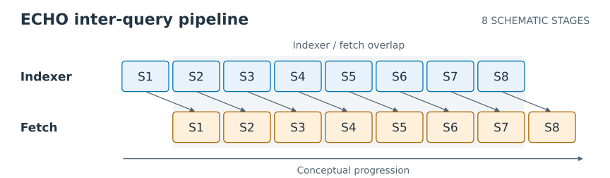
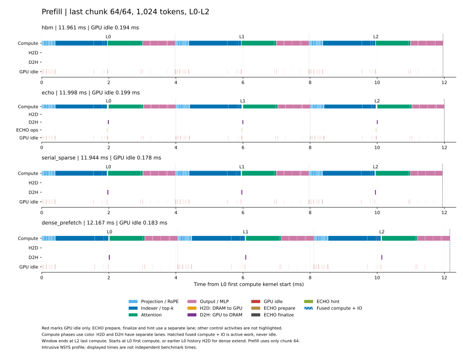
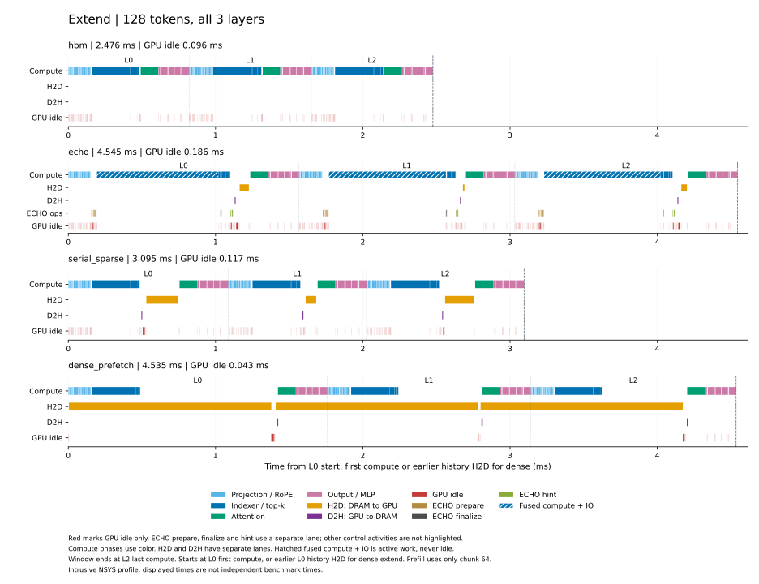
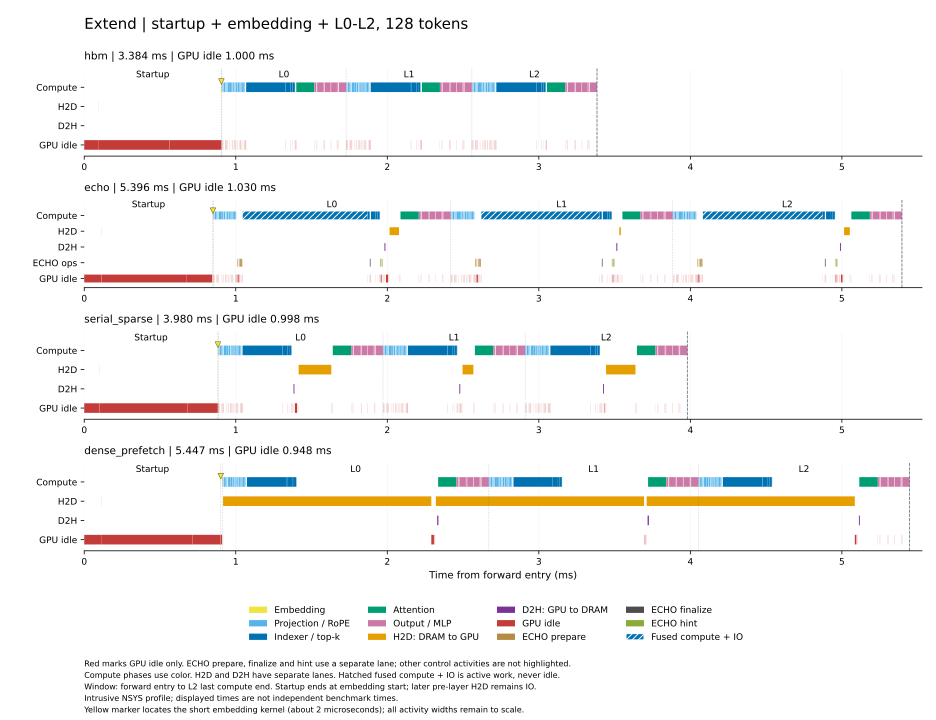
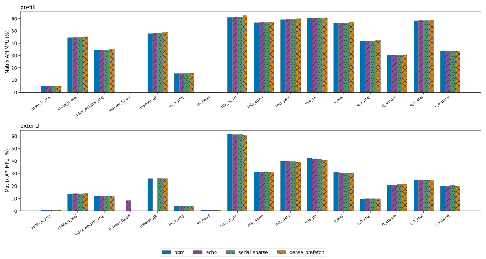

# DeepSeek V3.2 MFU

四种实现的 extend 均使用一次完整 CUDA Graph replay。当前策略为
`deepseek-full-extend-graph-v2-dense-late-wait`：dense 的本层 projection、indexer
和 top-k 与本层历史 H2D 同时推进，在 append 和主 attention 前等待数据及映射就绪，
随即发起下一层 fetch，再执行当前层 attention。Prefill 继续使用
`deepseek-compute-islands-v4-bound-inputs`；普通 forward 与其他方法保留原调度。

图内包含 embedding、L0–L2 的计算、cache 操作、真实 H2D/D2H、ECHO hint 备份、
final norm 和 LM head。输入校验与 staging、事务开始、同步及主机提交留在图外。
原单点报告的 cold/warm 正确性、独立 cold 计时、阶段 profile 和逐算子 MFU 均已完成。

本实验检查 baseline 实现的性能合理性。使用真实 checkpoint 第 0–2 层依次传播
hidden/residual，执行普通持久 append。新增矩阵见下文；后文保留的原单点报告
使用 H=65,536、A=128、history chunk=1,024、extend chunk=128、
P=NH=65,664 tokens。结果不代表完整 61 层或 C10 GR serving。

## ECHO inter-query prefetcher 原理图



图中将 query 工作示意划为 S1–S8 共 8 个 stage。上排执行 indexer 计算，下排
fetch 同一 stage 选出的历史 KV；fetch 错后一拍，使 `Fetch(Si)` 与
`Indexer(Si+1)` 重叠。8 个 stage 是示意划分，不对应 native kernel 的缓冲级数；
条宽和间距不代表实测时长。

下载 [SVG](report/echo_inter_query_prefetcher/echo_inter_query_prefetcher.svg)、
[PDF](report/echo_inter_query_prefetcher/echo_inter_query_prefetcher.pdf) 或
[PNG](report/echo_inter_query_prefetcher/echo_inter_query_prefetcher.png)。流水关系依据
[融合 kernel](../../operators/deepseek_v32/indexer/csrc/echo_logits.cuh)与
[SM 搬运](../../operators/deepseek_v32/indexer/csrc/echo_cache.cuh)绘制；源码与图像哈希见
[来源记录](report/echo_inter_query_prefetcher/provenance.json)。制图 run ID 为
`deepseek_echo_prefetch_schematic_20261007_02`，未新增 GPU 测量。

从仓库根目录重新生成时使用新的输出目录；该入口只调用 Matplotlib：

```bash
CUDA_VISIBLE_DEVICES= .venv/bin/python -m experiments.deepseek_v32_mfu.src.draw_echo_prefetcher \
  --output-dir experiments/deepseek_v32_mfu/output/data/echo_prefetch_schematic_new
```

## H × A 时间与 timeline

新增 `H=[4K,16K,64K] × A=[128,256,512,1024]` 的 12 组配置，K=1,024。
每组比较 `hbm`、`echo`、`serial_sparse` 和 `dense_prefetch`，使用真实 checkpoint
的 L0–L2 和一次完整 extend CUDA Graph replay。Cold 设置清除 offload 主 KV 的
HBM 驻留，保留 DRAM 与 resident indexer。
History chunk 固定为 1,024，extend 整批执行 A 个 tokens，P=NH=H+A；执行普通
持久 append，范围包含 embedding、final norm 和末 token LM head。

每个 shape 分别运行正确性验收、独立计时和侵入式 NSYS profile。独立计时每方法
预热 1 次，完整 prefill 测量 3 次、完整 extend 测量 5 次，报告同步 wall-time
中位数。输入准备、事务和必要同步/提交计入时间；权重加载、编译、图准备与 prefix
恢复不计入。来源矩阵 run ID 为 `deepseek_shape_matrix_complete_20261007_01`，各 shape
的子 run ID、硬件、依赖与源码身份见[汇总](report/shape_matrix/summary.json)。

完整计时和各 shape 的图表入口见[矩阵报告](report/shape_matrix/results.md)，
未舍入计时见[计时表](report/shape_matrix/timing.csv)，每次计时的实际逐层搬运量见
[样本计数表](report/shape_matrix/cache_metrics_samples.csv)，profile 窗口见
[窗口表](report/shape_matrix/timeline_windows.csv)。Prefill timeline 只取最后一个
1,024-token chunk 的 L0–L2；extend timeline 取完整 A-token batch 的 L0–L2，
另提供包含启动与 embedding 的版本。主图保留 dense L0 的完整历史 H2D。
这些 profile 窗口与完整 prefill/extend 的独立 wall-time 分开解释，本组不新增逐算子 MFU。

[矩阵统计报告](report/shape_matrix_statistics/results.md)汇总延迟比、H/A 增长时的
延迟变化、样本波动、搬运量与 timeline 指标，保留全部 384 个计时样本。统计 run ID
为 `deepseek_shape_statistics_20261007_01`，数据来自上述矩阵，没有新增 GPU 测量；
报告末尾提供统计与绘图的复现命令。

所有形状分别验收全部 extend hidden、extend 末 token logits、prefill 末 token
logits，以及精确 top-k、KV 与 cache 事务。ECHO 的原子
预取额度饱和时，符合条件的 token 可能因调度不同而被实际预取；因此验收逐次检查
预取资格和状态转移，计时样本保存各自的 prefetch/recall 计数。原始分数资格与
最终驻留 KV 的检查在运行时完成；独立复核重读保存的输出和精简状态证据，
不重新验证未保存的原始分数或 KV payload。见[独立复核](report/shape_matrix/audit/0_audit.json)。

本轮未修改模型或算子实现，也未测量 warm 矩阵。硬件查询两次触及 20 秒期限后，
将单次 `nvidia-smi` 查询期限改为 120 秒，不增加重试；已完成的六组保留原始来源，
其余形状使用新期限。逐形状的 check/bench/profile 身份严格一致，跨形状源码差异
仅限这项发生在模型加载前的查询期限。四个批次及成功形状来源见
[矩阵清单](report/shape_matrix/matrix_manifest.json)。验收插桩产生的显存观测不代表
独立计时或 serving 容量。下文保留原 H=65,536、A=128 单点 MFU 报告及其测量边界。

本组运行于 GPU0 的 H200 SXM（名称字段为 NVIDIA M403，SM90），CPU 绑定
0–7。GPU 观测保留原始归属标记：第二批有一条观测缺少完整祖先链，
无法当场确认进程归属；同一 PID 在此前七次观测中属于本任务。观测不证明持续隔离。其他 GPU 有并行任务，CPU/DRAM 也未隔离；
详见[观测记录](report/shape_matrix/audit/observer.json)。

复现沿用下文的环境设置，改用 GPU0、CPU 0–7。每次使用新的矩阵 ID 和发布目录；
默认脚本覆盖全部 12 组，并生成主图和启动对比图。

```bash
MATRIX_RUN_ID=deepseek_shape_matrix_new

MFU_RUN_ID="$MATRIX_RUN_ID" CUDA_VISIBLE_DEVICES=0 taskset -c 0-7 \
  bash experiments/deepseek_v32_mfu/scripts/shape_matrix.sh -- \
  --physical-device 0 --model /preset-models \
  --warmups 1 --prefill-repeats 3 --repeats 5

CUDA_VISIBLE_DEVICES= .venv/bin/python -m experiments.deepseek_v32_mfu.src.audit_shape_matrix \
  --manifest "experiments/deepseek_v32_mfu/output/data/$MATRIX_RUN_ID/manifest.json" \
  --output "experiments/deepseek_v32_mfu/output/data/$MATRIX_RUN_ID/audit.json"

CUDA_VISIBLE_DEVICES= .venv/bin/python -m experiments.deepseek_v32_mfu.src.report_shape_matrix \
  --manifest "experiments/deepseek_v32_mfu/output/data/$MATRIX_RUN_ID/manifest.json" \
  --audit "experiments/deepseek_v32_mfu/output/data/$MATRIX_RUN_ID/audit.json" \
  --output-dir "experiments/deepseek_v32_mfu/output/data/${MATRIX_RUN_ID}_report" \
  --publish-dir experiments/deepseek_v32_mfu/report/shape_matrix_new
```

## 独立计时

每种方法预热 1 次，正式 prefill 测量 3 次、extend 测量 5 次。下表为同步 wall-time
中位数：prefill 包含全部 64 个 chunk；extend 包含输入准备、事务与必要同步/提交。
权重加载、编译、graph 准备和 prefix 恢复均在计时外。Warm 只验收正确性，未计时。

| 方法 | 完整 Prefill ms | 完整 Extend ms | 每次 extend 的图数 | 图内 GPU 节点数 |
| --- | ---: | ---: | ---: | ---: |
| `hbm` | 644.938 | 3.326 | 1 | 218 |
| `echo` | 648.375 | 5.716 | 1 | 299 |
| `serial_sparse` | 640.701 | 4.265 | 1 | 242 |
| `dense_prefetch` | 645.800 | 5.706 | 1 | 224 |

原始样本见[计时表](report/full_extend_graph/mfu/timing_samples.csv)。本轮 dense 与
ECHO 的完整 extend 中位数接近，均高于 serial sparse；这些是本次有限样本的结果。
独立计时与下方侵入式 NSYS profile 分开解释。

## 最终 timeline

Prefill **只取最后一个 chunk（64/64，位置 64,512–65,535，共 1,024 tokens）的
L0–L2**。Extend 取完整 128-token batch 的 L0–L2。

两张主图均到 L2 最后计算 kernel 结束。Prefill 和 extend 的 HBM/ECHO/serial
从 L0 首个计算开始；**dense extend 从 L0 首个计算与 L0 历史 H2D 开始的较早者起算**，
完整保留首层 fetch。计算集中在一行，用颜色区分阶段；橙色 H2D、紫色 D2H 各占一行。
红色只表示 GPU 空闲；ECHO prepare/finalize/hint 在独立一行显示。





Gap 是窗口中计算与实际 IO 区间并集之外的时间，包括未被有效工作覆盖的控制操作
和 GPU 空闲。融合 ECHO 段整体算有效工作，保留在比例分母中；分母只扣除独立 IO
覆盖且没有计算的时间。数值按原始时间区间求并集，不用 profile 代替独立计时。

| 方法 | Prefill 窗口 ms | Prefill gap ms | Prefill gap 比例 | Extend 窗口 ms | Extend gap ms | Extend gap 比例 |
| --- | ---: | ---: | ---: | ---: | ---: | ---: |
| `hbm` | 11.961 | 0.326 | 2.72% | 2.476 | 0.202 | 8.18% |
| `echo` | 11.998 | 0.368 | 3.08% | 4.545 | 0.489 | 11.07% |
| `serial_sparse` | 11.944 | 0.317 | 2.67% | 3.095 | 0.309 | 11.89% |
| `dense_prefetch` | 12.167 | 0.328 | 2.71% | 4.535 | 0.093 | 3.92% |

Dense 主窗口为 4.534934 ms，GPU idle 为 42.528 µs。原生 trace 确认 L0 H2D 与
本层 projection、indexer、top-k 均有重叠；L1 fetch 与 L0 MLA 重叠 121.408 µs，
L2 fetch 与 L1 MLA 重叠 120.608 µs。每层实际搬运 72 MiB H2D、144 KiB D2H，
H2D 和映射发布均在本层 append、recall、MLA 前完成。见[原生依赖与重叠核验](report/full_extend_graph/audit/profile.json)。

原始端点和未舍入数值见[窗口表](report/full_extend_graph/windows.csv)，gap 分解见
[来源表](report/full_extend_graph/gap_sources/summary.csv)、
[控制操作分类](report/full_extend_graph/gap_sources/control_sources.csv)和
[原始分解](report/full_extend_graph/gap_sources/sources.json)。图内节点共享一次 graph
launch，节点间空闲不能解释为逐 kernel 的 Python 提交。

### Extend 对比：包含启动与 embedding

附图从 `forward` 进入到 L2 最后计算结束。`Startup` 表示进入 `forward` 至 embedding
首个 GPU kernel 开始；embedding 保留真实宽度，并用黄色标记定位。红色仍只表示
GPU 空闲，实际 IO 单独显示。这里的启动区间不含编译、graph capture 或 prefix 恢复。



附图与主图使用同一份 NSYS profile，仅扩展显示窗口，不改变主图 gap 的验收边界。
来源见[绘图记录](report/full_extend_graph/with_startup/compact_receipt.json)，
数值见[窗口表](report/full_extend_graph/with_startup/windows.csv)。

## 三层窗口与逐层 gap

整体窗口与主图相同。L0 从对应主图起点开始；L1/L2 从前一层最后计算结束开始，
各层均到本层最后计算结束。图外启动、同步和提交不计入这里的 gap，仍计入完整
extend 的独立 wall-time 与 MFU 分母。

| 方法 | 三层整体 gap | L0 gap | L1 gap | L2 gap |
| --- | ---: | ---: | ---: | ---: |
| `hbm` | 8.18% | 8.23% | 8.23% | 8.07% |
| `echo` | 11.07% | 11.15% | 10.78% | 11.28% |
| `serial_sparse` | 11.89% | 12.53% | 11.30% | 11.85% |
| `dense_prefetch` | 3.92% | 3.99% | 2.25% | 5.46% |

HBM 和 dense 的整体及每层 gap 均低于 10%；ECHO 和 serial sparse 仍略超。
见[逐层窗口表](report/full_extend_graph/mfu/timeline_layer_gap.csv)和
[独立区间审计](report/full_extend_graph/mfu/timeline_layer_gap_source.json)。原始 trace
中相邻层活动有 64/224 ns 的时间戳交集；分析保留原值并按区间并集计算，逐层窗口仍
按前层末端切分。

## 当前版本 MFU

Prefill MFU 覆盖全部 64 个 chunk；extend MFU 覆盖一次完整图和图外必要开销。
两者均包含真实 L0–L2、embedding、final norm 和末 token LM head，与裁剪 timeline
采用不同时间边界。

| 方法 | Prefill MFU | Extend MFU |
| --- | ---: | ---: |
| `hbm` | 44.90% | 20.30% |
| `echo` | 44.66% | 11.81% |
| `serial_sparse` | 45.19% | 15.83% |
| `dense_prefetch` | 44.84% | 11.83% |

整段 MFU = `100 × Σ精度(有效矩阵 FLOPs / 对应 dense 峰值) / 独立同步 wall-time`。
H200 的 FP8/BF16/FP32 dense 峰值分别为 1979/989.5/67 TFLOP/s。四种方法的有效
矩阵工作相同：prefill 2,689 次矩阵 API，理想计算时间 289.549384 ms；extend
43 次，理想计算时间 0.675229 ms。标量运算、IO、控制与空闲不增加有效矩阵 FLOPs，
但其耗时保留在整段分母中。这不是 NCU 测得的 Tensor Core 活跃率。



逐算子 MFU 使用该矩阵 API 独占归属的 GPU kernel 耗时之和，量化和融合 ECHO
prefetch 保留在对应 API 的计时中；非矩阵操作的 FLOPs/MFU 为 N/A。跨层按总工作量
除以总耗时计算，不平均各层百分比。每方法、每阶段采集一次 profile。

数据见[整段 MFU](report/full_extend_graph/mfu/final_mfu.csv)、
[逐算子表](report/full_extend_graph/mfu/operator_mfu.csv)、
[逐层算子表](report/full_extend_graph/mfu/operator_mfu_by_layer.csv)和
[FLOPs、时间与来源汇总](report/full_extend_graph/mfu/summary.json)。
四种 extend 各有一次 graph launch、43 个矩阵 API，GPU 节点归属与耗时守恒。
见[逐算子 profile 复核](report/full_extend_graph/mfu/audit/profile.json)。

## 图的支持范围、容量与验收

先调用 `prepare_extend_graph(token_ids)`，随后 `forward` 使用准备好的图。
图绑定固定 prefix、query shape、输出模式、cache generation/storage、clock 和驻留
证明；每次 replay 前须恢复匹配的 prefix。Offload 要求单 session 且 H+A<=P，
绑定变化时直接报错。输出借用 graph storage；跨 replay 保留时由调用者复制。
当前不支持任意增长历史，也未启用 C10 或 NOSA 的完整图。见[模型说明](../../models/deepseek_v32/README.md)。

默认输出图的 static input 实际 allocated 为 1,024 B；private pool reserved
为 HBM 142 MiB、三个 offload 方法各 144 MiB。每图 2 GiB 是选择的规划上限。
三个 offload 图各持有 442,368 B 写回源，已计入 private pool。分配时的 PyTorch
allocated/reserved/设备已用量，以及 prefill 图和 cache 计划见
[汇总](report/full_extend_graph/summary.json)；这些观测不代表多用户 serving 物理预算验收。
Cache HBM/DRAM 规划预算仍为 24/64 GiB，权重与普通 activation 另计。

Cold 清除 offload 主 KV 的 HBM 驻留，保留 DRAM 与 resident indexer；warm 保留
构建 prefix 后的驻留。两种设置各通过 13 项标准输出比较和 44 项完整图检查。
独立重读每组 36 个保存 tensor，31 项比较均逐位一致；两组 profile 的保存输出也
逐位一致。运行时完整 cache 检查与未保存的中间输出不冒充独立重读。见
[cold 复核](report/full_extend_graph/audit/check.json)、
[warm 复核](report/full_extend_graph/audit/warm_check.json)和
[计时复核](report/full_extend_graph/audit/bench.json)。

本轮修改三个模型执行文件和策略记录。其他方法的图节点清单、12 项跨版本保存
输出均保持一致。Native helper 的 PATH 改变了构建 fingerprint 和库路径，但
314 项源/依赖及三个 `.so` 的实际内容完全一致，见
[影响范围核验](report/full_extend_graph/audit/impact.json)和
[native 内容核验](report/full_extend_graph/audit/native_payload_comparison.json)。
新旧计时仍是两次独立测量，不据此给出严格的单变量归因。

平台为 GPU3 的 H200 SXM（PCI ID `2335`，SM90；名称字段为 NVIDIA M403），
UUID `GPU-80ff95c3-176e-fd8a-728f-9c5577c4a779`，驱动 570.124.06；CPU 绑定
24–31、NUMA 0，PyTorch 线程数 8。PyTorch 2.12.1+cu130、Triton 3.7.1、CUDA
Toolkit 13.2；其余依赖和源码身份见[来源记录](report/full_extend_graph/provenance.json)。
Cold check、warm check、bench、阶段 profile、逐算子 profile 分别有 20、21、19、
40、38 次 GPU 离散观测，未发现外来 GPU 进程；这不证明连续隔离或 CPU 独占。

| 用途 | Run ID |
| --- | --- |
| Cold 正确性 | `deepseek_dense_late_wait_cold_check_20261006_01` |
| Warm 正确性 | `deepseek_dense_late_wait_warm_check_20261006_01` |
| 独立计时 | `deepseek_dense_late_wait_bench_20261006_01` |
| 阶段 profile | `deepseek_dense_late_wait_profile_20261006_01` |
| 逐算子 profile | `deepseek_dense_late_wait_mfu_profile_20261006_01` |
| MFU 报告 | `deepseek_dense_late_wait_mfu_report_20261006_01` |
| 主 timeline | `deepseek_dense_late_wait_timeline_20261006_02` |
| 启动对比图 | `deepseek_dense_late_wait_startup_20261006_02` |

Check 产物在 `/tmp/cxldsagr-checks/deepseek_v32_mfu/data/<run_id>/`；其余原始产物
在本实验 `output/{data,log,profile}/<run_id>/`。图表由
`deepseek_dense_late_wait_report_20261006_01` 选出发布，见
[报告说明](report/full_extend_graph/results.md)和[发布清单](report/full_extend_graph/publication_manifest.json)。
独立 cache-manager 的 ECHO/serial 结果保留原 profile 来源，不与本轮 dense 结果混用。

## 复现

从仓库根目录运行，依赖准备见 [3rdparty](../../3rdparty/README.md)。各次运行使用
不同的新 run ID；bench/profile 必须绑定相同配置和执行身份的 check receipt。

```bash
export PATH="$PWD/.venv/bin:/usr/local/cuda/bin:$PATH"
export CUDA_VISIBLE_DEVICES=3 CXLDSAGR_SM90_BACKEND=native
export OMP_NUM_THREADS=8 MKL_NUM_THREADS=8 OPENBLAS_NUM_THREADS=8
export TRITON_PTXAS_BLACKWELL_PATH=/usr/local/cuda/bin/ptxas
export PYTORCH_ALLOC_CONF=backend:native,pinned_use_cuda_host_register:True,pinned_num_register_threads:8

MFU_RUN_ID=full_graph_check_new taskset -c 24-31 \
  bash experiments/deepseek_v32_mfu/scripts/run.sh --mode check \
  --physical-device 3 --model /preset-models --extend-graph --extend-residency cold

MFU_RUN_ID=full_graph_bench_new taskset -c 24-31 \
  bash experiments/deepseek_v32_mfu/scripts/run.sh --mode bench \
  --physical-device 3 --model /preset-models --extend-graph --extend-residency cold \
  --validation-receipt /tmp/cxldsagr-checks/deepseek_v32_mfu/data/full_graph_check_new/receipt.json

MFU_RUN_ID=full_graph_profile_new taskset -c 24-31 \
  bash experiments/deepseek_v32_mfu/scripts/gap_profile.sh \
  --physical-device 3 --model /preset-models --extend-graph --extend-residency cold \
  --validation-receipt /tmp/cxldsagr-checks/deepseek_v32_mfu/data/full_graph_check_new/receipt.json \
  --benchmark-run experiments/deepseek_v32_mfu/output/data/full_graph_bench_new

MFU_RUN_ID=full_graph_mfu_profile_new taskset -c 24-31 \
  bash experiments/deepseek_v32_mfu/scripts/profile_layers.sh \
  --physical-device 3 --model /preset-models --extend-graph --extend-residency cold \
  --validation-receipt /tmp/cxldsagr-checks/deepseek_v32_mfu/data/full_graph_check_new/receipt.json \
  --benchmark-run experiments/deepseek_v32_mfu/output/data/full_graph_bench_new

CUDA_VISIBLE_DEVICES= .venv/bin/python -m experiments.deepseek_v32_mfu.src.report_full_graph_mfu \
  --profile-run experiments/deepseek_v32_mfu/output/data/full_graph_mfu_profile_new \
  --run-id full_graph_mfu_report_new

CUDA_VISIBLE_DEVICES= .venv/bin/python -m experiments.deepseek_v32_mfu.src.compact_timeline \
  --profile-run experiments/deepseek_v32_mfu/output/data/full_graph_profile_new \
  --gap-audit experiments/deepseek_v32_mfu/output/data/full_graph_profile_new/gap_audit.json \
  --output-dir experiments/deepseek_v32_mfu/output/data/full_graph_timeline_new \
  --layout separate --window three-layers --io-layout directions --annotations idle-echo

CUDA_VISIBLE_DEVICES= .venv/bin/python -m experiments.deepseek_v32_mfu.src.compact_timeline \
  --profile-run experiments/deepseek_v32_mfu/output/data/full_graph_profile_new \
  --gap-audit experiments/deepseek_v32_mfu/output/data/full_graph_profile_new/gap_audit.json \
  --output-dir experiments/deepseek_v32_mfu/output/data/full_graph_extend_startup_new \
  --layout separate --window extend-startup --io-layout directions --annotations idle-echo
```

Warm 用新的 check run ID 和 `--extend-residency warm` 单独验收。`gap_profile.sh`
生成阶段 timeline，`profile_layers.sh` 记录逐算子 FLOPs 和完整图节点归属。
两种 profile 均把图捕获与实际 replay 分开，不能把捕获时间算入执行时间。
Timeline 报告入口为 `src.report_extend_graph --help`，gap 来源为 `src.extend_gap_sources`。

此前 v3 MFU 及依赖它的旧 simulation 已撤回，由本轮完整图 MFU 替换；新 simulation
尚未重算。独立 cache 操作和真实模型 top-k→MLA 区间见
[cache manager performance](../cache_manager_performance/README.md)。
