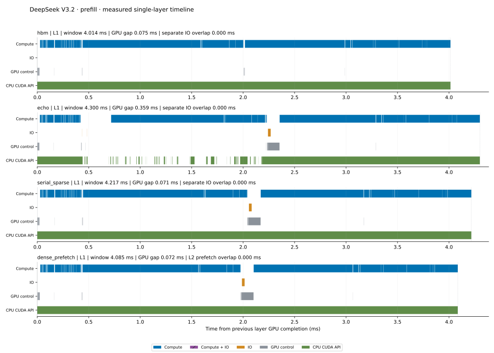
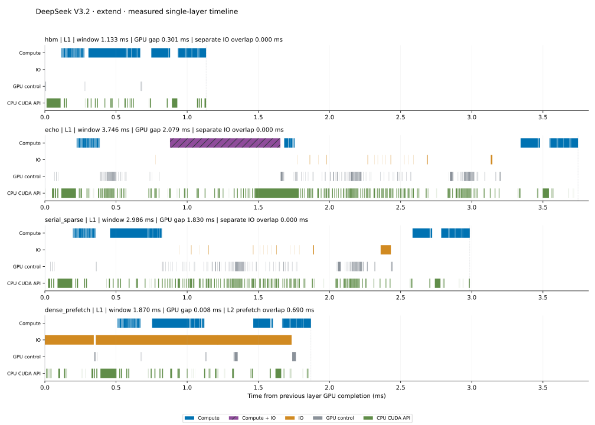

# DeepSeek V3.2: four-method MFU

Profile `deepseek_mfu_dma_a128_profile_20261006_01`; independent benchmark `deepseek_mfu_dma_a128_bench_20261006_01`.

The real checkpoint layers 0–2 propagate hidden/residual sequentially. The execution includes embedding, three dense MLPs, final norm and last-token LM head. Results do not extrapolate to the full 61-layer model or GR serving.

Prefill 65,536; extend 128; chunk 1,024; pool 65,664; extend residency `cold`; compute graphs `True`.

| Method | Phase | Median wall ms | Final MFU % |
|---|---|---:|---:|
| hbm | prefill | 649.381 | 44.59 |
| echo | prefill | 686.327 | 42.19 |
| serial_sparse | prefill | 665.076 | 43.54 |
| dense_prefetch | prefill | 664.751 | 43.56 |
| hbm | extend | 3.761 | 17.95 |
| echo | extend | 8.434 | 8.01 |
| serial_sparse | extend | 6.534 | 10.33 |
| dense_prefetch | extend | 5.986 | 11.28 |

Final MFU is 100 × Σ_precision(useful matrix FLOPs / dense peak) / independent synchronized wall time. It includes nonmatrix computation, communication, host scheduling and gaps in the denominator. FP8/BF16/FP32 nominal H200 dense peaks are 1979/989.5/67 TFLOP/s; this is not Tensor Core activity.

[Operator table](operator_mfu.csv) and [per-layer table](operator_mfu_by_layer.csv) use each matrix API's exclusively attributed GPU kernel-duration sum. Quantization and fused prefetch remain in their API denominator. Nonmatrix rows have no FLOPs or MFU. Graph replay ownership is verified against capture-time API nodes and Nsight clone lineage.

The prefill timeline selects the last chunk of layer 1; extend selects its complete query batch. Each window runs from the preceding layer's GPU computation completion to the selected layer's completion. IO from another stream remains visible. Raw inclusive CPU scopes remain in the CSV. D2D copies are GPU control; IO contains host-direction copies and mapped-host gather kernels. CUDA API intervals include synchronization. Complete next-layer prefetch activities are retained even outside the selected window; the dotted line marks the window end. Native transport kind, launch correlation, stream, full activity intervals and H2D bytes are reported explicitly. Fused ECHO work is shown as Compute + IO without inferring separate transfer intervals. Cache byte counters identify actual phase transfers; kernel duration alone does not imply nonzero transferred records.

[Timeline intervals](timeline_activities.csv), [gap/overlap metrics](timeline_summary.json), [native SQL overlap audit](dense_overlap_sql_audit.json) and [source and measurement binding](summary.json) preserve the measured boundaries. A single profile per method/phase has no repeated-profile confidence interval. No NCU hardware utilization was collected by this experiment.

[Run acceptance](run_acceptance.json) binds check, benchmark, profile, saved outputs, native identities and raw observers. Exit statuses are check: child 0, observer wrapper 0; bench: child 0, observer wrapper 0; profile: child 0, observer wrapper 0. Independent raw-evidence audits are retained for check, bench, profile. No observer reconciliation was required. No unresolved selected-GPU foreign process remains. Other-device process observations and their sampled utilization are retained separately. Discrete observations do not prove continuous device isolation or exclusive CPU use.
