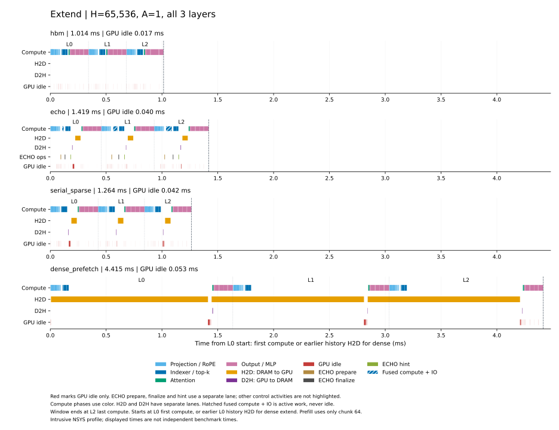

# H64K + A1 with independent method processes

Each method has a separate numerical check, clean benchmark, minimal node profile and operator profile. Every process performs only its selected method's normal warmup. HBM outputs are loaded on CPU as the offload correctness reference.

The workload uses checkpoint layers L0–L2, H=65,536, A=1, history chunk=1,024, P=NH=65,600, FP8 weights and BF16 main KV on H200 SXM / SM90, GPU0, CPU0–7. Offload restores a cold prefix before every step. HBM keeps resident KV. One warmup precedes three prefill and five step wall samples per method.

| Method | Prefill wall ms | Step wall ms | Step MFU % | L0–L2 GPU ms | GPU idle µs |
| --- | ---: | ---: | ---: | ---: | ---: |
| `hbm` | 633.801203 | 1.803457 | 0.395465 | 1.014466 | 16.737 |
| `echo` | 639.018574 | 2.562300 | 0.278345 | 1.419011 | 40.388 |
| `serial_sparse` | 648.025304 | 2.401064 | 0.297037 | 1.263747 | 41.890 |
| `dense_prefetch` | 648.195370 | 5.539999 | 0.128737 | 4.415209 | 53.409 |

Wall medians cover complete synchronized execution, including required input, transaction and commit work. Loading, graph preparation and prefix restoration remain outside timing. The intrusive GPU timeline runs separately and covers L0's first compute through L2's last compute; dense includes L0 history H2D. The full graph also contains embedding, final norm and the last-token LM head.

MFU is 100 × the sum of useful matrix FLOPs divided by each precision's nominal dense peak, divided by the independent complete wall time. It is not measured Tensor Core occupancy. Nominal FP8/BF16/FP32 peaks are 1979/989.5/67 TFLOP/s.

13 standard output comparisons and 44 full-graph checks cover all four methods. The report independently rereads saved outputs, bounded ECHO transitions, actual traffic, original source/native artifacts, and raw GPU process/graph/window inventories. Unsaved scores and KV payloads retain their runtime correctness boundary. Process observations do not prove continuous machine isolation.

Fresh method processes remove another method's same-process preparation from the measurement boundary. This is not a change to model computation or evidence of a particular hardware mechanism. Different-batch wall times are not paired speedup estimates. The official SGLang comparison retains different inputs, natural residency and framework behavior.

Cohort: `deepseek_h64k_a1_fused_prepare_20261009_01`. [Summary and child identities](summary.json), [all wall samples](timing_samples.csv), [raw-window summaries](windows.csv), [complete-stage MFU](final_mfu.csv), [operator MFU](operator_mfu.csv), [input hashes](input_hashes.json), [publication manifest](publication_manifest.json).
