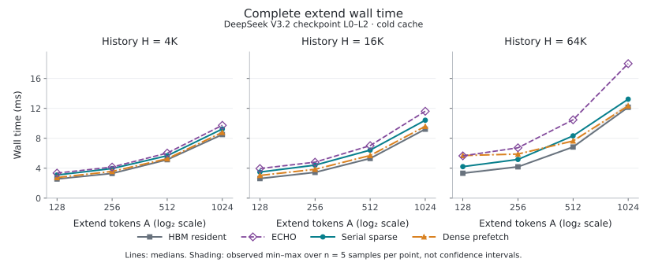
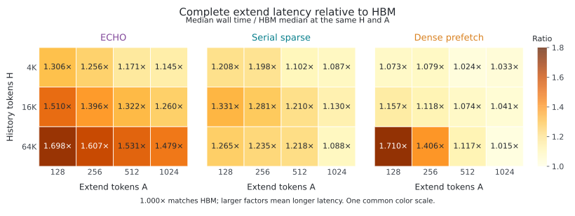
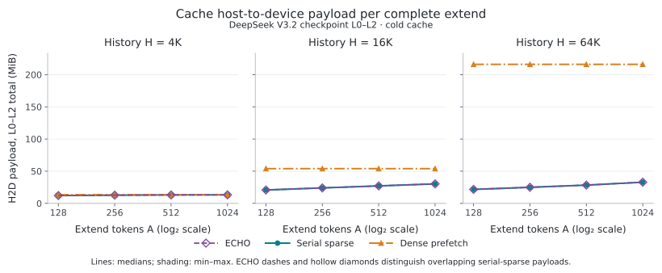

# DeepSeek V3.2 H × A 矩阵统计报告

## 主要结果

本报告汇总 `deepseek_shape_matrix_complete_20261007_01` 的 12 组形状、4 种方法及 384 个正式计时样本。以下排名依据每组的已测中位数。

- HBM 的 extend 中位数在 12/12 组中最低。三个 offload 方法中，dense prefetch 在 10/12 组最低；serial sparse 在 H=64K、A=128/256 两组最低；ECHO 没有最低延迟点。
- 以每个形状等权汇总，ECHO、serial sparse、dense prefetch 的 extend 延迟相对 HBM 的几何平均比值分别为 1.380、1.194、1.140 倍。
- ECHO 比 serial sparse 慢 4.87%–35.90%，几何平均延迟比为 1.156。两者在全部 12 点、每点 5 次计时中的 H2D 字节数逐点相同，因此本组延迟差异不能归因于 ECHO 搬运了更多字节。
- Prefill 的方法间中位数差异较小，但部分三次样本中出现较大波动。所有样本均保留；本报告不给出显著性、置信区间或线上流量加权结论。

## 数据范围与统计口径

H=[4K,16K,64K]，A=[128,256,512,1024]，K=1,024。实际执行真实 checkpoint 的 L0–L2、embedding、三个 dense MLP、final norm 与末 token LM head。History chunk=1,024，extend 整批执行 A 个 token、一次完整 CUDA Graph，P=NH=H+A，采用普通持久 append 和 cold 主 KV 驻留设置。硬件为 GPU0 的 H200 SXM（SM90，名称字段 NVIDIA M403），CPU 绑定 0–7。H/A 变化时，P/NH 也按 H+A 变化；这是一组配置对照。该范围不代表完整 61 层模型、C10 GR serving 或相同字节预算下的容量比较。

每方法预热 1 次；每点 prefill 计时 3 次、extend 计时 5 次。同步 wall-time 包括输入准备、事务、必要同步和提交，排除加载、编译、图准备及 prefix 恢复。数值验收、独立计时和侵入式 NSYS profile 分开运行。来源分为四批；六个点的启动硬件查询期限为 20 秒，另六个为 120 秒，已核验除此之外执行源码一致。GPU/进程为离散观测，存在一条退出附近的归属不确定记录，其他 GPU 有并行任务，CPU/DRAM 未隔离。原始依据见[矩阵报告](../shape_matrix/results.md)及[独立验收](../shape_matrix/audit/0_audit.json)。

延迟比定义为 `T_method / T_HBM`，大于 1 表示更慢；反向加速比为 `T_HBM / T_method`。几何平均为 12 个形状延迟比的等权几何平均，不是将全部毫秒样本合并，也不代表业务访问频率。CV 为每点样本标准差（ddof=1）除以样本均值。图中的带状区域仅表示实测最小值到最大值。

## Extend 延迟与方法比较



| H | A | HBM ms | ECHO ms | Serial sparse ms | Dense prefetch ms | 最低 offload 中位数 |
| ---: | ---: | ---: | ---: | ---: | ---: | --- |
| 4K | 128 | 2.566 | 3.352 | 3.099 | 2.755 | `dense_prefetch` |
| 4K | 256 | 3.308 | 4.155 | 3.962 | 3.571 | `dense_prefetch` |
| 4K | 512 | 5.147 | 6.028 | 5.673 | 5.270 | `dense_prefetch` |
| 4K | 1024 | 8.505 | 9.739 | 9.247 | 8.788 | `dense_prefetch` |
| 16K | 128 | 2.623 | 3.960 | 3.492 | 3.036 | `dense_prefetch` |
| 16K | 256 | 3.447 | 4.810 | 4.415 | 3.855 | `dense_prefetch` |
| 16K | 512 | 5.309 | 7.019 | 6.425 | 5.700 | `dense_prefetch` |
| 16K | 1024 | 9.223 | 11.618 | 10.421 | 9.601 | `dense_prefetch` |
| 64K | 128 | 3.332 | 5.656 | 4.216 | 5.698 | `serial_sparse` |
| 64K | 256 | 4.192 | 6.734 | 5.176 | 5.894 | `serial_sparse` |
| 64K | 512 | 6.839 | 10.474 | 8.330 | 7.642 | `dense_prefetch` |
| 64K | 1024 | 12.155 | 17.981 | 13.231 | 12.339 | `dense_prefetch` |



| 方法 | 延迟比几何平均 | 各形状延迟比范围 | 反向加速比几何平均 |
| --- | ---: | ---: | ---: |
| `echo` | 1.380× | 1.145–1.698× | 0.725× |
| `serial_sparse` | 1.194× | 1.087–1.331× | 0.838× |
| `dense_prefetch` | 1.140× | 1.015–1.710× | 0.877× |

H=64K 时，dense/serial 的延迟比随 A=128、256、512、1024 依次为 1.352、1.139、0.917、0.933。已测点只把两者排序变化夹在 A=256 与 512 之间，不能据此确定精确阈值，也不能外推到未测 A。

## H 与 A 增长时的变化

下表为 A 从 128 增至 1,024（8 倍）时的 extend 延迟倍数。

| 方法 | H=4K | H=16K | H=64K |
| --- | ---: | ---: | ---: |
| `hbm` | 3.314× | 3.516× | 3.648× |
| `echo` | 2.905× | 2.934× | 3.179× |
| `serial_sparse` | 2.983× | 2.984× | 3.139× |
| `dense_prefetch` | 3.190× | 3.163× | 2.166× |

这组数据中，8 倍 A 对应约 2.17–3.65 倍延迟，批内每 token 的摊销时间降低。`A / 时间` 只是本次 batch 的 token 处理率，不是 serving 请求吞吐量。固定 A，将 H 从 4K 增至 64K（16 倍）时，extend 延迟变化如下。

| 方法 | H=64K / H=4K 延迟比范围（四个 A） |
| --- | ---: |
| `hbm` | 1.267–1.429× |
| `echo` | 1.621–1.846× |
| `serial_sparse` | 1.306–1.468× |
| `dense_prefetch` | 1.404–2.069× |

## Prefill 与样本波动

下表对每个 H，列出四个 A 配置中完整 prefill 中位数的最小值–最大值。每个中位数各来自三次计时，没有跨 A 合并样本。

| H | HBM ms | ECHO ms | Serial sparse ms | Dense prefetch ms |
| ---: | ---: | ---: | ---: | ---: |
| 4K | 29.314–29.976 | 30.246–30.928 | 30.143–30.783 | 29.639–30.287 |
| 16K | 132.095–133.099 | 132.732–134.267 | 132.188–133.629 | 132.410–133.298 |
| 64K | 637.331–653.778 | 643.398–648.827 | 644.864–650.458 | 641.960–650.294 |

H 扩大 16 倍后，完整 prefill 中位数增至原来的 20.803–21.966 倍。三个 offload 方法相对 HBM 的几何平均延迟比为 echo 1.014×、serial_sparse 1.012×、dense_prefetch 1.006×；结合以下波动，不将这些小差异解释为稳定优势。

| 阶段 | 方法 | 每点 CV 的中位数 % | 最大 CV % |
| --- | --- | ---: | ---: |
| prefill | `hbm` | 1.482 | 33.843 |
| prefill | `echo` | 1.403 | 5.705 |
| prefill | `serial_sparse` | 1.050 | 61.857 |
| prefill | `dense_prefetch` | 1.163 | 1.677 |
| extend | `hbm` | 1.811 | 4.178 |
| extend | `echo` | 0.802 | 1.309 |
| extend | `serial_sparse` | 0.895 | 1.819 |
| extend | `dense_prefetch` | 0.976 | 1.534 |

两个 prefill 点尤其需要保留原始样本查看：

- `hbm`，H=64K/A=128：三次样本为 1108.420、629.403、653.778 ms；中位数 653.778 ms，均值 797.201 ms，CV 33.843%。
- `serial_sparse`，H=4K/A=1024：三次样本为 80.782、29.813、30.783 ms；中位数 30.783 ms，均值 47.126 ms，CV 61.857%。

48 个方法–形状组合中，47 个组合的第一次正式 extend 样本为该组最大值。这是样本顺序现象，现有记录不足以确定原因。统计保留第一次样本和其他较大值，未通过删除样本改善结果。样本量较小且未随机化方法/形状顺序，当前排名是描述性结果。

## 搬运量与 timeline



以下为一次完整 extend、三层合计的 cache 软件账本 payload（MiB=2²⁰ B），不是物理总线流量。本组每点五次计时的 H2D、D2H 总量均相同。ECHO 与 serial sparse 的 H2D 总量在所有点逐次相等；ECHO 的这些 H2D records 分为 prefetch 和 residual recall 两类。相同计数不证明每次执行预取了相同 token 集合。

| H | A | ECHO / serial H2D MiB | Dense H2D MiB | ECHO prefetch records | ECHO residual recall records |
| ---: | ---: | ---: | ---: | ---: | ---: |
| 4K | 128 | 12.170 | 13.500 | 10985 | 92 |
| 4K | 256 | 12.747 | 13.500 | 11540 | 63 |
| 4K | 512 | 13.148 | 13.500 | 11936 | 32 |
| 4K | 1024 | 13.308 | 13.500 | 12091 | 22 |
| 16K | 128 | 20.829 | 54.000 | 16174 | 2785 |
| 16K | 256 | 24.038 | 54.000 | 19167 | 2713 |
| 16K | 512 | 27.167 | 54.000 | 20619 | 4109 |
| 16K | 1024 | 30.312 | 54.000 | 21940 | 5651 |
| 64K | 128 | 21.743 | 216.000 | 15600 | 4191 |
| 64K | 256 | 24.975 | 216.000 | 18097 | 4636 |
| 64K | 512 | 28.396 | 216.000 | 18943 | 6904 |
| 64K | 1024 | 32.906 | 216.000 | 19507 | 10445 |

Record 为 1,152 B；三个 offload 方法的 extend D2H 均为 `3 × A × 1152 B`，完整 prefill H2D 为零、D2H 为 `3 × H × 1152 B`。HBM 两方向均为零。所有样本均未发生 eviction 或 capacity split；不同重复中 ECHO 的预取额度竞争失败计数可能变化，但本组搬运总量未变。

下表只统计独立 NSYS 捕获的完整 extend L0–L2 主窗口。GPU idle 比例的分母为完整窗口；gap 比例的分母扣除仅被独立 IO 覆盖的时间，且融合 ECHO 区间算有效工作。Gap 含 idle 和仅控制操作占用的时间，两列不能混为同一指标。

| 方法 | 主窗 GPU idle % 范围 | 主窗 gap（扣除仅 IO 时间）% 范围 | 主窗口前的 profile 时间 ms |
| --- | ---: | ---: | ---: |
| `hbm` | 1.178–6.686 | 2.275–12.202 | 0.520–1.070 |
| `echo` | 1.316–7.831 | 3.745–18.440 | 0.742–0.857 |
| `serial_sparse` | 1.395–6.585 | 4.010–16.567 | 0.756–0.914 |
| `dense_prefetch` | 0.438–7.691 | 1.200–12.346 | 0.762–0.924 |

H=64K 时，dense 主窗仅 IO 覆盖的时间从 A=128 的 2.142 ms（窗口的 47.15%）降至 A=1024 的 0.183 ms（1.63%），两点 H2D 均为 216 MiB。相应独立延迟由比 serial 高 35.17% 变为低 6.74%。这一现象与较长计算覆盖更多搬运时间相符，但尚不是严格的因果分解。

启动视图与主视图终点相同，差额覆盖 `forward` 入口到主窗口起点，包括启动、embedding 及这段内其他活动。它不等于独立计时的 CPU 开销，不能从 wall-time 中直接扣除。Prefill timeline 只覆盖最后一个 1,024-token chunk，不能拿来替代上文完整 prefill 时间。每形状只有一次侵入式 profile，不用不同运行的字节数与 profile 时间拼出带宽，也不把阶段时间相加解释全部 wall-time。

## 数据与复现

- [逐点统计及全部样本](point_statistics.csv)：96 行（两阶段），保留均值、中位数、最小/最大值、标准差与 CV。
- [Extend 比较](comparisons.csv)、[方法汇总](aggregate_statistics.csv)、[H/A 缩放](scaling.csv)。
- [逐点搬运量](traffic_statistics.csv)、[主窗与启动窗统计](timeline_statistics.csv)。
- [统计汇总与边界](summary.json)、[输入及脚本哈希](provenance.json)、[发布清单](publication_manifest.json)。
- [原始 12 组 timeline 导航](../shape_matrix/results.md#timelines)。

本报告仅对已有测量做 CPU 统计，没有新增 GPU 测量、逐算子 MFU 或 serving 性能结论。复现时从仓库根目录运行，输出目录须使用新名称：

```bash
CUDA_VISIBLE_DEVICES= .venv/bin/python -m experiments.deepseek_v32_mfu.src.summarize_shape_matrix \
  --source-report experiments/deepseek_v32_mfu/report/shape_matrix \
  --run-id deepseek_shape_statistics_new \
  --output-dir experiments/deepseek_v32_mfu/output/data/deepseek_shape_statistics_new \
  --publish-dir experiments/deepseek_v32_mfu/report/shape_matrix_statistics_new
```
