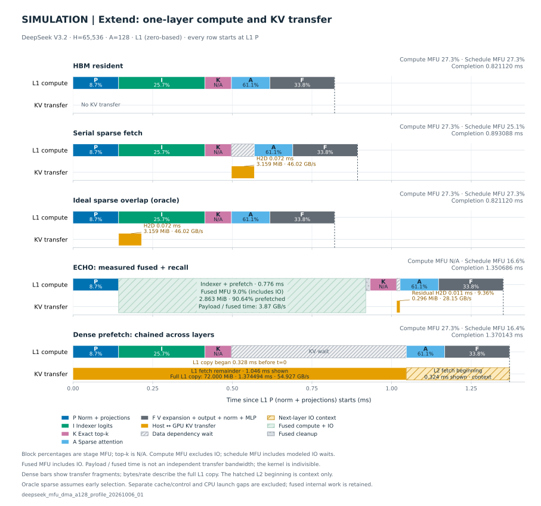
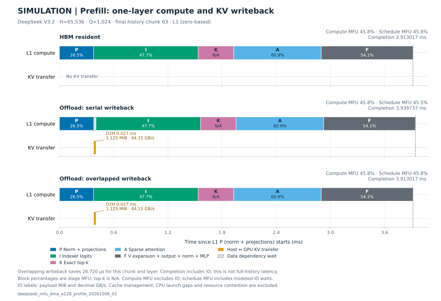

# DeepSeek V3.2 Motivation

当前先优化四方案的 extend cache 管理与 launch 开销，并按新的 gap 定义验收：
计算与 IO 区间并集之外的时间都计入 gap。达到扣除纯 IO 时间后小于 10% 的目标后，
将在 MFU 实验中发布优化后的时间、MFU 和带计算用途标签的 timeline，再重测完整 motivation。
以下已发布数据保留原实现身份，不代表当前优化版本的性能。
旧 ECHO 路径包含后来确认的融合 indexer scale stage 提前释放问题；原保存输出的
数值对照不替代修正后验收。受影响的 ECHO 性能、流量及派生 simulation 将随本轮
补测更新，旧数据不用于修正后实现的结论。

Dense prefetch 正在改用连续 Host DRAM/HBM 地址上的 `cudaMemcpyAsync`。下述结果
保留原 run ID 和 mapped-host gather 实现身份，新 DMA 路径尚未完成正式补测。

本实验属于论文 motivation：在相同 P/NH 配额下比较 HBM-only、ECHO、sparse fetch
和 dense prefetch，观察固定历史复用、稀疏召回和完整历史预取对请求延迟、流量及
内存占用的影响。合成请求与 checkpoint 工作负载替身用于系统测量，尚未验证真实
GR 任务的质量或场景代表性。

当前正式结果为 `deepseek_mfu_c10_bench_20261006_01`，独立数值验收为
`deepseek_mfu_c10_check_20261006_01`。报告重新核验了 128 份完整 candidate
hidden/logits，其中 96 组 offload/HBM 对照逐位一致；check 与 bench 的全部 cache
计数、访问分类和历史命中一致。这是一次正式轨迹，各请求只测一次。

## 单层 simulation

`deepseek_compute_io_simulation_20261006_04` 使用
[MFU 实验](../deepseek_v32_mfu/README.md)已发布的计算与 I/O 成本，按本实验的
H=65,536、A=128、history chunk=1,024 设置模拟 L1（从 0 编号）。测量来源是
`deepseek_mfu_dma_a128_profile_20261006_01` 的真实前三层路径；这里不推算完整
十层请求，也不将其 token、激活或 cache 状态视为某个 C10 请求。

模拟排除独立的 cache 管理、CPU launch、D2D/control 和原时间线空隙，保留 KV
未到齐产生的依赖等待。解析方案共用 HBM 计算成本；ECHO 行替换为已测 fused
indexer/prefetch、causal mask 和 residual recall，融合内部操作随整体时长保留。
假设计算和搬运互不减速，candidate 按 discard 处理，排除其持久 D2H。

| Extend 模拟方案 | L1 输出就绪 ms | 调度 MFU |
| --- | ---: | ---: |
| HBM 已驻留 | 0.821120 | 27.33% |
| 串行 sparse fetch | 0.893088 | 25.13% |
| 理想 sparse overlap（oracle） | 0.821120 | 27.33% |
| ECHO 已测 fused + recall | 1.350686 | 16.62% |
| Dense prefetch，逐层串接 DMA | 1.370143 | 16.38% |

Oracle 行假设 indexer 开始时已获知精确搬运集合，用于估算重叠收益上限，不是
ECHO 的实测或已实现时序。Dense 行按 L0→L1→L2 串接 DMA，令 L0 projection
与 L0 DMA 同时启动，图中以 L1 projection 开始为 t=0。
L0 的 projection/indexer/top-k 合计 0.493728 ms，attention/finish
合计 0.328223 ms，L0 DMA 为 1.373758 ms；由此得到 L1 DMA 从 −0.328223 ms
开始，到 1.046271 ms 完成。L1 前三阶段在 0.497248 ms 完成，attention 还须
等待 0.549023 ms，最终输出在 1.370143 ms 就绪。

同一行画出 L1 DMA 的剩余区间，以及 L2 DMA 从 1.046271 ms 开始、截至
L1 输出时的部分。L2 区间只交代连续预取的上下文，不延长 L1 的完成时间。
通信量和带宽仍按完整 L1 搬运计算：72 MiB、1.374494 ms、54.927 GB/s，
不按图中可见区间截短。

纯计算 MFU 为 prefill **45.76%**、extend **27.33%**，使用选定 chunk/layer 的
FLOPs 按各精度峰值分别归一化；调度 MFU 还将必要的 I/O 等待计入分母。
ECHO fused 区间无法拆出纯计算时间，整行纯计算 MFU 记为 N/A。

| I/O | 通信量 MiB | 完整搬运时间 ms | 有效带宽 GB/s |
| --- | ---: | ---: | ---: |
| Prefill L1 D2H | 1.125000 | 0.026720 | 44.149 |
| Extend sparse L1 H2D | 3.158569 | 0.071968 | 46.020 |
| Extend dense L1 H2D | 72.000000 | 1.374494 | 54.927 |
| ECHO residual recall | 0.295532 | 0.011008 | 28.151 |

ECHO fused kernel 在 0.775775 ms 内预取 2.863037 MiB，覆盖 90.64% 的历史 miss，
recall 补齐剩余 9.36%。融合区间 MFU 为 8.96%，包含计算与 I/O；其内部通信时间
不可分解，不单独报告通信带宽。各图已标出阶段 MFU、通信量、带宽及完整融合区间。



Prefill 选最后一个 chunk（63）。纯计算为 3.913017 ms，串行加入主 KV 写回后为
3.939737 ms；理想重叠可隐藏全部 26.720 µs 写回。该数字只覆盖这一个 chunk 和层。



完整假设、公式、来源、输入、CSV 和复现命令见
[simulation 报告](report/simulation/results.md)。本次运行只做 CPU simulation，
下述硬件实测结果仍保留原测量边界。

## 工作负载与方案

16 个用户依次访问两轮，H=65,536、A=128、history chunk=1,024，P=65,536、
NH=16,777,216，seed=42。HBM-only 按 history token 配额 P 做 session LRU，
此配置可保留一个用户；三个 offload 方案在 DRAM 保留历史，每层使用 P 槽缓存
主 KV。fixed P/NH 未设置额外 cache 字节子预算或 headroom，相同配额也不表示
相同物理内存占用。

ECHO 在已证明历史全部驻留时使用 resident indexer，否则融合 indexer 与部分
prefetch，再精确召回剩余 miss。sparse fetch 在精确选择后串行召回 miss。
dense prefetch 在独立 stream 提前搬入下一层完整历史中的 miss，消费者使用前
等待完成，命中直接复用；它要求 H≤P，attention 仍使用相同稀疏选择。四方案的
candidate 均在 GPU 临时执行，成功后丢弃，不写回 DRAM 或追加到持久 history。

模型将真实 checkpoint 的前三层独立复制为十个 dense block，source 顺序为
`[0,1,2,0,1,2,0,1,2,0]`；每个副本重放对应 source 的 hidden/residual 输入。
该工作负载含 embedding、final norm、全部 candidate hidden 和末 token LM head，
共 7,827,793,408 个参数，不代表训练得到的十层模型或完整 DeepSeek V3.2。
普通线性层使用 FP8，主 KV 为 BF16 512 latent + 64 RoPE，每层每 token
1,152 B；FP8 indexer K 与 FP32 scale 保留在 HBM。

纯计算 CUDA Graph 覆盖 Q=128/1,024 的 projection 与 finish，projection 同时
生成 indexer 的 causal bounds；cache 管理仍在图外。正式请求的形状和重放次数
经过核验，eager fallback 为零。当前 policy 为
`deepseek-compute-islands-v3-indexer-bounds`。

## 计时边界与正式结果

每方案依次预热 user 0 首访、user 1 首访及 user 0 复访，覆盖 history 构建、
candidate 和 host recall；随后释放预热资源，从空 cache 执行 32 个正式请求。
独立 check 保存全部输出，bench 校验匹配的 receipt 后计时，不在样本间保存或
逐元素比较输出。

同步墙钟包含输入验证与搬入、准入/淘汰、miss 时的 history 构建、candidate 和
请求清理。模型加载、编译、图准备、预热、计数的 host 读取、输出保存与数值比较
不计时；forward 内保留的运行检查和必要同步仍计入延迟。下表的总耗时为请求
墙钟时间之和，p95 使用线性插值。16 个样本的尾分位数不提供重复运行置信区间。

| 方案 | 首访均值 ms | 复访均值 ms | 复访 p95 ms | 32 请求总耗时 s | 复访历史命中 |
| --- | ---: | ---: | ---: | ---: | ---: |
| HBM-only | 2182.316 | 2178.992 | 2185.062 | 69.781 | 0/16 |
| ECHO | 2288.305 | 23.520 | 24.151 | 36.989 | 16/16 |
| Sparse fetch | 2225.483 | 17.188 | 17.488 | 35.883 | 16/16 |
| Dense prefetch | 2237.748 | 25.462 | 25.918 | 36.211 | 16/16 |


HBM-only 的 16 次复访均重建历史，三个 offload 方案均保留了复访用户的历史。
缓存 miss 的复访仍计为复访。端到端收益包含省去 history 重建的收益，不能直接
解释为 attention 加速或搬运重叠收益。在这条轨迹中，sparse fetch 的复访均值
最低；其排序仍受本次输入、容量、执行实现和测量环境限制。

## Candidate 流量与实际内存

| 方案 | 16 次复访 candidate H2D GiB | candidate D2H GiB |
| --- | ---: | ---: |
| HBM-only | 0.000000 | 0.000000 |
| ECHO | 1.161186 | 0.000000 |
| Sparse fetch | 1.161186 | 0.000000 |
| Dense prefetch | 11.250000 | 0.000000 |

计数在 candidate 开始前重置，表中不包含首次构建或重建 history 的流量。
ECHO 与 sparse fetch 的 candidate H2D 总量相同。精确消费并集驻留率在融合
prefetch 和 append 之后、精确 recall 之前采样，不能当作请求开始时的命中率。
GPU gather 从 mapped pinned memory 读取 KV，会占用 SM；它不等于 copy engine DMA。

| 方案 | allocated 峰值 GiB | reserved 峰值 GiB | 请求结束时设备已用量最大 GiB | cache HBM 记账最大 GiB | cache DRAM 记账最大 GiB |
| --- | ---: | ---: | ---: | ---: | ---: |
| HBM-only | 14.517354 | 23.634766 | 24.376038 | 6.624072 | 0.000000 |
| ECHO | 16.357248 | 24.296875 | 25.665100 | 8.462284 | 320.001038 |
| Sparse fetch | 16.358774 | 24.296875 | 25.665100 | 8.462284 | 320.001038 |
| Dense prefetch | 16.358774 | 24.304688 | 25.674866 | 8.462284 | 320.001038 |

PyTorch allocated/reserved 峰值在释放预热 cache 后重置，包含模型和正式执行。
reserved 还包含 allocator 保留的空闲空间，不能与 allocated 相加。设备已用量
为请求结束时的 total−free 采样，不是连续物理峰值；不能只用 allocated 判断
物理预算。普通 activation 没有独立测峰。

cache 记账包含共享资源和 graph storage，规划预留另列。Dense 的 HBM 预留为
17.436591 GiB，ECHO/sparse fetch 为 17.426820 GiB，差额为 10,491,392 B
在途预取 ticket workspace。预留上界不等于请求结束时的实际分配。
完整字节数见 [memory.csv](report/memory.csv)，容量解释见
[cache 管理实验](../cache_management/README.md)。

十层 P 槽的逻辑主 KV 为 0.703125 GiB，NH 对应 180 GiB 逻辑 host KV；
每层 pinned backing 进入 allocator 的 32 GiB 档位，十层合计 320 GiB。
本次 16 个 history 只写入 11.25 GiB 主 KV。NH 的 token 配额对应 256 个完整
history，但本实验没有验收承载全部 256 个用户的物理容量。

## 单层执行诊断

当前诊断来自 `deepseek_mfu_c10_profile_20261006_02`。80 份 profile 输出与独立
check 逐位一致；图中全部 GPU activity 的原始时间戳、kernel 名称、stream 及
memcpy 字节已核对，见[诊断报告](report/diagnosis.md)。


Dense 的 L1 compute 与完整 L2 gather 重叠 1.097090 / 1.837602 ms，比例为
59.702264%。分母包含 L2 gather 超过 L1 finish 的部分，L1 自身的 gather 尾部和
D2D/control 均不计入重叠分子。见[完整区间图](report/single_layer/dense_prefetch_actual.svg)。

| 方案 | Candidate L1 窗口 ms | 全部 stream 的空隙 ms | 最大空隙 µs |
| --- | ---: | ---: | ---: |
| HBM-only | 1.134402 | 0.224739 | 114.305 |
| ECHO | 2.632130 | 1.095618 | 175.136 |
| Sparse fetch | 1.863457 | 0.837761 | 133.088 |
| Dense prefetch | 2.317506 | 0.029824 | 1.472 |

这些是 request 16 的侵入式 profile 窗口，不是正式层延迟。HBM-only、ECHO 和
sparse fetch 仍有明显提交或准备空隙，不能宣称四方案的大空隙已消除；node-level
tracing 的影响也不能从现有数据中剥离。ECHO fused indexer/prefetch 的内部计算
与搬运区间未分解，见[单层说明](report/single_layer/results.md)。


Prefill 选 request 0、chunk 63、L1，Q=1,024。三条 offload 路径各写回 1.125 MiB
主 KV，窗口内没有历史 KV H2D gather，也没有测到主 KV 写回与 compute kernel
重叠。见[prefill 单层说明](report/prefill_layer/results.md)。

算子及端到端 MFU 统一见 [DeepSeek V3.2 MFU](../deepseek_v32_mfu/README.md)。
该实验执行真实前三层连续数据流，单独报告 prefill 和 extend；本目录保留 C10
完整请求与 cache 调度问题，不重复维护 C10 算子 MFU。

## 验收、环境与复现

独立 check 的收据为
`/tmp/cxldsagr-checks/deepseek_v32_motivation/data/deepseek_mfu_c10_check_20261006_01/receipt.json`，
文件 SHA-256 为 `1db5e4b5e53c4639a42edb9d44ca9b2e790d38e6ef932b790685e1865b2b644b`。
报告重核了 132 项收据证据、全部 128 份输出、128 条 bench 请求的 cache 计数
及 270 条内存采样，见 [独立审查](report/independent_bench_audit.json)。
这些检查不包含真实任务质量、未执行的容量轨迹或失败注入。

平台为 H200 / SM90 / 132 SM，PyTorch 2.12.1+cu130、CUDA 13.0；物理 GPU 3，
UUID `80ff95c3-176e-fd8a-728f-9c5577c4a779`，CPU24–31、NUMA0，
intraop=8、interop=96。观察器记录 148 次离散采样，最大间隔 30.617866 秒，
采样时未发现所选 GPU 上有其他进程。同期 GPU 1 上观察到 PID 3486827，
GPU 1 利用率采样最高为 25%，因此本轮不属于全机独占运行。离散采样不能
排除间隙中的活动，也未监测无关 CPU 工作；见 [观测摘要](report/observer_summary.json)。

Profile 的独立观察器记录 305 次采样，最大间隔 31.677917 秒；未观察到所选 GPU
上的其他进程，同期 GPU 1 有三个其他 PID，采样利用率最高 73%。见
[profile 观测摘要](report/diagnosis/observer_summary.json)。

正式 bench 的完整源码快照 SHA-256 为
`d1ad78fd4d8606877bf05d28e2a2cce79c6e9064cf53824bcf42c3ea8ec017fd`。
源码、native、输入、精度、cache/graph 和环境身份随运行保存；checkpoint 身份
使用路径、shard 大小和 mtime，不声称 hash 了全部权重内容。

从仓库根目录运行。以下命令使用新 run ID；脚本默认参数对应本页 H/P/NH/A/C。
依赖准备见 [第三方说明](../../3rdparty/README.md)。

```bash
export PATH="$PWD/.venv/bin:/usr/local/cuda/bin:/usr/local/bin:/usr/bin:/bin"
export CXLDSAGR_SM90_BACKEND=native
export OMP_NUM_THREADS=8 MKL_NUM_THREADS=8 OPENBLAS_NUM_THREADS=8
export PYTHONDONTWRITEBYTECODE=1
export PYTORCH_ALLOC_CONF=backend:native,pinned_use_cuda_host_register:True,pinned_num_register_threads:8
export TRITON_PTXAS_BLACKWELL_PATH=/usr/local/cuda/bin/ptxas
unset TRITON_PTXAS_PATH PYTORCH_CUDA_ALLOC_CONF PYTORCH_HIP_ALLOC_CONF
unset GOMP_CPU_AFFINITY KMP_AFFINITY OMP_PLACES OMP_PROC_BIND FLASHINFER_DISABLE_JIT

CUDA_VISIBLE_DEVICES=3 numactl --physcpubind=24-31 --membind=0 \
  bash experiments/deepseek_v32_motivation/scripts/run.sh \
  --mode check --run-id motivation_check_new --compute-graphs

CUDA_VISIBLE_DEVICES=3 numactl --physcpubind=24-31 --membind=0 \
  bash experiments/deepseek_v32_motivation/scripts/run.sh \
  --mode bench --run-id motivation_bench_new --compute-graphs \
  --validation-receipt /tmp/cxldsagr-checks/deepseek_v32_motivation/data/motivation_check_new/receipt.json

CUDA_VISIBLE_DEVICES=3 numactl --physcpubind=24-31 --membind=0 \
  bash experiments/deepseek_v32_motivation/scripts/profile.sh \
  --run-id motivation_profile_new \
  --reference-run experiments/deepseek_v32_motivation/output/data/motivation_bench_new
```

check 保存在系统临时目录；bench 数据和源码位于 `output/data/<run_id>/`，
日志位于 `output/log/<run_id>/`，原始 Nsight 产物位于 `output/profile/<run_id>/`。
正式报告由 `src.report` 和 `src.plot` 生成，发布前补充独立 byte/cache/memory
审查及环境观测。选定数据见 [正式结果](report/results.md)、
[逐请求表](report/per_request.csv)与[完整汇总](report/summary.json)。
