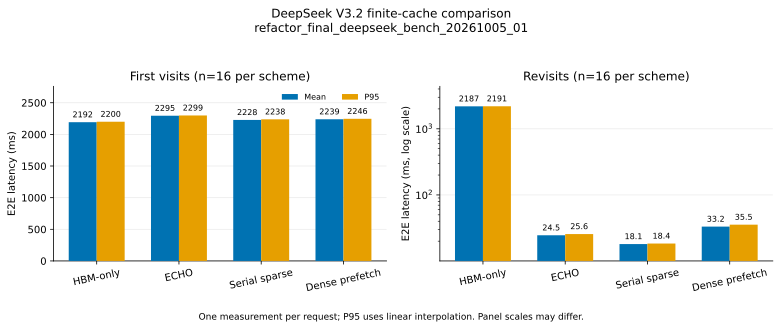
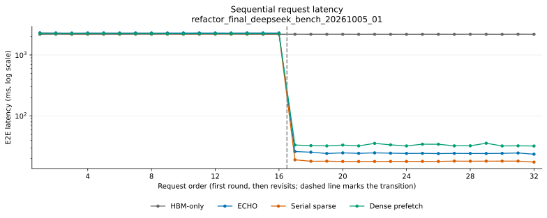

# DeepSeek V3.2 Motivation


本实验在相同 P/NH 容量下比较 HBM-only、ECHO、sparse fetch 和 dense prefetch，
观察固定历史复用、稀疏召回和完整历史预取对请求延迟、搬运量及内存占用的影响。
输入为 16 个用户顺序访问两轮，H=65,536、A=128、history chunk=1,024，
P=65,536、NH=16,777,216，seed=42。合成 token 和 checkpoint 工作负载替身
用于系统测量，尚不能说明真实 GR 任务质量或场景代表性。

独立数值验收 `refactor_final_deepseek_check_20261005_01` 已完成：128 份完整
candidate hidden/logits 输出通过验收，其中 96 组 offload/HBM 对照逐位一致。
三次正式运行分别为 `refactor_final_deepseek_bench_20261005_01`、
`refactor_final_deepseek_bench_20261005_02`、`refactor_final_deepseek_bench_20261005_03`；
诊断为 `refactor_final_deepseek_profile_20261005_01`。P0 与当前实现的输入、cache 计数和分配计量
一致；当前实现仍观察到 candidate、offload 复访、准入及清理阶段的延迟增加。
完整轨迹总时长略有下降，不能据此声称各阶段均无回归。

## 方案与测量边界

HBM-only 按 history token 配额 P 做 session LRU；当前 P 可保留一个用户。
三个 offload 方案在 DRAM 保留历史，每层用 P 槽缓存主 KV。ECHO 在已证明历史
全部驻留时使用 resident indexer，否则执行融合 indexer/prefetch 后精确 recall。
sparse fetch 在精确选择后串行召回 miss。dense prefetch 在独立 stream 提前搬入
下一层完整历史中的 miss，命中直接复用；逐层 pool 提供目标空间，不另分配完整
历史双 staging。该 dense 路径要求 H<=P，attention 仍消费相同稀疏选择。

四方案的 candidate 都在 GPU 临时执行，成功后丢弃，不写入 DRAM 或持久 history。
模型将 checkpoint 前三层独立复制为十个 dense block，每个副本重放相应 source
block 的 hidden/residual 输入。模型含 embedding、final norm、全部 candidate
hidden 和末 token LM head，共 7,827,793,408 个参数；它不代表经过训练的十层
模型或完整 DeepSeek V3.2。普通线性层使用 FP8，主 KV 为 BF16 的
512 latent + 64 RoPE record，每层每 token 1,152 B；indexer K/scales 保留在 HBM。

纯计算 CUDA Graph 覆盖 Q=128/1,024 的 projection 与 finish，cache 管理在图外
执行。重放次数、形状覆盖、eager fallback 及图内精度见 [来源审计](report/diagnosis/independent_provenance_audit.json)和[graph 归因复核](report/diagnosis/crosscheck.json)。
runner 创建时加载原生 CPU token validator，其二进制与编译依赖随执行身份保存。

每方案依次预热 user 0 首访、user 1 首访及 user 0 复访，覆盖历史构建、candidate
与 host recall；随后释放预热资源，从空缓存执行 32 条请求。check 保存全部输出，
bench 校验独立 receipt 后测量，不在样本间保存或比较完整输出。bench 每次独立
轨迹中每请求只测一次；三次独立轨迹分别保留，mean、median、p95 不跨运行混算。
尾分位数只描述这些样本。

同步墙钟包含输入验证与搬入、准入/淘汰、miss 时构建 history、candidate 和清理。
加载、编译、预热、图准备、计数 host 读取、输出保存和数值比较不计时。forward 内
原有 GPU 计数与归约仍计入延迟。candidate 的传输和命中计数在 history prefill 后
重置，不能解释为整请求流量。fixed P/NH 不另设 cache 字节子预算，也不扣除旧运行
观测到的占用差额。

## 正式结果与版本对照

下表为 `refactor_final_deepseek_bench_20261005_01` 的完整轨迹；全部三版本逐请求数据见
[request_samples.csv](report/three_version/request_samples.csv)。
总耗时为请求延迟之和，不含初始化和预热。

| 方案 | 首访均值 ms | 复访均值 ms | 复访 p95 ms | 32 请求总耗时 s | 复访历史命中 |
|---|---:|---:|---:|---:|---:|
| HBM-only | 2192.406 | 2187.398 | 2191.141 | 70.077 | 0/16 |
| ECHO | 2294.994 | 24.530 | 25.607 | 37.112 | 16/16 |
| Sparse fetch（serial_sparse） | 2228.258 | 18.084 | 18.406 | 35.941 | 16/16 |
| Dense prefetch | 2239.190 | 33.197 | 35.543 | 36.358 | 16/16 |





三种 offload 方案均命中全部 16 次复访历史，HBM-only 的 16 次复访均重建历史。 HBM-only 的复访如发生 history miss，
仍计为复访。复访中省去历史重建带来的端到端收益，不能直接解释为 attention 算子
或搬运重叠收益。ECHO 与 sparse fetch 的差异须结合精确选择、召回量和诊断证据分析。

三版本对照为 `refactor_final_deepseek_three_version_20261005_01`，保留旧发布、
三次冻结 P0 和三次当前运行，共七条轨迹的选定比较数据。发布前全部 896 条原始测量、receipt
及执行身份通过独立复核。旧发布采用验收与计时合并的流程，硬件和执行环境也与
P0/当前组不同，仅作历史描述。P0 与当前组的输入、GPU、CPU/NUMA、精度和计时
边界匹配。完整来源与数据见[三版本报告](report/three_version/results.md)和
[comparison.json](report/three_version/comparison.json)。

| 版本 | 运行 | 完整源码快照 SHA-256 |
|---|---|---|
| 旧发布 | `motivation_c10_20261004_u16_r2_01` | `11fc11b18b2e70baf450a82ab4fad66f2f8d4e22cda2e9f36bf74453a400df8f` |
| P0 | `refactor_p0_deepseek_bench_20261005_01` 至 `refactor_p0_deepseek_bench_20261005_03` | `d31a0ff6bde97acab24bb2f2c648e9d91ae46ba18f6c074b5f572cf49aaaab7a` |
| 当前 | `refactor_final_deepseek_bench_20261005_01` 至 `refactor_final_deepseek_bench_20261005_03` | `1319a540b7f78da9c363dd09c0f1568b450df3df5e4d3e8b60155a58c348b3dc` |

下表的 P0/当前数值是三次独立运行中“每次请求均值”的中位数，旧发布只有一次
轨迹。变化列只比较 P0 与当前，不把旧发布当作同条件性能基线。

| 指标 | 旧发布 ms | P0 ms | 当前 ms | 当前−P0 ms | P0 范围 ms | 当前范围 ms |
|---|---:|---:|---:|---:|---:|---:|
| HBM 首访 candidate extend | 10.596161 | 10.600519 | 10.718264 | +0.117745 | 0.016074 | 0.031974 |
| ECHO 复访请求 | 24.947221 | 24.128328 | 24.530059 | +0.401731 | 0.103185 | 0.080999 |
| Sparse fetch 复访请求 | 18.456172 | 17.762562 | 18.083835 | +0.321273 | 0.271310 | 0.044168 |
| Dense prefetch 复访请求 | 31.888811 | 32.123054 | 32.633588 | +0.510534 | 0.372216 | 0.600213 |

四项指标的 P0 与当前重复范围均不重叠；前三项增量超过两组各自的范围，dense
prefetch 的增量未超过当前组范围。逐个 request ID 对齐后，ECHO、sparse fetch、
dense prefetch 分别有 16/16、15/16、15/16 次复访的中位数增加；其中 7、12、8
个 request ID 的每个当前样本都高于每个 P0 样本。这些是三次重复中的剩余延迟
增加，尚不能给出统计置信度或确定原因。

八组“方案×首访/复访”的准入均值均增加 0.189032–0.490996 ms，清理均值均增加
0.036084–0.194572 ms，两类阶段的 P0/当前范围均不重叠。准入有六组、清理有
七组的中位数增量超过两组各自范围。清理阶段的 128/128 个匹配请求中位数增加，
124/128 个请求的全部当前样本都高于全部 P0 样本。已有 runtime/resource 检查
仍保留；这些观测本身不证明具体检查是增加的原因。

P0 与当前的完整轨迹总时长中位数分别为 179,493.801 和 179,330.893 ms，减少
162.908 ms（0.09076%）；两组范围分别为 110.319 和 249.918 ms，且相互重叠。
总时长包含远大于 candidate 的 history 构建阶段，不能用该下降掩盖上述复访或
candidate 增加。首访端到端均值的变化有正有负，仍受观测到的波动影响。

六次 P0/当前运行逐请求的输入、visit/hit 分类、P/NH、reservation/cache charge
及 candidate cache diagnostics 均一致，包括 H2D/D2H 和逐层记录；阶段耗时之和
等于请求墙钟时间。独立审计未发现数值、计量、契约或已采样进程归属方面的阻断
问题。各版本观测到的内存及 allocator 峰值分别保留，不能由 cache 计量一致推出
真实设备内存峰值相同。

三次运行的范围和 MAD 是本次观测的噪声尺度，不是允许回归的百分比或置信区间。
完整阶段、范围、MAD 和逐请求差值保留在对照数据中。当前 profile 已完成归因、数值与来源检查，但单次当前 profile 不能确定 P0/当前差异的原因。

## MFU 与流水线诊断

端到端 MFU 按实际有效矩阵 FLOPs 计算：分别用各精度的参考峰值换算理论时间，
求和后除以正式请求的同步墙钟时间。FP8、BF16、FP32 的参考峰值分别为
1,979、989.5、67 TFLOP/s，来源为 [NVIDIA H200 规格](https://www.nvidia.com/en-us/data-center/h200/)。
这是名义峰值归一化指标，不是实测 Tensor Core 指令利用率或 SM occupancy。
独立保存的峰值定义和来源见 [nominal_peaks.json](report/diagnosis/nominal_peaks.json)，不复用旧报告的性能数字。

| 方案 | 首访端到端 MFU | 复访端到端 MFU |
|---|---:|---:|
| HBM-only | 44.13% | 44.23% |
| ECHO | 42.15% | 9.16% |
| Sparse fetch | 43.42% | 12.42% |
| Dense prefetch | 43.20% | 6.77% |

HBM-only 的复访若重建 history，其计算量与只执行 candidate 的 offload 复访不同。
profile 每方案采集一次首访及第一轮完整用户访问后的第一次复访。四次 graph setup
单独采集，八次请求 capture 用于请求分析；中间请求用于恢复实际缓存状态。
80 份完整 profile/预热输出逐位一致。独立归因复核覆盖 45,933 次矩阵调用及对应主 kernel、195 组算子和 267,562 项 GPU 活动，并核验 6,560 次 graph replay。

矩阵 API MFU 使用各 API 归属 GPU 活动的时间并集之和作为分母，与端到端 MFU
分别报告。嵌套 CPU scope 时间不能相加；kernel duration sum、GPU 活动并集和
GPU envelope 也各有含义。跨运行的正式请求时间与 profile 时间不能相减后解释为
CPU 开销或可消除延迟。复访 profile 中，ECHO 与 sparse fetch 的矩阵 API 归属活动分别为 12.934 和 7.387 ms；ECHO 的范围包含融合 prefetch。该观测不能单独确定 P0/当前延迟增加的原因。

流水线诊断、算子 MFU、独立归属复核及聚合算术见 [诊断](report/diagnosis.md)、[算子 MFU](report/operator_mfu.md)、[归属复核](report/diagnosis/crosscheck.json)和[聚合算术](report/diagnosis/aggregate_arithmetic.json)。
分析保留无法归属的活动，核对矩阵工作、kernel 数量与时长，不能把缺失归属当成零耗时。
profile 的 formal reference 指向选定 bench，numerical reference 指向独立 check。

## Candidate 搬运与实际内存

| 方案 | 16 次复访 candidate H2D GiB | candidate D2H GiB |
|---|---:|---:|
| HBM-only | 0.000000 | 0.000000 |
| ECHO | 1.161186 | 0.000000 |
| Sparse fetch | 1.161186 | 0.000000 |
| Dense prefetch | 11.250000 | 0.000000 |

ECHO 与 sparse fetch 的 candidate H2D 总量相同；在这组输入和容量下，ECHO 的复访延迟更高。 ECHO 的精确消费并集驻留率在融合 prefetch 后采样，不能
据此声称请求开始时命中率更高。传输表不包含 history 构建流量。

| 方案 | allocated 峰值 GiB | reserved 峰值 GiB | 设备已用量采样最大 GiB | 请求边界 cache HBM 最大 GiB | cache DRAM 最大 GiB |
|---|---:|---:|---:|---:|---:|
| HBM-only | 14.517 | 23.635 | 24.376 | 6.624 | 0.000 |
| ECHO | 16.357 | 24.297 | 25.667 | 8.462 | 320.001 |
| Sparse fetch | 16.359 | 24.297 | 25.667 | 8.462 | 320.001 |
| Dense prefetch | 16.359 | 24.305 | 25.675 | 8.462 | 320.001 |

PyTorch 峰值在释放预热 cache 后重置，包含模型和正式执行。reserved 包含 allocator
保留的空闲缓存，不能与 allocated 相加。设备已用量由 total−free 得到，仅在边界
采样，不是连续峰值。cache 统计包括共享资源；图静态 tensor storage、实际 allocator
blocks、私有 reserved 和规划 reservation 分别记录，不能重复相加或把上限当实际分配。

十层 P 槽的主 KV 逻辑容量为 0.703125 GiB，NH 对应 180 GiB 逻辑 host KV。
本轮 16 个 history 共 11.25 GiB；NH 的配额相当于 256 个完整 history，但本实验
未验收承载 256 用户的完整物理容量。三种 offload 的 DRAM cache 计费最大值均为 320.001038 GiB，包含 pinned backing 与元数据。相同 P/NH 不代表相同总 HBM/DRAM 字节数。

## 验收、来源与运行方式

数值 check 的 receipt 位于
`docs/agents/acceptance/unified_runtime_20261005/deepseek_final/receipt.json`。
receipt 文件 SHA-256 为 `a25cc5d08891fd6811db232de0b862831b46702c1b2f3124b2921b611574c1b3`；
check 保存 132 项带签名的证据文件。验收覆盖全部 candidate hidden/logits、三次
预热及完整正常请求轨迹，不把失败注入、任务质量或未执行的容量轨迹包含在结论中。

check 的完整源码快照为 `1fc1cbaf7a97579f7094879938330a9933a82109909d2701a177e1653f0dc9f8`。
三次 bench 的完整源码身份均为
`1319a540b7f78da9c363dd09c0f1568b450df3df5e4d3e8b60155a58c348b3dc`；
profile 完整快照为 `cb9ae48c10127178c3bf06edbfb9c4052b11c63959507a15120a819bbcc526eb`。bench 与 check 的完整快照仅
`experiments/deepseek_v32_motivation/src/profile.py` 不同，该文件不在数值验收的
v2 执行源码集合内。receipt 使用该集合匹配数值路径；完整
快照额外包含 profile/报告工具，因此快照不同不必然意味着执行身份改变。复用 receipt
仍须通过实际输入、执行源码、backend/cache/graph、native、精度和环境校验。
checkpoint 身份使用路径、shard 大小和 mtime，不声称已 hash 全部权重。

平台与环境为 H200 / SM90 / 132 SM，PyTorch 2.12.1+cu130，CUDA 13.0；GPU UUID `80ff95c3-176e-fd8a-728f-9c5577c4a779`，CPU24–31，NUMA0，intraop=8、interop=96。测量窗口保存全部 GPU 的离散
进程观测，采样数、最大间隔及归属审计见 [run_acceptance.json](report/diagnosis/run_acceptance.json)；离散观测不能排除
采样间隙中的工作。check 中获准的其他 GPU 并行正确性工作不属于正式计时窗口。

从仓库根目录运行。下面是使用新 run ID 的入口示例；完整测量环境、CPU/NUMA
绑定和实际命令随各 run 保存。准备依赖见[第三方说明](../../3rdparty/README.md)。
本轮 P0/新实现对照使用以下环境。`TRITON_PTXAS_BLACKWELL_PATH` 固定依赖的
工具链配置，不表示已在 Blackwell 上验证。

```bash
export PATH="$PWD/.venv/bin:/usr/local/cuda/bin:/usr/local/bin:/usr/bin:/bin"
export CXLDSAGR_SM90_BACKEND=native
export OMP_NUM_THREADS=8 MKL_NUM_THREADS=8 OPENBLAS_NUM_THREADS=8
export PYTHONDONTWRITEBYTECODE=1
export PYTORCH_ALLOC_CONF=backend:native,pinned_use_cuda_host_register:True,pinned_num_register_threads:8
export TRITON_PTXAS_BLACKWELL_PATH=/usr/local/cuda/bin/ptxas
unset TRITON_PTXAS_PATH PYTORCH_CUDA_ALLOC_CONF PYTORCH_HIP_ALLOC_CONF
unset GOMP_CPU_AFFINITY KMP_AFFINITY OMP_PLACES OMP_PROC_BIND FLASHINFER_DISABLE_JIT

CUDA_VISIBLE_DEVICES=3 numactl --physcpubind=24-31 --membind=0 \
  .venv/bin/python -B -m experiments.deepseek_v32_motivation.src.measure \
  --mode check --run-id motivation_check_new --compute-graphs \
  --output-dir /tmp/cxldsagr-checks/deepseek_v32_motivation/motivation_check_new

CUDA_VISIBLE_DEVICES=3 numactl --physcpubind=24-31 --membind=0 \
  .venv/bin/python -B -m experiments.deepseek_v32_motivation.src.measure \
  --mode bench --run-id motivation_bench_new --compute-graphs \
  --validation-receipt /tmp/cxldsagr-checks/deepseek_v32_motivation/motivation_check_new/receipt.json

CUDA_VISIBLE_DEVICES=3 numactl --physcpubind=24-31 --membind=0 \
  env PATH=/usr/local/cuda/bin:/usr/local/bin:/usr/bin:/bin \
  bash experiments/deepseek_v32_motivation/scripts/profile.sh \
  --run-id motivation_profile_new \
  --reference-run experiments/deepseek_v32_motivation/output/data/motivation_bench_new
```

check 默认保存在系统临时目录，bench 数据及源码
快照位于 `output/data/<run_id>/`，日志位于 `output/log/<run_id>/`，原始 Nsight
文件位于 `output/profile/<profile_run_id>/`。报告由 `src.report`、`src.plot` 和
匹配的诊断分析生成；receipt 迁移须保持原字节及全部证据哈希，并使用报告支持的
重定位参数。结果、来源和发布清单见 [正式结果](report/results.md)、[完整汇总](report/summary.json)和[发布清单](report/publication_manifest.json)。

旧完整运行、profile 和 FLOPs 已在本次新报告验收后清理；[保留范围](report/three_version/retirement.json)只支持选定对照算术与身份追溯，不支持完整历史源码、native 或数值重审。P0 与当前三次控制运行继续保留。

测量时源码、原分析生成器与发布时辅助文件分别绑定，见 [source_bindings.json](report/source_bindings.json)和[helper 清单](report/report_helper_sources.json)。发布时的辅助快照只记录当时磁盘上的已加载模块；它不替代原测量或早先分析的源码身份。
