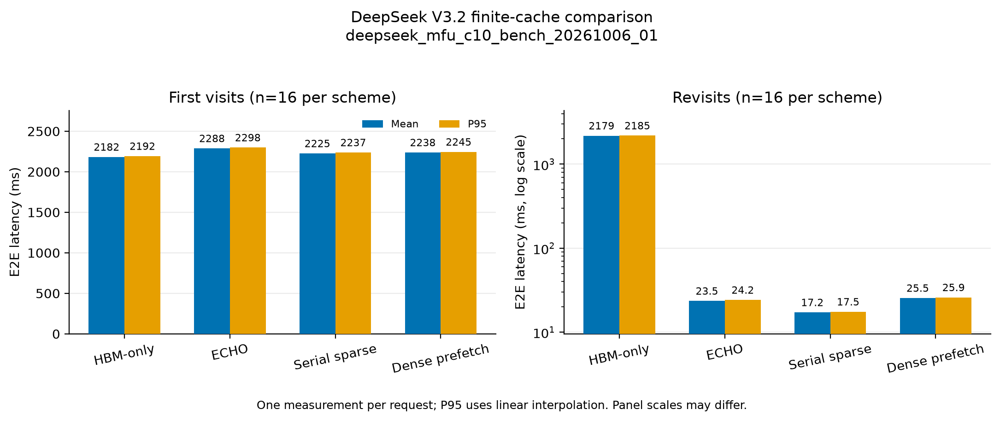
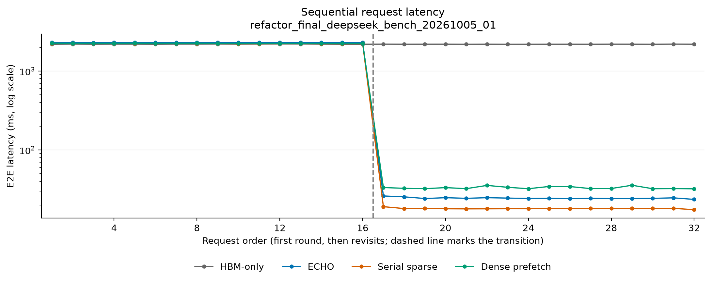

# DeepSeek V3.2 Motivation

本实验在相同 P/NH 容量下比较 HBM-only、ECHO、sparse fetch 和 dense prefetch。
本目录属于论文 motivation 实验。当前入口分为独立 `check`、`bench` 和 `profile`；
默认 `bench` 要求匹配的验收收据，不再逐请求复制、比较或保存完整输出。
**新入口尚未运行 GPU 实验**；下文 run ID、性能数字和报告仍对应原来的测量流程，
本次整理没有重跑或替换它们。

正式运行 `motivation_c10_20261004_u16_r2_01` 的 128 份完整输出已通过独立验收，
96 组 offload/HBM 对照逐位一致。首访端到端 MFU 为 42.37%–44.44%；
ECHO、sparse fetch、dense prefetch 的复访均值分别为 24.95、18.46、31.89 ms。

匹配 profile `motivation_c10_profile_20261004_01` 已通过数值、来源与 GPU 活动归属
核验。首访 API MFU 为 53.38%–56.18%；诊断采样及其边界见
[流水线诊断](report/diagnosis.md)与[算子 MFU](report/operator_mfu.md)。

输入为 16 个用户按相同顺序访问两轮，history=65,536、candidate=128、history
prefill chunk=1,024；P=65,536、NH=16,777,216。NH 的 host-page 配额相当于
256 个完整 history；本轮只访问指定的 16 个用户，未验收承载 256 个用户所需的
完整物理容量。

## 方案与测量边界

HBM-only 按独立 HBM history token 配额 P 做 session LRU，本轮可保留一个用户。
三个 offload 方案使用相同 P/NH 设置，DRAM 保留历史，逐层 P 槽缓存主 KV。
ECHO 在 history 全驻留已获证明时使用 resident indexer；否则执行融合
indexer/prefetch，再做精确 recall。sparse fetch 在精确选择后串行召回 miss。
dense prefetch 在独立 stream 提前搬入下一层完整历史中的 miss，命中直接复用；
每层 pool 提供独立目标，不另分配两层完整 staging。该 dense 路径要求 H<=P，
attention 仍消费相同的稀疏选择。

四方案的 candidate 都一次整批在 GPU 临时执行，结束后丢弃，不写入 DRAM 或持久
history。模型是 checkpoint 前三层独立复制出的十个 dense block 工作负载替身，
每个副本使用相应 source block 的 hidden/residual 输入；包含 embedding、final
norm、全部 candidate hidden 与末 token LM head，共 7,827,793,408 个参数。
它不代表经过训练的十层模型或完整 DeepSeek。线性层使用 FP8 后端，主 KV 为 BF16
的 512 latent + 64 RoPE record，每层每 token 1,152 B；indexer K/scales 保留在 HBM。

本轮显式启用纯计算 CUDA Graph，覆盖 Q=128/1,024 的 projection 和 finish，cache
管理仍在图外执行。四方案共完成 104,960 次重放，没有 eager fallback。原生 CPU
token 扫描在 runner 创建时加载；普通 runner 默认验证方式不因此改变。主 MLA
RoPE 直接写入最终输出布局，保留 FP32 residual/norm 运算与精确选择语义。

每方案依次预热 user 0 首访、user 1 首访和 user 0 复访，覆盖历史构建、候选执行与
DRAM miss 补回；随后释放全部 session/shared cache，从独立空缓存开始正式的
32 条请求。每请求测量一次，报告均值、median、p95 和总时长；尾分位数只描述本轮
样本。同步墙钟时间包含输入验证与搬入、准入/淘汰、miss 时构建 history、candidate
执行与清理。模型加载、三次预热、计算图准备、输出保存、诊断读取和逐位比较不计时。
所有方案使用同一份合成 GR token 内容，seed=42。

传输与 token 命中计数只覆盖 candidate forward；history prefill 的计数在候选开始
前重置，不能把这些字节当作整请求流量。CUDA allocated/reserved 峰值在释放预热
cache 后重置，包含模型、共享资源和完整正式轨迹；设备 free 仅在边界采样。
固定 P/NH 不设 cache 字节子预算，也不扣除旧轨迹的经验性占用差额。

平台为单卡 SM90、132 SM；PyTorch 显示 NVIDIA H200，nvidia-smi 显示 M403，
同一设备可见 HBM 为 139.81 GiB。环境为 Python 3.12.13、PyTorch 2.12.1+cu130、
CUDA 13.0，使用 DeepGEMM 2.8.1（`057ca596`）和 FlashMLA `ba89a346`。
CUDA matmul TF32 关闭；具体安装文件、JIT 产物、编译器与源码身份随运行保存。

## 运行方式

从仓库根目录运行。先独立验收，再引用收据测量性能；同一实现和输入的收据可复用。
两个阶段使用不同 run ID；`--compute-graphs` 必须显式传入。下列命令本次未执行：

```bash
export CUDA_VISIBLE_DEVICES=0
export TRITON_PTXAS_PATH="$PWD/.venv/lib/python3.12/site-packages/triton/backends/nvidia/bin/ptxas"
export TRITON_PTXAS_BLACKWELL_PATH=/usr/local/cuda/bin/ptxas
bash experiments/deepseek_v32_motivation/scripts/run.sh \
  --mode check --run-id motivation_c10_check --compute-graphs

bash experiments/deepseek_v32_motivation/scripts/run.sh \
  --mode bench --run-id motivation_c10_reproduce --compute-graphs \
  --validation-receipt "${TMPDIR:-/tmp}/cxldsagr-checks/deepseek_v32_motivation/data/motivation_c10_check/receipt.json"
```

匹配 profile 可使用独立 check 目录、带收据的 bench 或已验收的历史运行作为参考：

```bash
CUDA_VISIBLE_DEVICES=0 \
TRITON_PTXAS_PATH="$PWD/.venv/lib/python3.12/site-packages/triton/backends/nvidia/bin/ptxas" \
TRITON_PTXAS_BLACKWELL_PATH=/usr/local/cuda/bin/ptxas \
bash experiments/deepseek_v32_motivation/scripts/profile.sh \
  --run-id motivation_c10_profile_reproduce \
  --reference-run experiments/deepseek_v32_motivation/output/data/motivation_c10_20261004_u16_r2_01
```

测量入口 `src.measure` 调用 `models/deepseek_v32/serving_backend.py`、
`models/deepseek_v32/compute_graphs.py`、`serving/persistent.py`、
`cache/prefix_pool.py`、`cache/sparse_token_pool.py` 和
`models/deepseek_v32/pool_prefetch.py`。输入与来源采集复用
`GR.workload` 与 `evaluation.provenance`，内存边界采样复用
`experiments.deepseek_v32_echo_cache.src.capacity_probe`。check 对全部 candidate
hidden/logits 与独立空 cache 的 HBM-only 相同请求输出逐位比较，并验收完整请求轨迹的
正常 cache 生命周期。check 默认保存在系统临时目录中的 `cxldsagr-checks/`，不生成性能报告。
收据匹配源码、输入、P/NH、backend、计算图、native、精度和执行环境；checkpoint 仍以
路径、大小与 mtime 标识，不声称已 hash 全部权重。运行时 finite、repair、事务、allocator
检查及必要同步均保留。失败注入和任务质量不属于该数值验收的结论。

bench 原始数据和源码快照位于 `output/data/<run_id>/`，不含逐请求输出 tensor；stdout/stderr
位于 `output/log/<run_id>/`；原始 Nsight 文件位于 `output/profile/<profile_run_id>/`。
`src.report` 对新 bench 核验外部收据，对历史运行仍核验保存输出和来源。
`src.plot` 根据逐请求数据生成图表；以下旧 run ID 保留原始边界：

```bash
python -m experiments.deepseek_v32_motivation.src.report \
  --run-dir experiments/deepseek_v32_motivation/output/data/motivation_c10_20261004_u16_r2_01 \
  --output-dir /tmp/motivation_c10_report
python -m experiments.deepseek_v32_motivation.src.plot \
  --run-dir experiments/deepseek_v32_motivation/output/data/motivation_c10_20261004_u16_r2_01 \
  --output-dir /tmp/motivation_c10_report
```

## 结果

正式 run ID 为 `motivation_c10_20261004_u16_r2_01`，执行源码清单 SHA-256 为
`11fc11b18b2e70baf450a82ab4fad66f2f8d4e22cda2e9f36bf74453a400df8f`。
四方案各完成 32 条请求。总耗时是端到端请求延迟之和，不含初始化和预热。

| 方案 | 首访均值 ms | 复访均值 ms | 复访 p95 ms | 32 请求总耗时 s | 复访历史命中 |
|---|---:|---:|---:|---:|---:|
| HBM-only | 2176.89 | 2170.24 | 2178.39 | 69.554 | 0/16 |
| ECHO | 2283.43 | 24.95 | 25.51 | 36.934 | 16/16 |
| Sparse fetch（serial_sparse） | 2217.74 | 18.46 | 19.21 | 35.779 | 16/16 |
| Dense prefetch | 2233.84 | 31.89 | 32.28 | 36.252 | 16/16 |





P 恰好容纳一个用户的完整历史。HBM-only 在顺序遍历 16 个用户时不断淘汰，第二轮
仍须重建全部历史；三个 offload 方案在 DRAM 保留全部 16 个用户，复访只需执行
candidate。复访的大幅加速主要来自省去历史重建，不能据此单独判断搬运与计算的
重叠收益。sparse fetch 的复访均值最低；本轮 ECHO 尚未显示相对它的延迟优势。
各阶段分布、逐请求数据和分位数见[详细报告](report/results.md)与
[per_request.csv](report/per_request.csv)。

### 首访开销、MFU 与流水线诊断

端到端 MFU 按有效矩阵 FLOPs 和对应精度峰值计算，分母为正式请求的同步墙钟时间。
参考峰值为 FP8 1,979、BF16 989.5、FP32 67 TFLOP/s；各精度理论时间先求和再除以
实测时间。它不是硬件指令 MFU 或 SM occupancy。

| 方案 | 首访端到端 MFU | 复访端到端 MFU |
|---|---:|---:|
| HBM-only | 44.44% | 44.58% |
| ECHO | 42.37% | 9.00% |
| Sparse fetch | 43.62% | 12.17% |
| Dense prefetch | 43.31% | 7.04% |

HBM-only 的复访仍包含完整 history 构建，其他三方案的复访只执行 candidate，
因此两类复访的计算量不同。匹配 profile 每方案只采集一次首访和一次复访，
API MFU 分母为各矩阵 API 的 GPU 活动时间并集之和。首访 API MFU 为
53.38%–56.18%，不等于正式请求的端到端 MFU；不能把跨运行时间相减解释为
CPU 开销或可消除延迟。GPU 区间、选择与搬运成本见[流水线诊断](report/diagnosis.md)。

## Candidate 阶段搬运

| 方案 | 16 次复访 H2D 总量 GiB | candidate D2H 总量 GiB |
|---|---:|---:|
| HBM-only | 0 | 0 |
| ECHO | 1.161186 | 0 |
| Sparse fetch | 1.161186 | 0 |
| Dense prefetch | 11.250000 | 0 |

ECHO 和 sparse fetch 的 H2D 均为 1,246,814,208 B，dense 为其 9.688 倍。
dense 首访 candidate 直接复用刚构建的完整历史；复访时，该用户的历史已被其他
用户挤出 P 槽，每层补回 65,536 条记录，attention 消费的仍是相同稀疏选集。
三种 offload 首访的 candidate H2D 都为零，这不包含 history 构建流量。

ECHO 的精确消费并集驻留率在融合 prefetch 之后采样，不能用它与 sparse fetch
的差值声称请求开始时命中率更高或搬运量更少。

## 实际内存与验收

| 方案 | CUDA allocated 峰值 GiB | reserved 峰值 GiB | 设备已用量采样最大值 GiB | 请求边界 cache HBM 最大值 GiB | cache DRAM 最大值 GiB |
|---|---:|---:|---:|---:|---:|
| HBM-only | 14.517 | 23.635 | 24.376 | 6.624 | 0 |
| ECHO | 16.357 | 24.297 | 25.667 | 8.462 | 320.001 |
| Sparse fetch | 16.359 | 24.297 | 25.667 | 8.462 | 320.001 |
| Dense prefetch | 16.359 | 24.305 | 25.675 | 8.462 | 320.001 |

相同 P 只固定历史主 KV 槽数，不代表相同总 HBM 字节数。CUDA 峰值包含模型与执行
临时空间；请求边界 cache 统计包括共享资源，计算图按实际静态 allocator block
分配与观测到的私有 reserved 计入。allocated 是活跃分配，reserved 还包含 allocator 保留的空闲缓存，两者不能相加，也不是事先
扣除的预算。设备已用量由总量减去 free 得到，表中数值取每方案 64 次请求前后
观测的最大值，不是连续测得的峰值。每方案观测到的计算图私有 reserved 为
5,603,590,144 B；它与规划时选择的上限、显式静态 tensor storage 分开记录，不能当作所有未来运行的固定开销。

十层 P 槽的历史主 KV 共 0.703125 GiB。NH 对应 180 GiB 逻辑 host KV 容量；
每层 18 GiB pinned 分配按 32 GiB 档位分配，十层实际 backing 为 320 GiB，
再加页表等 metadata 后得到表中数值。此次填入的 16 个 history 共 11.25 GiB。
dense 复用逐层 pool，没有另分配完整历史双 staging。

128 条请求的全部 candidate hidden 与末 token logits 均保存并重新核验，96 条
offload 输出与对应 HBM-only 输出逐位一致。三种 offload 的最后一次预热均确认
存在 host recall；全部请求的 candidate host 写入为零，结束后只保留
65,536-token history。独立检查还覆盖 session LRU、全部重放、256 份请求边界
内存观测，以及实际加载的 native/Triton 源码、编译器和二进制身份。

来源、数值检查与预热记录见 [report_provenance.json](report/report_provenance.json)
和 [summary.json](report/summary.json)。这些结果只覆盖本次合成输入、十 block
checkpoint 工作负载替身与 16 用户两轮轨迹，不说明真实推荐质量或完整模型性能。

所选文件与来源 SHA-256 见 [publication_manifest.json](report/publication_manifest.json)。
