# DeepSeek V3.2 Motivation

本实验属于论文 motivation。在固定 P/NH 配额下比较 HBM-only、ECHO、sparse fetch 和 dense prefetch，观察历史长度与 candidate 长度怎样影响历史复用、请求延迟、candidate 搬运和内存占用。合成请求与 checkpoint 工作负载替身用于系统测量，尚未建立真实 GR 任务质量或场景代表性。

本轮批次为 `deepseek_motivation_matrix_20261007_01`，完成 H=[4,096,16,384,65,536] × A=[128,256,512,1024] 的 12 点矩阵。每点独立数值验收后测量四方案各 32 个请求，完整计时共 1,536 个请求。每个请求只测一次，首访和复访各含 16 个用户样本；p95 描述这 16 个样本，不是重复运行的置信区间。

按本次轨迹的复访均值排序，最低值分布为HBM-only 4 点、Sparse fetch 2 点、Dense prefetch 6 点。ECHO 的复访均值在 0/12 点低于 sparse fetch。两者的复访 candidate H2D 在 12/12 点相同。在 sparse fetch 的复访 H2D 非零的 8 点，dense 的 payload 为它的 1.832–9.688 倍。这些比较只描述本轮测量，不建立重复运行的稳定排序或单项优化的因果收益。

同一点的四方案使用相同请求。跨 A 按相同生成规则和 seed 重新生成 candidate，candidate 内容不保证前缀嵌套；跨点差值不能视为只改变长度的严格因果对照。

## 工作负载与计时边界

P=65,536、NH=16,777,216，16 个用户按固定顺序访问两轮，history chunk=1,024，seed=42。HBM-only 按 P 个 history token 做 session LRU，H=4K/16K/64K 时分别可保留 16/4/1 个历史。本轮 H4K 的 HBM 复访命中为 16/16，H16K、H64K 均为 0/16；三个 offload 方案在各点均为 16/16。缓存 miss 的复访仍计为复访。相同 token 配额不等于相同物理内存占用，保留在 DRAM 的历史也不等于主 KV 全部驻留 HBM。

每方案先访问 `min(16, floor(P/H)+1)` 个不同用户，再复访第一个用户。H4K/16K/64K 对应每方案 17/6/3 次预热，随后释放预热 cache，从空 cache 开始正式轨迹。HBM 配额可容纳全部历史时不人为制造 miss；dense 的连续槽位复用仍按实际搬运计费。

同步墙钟包含输入验证与搬入、准入/淘汰、miss 时的 history 构建、candidate 执行和请求清理。权重加载、编译、图准备、预热、计数的 host 读取、输出保存和逐元素数值比较不计时；forward 内的运行检查及必要同步仍计入。独立 check 保存全部输出，bench 核对匹配 receipt 后计时，不在样本间复制或比较完整输出。完整 trace 耗时为每方案 32 个请求墙钟之和。

模型将真实 checkpoint 前三层独立复制为十个 dense block，source 顺序为 `[0,1,2,0,1,2,0,1,2,0]`，各副本使用相应 source 的 hidden/residual 输入，包含 embedding、final norm、全部 candidate hidden 和末 token LM head。这是 C10 checkpoint 工作负载替身，不代表训练得到的十层模型或完整 DeepSeek V3.2。普通线性层使用 FP8；主 KV 为 BF16 512 latent + 64 RoPE，每层每 token 1,152 B；indexer K 与 scale 常驻 HBM。

计算图策略为 `deepseek-compute-islands-v4-bound-inputs`，只捕获 projection/finish，cache 事务、选择、attention 与 IO 留在图外。A=1024 与 history chunk 共用一个 query 形状，其他 A 使用两个形状；全部 replay 与零 eager fallback 已验收。这不是完整 extend 图。ECHO 在历史全部驻留时走 resident indexer，否则融合 indexer/prefetch 后精确召回 miss；sparse fetch 在精确选择后串行召回。Dense 用独立 stream 的 `cudaMemcpyAsync` 预取下一层完整历史，attention 仍使用相同稀疏选择。四方案均临时执行 candidate，成功后 discard，不追加持久 history 或写回 DRAM。

## 计算与 fetch 示意

ECHO 在本层 indexer 中融合部分历史 KV 的预取，随后执行精确 top-k，并取回仍缺失的选中 KV；serial_sparse 在精确 top-k 后才 fetch；dense_prefetch 用独立 DMA stream 预取下一层的完整历史，使其有机会与本层计算重叠。三个方案都使用 sparse attention。

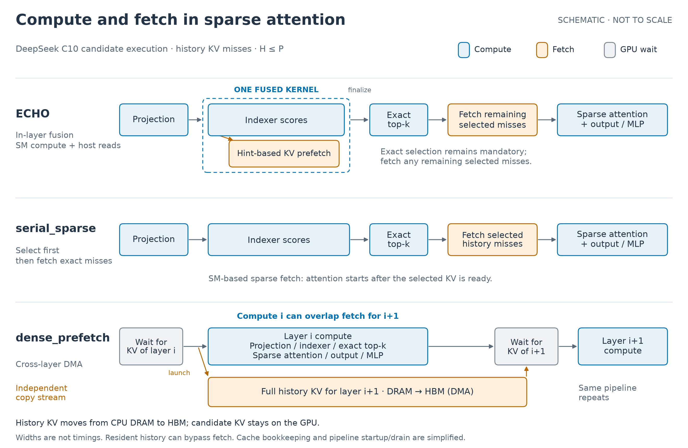

图对应存在历史 KV miss、H≤P 的 C10 候选路径。Dense 在每层计算前等待该层 KV 就绪；ECHO 和 serial 的 sparse fetch 由 SM 读取 pinned host memory。框宽和重叠位置只表示依赖关系，不表示实测耗时或隐藏比例；已驻留历史可以跳过搬运，candidate KV 留在 GPU。下载 [SVG](report/compute_fetch_schematic.svg) / [PDF](report/compute_fetch_schematic.pdf)，实现依据见[示意图来源](report/compute_fetch_provenance.json)。绘图 run 为 `deepseek_motivation_compute_fetch_20261007_03`，未新增 GPU 测量。

## H64K/A128 的计算时间占比

在已验收单点 profile 的 HBM-only 复访 candidate 中，按下述四类口径归并辅助操作后，Indexer 占 GPU kernel 时间的 41.83%，Attention 占 14.70%，合计 **56.53%**。单根竖向堆叠条展示四类占比，右侧括号标出 Attention + Indexer 的合计占比；图中使用大字标签，不加小字说明。统计覆盖十个 C10 block 的 candidate 计算，以及 embedding、LM head 和辅助操作；646 个 kernel 的时长总和为 9.193091 ms，四类合计 100%。

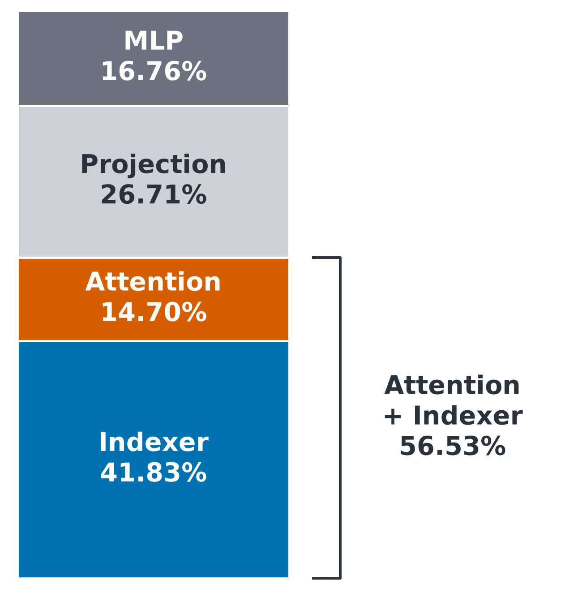

| 分组 | GPU kernel 时间（ms） | 占比 |
| --- | ---: | ---: |
| Indexer | 3.845120 | 41.8262% |
| Attention | 1.351331 | 14.6994% |
| Projection | 2.455713 | 26.7126% |
| MLP | 1.540927 | 16.7618% |

Indexer 包含打分、精确 top-k、indexer RoPE、index LayerNorm 及前后类型转换、index record 量化与 head-weight 缩放。Attention 包含 MLA 和 MLA RoPE。MLP 包含 gate/up/down、SiLU，以及 finish graph 中的 post-attention norm。

Projection 保留全部输入/输出投影 API：indexer Q/K/weight、主 attention Q/KV/O、Q 吸收与 V 展开；同时归入共享位置与 trig table 准备、input/Q/K norm、KV 布局，以及输入校验、embedding、final norm 和 LM head。因此这里的 Projection 是包含请求两端准备的统计分组，不仅指线性 kernel。各线性 API 内的量化、归约仍随该 API 计入，不重复统计。

Index LayerNorm 前的 FP32 转换与后的 BF16 转换，按每层实际 kernel 的 `index_k_proj → cast → LayerNorm → cast` 邻接关系核对，避免混入同名的位置或 head-weight 转换。[分组数据](report/compute_share_data.csv)和[阶段明细](report/compute_share_stages.csv)记录四类及排除项；绘图脚本遇到无法唯一归属的 kernel 会直接报错。

来源为 `deepseek_motivation_rerun_profile_20261006_01` 的 HBM-only request 16，仅筛选 candidate 段，不计该请求的 history 重建。分母为全部 candidate kernel 的时长之和，排除 63 次 memcpy 和 1 次 memset，共 0.130080 ms；不计 CPU 开销和 kernel 间空隙。这是一次带 instrumentation 的 profile，不是 FLOPs 占比、端到端延迟占比或新矩阵的匹配 profile。HBM candidate 没有历史 KV fetch，避免了 ECHO 融合 kernel 中计算与搬运无法分拆的问题。

下载 [SVG](report/compute_share_h64k_a128.svg) / [PDF](report/compute_share_h64k_a128.pdf)，来源与复算口径见[绘图记录](report/compute_share_provenance.json)。CPU 分析与绘图 run 为 `deepseek_motivation_compute_share_20261007_05`，未新增 GPU 测量。

## 复访延迟

表中为 16 次复访的均值，单位 ms。

| H | A | HBM-only | ECHO | Sparse fetch | Dense prefetch | 数据 |
| ---: | ---: | ---: | ---: | ---: | ---: | --- |
| 4,096 | 128 | 9.691 | 12.472 | 10.217 | 10.543 | [分组](report/points/h4096_a128/summary.csv) / [请求](report/points/h4096_a128/per_request.csv) / [内存](report/points/h4096_a128/memory.csv) |
| 4,096 | 256 | 12.198 | 13.911 | 12.547 | 12.449 | [分组](report/points/h4096_a256/summary.csv) / [请求](report/points/h4096_a256/per_request.csv) / [内存](report/points/h4096_a256/memory.csv) |
| 4,096 | 512 | 17.879 | 19.762 | 18.152 | 17.978 | [分组](report/points/h4096_a512/summary.csv) / [请求](report/points/h4096_a512/per_request.csv) / [内存](report/points/h4096_a512/memory.csv) |
| 4,096 | 1024 | 29.655 | 32.160 | 30.073 | 29.860 | [分组](report/points/h4096_a1024/summary.csv) / [请求](report/points/h4096_a1024/per_request.csv) / [内存](report/points/h4096_a1024/memory.csv) |
| 16,384 | 128 | 453.310 | 14.298 | 12.438 | 10.742 | [分组](report/points/h16384_a128/summary.csv) / [请求](report/points/h16384_a128/per_request.csv) / [内存](report/points/h16384_a128/memory.csv) |
| 16,384 | 256 | 456.245 | 16.942 | 15.465 | 13.543 | [分组](report/points/h16384_a256/summary.csv) / [请求](report/points/h16384_a256/per_request.csv) / [内存](report/points/h16384_a256/memory.csv) |
| 16,384 | 512 | 459.982 | 24.209 | 21.925 | 19.790 | [分组](report/points/h16384_a512/summary.csv) / [请求](report/points/h16384_a512/per_request.csv) / [内存](report/points/h16384_a512/memory.csv) |
| 16,384 | 1024 | 477.307 | 39.558 | 35.209 | 32.815 | [分组](report/points/h16384_a1024/summary.csv) / [请求](report/points/h16384_a1024/per_request.csv) / [内存](report/points/h16384_a1024/memory.csv) |
| 65,536 | 128 | 2163.207 | 21.038 | 15.772 | 19.784 | [分组](report/points/h65536_a128/summary.csv) / [请求](report/points/h65536_a128/per_request.csv) / [内存](report/points/h65536_a128/memory.csv) |
| 65,536 | 256 | 2165.339 | 24.310 | 18.987 | 20.040 | [分组](report/points/h65536_a256/summary.csv) / [请求](report/points/h65536_a256/per_request.csv) / [内存](report/points/h65536_a256/memory.csv) |
| 65,536 | 512 | 2179.869 | 37.170 | 27.968 | 26.989 | [分组](report/points/h65536_a512/summary.csv) / [请求](report/points/h65536_a512/per_request.csv) / [内存](report/points/h65536_a512/memory.csv) |
| 65,536 | 1024 | 2193.369 | 62.521 | 46.077 | 44.501 | [分组](report/points/h65536_a1024/summary.csv) / [请求](report/points/h65536_a1024/per_request.csv) / [内存](report/points/h65536_a1024/memory.csv) |

H16K/H64K 的 offload 复访省去了 history 重建；与 HBM 的延迟差值包含这部分工作，不能直接解释为 attention 加速或搬运重叠收益。H4K 下 HBM 能保留全部 16 个历史，应结合该点的 candidate 成本解释结果。

## 首访与完整轨迹

下表为每方案 32 个请求的完整 trace 总耗时，单位 s。首访占一半，完整 trace 的排序不能由复访排序代替。

| H | A | HBM-only | ECHO | Sparse fetch | Dense prefetch |
| ---: | ---: | ---: | ---: | ---: | ---: |
| 4,096 | 128 | 1.919 | 1.994 | 1.930 | 1.942 |
| 4,096 | 256 | 1.983 | 2.058 | 2.009 | 2.000 |
| 4,096 | 512 | 2.165 | 2.235 | 2.190 | 2.180 |
| 4,096 | 1024 | 2.560 | 2.623 | 2.588 | 2.583 |
| 16,384 | 128 | 14.492 | 7.541 | 7.505 | 7.473 |
| 16,384 | 256 | 14.577 | 7.620 | 7.590 | 7.560 |
| 16,384 | 512 | 14.709 | 7.850 | 7.808 | 7.765 |
| 16,384 | 1024 | 15.253 | 8.323 | 8.237 | 8.205 |
| 65,536 | 128 | 69.261 | 35.280 | 35.138 | 35.204 |
| 65,536 | 256 | 69.335 | 35.322 | 35.174 | 35.251 |
| 65,536 | 512 | 69.736 | 35.710 | 35.570 | 35.542 |
| 65,536 | 1024 | 70.284 | 36.403 | 36.133 | 36.136 |

## 按 candidate 长度比较复访

每个 A 保留两张独立图片，均只展示 16 次复访的平均延迟，每张 PNG 只有一个坐标图。横轴为 History（4K、16K、64K，K=1,024），按 log2 尺度排列。HBM-only 与三个 offload 方案的对比图使用对数纵轴；仅含三个 offload 方案的图使用从零开始的线性纵轴，便于查看它们之间的差异。不同图片的纵轴范围按数据设置。

本轮 12 个点中，ECHO 的复访均值均高于 sparse fetch；dense 与 sparse 的排序随 H/A 改变。

### A = 128

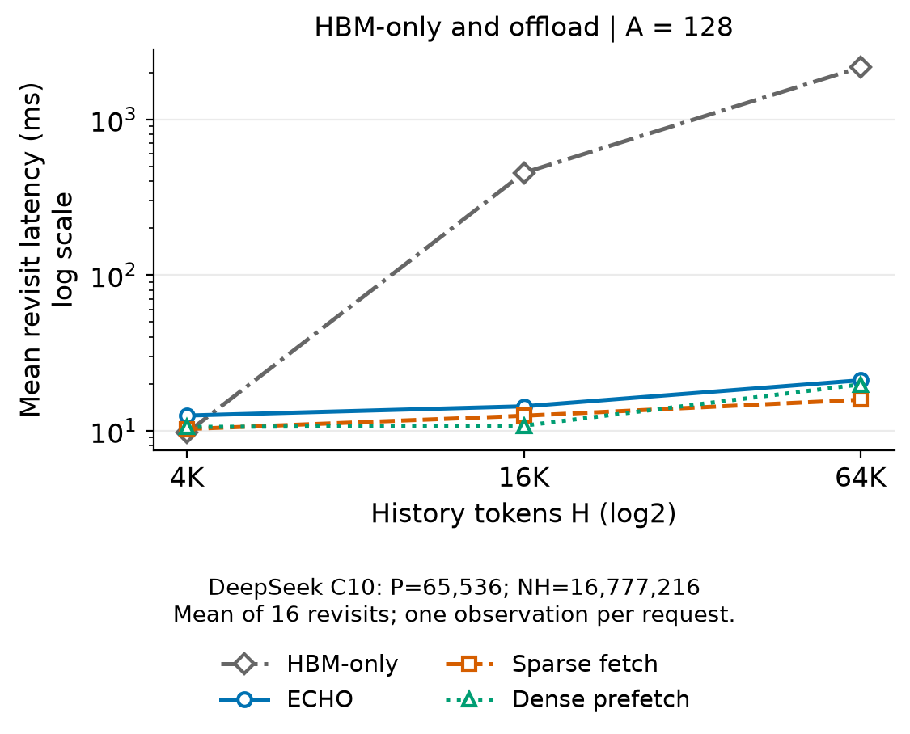

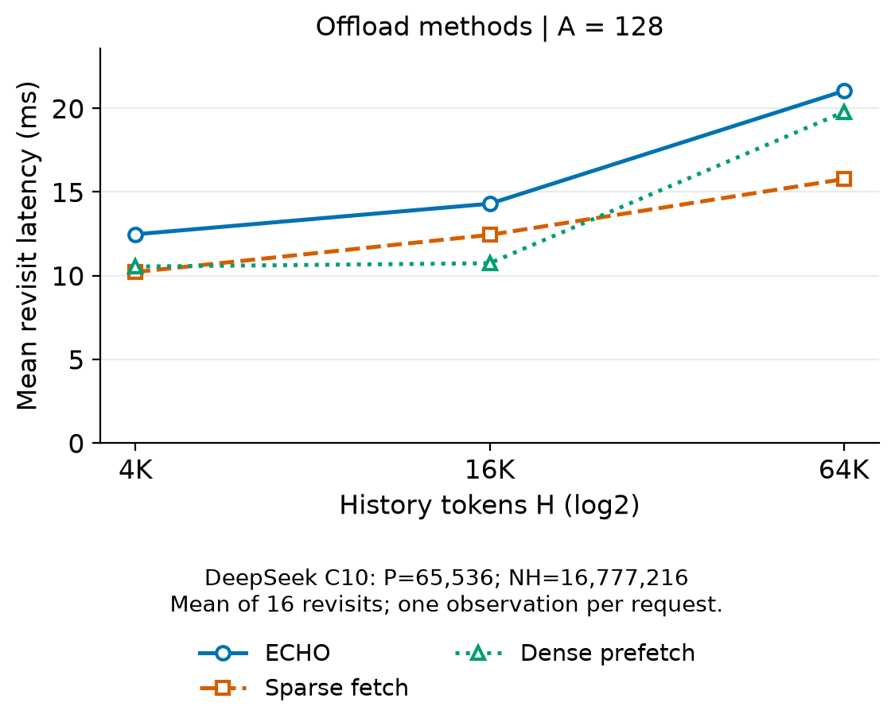

### A = 256

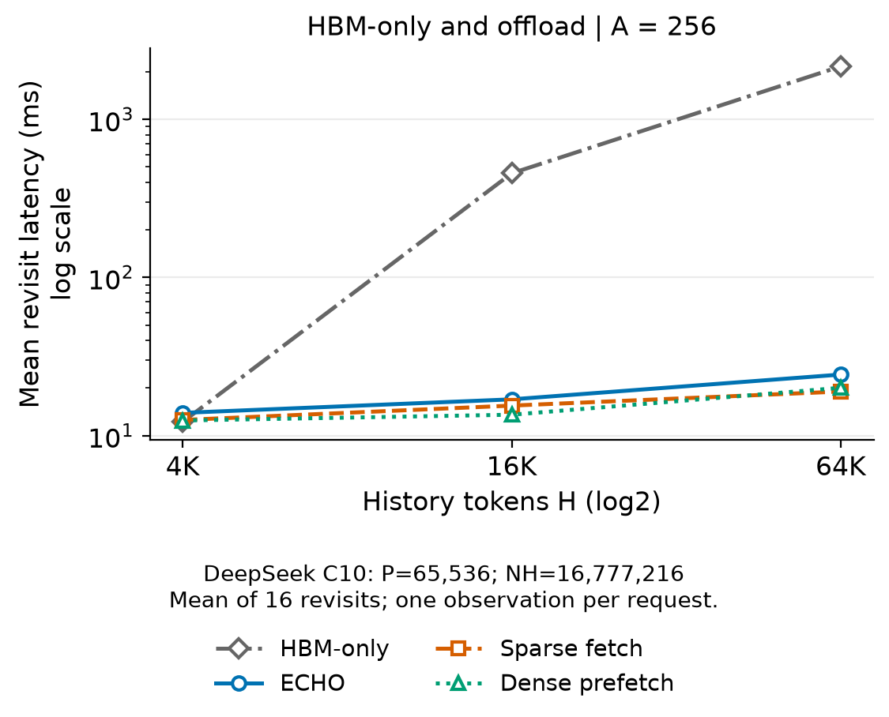

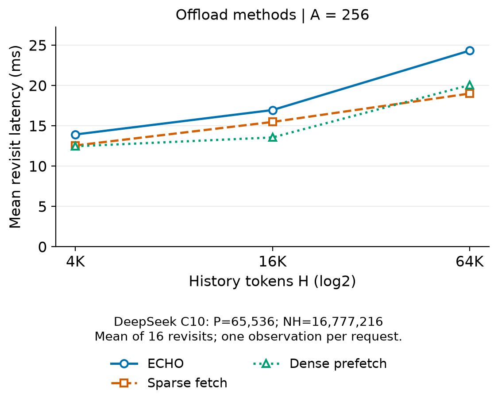

### A = 512

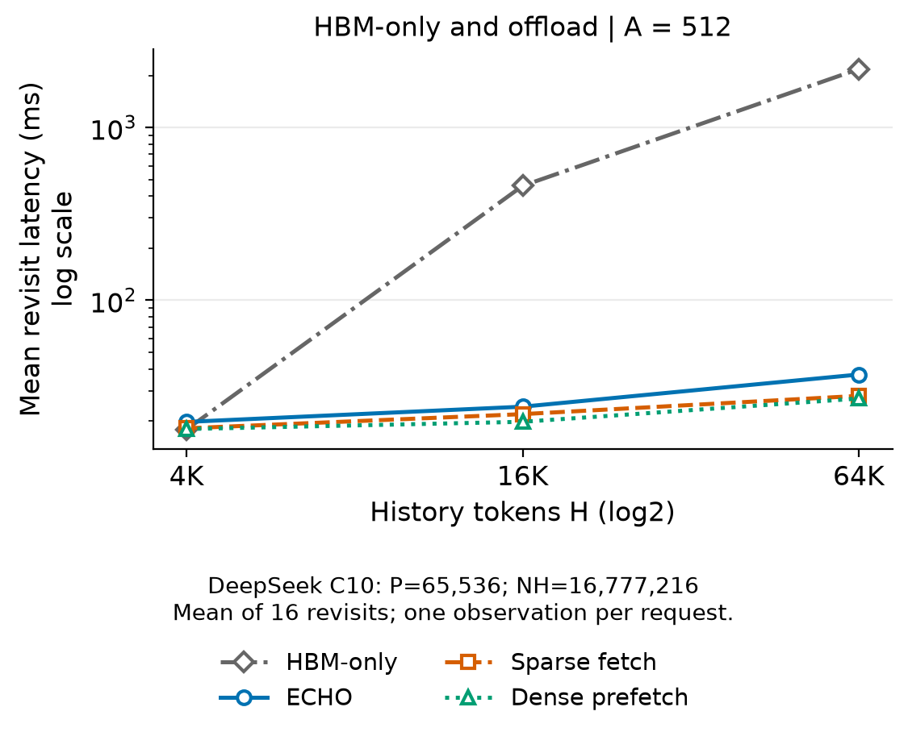

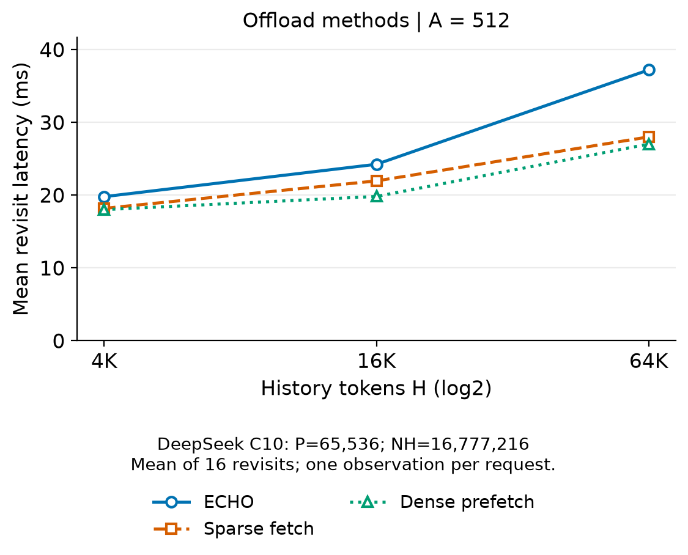

### A = 1024

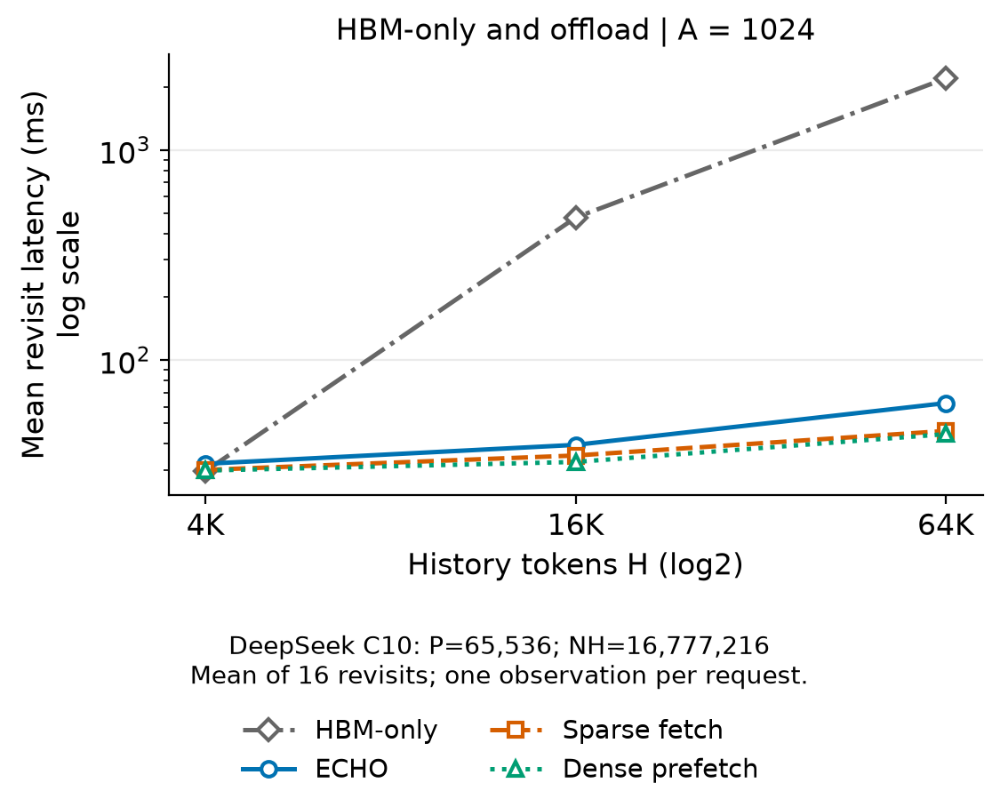

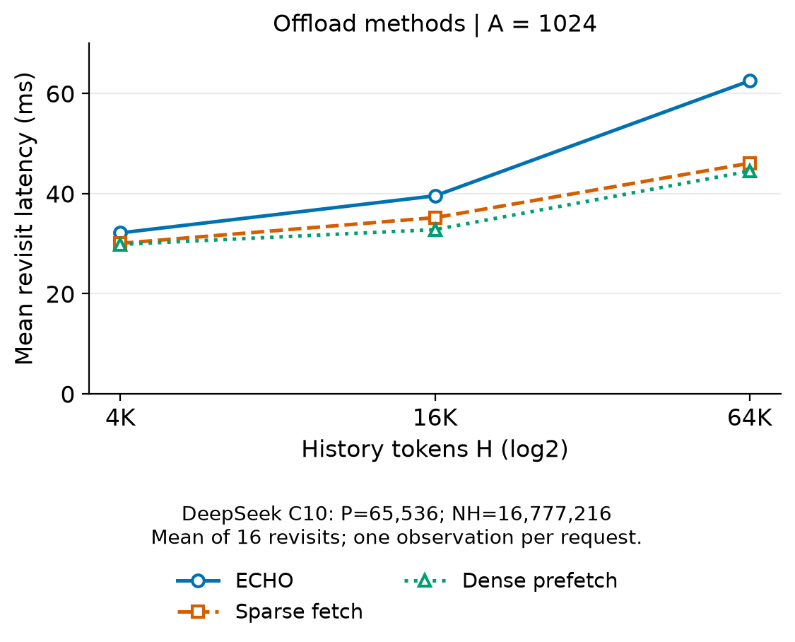

本组图由 CPU 绘图运行 `deepseek_motivation_revisit_plot_20261007_01` 生成，使用同一批次的 12 点测量，未新增 GPU 测量。[绘图数据](report/offload_plot_data.csv)保留两个视图中的全部 84 个绘图数值，[绘图来源](report/offload_plot_provenance.json)记录输入与脚本身份。每张 PNG 均有同名 SVG；原测量与验收边界不变。

## H64K 下随 A 变化的复访延迟

固定 History=64K，三个 offload 方案的复访均值都随 A 增加而上升。A=128、256 时 serial_sparse 的均值较低；A=512、1024 时 dense_prefetch 较低。横轴为 candidate 长度 A，按实际数值使用线性刻度；纵轴为 16 次复访的平均延迟，单位 ms，从零开始。

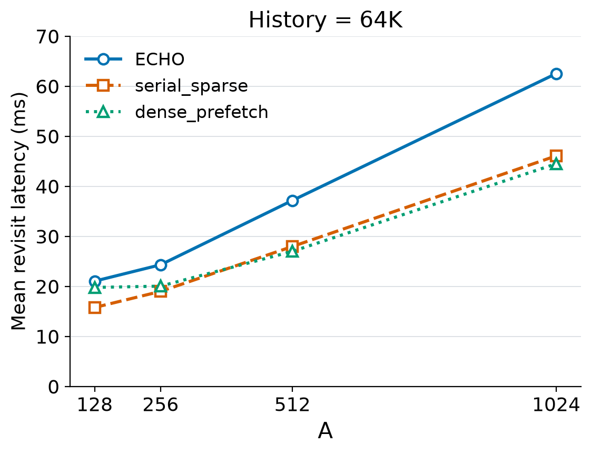

本图使用同一批次矩阵中 H=65,536 的四个点，仅包含 ECHO、serial_sparse、dense_prefetch。CPU 绘图 run 为 `deepseek_motivation_candidate_plot_20261007_01`，未新增 GPU 测量；样本与跨 A 比较的边界同前。下载 [SVG](report/revisit_offload_h64k_vs_a.svg) / [PDF](report/revisit_offload_h64k_vs_a.pdf)，数值与来源见[绘图数据](report/candidate_sweep_data.csv)和[绘图记录](report/candidate_sweep_provenance.json)。

## Candidate 流量与内存

[完整汇总](report/summary.json)和[矩阵 CSV](report/summary.csv)给出首访/复访的 H2D、D2H、选择并集驻留率、cache 记账与进程内存；逐点请求表和内存表见上表。Candidate 计数在执行前重置，不包含首次构建或重建 history 的流量。这些数值是软件 payload，不是 PCIe 总线实测流量。精确并集驻留率在 prefetch/append 后、精确 recall 前采样，不能当作请求开始时的命中率。所有点的 candidate D2H 均为零。

PyTorch allocated/reserved 峰值在释放预热 cache 后重置，包含模型与正式执行；reserved 包含 allocator 保留的空闲空间，不能与 allocated 相加。设备已用量为请求结束时 total−free 的离散采样，不是连续物理峰值，普通 activation 未独立测峰。cache 实际记账、预留上界、进程峰值分开报告；本轮没有填满 NH，不能据此验收最大用户容量或相同总字节预算。

## 验收与环境

12 份独立 check 共保存 1,536 份完整 candidate hidden/logits，1,152 组 offload/HBM 输出逐字节一致。各 check/bench 合计分别核对 416 次预热记录，正式请求的实际搬运、选择和其他 cache 计数、v4 graph replay、源码/native 身份和内存账本均通过独立审查。每点 check/bench 各有 270 条内存采样。逐点 run ID、receipt、源码身份、审查统计和 SHA-256 见[验收索引](report/run_acceptance.json)，发布素材见[清单](report/publication_manifest.json)。

ECHO 的 `prefetch_capacity_failures` 在 6 个点有 250 个层/请求值跨 check/bench 不同。该字段计数未获得额度的 reservation 尝试，受并发预检查时机影响；它不计已接受搬运的失败、丢失记录或总线字节。仅当两次实际成功预取都达到相同的 8,192 额度时，分别保留并核验这项非负整数计数。实际成功预取、召回、淘汰、选择/驻留和 payload 计数仍逐项相同，其他诊断字段没有放宽。原值与差异见验收索引，源码/native 依据及七项补充正确性检查见[计数契约](report/counter_contract.json)。这项分类不证明两次逻辑预取集合或 priority 轨迹相同，也不套用真实三层的状态转移验收例外。

GPU 执行源码及 receipt 保持原身份；运行后只修改了 CPU 矩阵报告器的该项比较规则。独立审查仅允许 `src/report_matrix.py` 的指定旧/新 SHA-256 差异，并确认它不在 receipt 的执行源码集合或 native 依赖清单中。所有其他源码继续逐项核验，具体摘要保存在验收索引。

平台为 NVIDIA H200 / SM90 / 132 SM，PyTorch 2.12.1+cu130、CUDA 13.0，GPU UUID 为 `80ff95c3-176e-fd8a-728f-9c5577c4a779`，CPU affinity 为 `24,25,26,27,28,29,30,31`，intraop=8、interop=96。Checkpoint 身份使用路径、shard 大小与 mtime，不声称 hash 了全部权重内容。

整批观察器已 exit 0，共 2093 次采样，最大间隔 30.577126 秒；原始样本覆盖全部正式 bench 进程区间，未记录所选 GPU 上的其他计算进程。Check 首端和尾端未被原始样本覆盖的最大区间分别为 0.140152、0.000000 秒，逐点如实记录。离散采样不能排除采样间隙中的活动或无关 CPU 工作。原始监控哈希、进程归属与覆盖范围见[观察器摘要](report/observer_summary.json)。

## 复现

从仓库根目录运行，使用新 batch ID。A1024 的完整验收输出较大，TMPDIR 放在有足够空间的 SSD 上。

```bash
export PATH="$PWD/.venv/bin:/usr/local/cuda/bin:/usr/local/bin:/usr/bin:/bin"
export CXLDSAGR_SM90_BACKEND=native
export OMP_NUM_THREADS=8 MKL_NUM_THREADS=8 OPENBLAS_NUM_THREADS=8
export PYTHONDONTWRITEBYTECODE=1 DG_JIT_WITH_LINEINFO=1
export PYTORCH_ALLOC_CONF=backend:native,pinned_use_cuda_host_register:True,pinned_num_register_threads:8
export TRITON_PTXAS_BLACKWELL_PATH=/usr/local/cuda/bin/ptxas
unset TRITON_PTXAS_PATH PYTORCH_CUDA_ALLOC_CONF PYTORCH_HIP_ALLOC_CONF
unset GOMP_CPU_AFFINITY KMP_AFFINITY OMP_PLACES OMP_PROC_BIND FLASHINFER_DISABLE_JIT
export TMPDIR=/mnt/ssd-wlcb/chenkaiqi/cxldsagr-tmp/motivation_matrix_new
mkdir -p "$TMPDIR"
matrix_id=motivation_matrix_new
CUDA_VISIBLE_DEVICES=3 numactl --physcpubind=24-31 --membind=0 \
  bash experiments/deepseek_v32_motivation/scripts/matrix.sh --run-id "$matrix_id"

run_args=()
for history in 4096 16384 65536; do
  for candidate in 128 256 512 1024; do
    run_args+=(--run-dir "experiments/deepseek_v32_motivation/output/data/${matrix_id}_h${history}_a${candidate}_bench")
  done
done
python -m experiments.deepseek_v32_motivation.src.report_matrix "${run_args[@]}" \
  --output-dir "experiments/deepseek_v32_motivation/output/data/${matrix_id}_report"
```

`scripts/matrix.sh` 按点调用独立 check/bench；报告由 `src.report_matrix` 汇总，逐点统计复用 `src.report`，绘图复用 `src.plot`。计时调用 `DeepSeekServingBackend`、`PersistentGRRunner` 与 `GR.workload`，实验代码不实现模型计算。发布前另执行独立 CPU 原始证据审查，并核对完整矩阵与整批观察器。

按 candidate 长度生成复访图时，`src.plot_offload_matrix` 读取已发布的矩阵汇总，分别绘制四方案对比和三方案细节，复用 `src.plot` 的配色与导出函数：

```bash
python -m experiments.deepseek_v32_motivation.src.plot_offload_matrix \
  --summary experiments/deepseek_v32_motivation/report/summary.json \
  --output-dir experiments/deepseek_v32_motivation/output/data/motivation_revisit_plot_new
```

固定 H64K、横轴为 A 的三方案图由 `src.plot_candidate_sweep` 生成，复用 `src.plot` 的配色、导出函数和 `src.plot_offload_matrix` 的线型：

```bash
python -m experiments.deepseek_v32_motivation.src.plot_candidate_sweep \
  --summary experiments/deepseek_v32_motivation/report/summary.json \
  --output-dir experiments/deepseek_v32_motivation/output/data/candidate_sweep_new
```

计算与 fetch 示意图由 `src.draw_compute_fetch` 生成，不读取计时数据：

```bash
python -m experiments.deepseek_v32_motivation.src.draw_compute_fetch \
  --output-dir experiments/deepseek_v32_motivation/output/data/compute_fetch_new
```

计算占比图由 `src.plot_compute_share` 读取保留的单点 profile，复用 `src.analyze_pipeline`、`src.graph_attribution` 和 `experiments.deepseek_v32_mfu.src.analyze_nsys` 的 CPU 归属分析，并核对原始 SQLite 与已验收汇总。运行需要本地保留的 profile 和 graph setup SQLite：

```bash
python -m experiments.deepseek_v32_motivation.src.plot_compute_share \
  --pipeline experiments/deepseek_v32_motivation/report/diagnosis/pipeline.json \
  --output-dir experiments/deepseek_v32_motivation/output/data/compute_share_new
```

本轮各点 ID 为 `deepseek_motivation_matrix_20261007_01_h<H>_a<A>_bench`，配对 check 使用 `_check` 后缀。完整矩阵报告在 `/mnt/ssd-wlcb/chenkaiqi/cxldsagr/experiments/deepseek_v32_motivation/output/data/deepseek_motivation_matrix_report_20261007_02/matrix`，独立审查在 `/mnt/ssd-wlcb/chenkaiqi/cxldsagr/experiments/deepseek_v32_motivation/output/data/deepseek_motivation_matrix_analysis_20261007_02`，整批监控在 `/mnt/ssd-wlcb/chenkaiqi/cxldsagr/experiments/deepseek_v32_motivation/output/log/deepseek_motivation_matrix_20261007_01/observer`。被忽略的 output 数据不随 Git 分发。

## 保留的单点 profile 证据

本轮 12 点矩阵没有新采集 profile。已验收的 `deepseek_motivation_rerun_profile_20261006_01` 只匹配旧 H64K/A128 单点 `deepseek_motivation_rerun_bench_20261006_01`；其局部 DMA/计算重叠证据保留在[无图证据说明](report/diagnosis.md)，不能视为新矩阵的匹配 profile，也不以局部交集推出本轮完整请求的因果收益。原单层和请求时间线展示已撤下。

`deepseek_dma_c10_bench_20261006_01` 仍是[独立 cache 管理报告](../cache_management/README.md)的内存观测来源，保留其原始证据，不将旧计时混入矩阵。NOSA、容量填满和 simulation 未重跑；旧 simulation 继续撤回。
