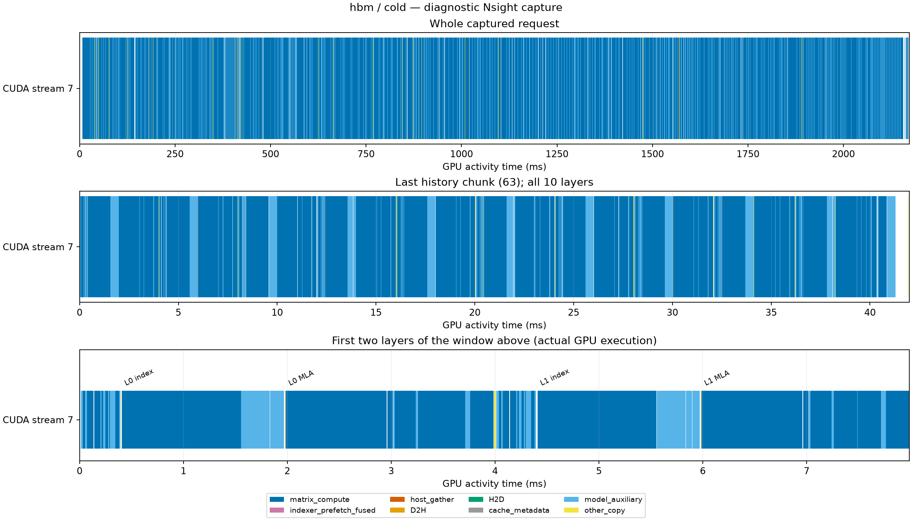
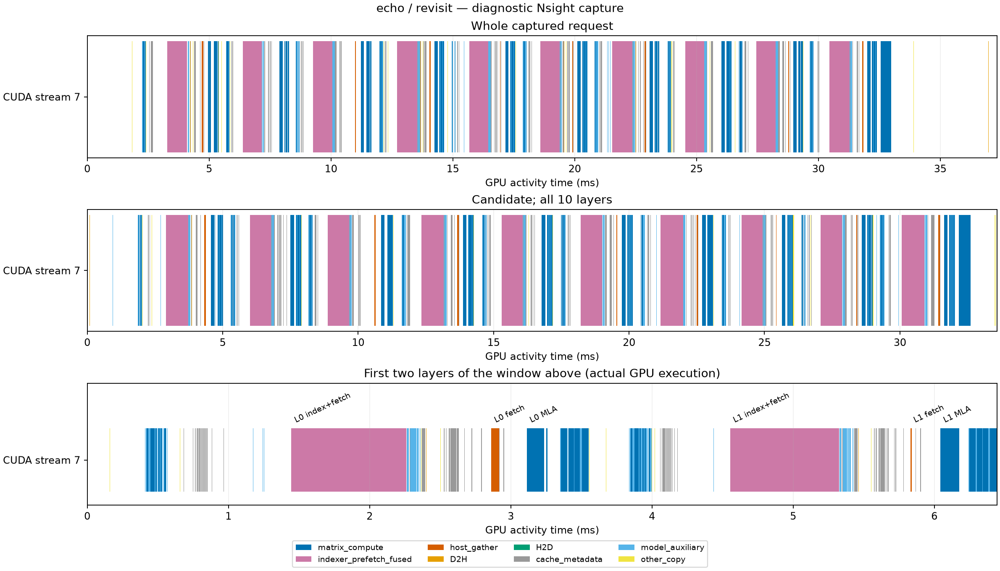
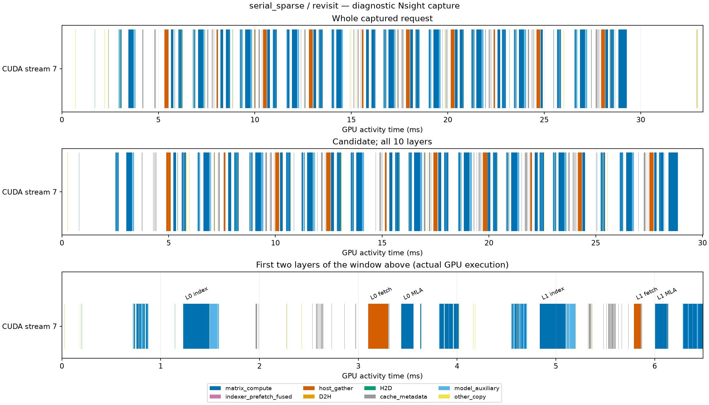
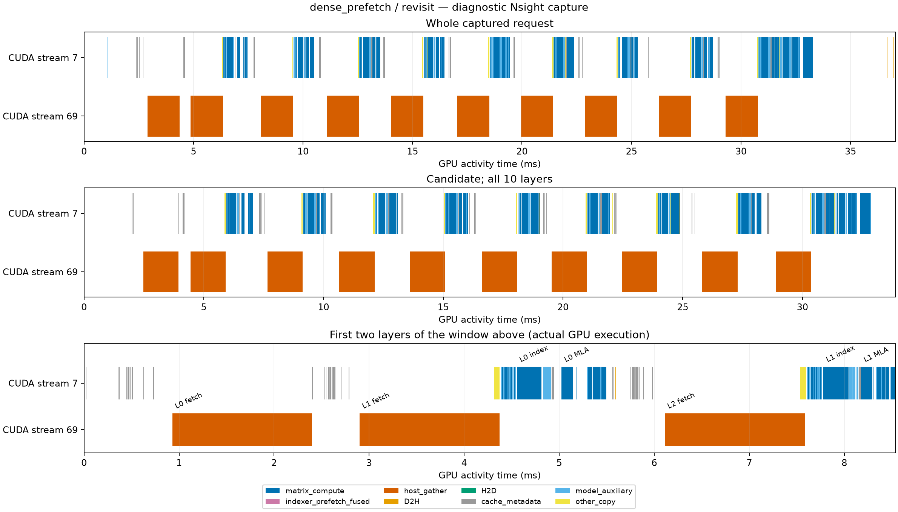

# C10 流水线诊断

正式结果来自 `motivation_c10_20261004_u16_r2_01`；本页诊断来自匹配的
`motivation_c10_profile_20261004_01`，每方案各采集一次首访和复访，共八个请求。
正式结果每方案、每阶段有 16 个请求，profile 仅用于解释当前执行中的成本，不能替代
正式延迟均值。模型、输入、P/NH 与计时边界见[实验说明](../README.md)。

## MFU 的分母

端到端 MFU 使用正式请求同步墙钟时间；API MFU 使用每次矩阵 API 所属 GPU
活动的时间并集，再对调用求和。内部量化、转置、归约和搬运已计入对应 API。
各精度有效 FLOPs 按 FP8 1,979、BF16 989.5、FP32 67 TFLOP/s 换算成理论时间，
求和后除以相应实测时间。CUDA matmul TF32 关闭。这些值不表示硬件指令 MFU
或 SM occupancy；API 时间之和也不等于所有 GPU 活动的全局时间并集。

| 方案 | 首访正式 MFU | 首访 API ms / MFU | 复访正式 MFU | 复访 API ms / MFU |
|---|---:|---:|---:|---:|
| HBM-only | 44.44% | 1812.184 / 53.38% | 44.58% | 1834.983 / 52.72% |
| ECHO | 42.37% | 1721.919 / 56.18% | 9.00% | 12.846 / 17.49% |
| Sparse fetch | 43.62% | 1795.076 / 53.89% | 12.17% | 7.392 / 30.39% |
| Dense prefetch | 43.31% | 1794.756 / 53.90% | 7.04% | 7.323 / 30.68% |

HBM-only 复访仍重建完整 history，其余三方案复访只执行 candidate。不能将 profile
API 时间从另一轮正式墙钟时间中扣除，推算 CPU 开销或可消除延迟。逐算子、逐层
结果见[算子 MFU](operator_mfu.md)，聚合值见[aggregate_mfu.csv](diagnosis/aggregate_mfu.csv)。

## GPU 活动与剩余成本

GPU span 从请求内首个 GPU 活动开始到最后一个结束；busy union 是这些活动的
时间并集，gap 为 span 减去 busy union。API 外非矩阵 union 仅统计未归属矩阵 API
的活动，包含选择、cache 管理与独立搬运等。请求两端的 CPU 时间不在 GPU span 内。

| 方案 / 阶段 | GPU span ms | busy union ms | gap ms | API 外非矩阵 union ms |
|---|---:|---:|---:|---:|
| HBM-only / cold | 2172.468 | 2123.885 | 48.584 | 311.865 |
| HBM-only / revisit | 2190.197 | 2148.175 | 42.022 | 313.378 |
| ECHO / cold | 2469.114 | 2098.677 | 370.437 | 376.770 |
| ECHO / revisit | 37.331 | 16.616 | 20.715 | 3.771 |
| Sparse fetch / cold | 2237.514 | 2170.545 | 66.969 | 375.479 |
| Sparse fetch / revisit | 33.224 | 11.784 | 21.440 | 4.393 |
| Dense prefetch / cold | 2246.137 | 2171.787 | 74.350 | 377.038 |
| Dense prefetch / revisit | 37.047 | 24.786 | 12.262 | 17.463 |

以下为当前 profile 的 kernel 时长之和；各行可能处于不同归属范围，不能相加成
端到端请求时间。

| 首访成本 ms | HBM-only | ECHO | Sparse fetch | Dense prefetch |
|---|---:|---:|---:|---:|
| history 精确 top-k 三类 kernel | 190.221 | 180.875 | 188.316 | 188.289 |
| history resident_selection_kernel | 0 | 61.264 | 64.473 | 64.451 |
| 全请求 activation quantization | 37.521 | 36.912 | 37.177 | 37.211 |
| API 外图内 direct_copy_kernel | 20.640 | 19.913 | 20.432 | 20.432 |

精确 top-k 三类为 `FilteredTopKUnifiedKernel`、`StableSortTopKByValueKernel`
和 `FinalizeTopKIndicesKernel`。量化覆盖每方案 5,200 个首访 kernel，已经计入
矩阵 API 时间；三种 offload 的复访各有 80 个量化 kernel，约 0.195–0.197 ms。
API 外图内 `direct_copy_kernel` 每方案首访 2,600 个、offload 复访 40 个，
后者约 0.101 ms。本采集中 captured-graph MEMCPY 记录为零，以上复制成本来自
实际 copy kernel 的归属，不能据 MEMCPY 记录为零判断没有复制。

| 复访采样 | ECHO | Sparse fetch | Dense prefetch |
|---|---:|---:|---:|
| indexer API ms | 8.220 | 2.746 | 2.713 |
| indexer API MFU | 8.46% | 25.31% | 25.62% |
| 独立 host gather ms | 0.356 | 1.560 | 14.723 |
| 两次 pool audit 的 CPU exclusive 合计 ms | 2.780 | 2.117 | 2.114 |

ECHO 的 indexer API 包含融合 prefetch，独立 gather 仅反映其余召回；不能只比较
表中的 gather 一行判断完整搬运成本。dense 的独立 gather 读取完整历史 miss。
两次 pool audit scope 中没有 GPU 活动；backend truncate 约 0.010–0.011 ms，
也没有 GPU 活动。这些是单次诊断采样中的 scope，不是正式 cleanup 均值或优化收益。
正式运行中 sparse fetch 的复访均值仍低于 ECHO，当前结果没有显示 ECHO 的延迟优势。

## 时间线

以下四图均来自 `motivation_c10_profile_20261004_01`，由 `src.analyze_pipeline`
生成。横轴为相对时间，单位见各子图；局部窗口在标题中注明。ECHO 融合 kernel
的完整区间不能证明内部搬运与计算重叠，也不能据区间相交推出端到端收益。

## 核验与来源

80 份 profile 输出与相应正式输出逐位一致。独立核验覆盖 45,933 次矩阵调用及
同数主 kernel、267,562 个 GPU 活动、195 个算子分组、21 个聚合分组与 369 行
kernel 清单。6,560 次图重放、180,320 个图 GPU 活动和 4,360 条 clone 关系均完成
归属；八个请求的原生验证 scope 已确认。分析链退出码为零，11 份 stderr 均为空。
162 次离散 GPU 观测只发现指定 PID，最大间隔 28.837 s；这不证明连续独占。

[完成记录](diagnosis/completion_receipt.json)、[数值核验](diagnosis/independent_numerical_audit.json)、
[源码核验](diagnosis/independent_provenance_audit.json)、[算子归属核验](operator_mfu/crosscheck.json)、
[GPU 区间核验](diagnosis/bottleneck_summary.json)、[量化清单](diagnosis/kernel_inventory_audit.json)、
[复制 kernel 核验](diagnosis/graph_copy_kernels.json)和
[GPU 观测](diagnosis/gpu_observation_audit.json)随报告保留。所选数据和图像逐文件
来源及 SHA-256 见[发布清单](publication_manifest.json)。

正式执行源码清单 SHA-256 为
`11fc11b18b2e70baf450a82ab4fad66f2f8d4e22cda2e9f36bf74453a400df8f`，
profile 为 `c7c2f40915ce41897bd9eabd1dde1efb0dfcfcc528afaea039ef9ac03e57623c`。
原始 SQLite、图节点清单、逐调用账本、审计源码和日志留在相应运行的 `output/` 中；
逐调用账本为
`output/data/motivation_c10_profile_20261004_01/analysis/operator_mfu/operator_mfu_calls.jsonl`。
生产分析依次调用 `src.analyze_pipeline`、`src.verify_profile_flops`、`src.operator_mfu`
和 `src.aggregate_mfu`，完整已执行参数保存在
`output/data/motivation_c10_profile_20261004_01/analysis/independent_profile_audit/execution_sources/run_chain.sh`。
运行前使用新输出目录；各入口支持 `--help`。本次报告选择已有结果，没有新增 GPU 测量。
