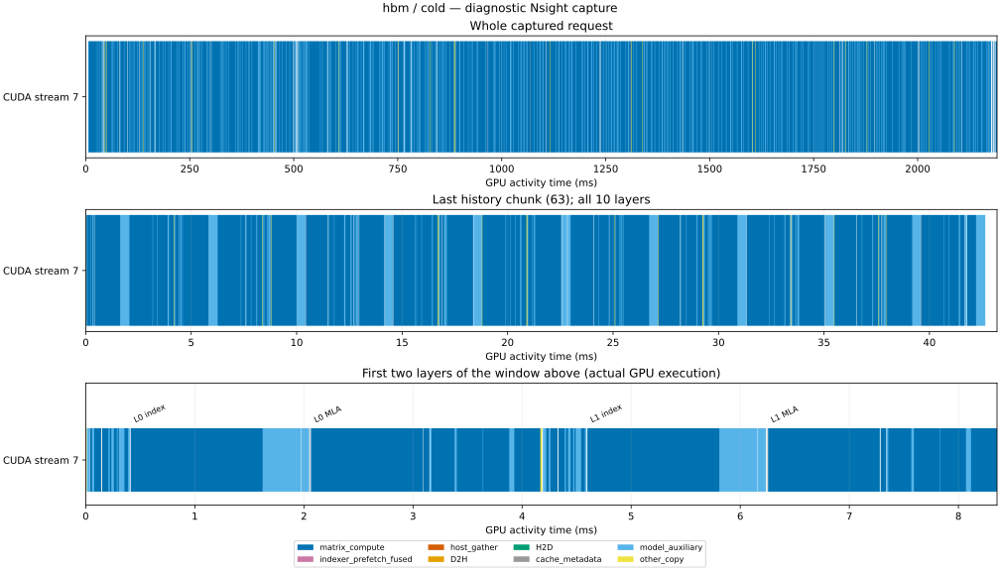
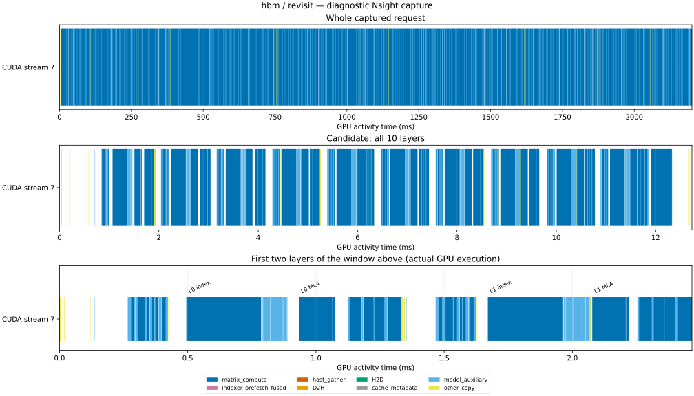
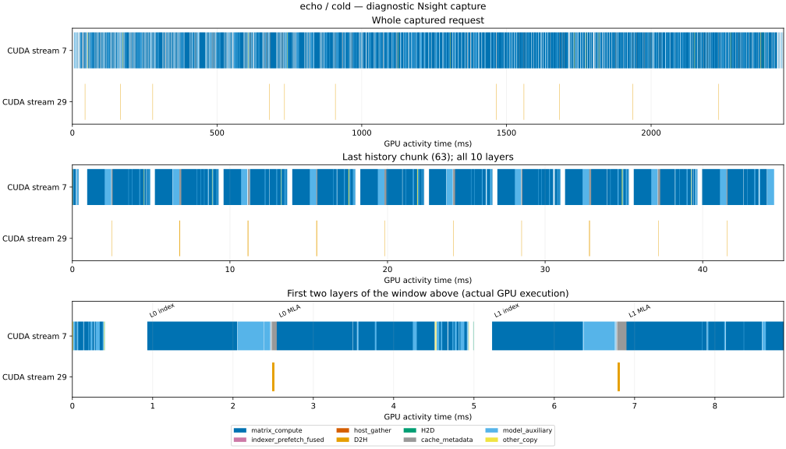
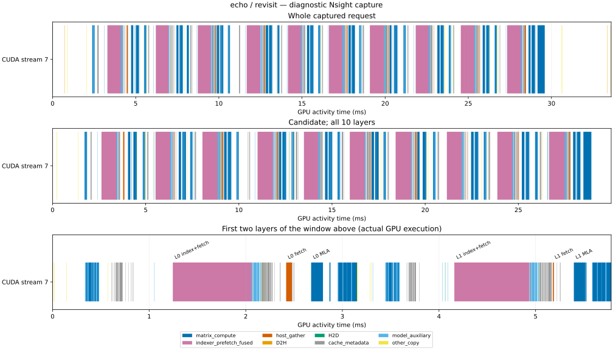
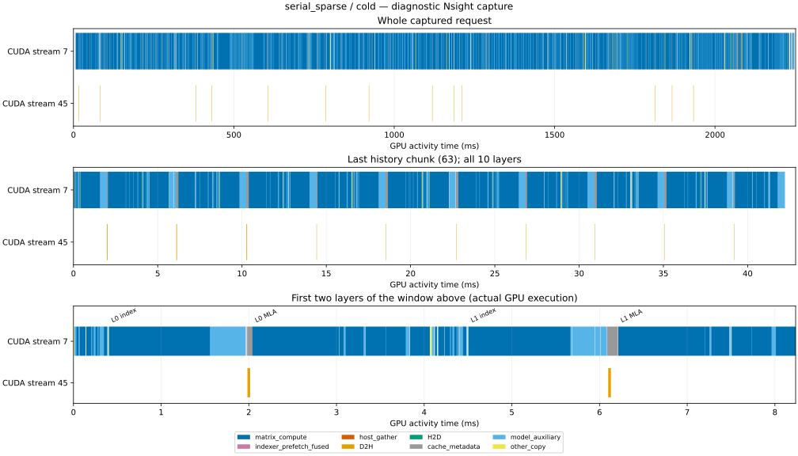
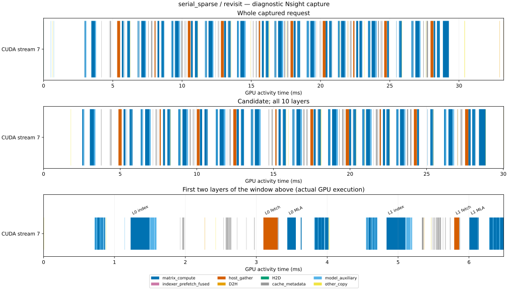
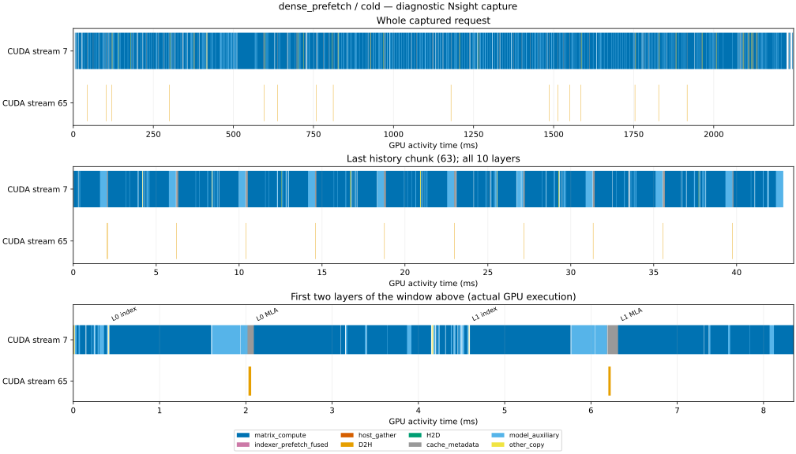
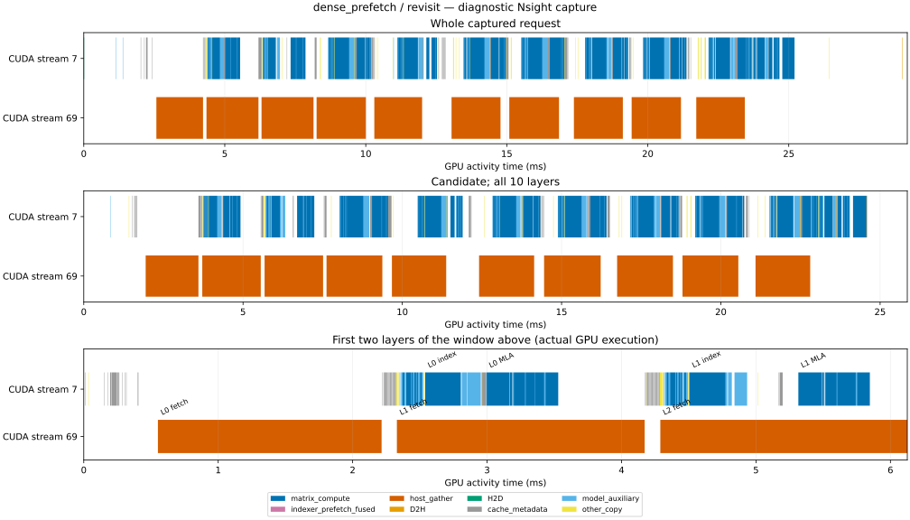

# C10 当前实现的诊断

`refactor_final_deepseek_profile_20261005_01` 的八段请求 capture 与四段 graph setup 分开保存。正式延迟来自预先选定的 bench01；13 步分析全部完成，见 [完成记录](diagnosis/completion_receipt.json)。

| 方案 | 请求 | GPU 活动数 | GPU 活动并集 ms | GPU envelope ms | envelope 内 gap ms |
|---|---|---:|---:|---:|---:|
| hbm | cold | 51612 | 2144.140 | 2189.285 | 45.144 |
| hbm | revisit | 51612 | 2156.400 | 2197.122 | 40.722 |
| echo | cold | 56124 | 2114.319 | 2470.287 | 355.968 |
| echo | revisit | 1522 | 16.732 | 35.213 | 18.481 |
| serial_sparse | cold | 51884 | 2185.739 | 2248.511 | 62.772 |
| serial_sparse | revisit | 1142 | 11.865 | 26.200 | 14.335 |
| dense_prefetch | cold | 52534 | 2186.856 | 2249.487 | 62.631 |
| dense_prefetch | revisit | 1132 | 25.573 | 36.288 | 10.715 |

GPU envelope、活动并集、duration sum 和正式 wall time 各自报告；不能跨运行相减后解释为 CPU 时间或可消除延迟。ECHO 和 sparse fetch 在当前 16 次复访中搬入相同的 candidate KV 总量，但正式请求延迟分别为 24.530 和 18.084 ms。当前 profile 不能单独确定 P0/当前的阶段延迟增加原因。

端到端与矩阵 API 利用率见 [aggregate_mfu.json](diagnosis/aggregate_mfu.json)，完整算子结果见 [operator_mfu.md](operator_mfu.md)。独立检查包括[矩阵归因](diagnosis/crosscheck.json)、[聚合算术](diagnosis/aggregate_arithmetic.json)、[数值](diagnosis/independent_numerical_audit.json)和[来源](diagnosis/independent_provenance_audit.json)。

## hbm

## echo

## serial_sparse

## dense_prefetch

