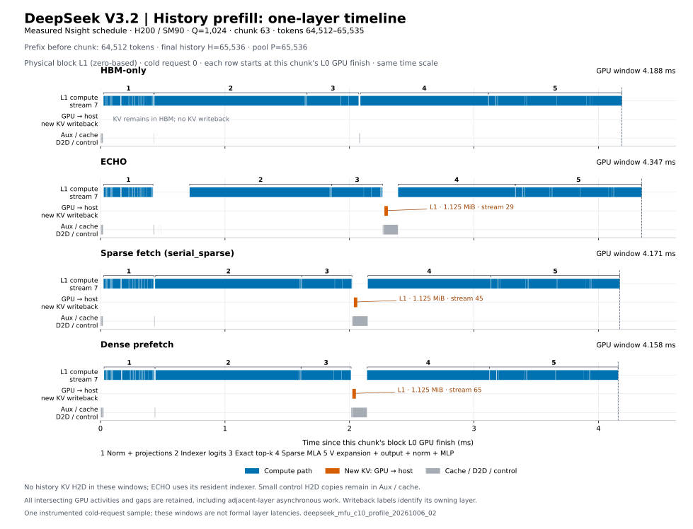

# History prefill 单层时间线

数据来自 `deepseek_mfu_c10_profile_20261006_02` 的 cold request 0。选择 history chunk 63，Q=1,024，覆盖 token 64,512–65,535；chunk 前已有 64,512 个 token，最终 H=65,536，P=65,536。图中 physical block L1 从同一 chunk 的 L0 finish graph 最后一个 GPU activity 结束计时，到 L1 finish graph 最后一个 GPU activity 结束。四行共享时间尺度，保留窗口内全部 kernel、memcpy、memset 和空隙。

| 方案 | 窗口 ms | GPU activity 并集 ms | 空隙 ms | 本 chunk L1 主 KV D2H B | D2H 时间 µs | D2H 与 compute kernel 重叠 µs |
| --- | ---: | ---: | ---: | ---: | ---: | ---: |
| HBM-only | 4.187833 | 4.139190 | 0.048643 | 0 | 0.000 | 0.000 |
| ECHO | 4.346908 | 3.991325 | 0.355583 | 1,179,648 | 27.744 | 0.000 |
| Sparse fetch | 4.170555 | 4.105148 | 0.065407 | 1,179,648 | 27.712 | 0.000 |
| Dense prefetch | 4.157980 | 4.091580 | 0.066400 | 1,179,648 | 28.064 | 0.000 |

三个 offload 方案在本 chunk 各写回 1,024×1,152 B，即 1.125 MiB 主 KV；这些 D2H 分别位于 stream 29、45、65。窗口内没有历史 KV H2D gather，ECHO 使用 resident indexer。ECHO 的两次小型控制 H2D 合计 16 B，放在 Aux/cache lane，不计入主 KV 流量。三次主 KV D2H 都没有与选定层的 compute kernel 重叠；不能仅凭独立写回 stream 声称这段 prefill 已实现计算与写回重叠。

这里的 GPU activity 并集包含 control/cache 工作和主 KV 写回，空隙按全部 stream 的并集计算。Memcpy 字节统计计入与窗口相交的完整 activity，不按绘图裁剪比例分配字节；本图的主 KV 写回均属于选定 L1/chunk。整段 history 的累计 cache counters 只在 JSON 中作为上下文保留，不冒充本 chunk 流量。此图是一个带 instrumentation 的请求样本，不是正式层延迟、完整 prefill 的性能或 MFU。

独立 SQL 审查核对了每条 GPU activity 的原始时间戳、stream 和 kernel 名称，见 [raw_check.json](raw_check.json)、[gap_summary.csv](gap_summary.csv)、[intervals.csv](intervals.csv)及[timeline.json](timeline.json)。Profile 数值、来源及观测边界见[诊断说明](../diagnosis.md)。从仓库根目录使用 `python -m experiments.deepseek_v32_motivation.src.plot_prefill_timeline --pipeline-json <pipeline.json> --layer 1 --chunk 63 --output-dir <new-output-dir>` 重建时间线。
