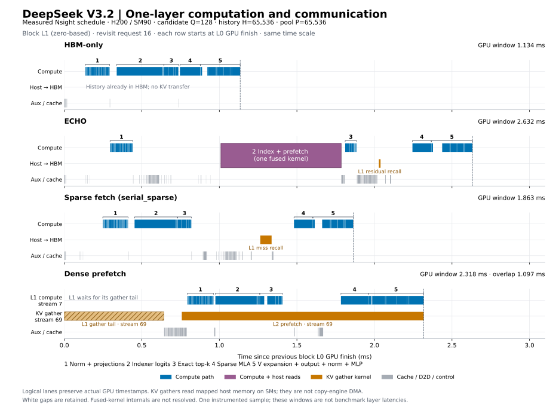
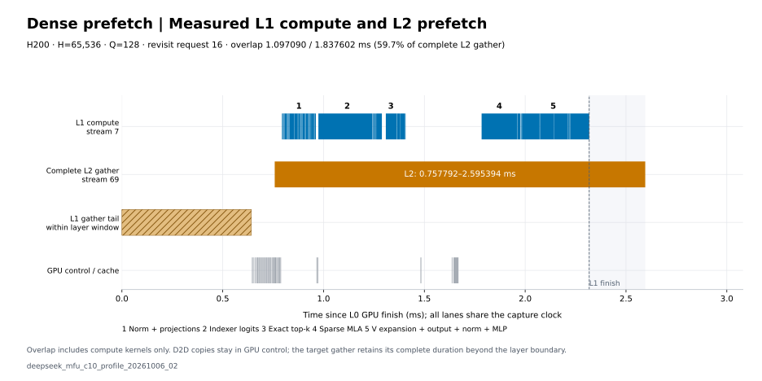

# Candidate 单层计算与搬运

数据来自 `deepseek_mfu_c10_profile_20261006_02`，物理 GPU 3（H200 / SM90）。固定 H=P=65,536、A=128，选择复访 request 16 的 physical block L1（从 0 编号）。四行分别以本次 capture 中 L0 finish graph 最后一个 GPU activity 的结束时刻为零点，到 L1 finish graph 最后一个 GPU activity 结束为止。图中保留这一窗口内全部 kernel、memcpy、memset，以及相邻层异步活动和空白区间。

| 方案 | 窗口 ms | 全部 stream 的 GPU activity 并集 ms | 空隙 ms | 空隙占比 | 最大空隙 µs |
| --- | ---: | ---: | ---: | ---: | ---: |
| HBM-only | 1.134402 | 0.909663 | 0.224739 | 19.811% | 114.305 |
| ECHO | 2.632130 | 1.536512 | 1.095618 | 41.625% | 175.136 |
| Sparse fetch | 1.863457 | 1.025696 | 0.837761 | 44.957% | 133.088 |
| Dense prefetch | 2.317506 | 2.287682 | 0.029824 | 1.287% | 1.472 |

“空隙”是窗口长度减去全部 GPU activity 的时间并集，不是各 stream 空白之和，也不是计算单元利用率。Mapped-host gather 占用 SM，因而计入 GPU activity；ECHO 的融合 indexer/prefetch 只有一个可观测 kernel，不能据此拆出内部搬运与计算区间。表格来自一次侵入式 profile，不作为正式层延迟或可消除开销的估计。

## Dense 下一层搬运的完整重叠

L2 gather 在 stream 69 上从 0.757792 ms 运行到 2.595394 ms，共 1.837602 ms；raw launch 的 grid 为 80 CTAs、每 CTA 128 threads。L1 compute 在 stream 7 上从 0.793760 ms 开始，至 2.317506 ms 结束。逐个计算 kernel 与完整 L2 gather 取交集，重叠为 **1.097090 ms，占完整 L2 gather 的 59.702264%**。

分母保留 L2 gather 超过 L1 finish 的部分，未在 2.317506 ms 截断。当前层 L1 在窗口开始时还有 0.642144 ms 的 gather 尾部；图中单独画出，不计为 L1 compute 与 L2 gather 的重叠。D2D、cache/control kernel 同样不计入这个重叠分子。两个 stream 同时有活动只能证明调度重叠，不能说明传输不占用计算资源，也不能单独推出完整请求加速。

## 剩余空隙的范围

HBM-only 的最大空隙为 21.056–135.361 µs，其中 node-level trace 下的 `cudaGraphLaunch` 占 95.200 µs。ECHO 的最大空隙从 pool-operation fill 结束延伸到 fused indexer 的 counter fill 启动，长 175.136 µs。Sparse fetch 的最大空隙位于 `sparse_map_kernel` 结束和 MLA kernel 启动之间，长 133.088 µs；对应 host scope 包含 sparse MLA 准备、tensor-map 编码和 kernel launch。ECHO 的同类召回后 MLA 启动间隔也保留了 137.888 µs 空隙。

这些记录定位了当前的提交和准备区间，但没有 Python 调用栈或 CPU 调度记录，且 node-level graph tracing 会侵入提交路径。不能把完整区间都归为 Python 开销，也不能宣称四方案的大空隙已经消除。当前 bounded native recall 不逐层读取 miss count；ECHO fused indexer 内的同步与请求末尾的 pool drain 仍保留。

## 核验与复现

独立 SQL 审查将图中每条 activity 的类型、原始起止时间、stream 与 kernel 名称逐项对回 SQLite；四方案分别保留 75、145、107、108 条 activity。Dense 的完整 L2 gather 还通过 CUDA launch correlation 与最内层 NVTX `motivation/dense_prefetch/revisit/candidate/chunk_0/layer_2/host_gather` 复核。见 [raw_check.json](raw_check.json)、[gap_summary.csv](gap_summary.csv)、[intervals.csv](intervals.csv)及[timeline.json](timeline.json)。

Profile 的 80 份输出与独立 check 逐位一致；来源及环境核验见[诊断说明](../diagnosis.md)。完整 trace 与分析保留在 `output/data/deepseek_mfu_c10_profile_20261006_02/`。从仓库根目录使用 `python -m experiments.deepseek_v32_motivation.src.plot_single_layer --pipeline-json <pipeline.json> --layer 1 --phase revisit --output-dir <new-output-dir>` 重建时间线。
