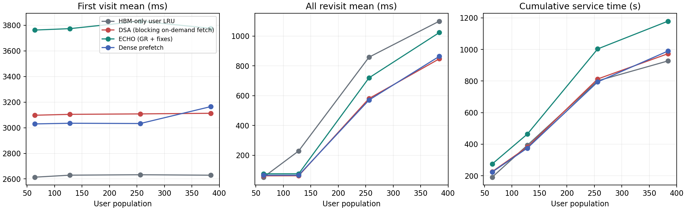
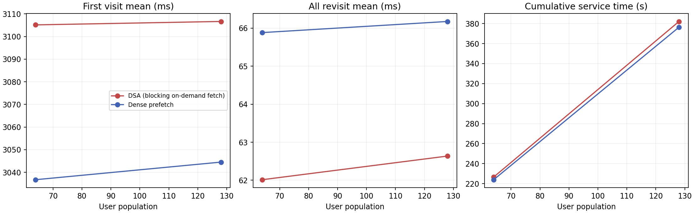
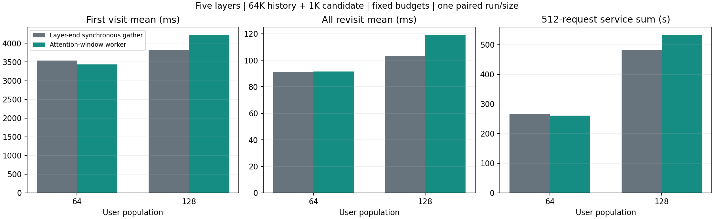
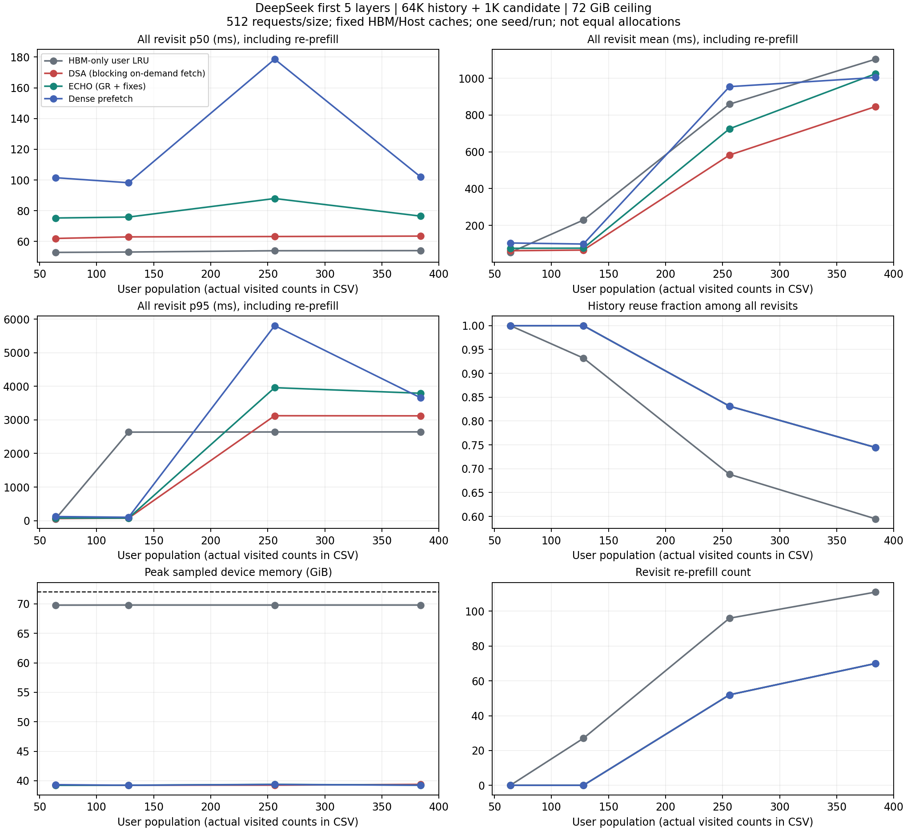
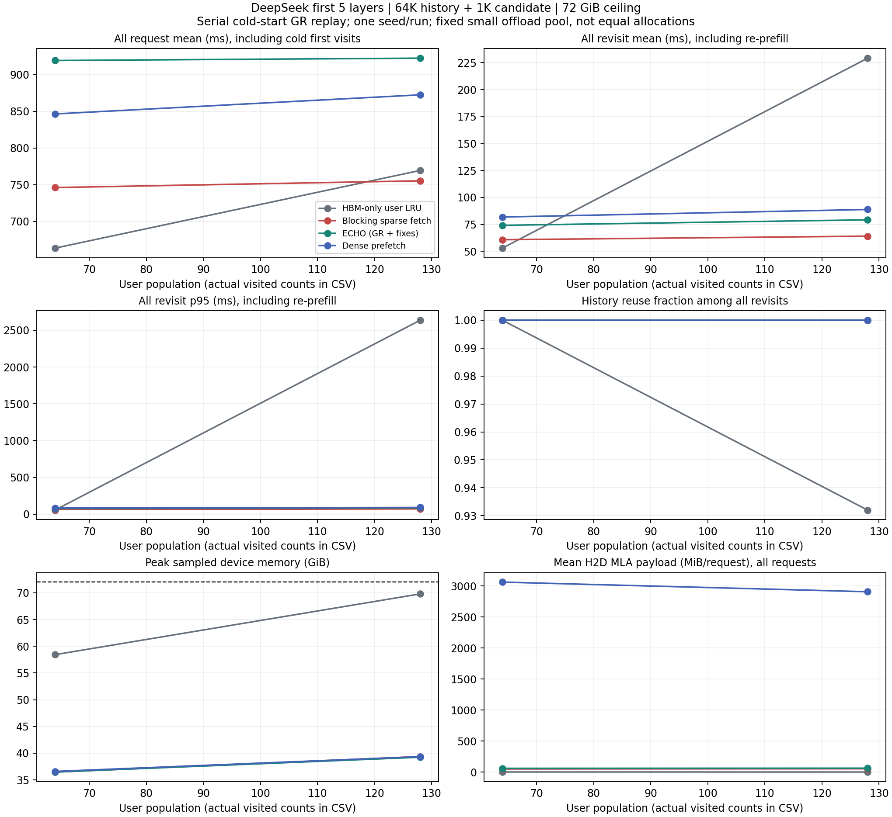

# GR serving cache：DSA 容量与搬运实验

## GPU-direct 四规模四方案重测（2026-10-02）

run group `gpu_direct_fixed512_20261002`：64/128/256/384 用户池，各 512 请求，
HBM-only LRU、DSA 阻塞搬运、ECHO 派生修复版和 GPU-direct Dense 共 16 组。
已完成 16/16 组、8192 条请求记录并发布本轮结果。固定五层、64K/1K、原精度及 72 GiB HBM / 66 GiB
Host 上限，缓存容量仍为 93 / 128 用户，offload 每层主 KV 池 66624 tokens。
复用 checksum 已核验的 `five_layer_fixed512_20261001_input_u{64,128,256,384}`，
本组输入目录为指向原不可变输入目录的符号链接，不重新生成或改动请求流。
已逐组核验 Dense provenance 为 `gpu_direct` + `attention_window`，所有运行源码指纹一致。
各组独立进程、预热两次并清空逻辑缓存后完整串行回放一次；不混入此前两方案结果，
不加网络、排队或 Nsight。首访、全部复访（含淘汰重算）与累计服务时间分别汇总。

```bash
SPARSEGR_SWEEP_USERS="64 128 256 384" \
  bash experiments/gr_cache_serving/scripts/run_fixed_budget_sweep.sh status gpu_direct_fixed512_20261002
SPARSEGR_SWEEP_USERS="64 128 256 384" \
  bash experiments/gr_cache_serving/scripts/run_fixed_budget_sweep.sh run gpu_direct_fixed512_20261002
SPARSEGR_SWEEP_USERS="64 128 256 384" \
  bash experiments/gr_cache_serving/scripts/run_fixed_budget_sweep.sh report gpu_direct_fixed512_20261002
```

### 四方案结果

首访指用户在整条流中第一次出现；复访包括缓存命中，以及历史已淘汰而重新 prefill 的请求。
累计服务时间为 512 个请求的 service_ms 之和，包含必要 prefill、候选计算和缓存管理，
不含模型加载、预热、计时外检查、网络或排队。每组仅一次测量，不声称统计显著性。

**首访平均，单位 s：**

| 用户池 | HBM-only LRU | DSA 阻塞搬运 | ECHO 派生 | Dense GPU-direct |
| --- | ---: | ---: | ---: | ---: |
| 64 | 2.614 | 3.097 | 3.762 | 3.030 |
| 128 | 2.630 | 3.104 | 3.773 | 3.035 |
| 256 | 2.633 | 3.108 | 3.832 | 3.033 |
| 384 | 2.629 | 3.113 | 3.776 | 3.164 |

**全部复访平均，单位 ms：**

| 用户池 | HBM-only LRU | DSA 阻塞搬运 | ECHO 派生 | Dense GPU-direct |
| --- | ---: | ---: | ---: | ---: |
| 64 | 52.82 | 61.85 | 75.38 | 65.79 |
| 128 | 228.88 | 62.36 | 75.58 | 65.89 |
| 256 | 858.39 | 580.67 | 719.60 | 570.57 |
| 384 | 1100.24 | 847.51 | 1023.73 | 864.14 |

**512 请求累计服务时间，单位 s：**

| 用户池 | HBM-only LRU | DSA 阻塞搬运 | ECHO 派生 | Dense GPU-direct |
| --- | ---: | ---: | ---: | ---: |
| 64 | 190.96 | 225.94 | 274.54 | 223.37 |
| 128 | 393.27 | 381.75 | 463.92 | 375.16 |
| 256 | 801.49 | 812.83 | 1003.27 | 794.41 |
| 384 | 927.26 | 973.01 | 1179.08 | 989.89 |



| 用户池 / 实际访问 | 首访 / 复访数 | HBM-only 复访命中率 / 重算次数 | 三个 offload 复访命中率 / 重算次数 |
| --- | ---: | ---: | ---: |
| 64 / 64 | 64 / 448 | 100% / 0 | 100% / 0 |
| 128 / 115 | 115 / 397 | 93.20% / 27 | 100% / 0 |
| 256 / 204 | 204 / 308 | 68.83% / 96 | 83.12% / 52 |
| 384 / 238 | 238 / 274 | 59.49% / 111 | 74.45% / 70 |

同规模三个 offload 的逐请求 Host 命中、淘汰及重算次数完全一致。容量压力下它们降低了
全部复访均值，但并不总降低累计时间：384 用户时 HBM-only 仍是整段最快。
GPU-direct Dense 在 256 用户点的复访均值及累计时间最低，384 用户点则慢于 DSA。
384 用户 Dense 首访和命中延迟有波动，本轮完整保留；单次、单 seed 且没有新时间线，
不将其归因于 NUMA、线程或某个 kernel，也不声称测得 overlap 比例。
容量压力下 P95 可能仍由重算决定，例如 384 用户的复访 P95：HBM-only 2.641 s、
DSA 3.126 s、ECHO 3.789 s、Dense 3.333 s，不能以复访均值下降代替尾延迟改善。

HBM-only 的 NVML 采样峰值为 69.78~69.80 GiB，三个 offload 为 39.21~39.49 GiB；
offload 未充分使用 HBM，不声称最优放置。三个 offload 的 pinned allocated/reserved
峰值均为 64 GiB + 13 B，Dense 不分配 CPU staging；HBM-only 仅有 13 B pinned 控制分配。
CPU cache 元数据最高按 272.17 MiB 计费，所有进程 RSS 峰值不超过 67.63 GiB，
均通过固定预算和启动前 NUMA non-Movable / 可用内存 / 可见 cgroup 检查。
环境为 H100 PCIe、Torch 2.8.0+cu128、CUDA 12.8、SGLang 0.5.3.post3；
所有组独立进程、两次预热后清空逻辑缓存；ECHO 第三方版本化源码未修改。

[汇总 CSV](report/gpu_direct_fixed512_20261002/summary.csv) 保留首访均值/P50/P95、
全部复访均值/P50/P95/P99、累计时间、prefill 总耗时、淘汰次数及内存；
[manifest](report/gpu_direct_fixed512_20261002/manifest.json) 记录 16 个 run ID、
summary checksum 和报告代码指纹；[指标总图](report/gpu_direct_fixed512_20261002/overview.png)。
各规模的全部复访 CDF / 请求序列：
[64](report/gpu_direct_fixed512_20261002/u64_latency.png)、
[128](report/gpu_direct_fixed512_20261002/u128_latency.png)、
[256](report/gpu_direct_fixed512_20261002/u256_latency.png)、
[384](report/gpu_direct_fixed512_20261002/u384_latency.png)。
原始指标、完整配置与源码快照位于 `output/data/gpu_direct_fixed512_20261002_u{规模}_{方案}_r1/`。
下方独立两方案回放、CPU-staging 调度/诊断和旧容量实验保持各自测量范围，不混入本轮。

## Dense GPU 直接读取 pinned Host（2026-10-02）

新默认 `--dense-prefetch-transport gpu_direct`：GPU kernel 读取完整历史位置表，直接从
pinned Host KV 写入双 HBM scratch；没有 CPU KV gather、CPU staging 或 DMA copy。
保持 `attention_window` 提前提交与消费前等待，候选仍在 GPU 生成，sparse attention 和
LRU 不变。与 DSA 统一的是 GPU-issued Host load 传输方式，不是完全相同的 kernel：
Dense 搬全量历史且使用固定 scratch，DSA 按需 recall 还包含筛选、分配与映射更新。
GPU 读取占用 SM/访存资源，不能假定与 attention 无争用或必然比 DMA 更快。

Host 上限仍为 66 GiB、容量仍为 128 用户。原 0.25 GiB staging 仅为预算上限中未使用的
预留，新版实际 staging 分配为零，不将规划值当作实际分配。HBM 总上限仍为 72 GiB。
独立 GPU kernel 测试已通过乱序地址、超过 4 GiB 的 Host 偏移和槽位复用；五层 resident
参照、GPU-direct 的两种调度及 128 用户满池正确性均通过，容差未放宽。
162 项聚焦 CPU 测试通过。下方旧 Dense 数字都是显式保留的 CPU staging 对照，
不能用于新传输方式的性能结论；完整容量扫描与旧诊断并未用 GPU-direct 全面重跑。

```bash
SPARSEGR_ECHO_TEST_LAYERS=5 SPARSEGR_ECHO_TEST_FIXED_BUDGET=1 \
  SPARSEGR_ECHO_TEST_TIMEOUT_S=1800 \
  SPARSEGR_ECHO_TEST_TRACE=experiments/gr_cache_serving/output/data/five_layer_fixed512_20261001_input_u64/requests.jsonl \
  bash scripts/run_echo_tests.sh dense_pair
bash experiments/gr_cache_serving/scripts/run_dense_direct.sh run dense_direct_20261002
bash experiments/gr_cache_serving/scripts/run_dense_direct.sh report dense_direct_20261002
```

本次补测为 64/128 用户各 512 请求的 DSA / Dense 两方案，共四组，使用原 checksum 固定
输入；64 用户先 DSA 后 Dense，128 用户反转。各组独立进程、两次预热、清空逻辑缓存后
串行完整测量一次，不启用 Nsight 或计时区诊断。并非完整五规模四方案容量扫描。

### GPU-direct 结果

四组共 2048 请求，输入、源码快照、固定预算与逐请求 Host 命中/淘汰结果校验通过。
64 用户点实际访问 64 人，首访/复访 64/448；128 用户点实际访问 115 人，首访/复访
115/397。两方案复访历史命中均为 100%，没有淘汰重算；所有复访均计入下表。
累计服务时间含必要的 prefill、候选及缓存管理，不含加载、预热和计时外检查。

| 用户池 | 方案 | 首访平均 (s) | 全部复访平均 (ms) | 512 请求累计服务时间 (s) |
| --- | --- | ---: | ---: | ---: |
| 64 | DSA 阻塞按需搬运 | 3.105 | 62.01 | 226.51 |
| 64 | Dense GPU-direct 提前预取 | 3.037 | 65.88 | 223.87 |
| 128 | DSA 阻塞按需搬运 | 3.107 | 62.64 | 382.13 |
| 128 | Dense GPU-direct 提前预取 | 3.045 | 66.17 | 376.39 |

| 用户池 | DSA 复访 P50/P95 (ms) | Dense GPU-direct 复访 P50/P95 (ms) |
| --- | ---: | ---: |
| 64 | 61.96 / 63.14 | 65.80 / 66.63 |
| 128 | 62.60 / 64.19 | 66.08 / 67.05 |



本轮 Dense 复访均值比 DSA 高 6.2% / 5.6%；首访略快使累计时间低 1.2% / 1.5%。
单次、单 seed 结果不能推出稳定的系统加速，也不能把与旧 CPU staging 报告的差异
全部归因于搬运 kernel。本轮没有时间线，不声称测得 overlap 比例；两个点都能保留全部
已访问用户，不是容量不足下的 offload 收益证据。

四组实测 pinned allocated/reserved 峰值均为 **64 GiB + 13 B**，新版 Dense 没有额外
0.25 GiB staging。NVML 采样峰值 39.21~39.34 GiB，进程 RSS 峰值 67.53~67.57 GiB，
CPU cache 元数据最高按 259.13 MiB 计费，均通过原预算。HBM 未充分利用，不声称最优放置。
环境为 H100 PCIe、Torch 2.8.0+cu128、CUDA 12.8、SGLang 0.5.3.post3，模型及精度不变；
ECHO 第三方版本化源码未修改。

[汇总 CSV](report/dense_direct_20261002/summary.csv)、
[manifest](report/dense_direct_20261002/manifest.json)、
[容量与延迟指标](report/dense_direct_20261002/overview.png)、
[64 用户 CDF/请求序列](report/dense_direct_20261002/u64_latency.png)、
[128 用户 CDF/请求序列](report/dense_direct_20261002/u128_latency.png)。
run ID 为 `dense_direct_20261002_u{64,128}_{sparse_sync,dense_prefetch}_r1`；
原始逐请求指标、配置及源码快照位于各 run 的 `output/data/` 目录。
报告由 `report_capacity.py --allow-partial` 生成，显式只有两个规模、两个方案。

## Dense 与 DSA 逐层诊断（2026-10-02）

已完成 CPU-staging Dense 与 DSA 阻塞搬运的同序列 Nsight 对照，拆分 FFN/MoE、indexer、主 attention、
CPU gather、H2D 与等待。采样覆盖 2 次首访和 4 次复访，并有前后无 Nsight 对照，
不替代下面的 512 请求性能结果。详细数据、时间线与复现命令见
[逐层耗时分析](report/parts_20261002/README.md)。
此入口显式固定 `cpu_staging`，没有测量本轮 GPU-direct，不将旧时间线解释套用到新路径。

## CPU-staging Dense 调度对照（2026-10-02）

此节只记录 CPU-staging 的 `attention_window` 调度，完成五层 GPU 正确性验证与四组配对回放。
`layer_end` 保留旧行为作为显式对照；下方旧报告的 Dense 均为旧调度，不能称为新流水线性能。
新的测量源码指纹与旧容量扫描不同，不能把新运行静默补入旧 run group。

窗口为第 L 层 main attention 到第 L+1 层 indexer 结束、main attention 使用 KV 前。
在当前 main attention 提交处将下一层 gather/H2D 交给单后台线程，主线程继续提交模型
计算；下一层不在层入口等主 KV，只在首次访问 scratch 前等 copy-ready event。
首层单独启动。双缓冲容量、全量已有 prefix 搬运、设备端生成 suffix、sparse attention
数学和 LRU 均不变。实际搬运何时开始、能覆盖多少计算时间仍需时间线才能判断。

新旧 Dense 各跑 64/128 用户、每规模 512 请求，共四组；沿用已生成且 checksum 固定的
`five_layer_fixed512_20261001_input_u{64,128}` 输入。模型、精度和 72 GiB HBM / 66 GiB
Host 预算不变，Host 容量 128 用户，HBM 主池 66624 tokens/layer。
每组独立进程、预热两次后清空逻辑缓存、完整测量一次；64 用户先旧后新，128 用户先新后旧。
不做 Nsight profiling，不在计时区添加诊断统计。不用此前旧版本测量替代本次旧调度重测。

```bash
SPARSEGR_ECHO_TEST_LAYERS=5 SPARSEGR_ECHO_TEST_FIXED_BUDGET=1 \
  SPARSEGR_ECHO_TEST_TIMEOUT_S=1800 \
  SPARSEGR_ECHO_TEST_TRACE=experiments/gr_cache_serving/output/data/five_layer_fixed512_20261001_input_u64/requests.jsonl \
  bash scripts/run_echo_tests.sh dense_pair
bash experiments/gr_cache_serving/scripts/run_dense_window.sh run dense_window_20261002
bash experiments/gr_cache_serving/scripts/run_dense_window.sh report dense_window_20261002
```

`dense_pair` 从空进程生成 resident 数值参照，再分别检查新旧 Dense；固定容量检查覆盖
128 用户填满、候选释放、HBM 副本缺失、Host 淘汰重算及槽位复用，容差不变。
配对报告校验相同源码、环境、输入、预算与逐请求缓存结果，分别报告首访、全部复访和
累计服务时间。新的小范围对照不冒充完整五规模四方案扫描；下方旧容量扫描保留其原始
`layer_end` 调度及独立测量边界，不与本次结果拼成同一组对照。

### 配对结果

run group 为 `dense_window_20261002`，四组各 512 请求，共 2048 条有效记录。
64 用户点实际访问 64 人，首访/复访为 64/448；128 用户点实际访问 115 人，
首访/复访为 115/397。两版各点的复访历史命中率均为 100%，没有淘汰或复访重算。
下面的累计服务时间包含首访 prefill，不包含模型初始化、预热及计时外检查。

| 用户池 | Dense 调度 | 首访平均 (s) | 全部复访平均 (ms) | 512 请求累计服务时间 (s) |
| --- | --- | ---: | ---: | ---: |
| 64 | 旧 `layer_end` | 3.540 | 91.25 | 267.46 |
| 64 | 新 `attention_window` | 3.432 | 91.55 | 260.65 |
| 128 | 旧 `layer_end` | 3.824 | 103.53 | 480.88 |
| 128 | 新 `attention_window` | 4.219 | 118.99 | 532.46 |

| 用户池 | 旧复访 P50/P95 (ms) | 新复访 P50/P95 (ms) |
| --- | ---: | ---: |
| 64 | 91.06 / 94.13 | 91.21 / 93.89 |
| 128 | 103.15 / 105.88 | 91.89 / 167.96 |



64 用户点的复访均值基本持平（新调度 +0.3%），累计时间下降 2.5%，主要来自首访差异。
128 用户点的新调度复访 P50 降低，但 P95 明显升高，复访均值增加 14.9%，累计时间
增加 10.7%。因此本次单 seed、单次运行的配对**没有证明稳定的端到端加速**。
提前提交后台 gather/H2D 并推迟消费等待，扩大了调度允许的重叠窗口；没有时间线证据，
不能将首访差异或尾延迟波动归因于某个算子、NUMA、线程争用或实际 overlap 比例。

154 项聚焦 CPU 测试通过；resident 参照和新旧 Dense 三个独立 GPU 检查通过，
包括五层 64K/1K 数值、不同候选、不同历史、128 用户满池、淘汰重算和槽位复用。
没有放宽容差或修改第三方版本化源码。四组 pinned allocated/reserved 峰值均为
64.25 GiB + 13 B，NVML 采样峰值 39.20~39.35 GiB，进程 RSS 峰值 67.82~67.86 GiB。
HBM/Host 预算、缓存容量、全量历史搬运和 sparse attention 数学均未改变。

[汇总 CSV](report/dense_window_20261002/summary.csv) 保留首访与复访的均值/P50/P95、
prefill 总耗时和内存；[manifest](report/dense_window_20261002/manifest.json) 保留四个
run ID、summary checksum、统一测量源码指纹和报告代码指纹。原始逐请求数据与源码快照
位于 `output/data/dense_window_20261002_u{64,128}_{layer_end,attention_window}_r1/`。

## 固定预算、每规模 512 请求（2026-10-01）

本轮固定五层 DeepSeek-V3.2、64K 历史、1K 候选和 H100，用户池取
64/128/256/384/512，每个规模均为 512 请求，Beauty weighted / Poisson seed 42。
**原版本的 147 项聚焦 CPU 测试和五层四路径 GPU 正确性检查已通过；该扫描完成 16/20 组，512 用户四组未完成。** run group 为
`five_layer_fixed512_20261001`，不混入下方三层或请求数随规模变化的结果。

五份输入已生成并核验 checksum，实际访问用户数依次为 64、115、204、238、274。
GPU 验证实际填满了 93/128 用户缓存，覆盖候选分支、淘汰重算、映射释放和槽位复用；
另通过跨 2/4 GiB index 地址检查。Dense 路径实测 pinned 峰值为 64.25 GiB + 13 B，
双倍 CPU 缓存元数据计费约 272.14 MiB，未超过规划；这些检查不作为性能结果。

四方案为 HBM-only 用户 LRU、DSA 阻塞按需搬运（内部 ID 仍为 `sparse_sync`）、
ECHO 派生修复版、Dense prefetch；全部执行相同 sparse attention。
用户池仅控制 workload，执行器始终使用以下固定物理缓存，包括 64 用户控制点：

生成器的 `history_cache_users` 仅用于离线生成时保持同用户历史一致，不是服务侧缓存容量；
输入准备结束后生成器进程退出，正式回放只使用执行器的固定 93/128 用户池。

- 总 HBM 上限 72 GiB，Torch 硬上限 70 GiB，外部库预留 2 GiB；容量规划另留
  8 GiB workspace 和 256 MiB 固定元数据。HBM-only 固定保留 93 用户，不保存 Host KV。
- 三个 offload 固定 128 用户 Host 历史容量，每层 HBM 主 KV 池固定 66624 tokens。
  Host 满时主动整用户 LRU 淘汰并释放副本/映射，复访未命中重新 prefill；
  候选仅在当前 forward 存活，结束释放，不加入历史。没有额外用户热度策略。
- Host 缓存预算为 66 GiB：45 GiB 有效历史 + 0.005836 GiB 候选/guard +
  18.994164 GiB allocator padding，共 **64 GiB 实际主池 pinned 分配**；
  Dense 双 staging 的实际取整分配最多 0.25 GiB，普通缓存元数据及少量 pinned 控制分配共预留 0.5 GiB，
  额外安全余量 1.25 GiB。不会分配 66 GiB pinned tensor。

`src/host_memory.py` 在启动前检查 allowed NUMA 的 non-Movable managed 及
free/clean-inactive 估计、MemAvailable、所有可见 cgroup 祖先的 memory.max/high
（或 v1 memory limit）；全局另外预留 32 GiB 模型/输入启动空间和 10 GiB 系统余量。
这是必要条件，不是内存预留或 NUMA 放置保证。运行中读取 Torch host allocator 的
allocated/reserved 峰值、Host cache 自有 CPU buffer/container 字节和进程 RSS；
元数据按两倍自有字节计入瞬时更新余量，不能称为完整 Python heap 归因。
进程 RSS 峰值另检查不超过缓存与启动空间合计的 98 GiB；该指标包含模型/输入，不当作缓存净占用。
超过规划则拒绝发布；LRU 在逻辑容量不足时提前发生，不以捕获 OOM 作为淘汰策略。

正确性先检查实际 93/128 用户池填满、候选分支、LRU 淘汰、清除 Host→HBM 映射及重算结果。
正式测量每组独立进程，首请求预热两次后释放全部 prefix/device 槽位，从空缓存回放。
计时仍包含 manager、必要的 prefill、候选和同步释放；Host 内存检查在请求计时之外。
本轮关闭额外传输计数器，不使用 correctness-only top-k 次序控制或 Nsight。

```bash
bash experiments/gr_cache_serving/scripts/run_fixed_budget_sweep.sh prepare five_layer_fixed512_20261001
SPARSEGR_ECHO_TEST_LAYERS=5 SPARSEGR_ECHO_TEST_FIXED_BUDGET=1 \
  SPARSEGR_ECHO_TEST_TIMEOUT_S=1800 \
  SPARSEGR_ECHO_TEST_TRACE=experiments/gr_cache_serving/output/data/five_layer_fixed512_20261001_input_u64/requests.jsonl \
  bash scripts/run_echo_tests.sh all
bash experiments/gr_cache_serving/scripts/run_fixed_budget_sweep.sh status five_layer_fixed512_20261001
bash experiments/gr_cache_serving/scripts/run_fixed_budget_sweep.sh run five_layer_fixed512_20261001
bash experiments/gr_cache_serving/scripts/run_fixed_budget_sweep.sh report five_layer_fixed512_20261001
```

所有输出拒绝覆盖。可用 `SPARSEGR_SWEEP_USERS` / `SPARSEGR_SWEEP_MODES` 选尚未完成的子集；
不得仅凭 `pending` 判断没有运行进程。测量期间冻结代码和编排脚本。
新 profile 的报告按 workload 人口分组，逐请求校验固定容量 LRU，并要求三个 offload
方案的 Host 命中/淘汰相同。主图覆盖全部复访平均/P50/P95、命中率、重算次数和显存，
辅以 CDF、请求序列、首访延迟、累计服务时间、prefill 耗时及 Host 占用。
历史命中不等于 HBM KV 命中；复访重算不能从统计中排除。
offload 有大量未使用 HBM，不声称最优放置、attention overlap 收益或在线 QPS/SLO。

### 固定预算部分结果

已完成 64/128/256/384 用户四方案，共 16 组、8192 条有效请求记录。
每组独立进程、预热两次后清空逻辑缓存、完整测量一次；Python 3.12.14、
Torch 2.8.0+cu128、CUDA 12.8、SGLang 0.5.3.post3，H100 PCIe。
逐请求统计、输入配对、固定容量 LRU、预算和源码快照均通过校验，三个 offload 的
Host 命中及淘汰序列完全一致。测量源码版本指纹为
`506ea0dfa1bedac2b6e807544d6802aa98eb93e8d9d5a277b9cb00b28e68bf25`。
没有放宽正确性容差、改变缓存容量或修改 ECHO 第三方版本化源码。



全部复访平均延迟，单位 ms，包含历史淘汰后的重新 prefill：

| 用户池 / 实际访问 | 复访数 | HBM-only LRU | DSA 阻塞搬运 | ECHO 派生 | Dense prefetch |
| --- | ---: | ---: | ---: | ---: | ---: |
| 64 / 64 | 448 | 52.98 | 62.07 | 75.37 | 104.17 |
| 128 / 115 | 397 | 228.95 | 65.59 | 75.97 | 98.52 |
| 256 / 204 | 308 | 859.16 | 582.47 | 725.39 | 954.45 |
| 384 / 238 | 274 | 1103.86 | 846.07 | 1024.71 | 1004.23 |

| 用户池 | HBM-only 复访命中率 / 重算次数 | 三个 offload 复访命中率 / 重算次数 |
| --- | ---: | ---: |
| 64 | 100% / 0 | 100% / 0 |
| 128 | 93.20% / 27 | 100% / 0 |
| 256 | 68.83% / 96 | 83.12% / 52 |
| 384 | 59.49% / 111 | 74.45% / 70 |

完整 512 请求累计服务时间，单位 s，包含冷启动首访，不含初始化、预热及计时外检查：

| 用户池 | HBM-only LRU | DSA 阻塞搬运 | ECHO 派生 | Dense prefetch |
| --- | ---: | ---: | ---: | ---: |
| 64 | 192.19 | 227.22 | 274.98 | 288.47 |
| 128 | 393.55 | 392.36 | 465.47 | 451.13 |
| 256 | 802.01 | 815.20 | 1013.60 | 1243.04 |
| 384 | 928.92 | 972.77 | 1180.43 | 1140.72 |

HBM-only 的 NVML 采样峰值为 69.78~69.80 GiB，offload 为 39.22~39.38 GiB，均低于
72 GiB。阻塞搬运及 ECHO 的 pinned allocated/reserved 峰值均为 64 GiB + 13 B，
Dense 为 64.25 GiB + 13 B；13 B 控制分配计入元数据预留，不占用 1.25 GiB 安全余量。
offload 双倍计费的自有 CPU 缓存元数据最高 272.17 MiB，进程 RSS 峰值为
67.53~67.83 GiB；RSS 包含模型加载与输入，不是缓存净占用。HBM-only 没有 Host KV，
仅观察到 13 B pinned 控制分配。没有申请 66 GiB pinned tensor。

完整 P50/P95、首访、淘汰、prefill 时间和内存见
[汇总 CSV](report/five_layer_fixed512_20261001_partial_u64_u384/summary.csv)；
[manifest](report/five_layer_fixed512_20261001_partial_u64_u384/manifest.json) 记录 16 个 run ID、
summary checksum 与报告代码指纹。各点的全部复访 CDF 和请求序列图：
[64](report/five_layer_fixed512_20261001_partial_u64_u384/u64_latency.png)、
[128](report/five_layer_fixed512_20261001_partial_u64_u384/u128_latency.png)、
[256](report/five_layer_fixed512_20261001_partial_u64_u384/u256_latency.png)、
[384](report/five_layer_fixed512_20261001_partial_u64_u384/u384_latency.png)。
报告由 `src/report_capacity.py` 对上述 16 个 run 的 `output/data/` 目录生成，
输出单独标记为 `five_layer_fixed512_20261001_partial_u64_u384`。

当前观察：容量充足时 HBM-only 最快；容量不足后，阻塞按需搬运降低了全部复访均值，
但不能据此宣称降低整段冷启动服务时间或 P95。例如 256 用户点的阻塞搬运 P95 为
3.124 s，高于 HBM-only 的 2.640 s，因为未命中时的重算更贵。
ECHO 在这四个点的全部复访均值均未胜过阻塞搬运；384 用户点还略慢于 Dense，
不能沿用“ECHO 总是优于全量预取”的结论。256 用户 Dense 存在明显延迟波动，
完整保留本次测量；单 seed、单次运行且未做时间线分析，不归因到某个算子、NUMA 或 overlap。
三个 offload 的命中率和重算次数曲线完全重合。固定请求数下实际访问数、复访数不同，
不能将用户池规模当作实际工作集，或预设重算次数单调增加。

### 中断与续跑

384 用户阻塞搬运首次尝试被外部 GPU 进程触发独占性检查拒绝发布，等待该任务退出后，
已用完全相同源码从空缓存完整重跑并通过。512 用户 HBM-only 首次尝试也被另一外部
GPU 进程中断，尚无成功产物；512 用户三个 offload 未运行。两次失败日志只留在 `/tmp`，
不纳入实验结果。该旧扫描当前没有回放进程。2026-10-02 已修改 Dense 调度与测量源码，
即使指定 `layer_end`，当前源码指纹也不同；不能直接用当前 checkout 追加旧 run group。
补齐旧版本需先恢复已保存的原测量快照并取得独占 GPU 窗口，或另起同版本完整对照。

```bash
bash experiments/gr_cache_serving/scripts/run_fixed_budget_sweep.sh status five_layer_fixed512_20261001
# status 会列出 source_changes_since_run；源码未恢复时不要向本组追加运行。
```

完整报告发布验收后再替换本节部分报告；此前三层与变请求数实验保留各自有效版本及边界。
147 项聚焦 CPU 回归（实验 71、模型适配 44、serving 28、次序控制 4）再次通过，
不将其描述为全仓库回归。512 用户点缺失，故本轮尚未达到完整 20 组验收。

## 五层容量扫描（2026-09-30）

此前实验固定 embedding + 前五层（3 层 dense FFN、2 层 MoE）、64K 历史、1K 候选，
扫描 64/128/256/384/512 用户。64 为低压力控制点。每层 MoE 的 256 个 routed experts、
shared expert、router 与 correction bias 全部从原 checkpoint 加载，不做专家权重 offload。
选中 3212 个张量，跨 6 个分片，原始权重/scales 共 26,700,455,104 B；保留 FP8 权重与 BF16 KV。

五层 4K/64K 四路径及跨 2/4 GiB index 地址的受控正确性已通过。
**完整扫描尚未完成：20 组中完成 11 组，9 组 offload 受 pinned Host 内存容量阻塞。**
64/128 用户各四组及 256/384/512 用户 HBM-only 为有效运行，当前无回放进程。
256 用户 sparse fetch 曾在初始化阶段 OOM，未发布结果，384/512 用户 offload 未运行。
逐组成功产物保存在 `output/data/five_layer_capacity_20260930_*`。
下方三层报告保留其原始版本与测量边界，不把其中数字改称五层结果。

四组为有限 HBM-only 用户 LRU、blocking sparse fetch、ECHO 派生适配、dense prefetch。
统一预算上限为 72 GiB，其中 Torch allocator 硬上限为 70 GiB，外部库预留 2 GiB；
另在 pool 容量规划时预留 8 GiB workspace 与 256 MiB 固定元数据。
NVML 每 20 ms 检查总显存和独占 GPU，超预算/出现其他进程则拒绝发布结果；
采样不能排除间隔内的短暂外部显存峰值，不将该监测描述为 CUDA 全局硬配额。

HBM-only 在本轮保守规划下最多保留 93 个用户，容量不足时整用户 LRU 淘汰并在复访时重新
prefill。三个 offload 组暂保留已验证的 66624-token/layer MLA pool，Host 容纳整个用户池；
全部 Host index 仍在 HBM，dense 的 staging/mapping 另外计费。
这是共同上限下的不同放置方案，不是相同实际分配量，也不是已优化剩余 HBM 使用的策略。
512 用户的五层 Host 主 KV 为 180 GiB，resident index 为 20.625 GiB（均不含 guard/元数据）。

每个规模生成独立 Beauty / weighted / Poisson seed 42 流，请求数为用户池的 4 倍；
四组共享相同文件，报告实际访问人数，不能将用户池规模当成同时活跃人数。
先对首请求做两次 kernel 预热并释放，再从空缓存回放全部输入，不声称这是稳态或在线排队。
主指标是包括淘汰重算的所有复访延迟，同时记录命中率、重算次数/时间、显存和 MLA payload。
传输计数的 GPU 快照开销计入服务时间，聚合/读回在计时外；不等同于 PCIe 总流量或 overlap 时间线。

```bash
SPARSEGR_ECHO_TEST_LAYERS=5 \
  SPARSEGR_ECHO_TEST_TRACE=experiments/gr_cache_serving/output/data/input_beauty_128_512_20260929_v2/requests.jsonl \
  bash scripts/run_echo_tests.sh all
bash experiments/gr_cache_serving/scripts/run_capacity_sweep.sh prepare five_layer_capacity_20260930
# 完整 run/report 需先解决下述 pinned Host 容量阻塞；当前主机会提前拒绝大池。
bash experiments/gr_cache_serving/scripts/run_capacity_sweep.sh run five_layer_capacity_20260930
bash experiments/gr_cache_serving/scripts/run_capacity_sweep.sh report five_layer_capacity_20260930
```

输出均拒绝覆盖；可通过 `SPARSEGR_SWEEP_USERS` / `SPARSEGR_SWEEP_MODES` 选择尚未运行的子集。
报告调用 `src/report_capacity.py`，允许缓存命中结果因容量而不同，禁止只比较命中复访。
本机 MoE 使用上游默认 Triton kernel 配置，未做该形状的专项调优；同一模型后端用于全部方案。

中断后先运行只读恢复检查，不直接重启整个扫描：

```bash
bash experiments/gr_cache_serving/scripts/run_capacity_sweep.sh status five_layer_capacity_20260930
```

`status` 使用标准库核验输入文件 checksum、成功运行的逐请求统计与源码快照，
区分 `complete`、`pending` 和 `blocked_host`；不导入 CUDA，不分配 pinned 池，也不覆盖产物。
`pending` 仅表示尚无成功产物，可能已有回放进程，不能据此重复启动同一组。
它将不同测量源码版本分组显示，不能因此绕过正式报告的同版本要求。
2026-10-01 恢复时已确认原实验进程均已退出，GPU 空闲；9 组成功结果完整，
随后补完 384/512 用户 HBM-only，两组通过独立结果校验；另外 9 组仍受下述 Host 容量条件阻塞。
新增 Host 预检与其 provenance 字段发生在原 9 组之后；恢复运行保留新的真实源码指纹，
不覆盖旧快照或将不同版本静默合并成配对性能报告。
两组回放均成功发布后，外层 sweep shell 在收尾时报语法错误、退出码为 2；运行期间曾修改
其帮助文本，可能影响 Bash 后续读取。当前脚本 `bash -n` 与完整 `status` 均通过，
新结果的请求数、逐请求统计、源码快照与预算也单独核验通过；不将 shell 退出状态改称成功。
后续运行期间同时冻结测量源码与编排脚本，不因外层收尾失败重复覆盖已验收的回放。
本次 133 项聚焦 CPU 测试通过（实验工具 58、模型适配 44、serving 27、次序控制 4），
新增恢复工具及报告校验改动通过 Ruff 检查；未重跑完整 GPU 数值测试或全仓库回归。
ECHO 第三方版本化源码保持未修改，未调整系统 NUMA / CXL 配置。

大用户池另需 `echo_index_read_int64_address_v1`：上游 GetK/GetS 在 int32 page ID 上
乘 8448-byte stride，超过 2 GiB 会溢出。适配层仅对超过该范围的 index buffer 在乘法前
提升 page ID 为 int64，保留原 gather 与选块逻辑，原源码不变；source/adapter SHA 写入
provenance。小 buffer 不安装该作用域，因此不改动既有 128 用户三层报告的 index 读取路径。

### 五层部分结果

仅将已完成四组配对的 64/128 用户纳入本图，不外推 256/384/512：



全部复访平均延迟，单位 ms，含淘汰后重新 prefill：

| 用户池 / 实际访问 | 复访数 | HBM-only LRU | Blocking sparse | ECHO 派生 | Dense prefetch |
| --- | ---: | ---: | ---: | ---: | ---: |
| 64 / 61 | 195 | 52.92 | 60.74 | 74.11 | 81.80 |
| 128 / 115 | 397 | 229.19 | 64.05 | 79.20 | 88.81 |

全部请求平均延迟，单位 ms，包含从空缓存开始的首次访问：

| 用户池 | HBM-only LRU | Blocking sparse | ECHO 派生 | Dense prefetch |
| --- | ---: | ---: | ---: | ---: |
| 64 | 663.60 | 746.19 | 919.37 | 846.51 |
| 128 | 769.55 | 755.38 | 922.52 | 872.58 |

64 用户全部复访命中。128 用户 HBM-only 有 27/397 次复访重算，复访 p95 为 2637.73 ms；
三个 offload 组没有复访重算。对应采样显存峰值为 HBM-only 69.80 GiB、offload 39.24~39.37 GiB。
另一个独立成功点 `five_layer_capacity_20260930_u256_resident_r1` 实际访问 242 用户，
782 次复访中重算 328 次，复用率 58.06%，全部复访平均 1138.49 ms、p95 2640.50 ms。
该点没有完整 offload 对照，不纳入配对图，也不据此填写缺失方案的性能。

2026-10-01 续跑完成两个 HBM-only 点，run ID 分别为
`five_layer_capacity_20260930_u384_resident_r1` 和 `five_layer_capacity_20260930_u512_resident_r1`：

| 用户池 / 实际访问 | 请求数 | 复访数 | 复访重算数 | 复用率 | 全部复访平均 / p95，ms |
| --- | ---: | ---: | ---: | ---: | ---: |
| 384 / 360 | 1536 | 1176 | 656 | 44.22% | 1495.42 / 2641.91 |
| 512 / 477 | 2048 | 1571 | 987 | 37.17% | 1680.05 / 2644.15 |

两组采样显存峰值均为 69.80 GiB，保留容量仍为 93 用户；已核验逐请求统计、源码快照和预算。
它们没有同规模 offload 对照，不加入配对图。
续跑使用增加 Host 容量预检后的源码版本；差异在计时前的预检、源码指纹清单及 summary
字段，不修改模型或请求计时逻辑，原 9 组快照保持不变。

这些结果支持“有限 HBM 下的淘汰重算会显著增加复访延迟”，但不能宣称所有 offload 路径
都降低冷启动回放的平均延迟。当前 ECHO 派生路径比 blocking sparse 更慢；128 用户完整流
的 MLA H2D payload 分别为 31.46 / 26.79 GiB，dense prefetch 为 1453.54 GiB，
其中包括 cold-prefill chunks 的搬运，不是只统计候选阶段，更不是 PCIe 总流量。
本轮不证明 fetch 与 main attention overlap 的收益，也不比较 dense attention 或推荐质量。

数据见 [summary.csv](report/five_layer_capacity_20260930_partial_u64_u128/summary.csv)，
精确八个 run ID、原始 summary SHA 与报告脚本 SHA 见
[manifest.json](report/five_layer_capacity_20260930_partial_u64_u128/manifest.json)。
每组成功产物保留 `source_snapshot.json`，记录当时冻结的测量实现；后加的 Host 容量预检
不冒充这些运行已经使用的功能，不改变其模型或计时结果。报告生成命令：

```bash
uv run --no-project --python 3rdparty/ECHO/.venv/bin/python --with matplotlib==3.10.7 \
  python -m experiments.gr_cache_serving.src.report_capacity \
  experiments/gr_cache_serving/output/data/five_layer_capacity_20260930_u64_*_r1 \
  experiments/gr_cache_serving/output/data/five_layer_capacity_20260930_u128_*_r1 \
  --output-dir experiments/gr_cache_serving/report/five_layer_capacity_20260930_partial_u64_u128
```

### Pinned Host 容量阻塞

本机约 381 GiB 的总主存不能全部视作 CUDA pinned 内存。`/proc/zoneinfo` 显示 node 0/1
合计约 125.50 GiB managed non-Movable 内存，node 3 的 256 GiB 全部在 `ZONE_MOVABLE`。
一次 16 MiB 的独立诊断先将页面分配、触碰在 node 3，CUDA host register 成功后，
抽查的四个页面全部从 node 3 迁移至 node 0。因此不能用 node 3 的空闲容量保证大 pinned 池可用。

上游 ECHO 一次分配所有层的 Host KV；当前 Torch 2.8 `CachingHostAllocator` 会按 2 的幂
向上取整，不能只按 tensor 的 `nbytes` 估算实际 pinned 分配：

| 用户池 | 五层 Host KV payload，约 GiB | 单次 pinned 分配，GiB |
| --- | ---: | ---: |
| 64 | 22.5 | 32 |
| 128 | 45 | 64 |
| 256 | 90 | 128 |
| 384 | 135 | 256 |
| 512 | 180 | 256 |

256 用户初始化时发生 OOM，失败日志只保留在系统临时目录，不发布为实验数据。
新增 `src/host_memory.py` 会在 GPU 模型加载前检查 allowed NUMA nodes 的 non-Movable
managed 容量、pinned 取整和 10 GiB 余量；这是必要条件检查，不保证空闲量、cgroup 配额或
实际 NUMA 放置。128 用户预检通过，256/512 用户已验证会提前拒绝，GPU 未启动。

```bash
python3 -m experiments.gr_cache_serving.src.host_memory --host-users 128
python3 -m experiments.gr_cache_serving.src.host_memory --host-users 256
```

完整扫描需要可验证的更大 pinned 内存资源，或另行批准并验证内存上线配置调整。
即使规避取整，384/512 用户的 payload 本身也超过当前 non-Movable 容量。
pageable 后备池加 DRAM staging 是另一种数据通路，不能无说明地替换 ECHO 的直接访问 Host 池。
本轮未修改系统 NUMA / CXL 配置，也没有通过缩短历史、缩减用户池或改变精度绕过容量条件。

## 三层已完成测量

面向初次阅读的独立报告：[实验流程与结果](report/serial_beauty_64k_20260930/实验流程与结果.md)，
用通俗名称解释四组方案、缓存生命周期、计时口径、结果及结论边界。

## 目的与状态

研究固定用户历史、变化候选和用户热度下的跨请求 KV 复用、HBM/host 放置与搬运。
目标比较 ECHO、逐层全量 KV prefetch、无 overlap 的 sparse fetch，三组都执行相同
sparse attention。模型取 DeepSeek-V3.2 embedding 和完整前三层，单卡 H100 PCIe，
输出 hidden，不运行 LM head、文本生成或完整 61 层模型。

**已有完整 512 请求的串行同步原型测量；不是统一 HBM 预算或在线排队 serving 结果。**
本目录提供容量/源码 preflight、GR 请求流、独立正确性检查、完整回放与报告入口。
真实 embedding + 三层模型已在 H100 通过 4K + 1K、64K + 1K GR 输入的四路径 GPU 正确性验证；
已有串行 host prefix LRU 和基于已发生请求的用户级 HBM 保留选项；
全量 prefix 双缓冲预取已经接入，精确 block 热度、完整字节预算管理、
完整串行回放已经实现；真实到达时间与排队回放尚未实现。
两种长度均在下述 test-only logical top-k 次序控制下完成 `all`，三种 offload 输出
与同批 resident 文件交叉参考通过，保持原容差 `rtol=0.02, atol=0.02`。
其中 ECHO 使用显式 phase snapshot overlay 修复；这里的 64K 正确性检查来自 V2 Beauty
请求流的三用户子序列，不是完整 512 请求回放。独立的完整回放见末节，也不表示原版 ECHO 已通过。
系统设计、预算、policy 和验收条件见 [设计说明](../../docs/gr_cache_serving.md)。
准备材料不构成模型运行结果，不分配性能 run ID，不画预设加速比。

## 来源和依赖

- ECHO：`sjtu-zhao-lab/ECHO@bc1b75c1000010d0ac6f032ebaac283255c050b1`，
  本地 `3rdparty/ECHO/`，用独立环境。它的修改版 DeepGEMM 与仓库通用依赖分开。
- checkpoint：`/mnt/nfs/share/models/DeepSeek-V3.2`；前三层和 embedding 位于第一分片，
  preflight 只读 safetensors header，不加载权重。参数容量不是 GPU 峰值显存。
- 实际模型保留 checkpoint 的 FP8 权重量化配置、128x128 block scales 和上游权重后处理，
  activation 与 MLA KV 使用 BF16，index K 为 FP8、scale 为 FP32。
  preflight 中“FP8 解量化到 BF16”的容量列是假设估算，不表示运行的是全 BF16 权重模型。
- workload：复用 `GR.input_generator.create_input_generator`、`TextConfig` 和
  `GR.scheduling.ScheduleConfig`；tokenizer 使用同一 checkpoint，默认 Beauty / weighted / Poisson。
- preflight 只需 Python 3.12 标准库；workload 需要仓库版本的 `tokenizers` 和 `ijson`。
  ECHO 环境是否可运行须另行验证，源码存在不代表扩展已构建。

2026-09-29 已恢复上游 Python 依赖：上游固定 `flashinfer_python==0.4.0`，其官方
PyPI 元数据依赖 `apache-tvm-ffi==0.1.0b15`，但该版本在官方 PyPI 返回 404，
FlashInfer 官方 wheel/nightly 索引也未提供。使用官方 PyPI、允许预发布进行依赖解析
仍失败。相关上游问题见 [FlashInfer #1962](https://github.com/flashinfer-ai/flashinfer/issues/1962)。
改从 [TVM FFI 官方版本提交](https://github.com/apache/tvm-ffi/commit/70927743bd9f9e24eba65a06eb7a695137c49522)
构建同版本，并将源码约束同时传给 FlashInfer 的隔离构建环境；未用 `--no-deps`
跳过解析。不声称源码构建与已下架的原 wheel 字节一致，也不声称完整重建了作者环境。

本机隔离环境为 `3rdparty/ECHO/.venv`，CPython 3.12.14、Torch 2.8.0 / CUDA 12.8、
FlashInfer 0.4.0、SGLang 0.5.3.post3。系统 Python 缺少开发头文件，因此使用
uv-managed Python；CUDA 12.8 工具链也位于该环境，不替换系统 CUDA。
已从固定 ECHO 源码构建 `sgl-kernel==0.3.16.post2` 和修改版
`deep-gemm==2.1.1+bc1b75c`，后者在安装 sgl-kernel 后重新安装，避免被其附带版本覆盖。
Hadamard 使用上游 Docker 固定的
`Dao-AILab/fast-hadamard-transform@7fd811c2b47f63b0b08d2582619f939e14dad77c`。
安装后的 `uv pip check` 有一个已知版本声明冲突：上游 SGLang 声明
`sgl-kernel==0.3.15`，实际使用上述 ECHO 自定义版本，不能称依赖检查全部通过。
构建命令、wheel 摘要和环境记录保存于忽略的 `3rdparty/ECHO/.environment/`。
FlashMLA 使用 Docker 固定的
`deepseek-ai/FlashMLA@1408756a88e52a25196b759eaf8db89d2b51b5a1`，仅构建 SM90。
它的 CUTLASS 版本与顶层共享版本不同，按其精确 pin 隔离；ECHO DeepGEMM 的同版本
CUTLASS include 则链接顶层共享源码。已安装的 173 个包及源码指纹见上述本地记录。

新建 Python 环境可用以下命令；已有环境不要重复执行 `uv venv`。约束文件纳入版本管理，
不依赖本机临时文件。此过程只安装 Python 依赖，不构建完整 ECHO CUDA 后端：

```bash
uv python install 3.12.14
uv venv --python 3.12.14 3rdparty/ECHO/.venv
uv pip install --python 3rdparty/ECHO/.venv/bin/python \
  -b experiments/gr_cache_serving/scripts/echo-build-constraints.txt \
  -e 3rdparty/ECHO/sglang/python \
  'apache-tvm-ffi @ git+https://github.com/apache/tvm-ffi.git@70927743bd9f9e24eba65a06eb7a695137c49522'
uv pip check --python 3rdparty/ECHO/.venv/bin/python
```

已有 Python 环境、CUDA 12.8（含 `nvcc`、`cuobjdump`）及顶层 CUTLASS 后：

```bash
bash experiments/gr_cache_serving/scripts/build_echo_backend.sh
bash experiments/gr_cache_serving/scripts/build_echo_backend.sh --check
```

构建脚本固定五个组件的来源/版本，跳过已安装且来源匹配的组件，不修改系统 CUDA
或根仓库依赖。`--check` 只检查导入和来源，不代替 GPU 数值检查。

运行时将该环境的 `bin` 加入 `PATH`，供 JIT 找到 ninja。从本仓库根目录运行，
不要从 `3rdparty/ECHO/` 根目录导入 `sglang`，避免同名外层目录遮蔽已安装包。

## 准备入口

从仓库根目录运行，已有有效目录拒绝覆盖：

```bash
bash experiments/gr_cache_serving/scripts/prepare_echo.sh
python3 -m experiments.gr_cache_serving.src.preflight \
  --model-path /mnt/nfs/share/models/DeepSeek-V3.2 --layers 3

# 本机已建立的独立输入工具环境，不是 ECHO 模型运行环境。
uv venv 3rdparty/ECHO/.venv-tools --python 3.12
uv pip install --python 3rdparty/ECHO/.venv-tools/bin/python \
  tokenizers==0.23.2 ijson==3.5.1
3rdparty/ECHO/.venv-tools/bin/python -m experiments.gr_cache_serving.src.workload \
  --tokenizer /mnt/nfs/share/models/DeepSeek-V3.2 \
  --prefix-tokens 65536 --candidate-tokens 1024 \
  --num-users 128 --count 512 --history-cache-users 128 --curve-dataset beauty \
  --sampling weighted --arrival poisson --qps 1 --seed 42 \
  --output-dir experiments/gr_cache_serving/output/data/input_beauty_128_512
```

`qps` 只定义输入时间戳，生成器不按墙钟发请求。缓存命中必须由实际 cache 测量，不能
用 `common_prefix_tokens` 或重复用户比例冒充。脚本从实际 tokenizer 计算指令长度，
保证 prefix 包含指令与历史，candidate suffix 恰好为指定长度。
`--history-cache-users` 仅控制 GR 生成器在 CPU 缓存多少份历史文本，不是 serving KV cache。

请求产物为 `requests.jsonl`、`users.jsonl`、`metadata.json`、`requests.sha256`，包含指纹、边界和复访统计。
最终目录发布要求 Linux `renameat2(RENAME_NOREPLACE)`，原子拒绝覆盖；缺少支持时明确失败。
它们位于忽略的 `output/data/`，不作为报告结果；正式测量的日志、数据和 profiler 将按
项目约定分别写入 `output/log/<run_id>/`、`output/data/<run_id>/`、`output/profile/<run_id>/`。

准备工具测试使用临时 fixture，不加载模型或生成论文测量：

```bash
python3 -m unittest discover -s experiments/gr_cache_serving/tests -v
```

真实权重正确性入口与论文测量分开：

```bash
bash scripts/run_echo_tests.sh all
# 使用已经生成的完整长度输入，不裁短历史或候选。
SPARSEGR_ECHO_TEST_TRACE=experiments/gr_cache_serving/output/data/input_beauty_128_512_20260929_v2/requests.jsonl \
  bash scripts/run_echo_tests.sh all
```

`all` 以独立进程分别运行 resident、阻塞 sparse fetch、`echo_gr_adapted` 与 dense prefetch，
用临时 resident hidden 参考比较三组 offload 输出；临时参考结束后删除。
检查包括 candidate A/B/A 分支、强制 HBM 淘汰、释放后重新 prefill、
三个用户交错复用与 host 容量淘汰；指定的 trace 必须包含三个用户及首用户的复访。
不包含延迟统计，也不将这些子序列检查称为完整 512 请求回放。

### 次序控制与原版 kernel 限制

原生 top-k 通过原子操作分配输出位置，同一 selected multiset 也可能以不同顺序返回，
继而改变 FlashMLA 浮点归约次序；边界同分还可能改变入选 membership，二者不能混为一谈。
正确性入口默认启用 `tests/integration/echo_topk_control.py` 的
`test_only_logical_topk_order_v1`：只将原 indexer 返回的条目按逻辑 token 次序重排，
保留重复项和 `-1`，并逐行检查重排前后的 multiset 完全相同。
它覆盖 cold-prefill chunks 和 candidate extends，不修改预测阈值或替换选块集合，
也不解决边界 tie 的 membership 差异。额外排序和检查包含同步，禁止用于性能测量；
受控数值比对通过不等于原生 serving 路径具有确定性。

`SPARSEGR_ECHO_TEST_TOPK_ORDER=native` 可禁用该测试控制。
临时 resident reference 校验所有参与比较的输入、checkpoint 元数据指纹、
ECHO revision/patch SHA，以及次序控制 ID/源码 SHA，禁止混用 logical 和 native 参考。
权重元数据指纹不是全部权重 payload 的内容哈希。

64K 检查还暴露了独立的原版 SM90 fused prefetch 共享 flag 竞态：
`s_prefetch_enabled` 的 phase 分支判断可能与另一 warp 的更新交错，造成参与线程
进入不同的同步路径。它不是 top-k 输出排序问题，logical 次序控制不能修复它。
[echo_kernel.py](../../models/deepseek_v32/echo_kernel.py) 提供显式派生修复
`echo_sm90_prefetch_phase_snapshot_v1`：先把 phase flag 读入线程局部快照，再同步后
按快照分支。它不修改 ECHO checkout 或已安装包，在独立 header overlay 中替换一个 `.cuh`，
其余 include 链接原安装树；原包在使用期间须保持不变。

Python `open_echo_runner(..., kernel_patch=None)` 默认仍用原版 kernel；显式传入
`PREFETCH_PHASE_PATCH_ID` 才选择 overlay。GPU 正确性脚本默认只给 `echo_gr_adapted`
选择 `SPARSEGR_ECHO_TEST_KERNEL_PATCH=phase_snapshot`，其他路径不应用此修复；
设置 `SPARSEGR_ECHO_TEST_KERNEL_PATCH=native` 可复查原版；原版 ECHO 64K 仍观察到挂起，
不作为已通过的路径。此前 4K native top-k 次序四路径检查也通过，但不外推 64K native 次序。
修复后仍叫派生版本，不包装成未修改的原版 ECHO 结果。

overlay provenance 包含原 header/修复后 header SHA256、完整 installed include manifest 摘要、
C++ 扩展 SHA、初始化器源码 SHA、overlay identity 与 JIT 配置；
DeepGEMM 以修改后的 `.cuh` 内容和 include 路径生成不同 JIT cache key。
选择必须早于 DeepGEMM/SGLang 导入且每进程仅一次，退出后不恢复或继续使用该编译器；
切回 native 必须新进程。默认 overlay 位于 `~/.cache/cxldsagr/echo-deepgemm/`，
不在源码或 installed package 内。

### Dense prefetch 的边界

`dense_prefetch` 调用 [echo_dense.py](../../models/deepseek_v32/echo_dense.py)，记录为
`dense_all_prefix_staging_v1`。完整已有 prefix 从 host gather 到 pinned staging，
再按层用两个 HBM buffer 交替传输；当前 suffix 的本层 KV 尚不存在，由该层在 GPU
生成后直接补入 buffer。仍使用原 indexer 和 FlashMLA sparse attention，不调用 sparse recall。
下一层传输在当前层 kernel 入队后提交，是否有实际 overlap 须由时间线测量，不能由 stream
数量推出。当前原型保留 ECHO 的逐层 write pool，必须和新增双缓冲、mapping、index
一起计入预算；不能与只限制原 pool 的其他组直接宣称“同 HBM 预算”。
这条路径不利用原 write pool 的历史命中省略 prefix 传输，属于全量搬运消融，
不是已经完成的统一 admission/公平字节预算 baseline。

## 结果与结论

### 完整串行回放入口（2026-09-30）

新增 `src/replay.py` 与 `scripts/run_replay.sh`，测量现有同步原型的完整请求服务时间，
不是在线排队/网络 serving，也不将正确性测试耗时当作性能结果。默认完整读取上述
512 请求，先预热第一个请求两次并释放全部 prefix/device 槽位，再从空逻辑缓存按原顺序回放。
不读取未来热度，不启用额外用户级 HBM 保留策略，不启用 test-only top-k 排序。
Host 默认容纳 128 个历史，HBM MLA pool 每层 66624 slots，候选结束释放；
offload 的 index 仍覆盖完整 Host token 容量并常驻 HBM。

计时包围 `EchoCacheManager.execute`，包括校验/摘要、缓存查找、首访 prefill、候选前向、
逐 forward 同步和候选释放；不含 JSON 读取、模型加载、预热、输出有限性检查和日志。
分别记录首访、prefix hit、Host 淘汰后的 re-prefill，以及 prefill/candidate/其余管理时间。
`inverse_mean_service_requests_per_s` 仅为平均服务时间的倒数，不是在线吞吐或满足 SLO 的容量。
记录明确的 MLA/index buffers、PyTorch allocated/reserved 峰值和源码指纹，
仍未强制三组总 HBM 字节数完全相同；dense 额外 staging、resident 全量 GPU pool 不能忽略。

```bash
bash experiments/gr_cache_serving/scripts/run_replay.sh \
  echo_gr_adapted serial_beauty_64k_echo_i64_r1_20260930 --repetition 1
bash experiments/gr_cache_serving/scripts/run_replay.sh \
  sparse_sync serial_beauty_64k_sparse_i64_r1_20260930 --repetition 1
```

只在完整成功后发布 `output/data/<run_id>/summary.json`、逐请求 `requests.jsonl`
和 `output/log/<run_id>/`；失败日志保留在系统临时目录，不进入实验结果。
`SPARSEGR_REPLAY_DIAGNOSTIC=1 CUDA_LAUNCH_BLOCKING=1` 可做同步定位，产物仅在临时目录，
不能用于性能报告。测量期间源码发生变化时拒绝发布。完整回放结果以下方有效运行记录为准。

本次扩大 Host pool 后发现原 `_recall_update_extend_kernel` 的 `host_idx * 576`
使用 signed int32，约 373 万 token 后元素地址溢出。增加显式派生修复
`echo_extend_recall_int64_address_v1`（`models/deepseek_v32/echo_recall.py`），
在乘法前提升 host index 到 int64；仅克隆 Triton JIT 对象并修改这一行，不改上游文件或缓存策略。
作用域结束恢复原对象，源码和修复后 SHA 写入 runner provenance。
跨 4 GiB pinned Host 地址的 GPU 回归、修复后的 64K 四路径 resident 交叉检查已通过；
这不替代完整流回放，也不把原失败运行保留为性能结果。

已完成输入准备 `input_beauty_128_512_20260929_v2`：128 个用户池，512 条请求中实际访问
115 个用户，115 次首访、397 次复访；每条请求为 65536-token prefix 和 1024-token suffix。
产物位于 `output/data/input_beauty_128_512_20260929_v2/`，metadata 明确记录
`serving_executed=false`。这是 Beauty 热度曲线驱动的合成 GR 输入，不是真实线上 trace；
复访次数不等于 cache hit 次数。

GPU 正确性使用真实 FP8 checkpoint 前三层、BF16 activation/MLA KV：4K + 1K 与上述
V2 trace 三用户子序列的 64K + 1K 均通过 resident、`sparse_sync`、修复版
`echo_gr_adapted`、`dense_prefetch` 的 `all` 检查。包含候选分支、KV/index 快照、
HBM 驱逐/重取、host LRU 淘汰和逐路径 resident 文件参考，不包含计时或完整 512 请求回放。
2026-09-30 共 107 项聚焦 CPU 测试通过：39 项实验工具（含 7 项回放/报告）、
40 项模型适配、24 项 serving、4 项次序控制；
未运行全仓库回归。这些是正确性检查，不生成论文性能 run ID。

### 首轮完整回放结果

日期 2026-09-30，H100 PCIe 80GB，Torch 2.8.0 / CUDA 12.8，真实 checkpoint FP8 权重、
BF16 activation/MLA KV。每个模式独立进程、同一 seed 42 trace、一次完整冷缓存回放，
各 512 请求，均为 115 首访 + 397 prefix hit，Host eviction 为 0。
预热及计时边界见上节；没有多次重复或多种子置信区间，不使用测试专用 top-k 重排。
所有输出做有限性检查；不把它当成推荐质量或 native 路径逐元素一致性证明。

| 路径 | 首访 p50 (ms) | 复访 p50 (ms) | 复访 p95 (ms) | 累计服务时间 (s) | 峰值 Torch allocated (GiB) |
| --- | ---: | ---: | ---: | ---: | ---: |
| Resident，全量 GPU 容量参照 | 1180.66 | 29.19 | 30.05 | 147.46 | 34.31 |
| Blocking sparse fetch | 1455.90 | 34.79 | 35.58 | 181.21 | 7.62 |
| ECHO，GR + kernel 修复 | 1861.83 | 43.92 | 44.74 | 231.42 | 7.62 |
| Dense prefetch，另加 staging | 1756.93 | 53.26 | 54.61 | 223.29 | 7.80 |

累计服务时间为逐请求计时之和，不含初始化/预热/检查/日志，也不是 Poisson 时间轴的排空时间。
这里的 prefix hit 是历史可复用，不是 HBM KV hit ratio。各组实际峰值 reserved 和主要 buffer
字节另存 summary；Torch allocated 不等于 NVML 总显存，表格不是强制等总 HBM 预算比较。
三组 offload 具有相同 66624-token/layer 主 KV pool（共约 219.59 MiB）、
约 27.00 GiB Host MLA pool、约 3.094 GiB resident index；dense 另有约 178.79 MiB
持久 HBM staging/mapping。Resident 为全部 128 用户预留 GPU KV，不是等预算 LRU 对照。


图表/汇总：[summary.csv](report/serial_beauty_64k_20260930/summary.csv)、
[manifest.json](report/serial_beauty_64k_20260930/manifest.json)。图中的重复次数目前均为 1，
min/max whisker 不代表置信区间。有效 run ID 如下，原始数据与日志分别位于
`output/data/<run_id>/`、`output/log/<run_id>/`，源码快照另存各 data 目录的 `source_snapshot.json`：

- `serial_beauty_64k_echo_i64_r1_20260930`
- `serial_beauty_64k_sparse_i64_r1_20260930`
- `serial_beauty_64k_dense_i64_r1_20260930`
- `serial_beauty_64k_resident_i64_r1_20260930`

报告生成命令（新报告目录拒绝覆盖，图表不使用失败运行）：

```bash
uv run --no-project --python 3rdparty/ECHO/.venv/bin/python --with matplotlib==3.10.7 \
  python -m experiments.gr_cache_serving.src.report_replay \
  experiments/gr_cache_serving/output/data/serial_beauty_64k_echo_i64_r1_20260930 \
  experiments/gr_cache_serving/output/data/serial_beauty_64k_sparse_i64_r1_20260930 \
  experiments/gr_cache_serving/output/data/serial_beauty_64k_dense_i64_r1_20260930 \
  experiments/gr_cache_serving/output/data/serial_beauty_64k_resident_i64_r1_20260930 \
  --output-dir experiments/gr_cache_serving/report/serial_beauty_64k_20260930
```

本轮观察：ECHO 复访 p50 比 blocking sparse fetch 高 26.2%，比 dense prefetch 低 17.5%；
累计服务时间比 blocking 高 27.7%，也比 dense 高 3.6%。ECHO 的冷 prefill 占累计服务时间
约 90.1%，因此必须把首访和复访分开，不用一个整体平均值代替缓存复用分析。
ECHO 的峰值 Torch allocated 比全量 resident 低约 77.8%，代价是复访 p50 高约 50.4%。
这些是在当前配置中实测的取舍，不是 ECHO 在所有 GR 场景都更慢的结论。

尚不能从本轮推出主 attention overlap 的收益、ECHO 较慢的具体 kernel 原因、
HBM 命中率/搬运量、在线 QPS/SLO，或 sparse attention 相对 dense attention 的收益。
下一步应做同总预算的 HBM-only prefix LRU 对照、容量 sweep、多种子/重复和独立 Nsight
时间线。当前三组执行器保留逐 forward 同步，ECHO 也包含显式派生修复，不能冒充论文原版结果。
