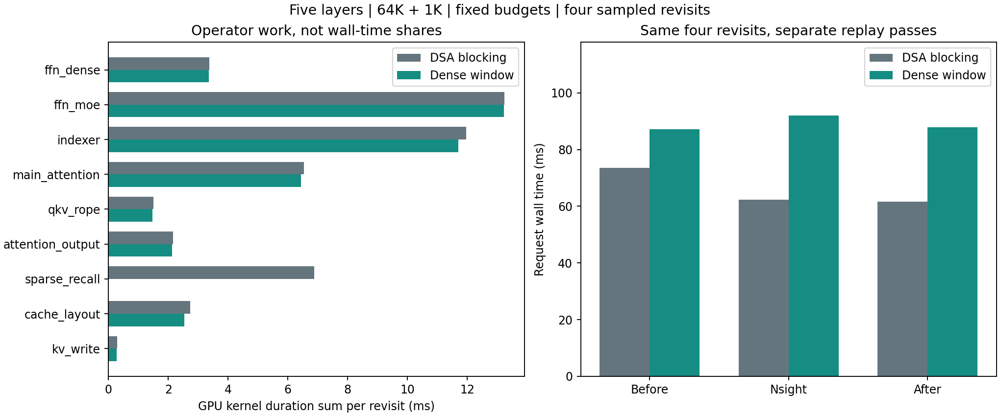
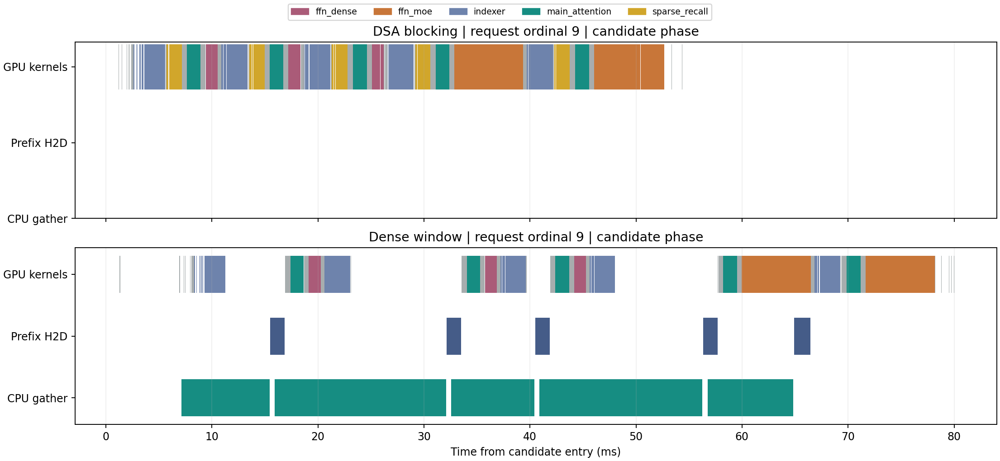

# Dense 预取与 DSA 阻塞搬运的逐层耗时分析

## 结论

本次短序列时间线表明，Dense 慢的主要位置不是 FFN、indexer 或主 attention 的计算，
而是 CPU 全量 gather 未能被跨层计算窗口充分遮挡，造成 GPU 等数据的间隙。
提前发起预取确实产生了 overlap，但前三个跨层窗口仍不足以覆盖下一层的 gather/H2D。
DSA 虽在 attention 前阻塞取回，实际取回量却约为 Dense 的五分之一，且不经过同一 CPU gather 路径。

这是对 `attention_window` + CPU staging Dense 的诊断，不是对所有 dense prefetch 实现的结论。
随后接入的 GPU-direct pinned Host 读取没有在此报告中采样；当前复现入口显式选择
`cpu_staging`，不将这里的 CPU gather 时间线解释用于 GPU-direct。
没有修改模型算法、缓存策略、精度、第三方源码或原有性能测量入口。

## 配置与计时边界

- H100 PCIe，DeepSeek-V3.2 前五层，前三层 dense FFN、后两层 MoE；64K 历史、1K 候选。
- 固定 72 GiB HBM 总预算、66 GiB Host 缓存预算，128 用户 Host 容量，66624 tokens/layer 主 KV 池。
- 使用原 `five_layer_fixed512_20261001_input_u64` 输入，先回放 ordinal 0~7 建立缓存状态，
  Nsight 采集 ordinal 8~13：首访为 8、11，复访为 9、10、12、13。四次复访均命中 Host 历史。
- 两个独立进程分别运行 DSA 与 Dense。模型预热两次后清空逻辑缓存；每进程按顺序运行
  无 Nsight 前对照、Nsight 采样、无 Nsight 后对照，每轮从空逻辑缓存回放同一前 14 个请求。
- Nsight Systems 2025.6.3，CUDA/NVTX tracing；没有逐算子同步，没有 CPU sampling。
  GPU kernel 按 CUDA API correlation ID 关联到提交线程最内层 NVTX 范围，避免嵌套重复计数。
- 三轮均保留运行时包装及传输计数；DSA 在原 recall 完成后复制计数器，请求计时外读回。
  因此无 Nsight 对照仍是有轻量插桩的诊断对照，不等同于原正式性能入口。
- 不用这 6 请求窗口推断总体 P95/QPS，也不将本次结果与旧源码的 512 请求结果直接拼接。

## 首访 复访与累计服务时间

单位：首访与复访为 ms，累计为窗口内 6 请求的 s，不包含 conditioning 的前 8 请求。

| 路径 | 采集轮次 | 首访平均 | 复访平均 | 6 请求累计 |
| --- | --- | ---: | ---: | ---: |
| DSA 阻塞搬运 | 前对照 | 3238.81 | 73.49 | 6.772 |
| Dense 提前预取 | 前对照 | 3225.65 | 87.22 | 6.800 |
| DSA 阻塞搬运 | Nsight | 3117.64 | 62.33 | 6.485 |
| Dense 提前预取 | Nsight | 3286.81 | 92.04 | 6.942 |
| DSA 阻塞搬运 | 后对照 | 3104.73 | 61.69 | 6.456 |
| Dense 提前预取 | 后对照 | 3239.73 | 87.78 | 6.831 |

前后对照有漂移，特别是 DSA 的前对照更慢，不能把前对照与 Nsight 的差直接当作 profiler 开销。
Dense 的 Nsight 复访比其前后对照高约 5%，下文时间分解全部明确为 Nsight 采样值。
三轮均观察到 Dense 复访慢于 DSA，但首访差异在前对照中很小且方向相反，不能声称首访稳定提速或减速幅度。

## 复访阶段分解

下表为四次复访的五层合计，再按请求平均；GPU 行是各 kernel duration 的总和，单位 ms。
这些行不包含 CPU gather 或 GPU 空闲时间，不应直接当作端到端占比。

| GPU 部分 | DSA 阻塞搬运 | Dense 提前预取 |
| --- | ---: | ---: |
| Q/K/V 投影与 RoPE | 1.50 | 1.47 |
| Indexer 与 top-k | 11.96 | 11.70 |
| 主 sparse attention | 6.54 | 6.44 |
| Attention 输出变换与投影 | 2.16 | 2.12 |
| 前三层 dense FFN | 3.38 | 3.36 |
| 后两层 MoE | 13.25 | 13.24 |
| Norm 与层间处理 | 0.22 | 0.22 |
| KV 写入路径的 GPU kernels | 0.29 | 0.27 |
| KV 映射与布局处理 | 2.73 | 2.54 |
| Sparse recall 路径 kernels | 6.89 | 0 |
| Forward/phase 等其他 GPU kernels | 0.33 | 0.35 |
| **GPU kernel duration 总和** | **49.26** | **41.71** |

DSA 的 sparse recall 行包含标记、去重计数、分配/回收、映射更新和从 Host 读取 KV，
不是单纯的 PCIe 传输时间。读取发生在 GPU kernel 中，不能用 memcpy 汇总代替。
Dense 的 H2D 是独立 copy engine 事件，不计入上面的 GPU kernel 总和。

| 墙钟与 IO 指标 | DSA 阻塞搬运 | Dense 提前预取 |
| --- | ---: | ---: |
| 候选 forward 墙钟时间 | 54.41 ms | 81.34 ms |
| GPU 工作时间并集，含 memcpy | 49.00 ms | 47.01 ms |
| 候选阶段无已追踪 GPU 工作的间隙 | 5.40 ms | 34.33 ms |
| CPU 全量 gather 累计 | 无此路径 | 56.11 ms |
| 完整 prefix H2D 时间并集 | 无此路径 | 6.94 ms |
| H2D 与模型计算重叠时间 | 不适用 | 1.50 ms |
| CPU gather 与模型计算重叠时间 | 不适用 | 25.61 ms |
| 消费端 CPU 等待范围累计 | 不适用 | 42.51 ms |
| 实际取回历史主 KV payload | 约 72.05 MiB | 360 MiB |

CPU/GPU 可同时运行，不能将 gather、H2D、等待与计算直接相加；消费端 CPU 等待也不是
等量 GPU 停顿。时间线上，Dense 的 34.33 ms GPU 空隙中有 24.51 ms 与 CPU gather 重合。
这里的 GPU 空隙仅表示没有采集到 kernel/memcpy/memset 工作，不是硬件 stall 指标。

候选阶段的墙钟差异可以按时间并集核对：Dense 比 DSA 多 26.93 ms，其中 GPU 工作并集
少 1.99 ms，但没有 GPU 工作的间隙多 28.93 ms。结合这些间隙与 gather 的重合，
以及下一节的 copy 完成迟到，可定位当前 gather/预取流水线为关键瓶颈，而不是 FFN 变慢。



## 为什么提前预取仍未遮住搬运

层编号从 1 开始。窗口定义为第 L 层主 attention 的首个 GPU kernel 开始，到 L+1 层
indexer 的最后一个 GPU kernel 结束。以下为四次复访的平均，单位 ms。

| 跨层窗口 | 窗口长度 | 下一层 CPU gather | H2D 完成相对下一层 indexer 结束 |
| --- | ---: | ---: | ---: |
| 1 到 2 | 5.64 | 16.29 | 晚 10.64 |
| 2 到 3 | 5.55 | 7.82 | 晚 2.24 |
| 3 到 4 | 5.66 | 15.84 | 晚 10.16 |
| 4 到 5 | 11.00 | 7.92 | 早 2.97 |

每层还需约 1.4 ms H2D。前三个窗口中，CPU gather 自身已超过可用窗口；
最后一个窗口有 MoE 计算，足以覆盖本次采样的 gather/H2D。首层没有上一层窗口，
其 gather 平均约 8.25 ms，只能尝试与首层准备/indexer 重叠。

单个候选的时间线如下：绿色 CPU 行是 gather，蓝色 copy 行是 H2D，GPU 行不同颜色表示
算子。Dense 前几层的 GPU 空隙与尚未完成的 gather 对齐；DSA 则以较短的 recall kernel
付出取回成本后继续执行。图中的 DSA 没有 prefix H2D memcpy，不代表没有 Host→GPU IO。



这证明“CPU 提前提交”并不等于“数据已经开始 DMA”，也不等于“数据能在下一层使用前到齐”。
为什么第 2、4 层 gather 比其他层慢，本次没有 NUMA/CPU 调度/内存带宽证据，暂不归因。

## 首访历史构建

64K 历史以 1K 分块 prefill，共 64 个 forward。Dense 每块重搬之前的完整 prefix，
五层累计 payload 为 `5 * 1152 * 1024 * (0 + 1 + ... + 63)`，约 **11.07 GiB**，
与计数器和 Nsight memcpy 字节一致，不含最后一次候选的 360 MiB。

两个采样首访中，DSA prefill 的实际 recall 字节数均为 0。当前 HBM 主池可容纳完整活动
上下文，因此历史构建过程中写入的 KV 可被继续使用；但每层仍执行 recall 检查和元数据 kernel。

| 历史 prefill 指标，按两次首访平均 | DSA | Dense |
| --- | ---: | ---: |
| 墙钟时间 | 3049.08 ms | 3192.88 ms |
| Dense FFN GPU kernels | 216.83 ms | 216.79 ms |
| MoE GPU kernels | 849.35 ms | 848.79 ms |
| Indexer GPU kernels | 446.51 ms | 442.14 ms |
| 主 attention GPU kernels | 424.44 ms | 424.18 ms |
| Recall 路径 GPU kernels | 415.61 ms | 0 |
| CPU gather 累计 | 无此路径 | 1403.13 ms |
| Prefix H2D 时间并集 | 无此路径 | 231.07 ms |
| GPU 工作间隙 | 239.55 ms | 684.56 ms |

Dense 去掉了 DSA recall 检查开销，但增加了重复 gather/搬运及空隙；不能把 1403 ms gather
全部算成额外延迟，其中相当部分与计算重叠。首访与复访必须分开讨论。

## 后续优化方向

优先减少或消除 CPU 全量 gather，例如验证连续历史布局能否直接 DMA、改进 gather 实现，
并针对慢层检查 NUMA 放置和实际内存吞吐。此处只是后续假设，尚未实现或验证。
仅进一步移动提交位置，不改变 8~16 ms 的 gather 成本，未必能让约 5.6 ms 的窗口足够用。
更深预取或更多 buffer 需要另行核算预算与依赖，不能视为本次相同配置下的免费收益。

## 复现与数据

```bash
bash experiments/gr_cache_serving/scripts/run_parts_profile.sh sparse_sync parts_20261002_dsa
bash experiments/gr_cache_serving/scripts/run_parts_profile.sh dense_prefetch parts_20261002_dense
uv run --no-project --python 3rdparty/ECHO/.venv/bin/python --with matplotlib==3.10.7 \
  python -B -m experiments.gr_cache_serving.src.analyze_parts \
  experiments/gr_cache_serving/output/data/parts_20261002_dsa \
  experiments/gr_cache_serving/output/data/parts_20261002_dense \
  --output-dir experiments/gr_cache_serving/report/parts_20261002
```

入口拒绝覆盖；再次运行需使用新 run ID/输出目录。采集复用 `replay.load_trace/source_fingerprints`、
现有 `EchoCacheManager/open_echo_runner`、checkpoint audit、HBM budget/guard 和 Host preflight/guard。
计时包装只在独立进程运行期间安装并在退出时恢复，不修改第三方文件。

原始 summary、源码快照位于 `output/data/parts_20261002_{dsa,dense}/`，原始 Nsight report 与
SQLite 位于 `output/profile/parts_20261002_{dsa,dense}/`，日志位于对应 `output/log/`。
[manifest](manifest.json) 保存 run ID、输入 summary 校验和、分析器指纹及归属覆盖度。
未归属 GPU 工作总和分别为 0.331/0.279 ms，主要是请求外检查，不以零丢失宣称完美覆盖。

逐请求阶段见 [phases.csv](phases.csv)，逐层算子见 [parts.csv](parts.csv)，
CPU gather/H2D/等待见 [io_layers.csv](io_layers.csv)，跨层窗口见 [windows.csv](windows.csv)，
kernel 明细见 [kernels.csv](kernels.csv)。CSV 层号从 0 开始。

新增 6 项 CPU 测试通过；两条路径所有 warmup/回放输出均通过有限值检查，缓存轮次结束后
全部逻辑槽位释放，源码冻结校验通过。算法未变，本次不替代此前五层数值正确性验证。
GPU 独占与 Host 条件检查通过，NVML 峰值约 39.22/39.20 GiB，pinned 峰值分别为
64/64.25 GiB 加 13 B；进程 RSS 峰值约 68.48/68.73 GiB，包含 profiler、模型和输入。
