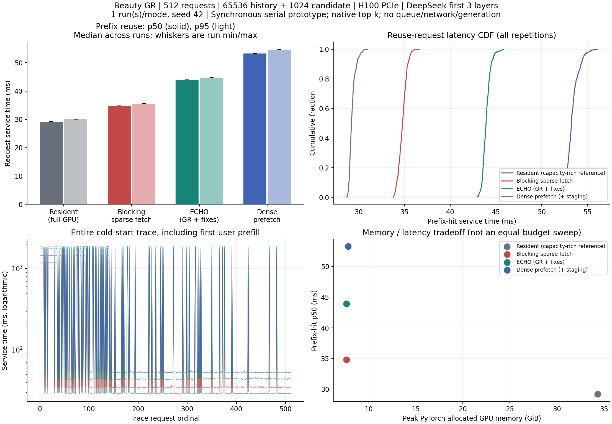

# GR 缓存复用与数据搬运：实验流程与结果

实验日期：2026-09-30。本文整理已完成的首轮测量，不代表重新运行实验。

## 1. 这次想回答什么问题

GR 请求可以分成两部分：**同一用户相对固定的历史，以及每次请求变化的候选内容**。
如果每次都重新计算长历史，开销会很大。因此，我们希望：

1. 用户第一次来时，先计算历史，生成可复用的 KV 缓存，这一步称为 prefill。
2. 同一用户再次来时，复用历史缓存，只对本次候选做新的前向计算。
3. 历史缓存太大时，把完整历史放在主机内存里，GPU 显存只保留一部分；计算时再搬入需要的数据。

本轮重点是第三步：**历史已缓存之后，怎样把数据搬到 GPU，延迟和显存代价分别是多少？**
比较三种搬运方式，并增加“所有历史都放在 GPU”作为参照。

先说明结论：在本轮配置中，ECHO 适配版比全量搬运的复访延迟低，但没有超过“先选再搬”的阻塞式方案。
Offload 明显减少了 GPU 上的内存占用，但本轮尚不能证明热度策略或搬运与主 attention 重叠的收益。

## 2. 先把几个词说清楚

| 词语 | 本文中的含义 |
| --- | --- |
| KV 缓存 | 历史已经计算过的中间数据。复访时复用它，不必从头重算历史；不是缓存最终推荐答案。 |
| HBM | GPU 显存。GPU 可以直接使用，但容量有限。 |
| Host / DRAM | 主机内存。本实验把完整历史 KV 放在这里，再按需搬到 GPU；没有使用 CXL 或 RDMA。 |
| Offload | 把完整历史 KV 放在主机内存，GPU 只保留部分副本和工作数据。 |
| Indexer | 为当前计算挑选要关注的历史位置的模块。它自己也有缓存，与用于主 attention 的历史 KV 分开管理。 |
| Sparse attention | 只对选中的历史位置做 attention，而不是对全部历史做 attention。 |
| Prefetch | 预取：提前把可能需要的数据搬到 GPU，争取减少后续等待。 |
| Overlap | 两件事在时间上重叠，例如一边计算、一边搬数据。用了多个 stream 不等于已经证明重叠有效。 |

**本轮四组都使用 sparse attention。Dense prefetch 的“全量”指搬运全量历史，不是改成 dense attention。**

## 3. 四组方案分别怎么做

### 3.1 一张表看懂区别

以下描述的是处理当前用户时，每层历史数据如何到达 GPU；新候选的 KV 由该层在 GPU 上生成。

| 本文使用的方案名 | 历史数据放在哪里 | 计算前怎么拿到数据 | 用它回答什么问题 |
| --- | --- | --- | --- |
| 全部历史留在 GPU（Resident） | 为所有可保留用户的历史预留 GPU 空间 | 已经在 GPU，不需要从主机搬历史 KV | 显存充足、不需要搬运时，能有多快？ |
| 先选再搬（阻塞 sparse fetch） | 完整历史在主机，GPU 保留部分副本 | 先选历史位置；已在 GPU 的直接用，缺少的搬齐后再做 attention | 只搬需要的数据，但不把搬运与计算重叠，表现如何？ |
| 边选边预取（ECHO 适配版） | 完整历史在主机，GPU 保留部分副本 | 选位置的过程中预取预测会用到的数据；选择结束后补齐仍缺少的数据，再做 attention | 提前搬运能否减少“选完之后还要等数据”的时间？ |
| 当前用户历史全搬（Dense prefetch） | 完整历史在主机，GPU 另加双缓冲 | 不等选择结果，每层都搬入当前用户全部已有历史；尝试提前搬下一层数据 | 多搬数据、争取提前准备，是否比按需搬运更划算？ |

可以把四组记成：**都在 GPU、先选再搬、边选边搬、不等选择全搬。**

### 3.2 容易混淆的地方

- **Resident 不是相同显存预算下的对手。** 它用更多显存保存所有用户历史，是容量充足时的参照。
- **阻塞 sparse fetch 不是完整 HiSparse 复现。** 本轮只把它作为“没有搬运与计算重叠”的按需搬运对照。
- **ECHO 的重叠对象主要是 indexer 计算与预取。** 不能把本轮结果表述为“主 attention 与 fetch 已有效重叠”。
- **Dense prefetch 只全搬当前用户的历史，不是每次搬所有用户。** 它保留原 KV 写入池，另外增加双缓冲；也没有利用原池中的历史命中来省略全量传输。
- **ECHO 是 GR 适配加正确性修复后的派生版本。** 不是未修改的论文原版；修复内容见第 8 节。

## 4. 请求和缓存如何流转

### 4.1 首次访问

```text
用户 A 第一次请求
  -> 没有可复用的历史缓存
  -> 对 64K 历史前缀做 prefill，建立缓存
  -> 利用这份历史缓存计算本次 1K 候选
  -> 返回候选 hidden states
  -> 释放本次候选的临时缓存，保留用户 A 的历史缓存
```

历史 prefill 按每块 1024 token 执行。首访计时包含历史 prefill 和候选计算，不只是建立缓存的时间。

### 4.2 再次访问

```text
用户 A 再次请求，历史不变、候选变化
  -> 找到可复用的历史缓存，不重新 prefill
  -> 按所选方案，准备本次计算需要的 GPU 历史数据
  -> 计算新的 1K 候选
  -> 返回候选 hidden states
  -> 释放本次候选的临时缓存，继续保留历史缓存
```

**从 DRAM 把已有 KV 搬回 GPU，不等于重新 prefill。** 前者是搬数据，后者是重新运行模型计算历史。
候选缓存不会并入长期用户历史，避免上一次候选影响下一次请求。

### 4.3 这轮有没有按热度管理缓存

输入具有冷热用户分布，但本轮**没有启用额外的用户热度保留策略**，也没有提前读取未来请求。
ECHO 路径沿用其原生 FIFO/优先级管理和预取机制，不能笼统称为“按用户 LRU 管理 HBM”。

主机上的历史缓存使用用户级 LRU：容量不足时淘汰最久未使用用户的完整历史。
但本轮容量足以容纳 128 个用户，只实际访问了 115 个用户，所以四组的主机历史淘汰次数都为 0。
397 次复访都成功复用了历史；这说明“不必重新 prefill”，**不说明所需 KV 全部命中 HBM**。

Indexer 缓存仍按完整历史容量预留在 HBM，本轮约占 3.094 GiB；它没有随主 KV 一起 offload。
因此这里不是“所有类型的 cache 都能自由在 HBM 和 DRAM 之间分层”。

## 5. 实验配置与执行流程

### 5.1 固定配置

| 项目 | 本轮实际配置 |
| --- | --- |
| GPU | 单张 NVIDIA H100 PCIe 80GB |
| 模型 | 真实 DeepSeek-V3.2 checkpoint 的 embedding 和完整前三层，不是完整 61 层模型 |
| 输出 | GPU 上的候选 hidden states；不运行最终 norm、LM head，不生成推荐答案 |
| 精度 | FP8 权重；BF16 activation 和主 KV；FP8 index K 加 FP32 scale |
| 软件 | Python 3.12.14，PyTorch 2.8.0 / CUDA 12.8，SGLang 0.5.3.post3，ECHO 独立环境 |
| 输入来源 | Beauty 热度曲线驱动的合成 GR 请求，不是真实线上请求日志 |
| 用户和请求 | 128 个用户的候选总体，实际访问 115 个用户；共 512 条请求，115 次首访、397 次复访 |
| 每条请求长度 | 65536-token 固定前缀，其中指令 23 token、历史 65513 token；另加 1024-token 候选后缀 |
| 用户复访语义 | 同一用户的历史前缀不变，候选后缀变化 |
| 主机历史容量 | 可容纳 128 份用户历史，另预留候选及对齐空间 |
| 三组 offload 的主 KV 显存池 | 每层 66624 个 token 槽位，三层合计约 219.59 MiB；这不是总显存占用 |
| 额外缓冲 | Dense prefetch 另占约 178.79 MiB 持久 HBM staging / mapping，不能忽略 |
| 重复次数 | 每种方案各运行一次完整请求流，固定 seed 42；没有多种子或多轮置信区间 |

三组 offload 的主机 KV 池约为 27.00 GiB。这是预留池容量，不是整个进程的主机内存峰值。

### 5.2 实际执行顺序

1. 准备同一份完整请求流，核对请求数量、token 边界、输入指纹和同用户历史一致性。
2. 独立完成正确性验证；发现并修复长上下文同步和大主机地址访问问题后，再进行有效测量。
3. 每组启动独立进程，加载相同权重和对应缓存路径。
4. 用第一条请求执行两次预热，然后释放所有历史和设备 KV 槽位，确认逻辑缓存为空。即“算子已预热，用户缓存从空开始”。
5. 按相同顺序串行执行全部 512 条请求。一条结束后立即处理下一条，不按输入的到达时间戳等待，也不做请求 batching。
6. 逐请求记录首访或缓存复用、服务耗时、prefill / 候选阶段耗时，以及是否发生历史淘汰；另记录显存峰值。
7. 在请求计时之外检查输出是否存在 NaN / Inf。完整成功且源码指纹未变化时，才发布数据和日志。
8. 汇总四组有效结果，生成表格和分布图。失败运行和用于定位错误的同步诊断运行不进入结果。

本轮性能路径使用原生 top-k 次序，没有开启正确性测试专用的排序控制。

### 5.3 “端到端”计时从哪里到哪里

这里测的是**本地串行原型的一次完整请求处理时间**，不是完整在线推荐服务的端到端延迟。

| 计时包含 | 计时不包含 |
| --- | --- |
| 请求校验、历史摘要和缓存查找 | 请求流文件读取、预先生成 token |
| 必要的缓存管理和数据搬运 | 模型加载、算子预热 |
| 首访的历史 prefill、所有请求的候选前向计算 | 网络传输、服务队列等待、调度系统 |
| 每次 forward 的 GPU 完成同步、候选缓存释放 | 输出有限性检查、日志、进程退出 |

当前执行器每次 forward 都同步，包括历史 prefill 的每个 1024-token 分块。
因此结果反映的是当前同步原型，不是充分优化后的异步 serving 上限。

## 6. 实验结果：表格应该怎样读

### 6.1 先解释列名

- **首次来访的典型耗时（P50）**：115 次首访耗时从小到大排序后的中位数，约一半首访比它快。包含建立历史缓存和计算本次候选。
- **再次来访的典型耗时（P50）**：397 次成功复用历史请求的中位数。它最直接反映“历史已经缓存后，一次请求要多久”。
- **再次来访的较慢情况（P95）**：约 95% 的复访在这个时间内完成，约 5% 更慢。它不是最大值，也不是 95% 置信区间。
- **峰值显存占用**：PyTorch 统计的峰值 allocated，包括模型、缓存和其追踪到的临时张量，不只是 KV 缓存；不是 `nvidia-smi` 总占用，也不是 PyTorch reserved。

耗时单位为毫秒（ms），越低越好；显存单位为 GiB，1 GiB = 2^30 字节。较少显存通常意味着可以容纳更多用户或更大的模型，但本轮没有测量这种扩容能力。

### 6.2 主要结果

| 方案：一句话说明 | 首次来访的典型耗时（P50） | 再次来访的典型耗时（P50） | 再次来访的较慢情况（P95） | 峰值显存占用（PyTorch allocated） |
| --- | ---: | ---: | ---: | ---: |
| **全部留在 GPU**：不从主机搬历史 KV | 1180.66 ms | 29.19 ms | 30.05 ms | 34.31 GiB |
| **先选再搬**：只搬选中且 GPU 缺少的数据，搬完再算 | 1455.90 ms | 34.79 ms | 35.58 ms | 7.62 GiB |
| **ECHO 适配版**：边选边预取，最后补齐缺少的数据 | 1861.83 ms | 43.92 ms | 44.74 ms | 7.62 GiB |
| **当前用户历史全搬**：不等选择，每层搬全量历史 | 1756.93 ms | 53.26 ms | 54.61 ms | 7.80 GiB |

例如 ECHO 这一行表示：第一次处理一个用户通常需要约 **1.86 秒**；历史缓存建立之后，后续请求通常约 **43.92 毫秒**，约 95% 的复访不超过 **44.74 毫秒**。
它并不表示每个用户只占 7.62 GiB，也不表示所有缓存都留在显存。

四组均完成 512 条请求，均为 115 次首访、397 次历史复用、0 次主机历史淘汰。
表中的相近显存值不代表强制相同总 HBM 预算：Resident 预留全量历史，Dense prefetch 有额外缓冲。

### 6.3 为什么还要看整轮时间

| 方案 | 512 条请求的累计服务时间 |
| --- | ---: |
| 全部留在 GPU | 147.46 s |
| 先选再搬 | 181.21 s |
| ECHO 适配版 | 231.42 s |
| 当前用户历史全搬 | 223.29 s |

累计服务时间是每条请求计时之和，不含加载、预热、检查和日志，也不是按真实到达时间运行后的总完成时间。

ECHO 的历史 prefill 阶段占本轮累计服务时间约 **90.1%**。因此，虽然 ECHO 的复访比全量搬运快，整轮却比全量搬运慢。
这也是为什么必须把首访和复访分开报告，不能只用一个平均延迟概括缓存收益。

### 6.4 直接从数据得到的观察

1. **三组 offload 中，“先选再搬”这轮最快。** ECHO 的复访 P50 比它高约 26.2%，累计服务时间高约 27.7%。目前不能认为预取已经带来净收益。
2. **ECHO 的复访比全量搬运快。** 复访 P50 低约 17.5%，但累计服务时间高约 3.6%，需要同时考虑首访比例。
3. **Offload 显著降低显存占用，但有延迟代价。** ECHO 相对全量 Resident 的峰值 allocated 低约 77.8%，复访 P50 高约 50.4%。这是当前配置的取舍，不是同显存预算下的性能结论。
4. **历史复用避免了再次 prefill。** 本轮所有复访都复用了历史，但没有“每次都重新 prefill”的独立消融，不能把首访与复访之比直接当成公平的缓存加速比。



图中 `resident` 对应“全部留在 GPU”，`sparse_sync` 对应“先选再搬”，`echo_gr_adapted` 对应“ECHO 适配版”，`dense_prefetch` 对应“当前用户历史全搬”。
每组只有一次完整运行，图中的重复运行 min/max 标记不代表置信区间。原始数值汇总见 [summary.csv](summary.csv)，图表来源见 [manifest.json](manifest.json)。

## 7. 对论文 motivation，目前能说到哪一步

| 想说明的论点 | 本轮证据到什么程度 | 还需要什么实验 |
| --- | --- | --- |
| 为什么考虑 offload | 支持“可以用更低的显存占用处理同一请求流，但增加延迟” | 同总 HBM 预算下，与仅用 HBM 缓存并允许淘汰重算的方案比较；增加用户规模 |
| 为什么少搬数据 | 按需搬运的复访延迟低于本轮全量搬运方案 | 记录真实搬运字节数、HBM 命中率，分解主机 gather 和传输耗时 |
| 为什么用 sparse attention | 本轮不能回答；四组全是 sparse attention | 增加 dense attention 对照，并评估输出或推荐质量 |
| 为什么让 fetch 与主 attention overlap | 本轮不能证明；没有对应隔离对照和时间线 | 实现或接入主 attention overlap 路径，比较开关 overlap，并用 profiler 验证 |
| 为什么需要热度管理 | 本轮不能证明策略收益；只有热度分布输入，没有额外热度策略对照 | 固定字节预算，比较不同保留策略，改变冷热分布，并让容量不足触发淘汰 |
| ECHO 是否适合实际在线 serving | 只得到当前三层串行原型上的第一轮结果 | 多轮、多种子、到达时间回放、队列和并发，以及给定延迟目标下的吞吐测试 |

因此，本轮最稳妥的总结是：**在这组 GR 请求上，历史复用和 offload 已能完整执行；按需搬运比当前全量搬运方案更有利于复访延迟，但 ECHO 的预取机制尚未优于阻塞式按需搬运。具体瓶颈仍需测量定位。**
不能仅凭这些延迟数字断言是预测不准、传输争用或某个 kernel 导致 ECHO 更慢。

## 8. 正确性与实现边界

为支持 GR 历史复用和本轮长上下文请求，实现做了以下适配和修复：

| 改动 | 通俗解释 |
| --- | --- |
| 用户历史与候选生命周期分离 | 历史可以跨请求保留；本次候选用完释放，不污染下一次请求 |
| GR recall 空闲槽位适配 | 搬回缺少的 KV 时，先使用已有空位，只淘汰确实不够的部分 |
| ECHO phase snapshot 修复 | 修复长上下文预取中的线程同步分支竞态，避免执行挂起 |
| Host 地址改用 64 位计算 | 主机 KV 池较大时，避免地址乘法溢出，导致错误访问 |

这些通过自有适配代码和独立 kernel overlay 生效，没有修改第三方 checkout 或已安装包的源文件，但执行行为已经改变，所以仍然必须称为派生版本。

已有 107 项聚焦 CPU 测试通过，未运行全仓库回归。新增大地址修复后，跨 4 GiB 主机地址的 GPU 回归以及 64K 历史 + 1K 候选四路径交叉正确性检查通过。
4K + 1K 曾在此前通过，但没有在新增大地址修复后再次运行。

交叉正确性检查使用测试专用 top-k 次序控制，并按 `rtol=0.02, atol=0.02` 对照 Resident；其耗时不用于本报告。
正式回放不使用该排序控制，每条输出只检查有限性。这不等于证明原生路径逐元素确定性，也不等于验证推荐质量。

## 9. 数据来源与复现

实验代码、运行入口和依赖细节见 [实验 README](../../README.md)。

有效运行 ID：

| 方案 | Run ID |
| --- | --- |
| 全部留在 GPU | `serial_beauty_64k_resident_i64_r1_20260930` |
| 先选再搬 | `serial_beauty_64k_sparse_i64_r1_20260930` |
| ECHO 适配版 | `serial_beauty_64k_echo_i64_r1_20260930` |
| 当前用户历史全搬 | `serial_beauty_64k_dense_i64_r1_20260930` |

以下路径均相对于 `cxldsagr` 仓库根目录：

- 输入：`experiments/gr_cache_serving/output/data/input_beauty_128_512_20260929_v2/requests.jsonl`。
- 输入 SHA256：`b46b9c8a04f2b955f41cff9ec194e367975fe23aff64296fda36e08e9216807d`。
- 每组汇总、逐请求记录和测量时源码快照：`experiments/gr_cache_serving/output/data/<run_id>/`。
- 每组运行日志：`experiments/gr_cache_serving/output/log/<run_id>/`。
- ECHO 固定源码版本：`bc1b75c1000010d0ac6f032ebaac283255c050b1`；各修复指纹保存在每组 `summary.json` 中。

已有环境和输入就绪后，从仓库根目录运行以下命令，可创建新一轮测量。示例使用新的 run ID，不覆盖本轮结果；若已使用过这些名称，需要再次换名。

```bash
bash experiments/gr_cache_serving/scripts/run_replay.sh resident serial_beauty_64k_resident_i64_r2_20260930 --repetition 2
bash experiments/gr_cache_serving/scripts/run_replay.sh sparse_sync serial_beauty_64k_sparse_i64_r2_20260930 --repetition 2
bash experiments/gr_cache_serving/scripts/run_replay.sh echo_gr_adapted serial_beauty_64k_echo_i64_r2_20260930 --repetition 2
bash experiments/gr_cache_serving/scripts/run_replay.sh dense_prefetch serial_beauty_64k_dense_i64_r2_20260930 --repetition 2
```

以上是复现命令，**不表示第二轮已经运行**。图表由 `experiments.gr_cache_serving.src.report_replay` 从四组有效运行生成，完整命令见实验 README。
