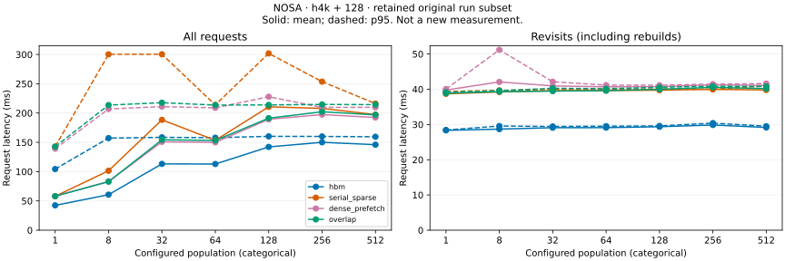
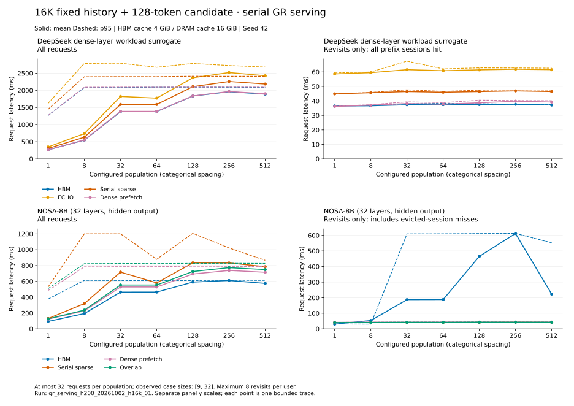
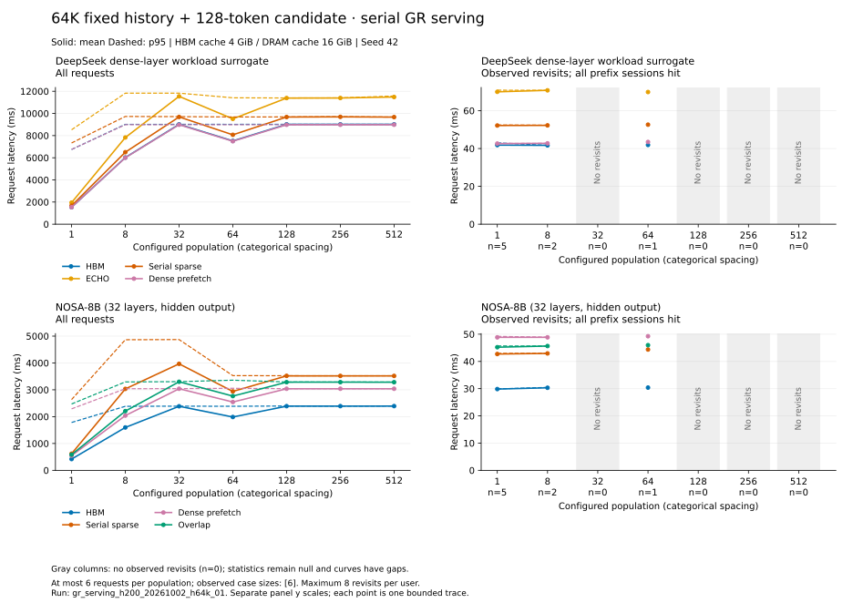

# GR 多用户 Serving 缓存对照

本实验测量固定用户 history、变化 candidate 的串行请求延迟，并分别报告完整轨迹、
首次访问和复访。仅使用一张 GPU，不包含网络服务、并发排队或模拟到达时间等待。
本目录保留 NOSA 原 4K/16K/64K 短热度轨迹的子集，沿用原 run ID、实现身份和
测量边界；提取与重绘不形成新的 NOSA 测量，也不增加全过程硬预算验收证据。

DeepSeek 的 [ECHO cache 分析](../deepseek_v32_echo_cache/README.md) 给出固定 P/NH
的静态容量边界；[motivation 实验](../deepseek_v32_motivation/README.md) 单独测量
16 用户两轮、P=65,536、NH=16,777,216 的四方案端到端延迟。原 DeepSeek
4 GiB / W / chunk 对照已撤回；本页的 NOSA 数据与测量边界独立保留。

## 内容与测量边界

- NOSA 比较 HBM、serial sparse、dense prefetch、attention 与 sparse fetch overlap。
- 每组对照使用相同的申报 cache 配额，同时报告预留与观测分配。模型权重和普通
  activation 单独说明。HBM 配额是实验控制条件，远小于 H200 的物理显存；超过这项
  配额不等于耗尽整卡显存。申报字节与请求边界采样不能单独证明全过程均在硬预算内。
- 跨请求保留固定用户 prefix session，按 session LRU 淘汰；candidate 完成后截短到
  固定 history。命中依据实际 session 状态及精确 token identity。
- `latency_ms` 是同步后的逐请求墙钟时间，包含 miss 时的 prefix 构建、candidate
  执行、截短和清理；有单独计时的 `prefix_ms`、`extend_ms`、`cleanup_ms` 同时报出。
  权重加载、编译、独立预热和 workload 生成不计入请求延迟，各方案从独立空 cache 开始。
- `visit_index > 0` 就是复访，即便此前历史被淘汰、当前需要重建。报告数量、均值、
  中位数、p95/p99；分位数使用 `(n - 1) * p` 位置线性插值。单条 trace 的尾分位数
  是描述统计，不是置信区间；无复访为 null，不写成零。

## 保留的 NOSA 短轨迹

NOSA 严格加载完整 NOSA-8B checkpoint 的 32 层，执行完整 sparse selection、CIS
与 causal attention，返回全部 candidate normalized hidden，不执行 LM head/decode。
dense prefetch 搬运整层历史 K/V，attention 仍使用同一稀疏选择。原 offload 为完整
逻辑地址的一层 staging，dense 为两层交替 staging；没有 token/page slots 或页级
eviction。旧准入根据每用户预留上界分配 session；报告分别列 cache 分配、准入预留
和 CUDA allocator 峰值，三者不混用。

保留子集共 84 cases、1776 条测量/数值记录和 1332 条非 HBM 完整 candidate hidden
逐元素一致记录。每长度 28 cases、84 个 all/first/revisit summary groups；4K/16K
各保留 603 条非 HBM 比较，64K 为 126。`retained_subset` 记录原审计依据和提取身份：
原数值记录及 NOSA raw 字节保持，未在发布阶段重新执行模型，原源码也未重签。

| 固定历史 | 原 run ID | 每档请求上限 | NOSA 请求数 | HBM 复访 miss / 每方案复访数 | 报告 |
| --- | --- | ---: | ---: | ---: | --- |
| 4K | `gr_serving_h200_20261002_h4k_01` | 32 | 804 | 0 / 63 | [4K](#4k-nosa-结果) |
| 16K | `gr_serving_h200_20261002_h16k_01` | 32 | 804 | 13 / 63 | [16K](#16k-nosa-结果) |
| 64K | `gr_serving_h200_20261002_h64k_01` | 6 | 168 | 0 / 8 | [64K](#64k-nosa-结果) |

三个长度各档的全部请求均值仍均为 HBM 最低。16K 的旧准入规则下，HBM 有 13 次
复访重建，三个 offload 方案均没有；这是该短轨迹在原申报配额下的观测，不能
外推为其他输入或配置的容量结论。4K、64K 未观察到复访重建。64K 只有六请求
窗口，四档没有复访，不与 32 请求窗口直接计算跨历史加速比。

Overlap 相对 serial sparse 的全部请求均值在 21 个长度/用户组合中有 20 个更低，
但复访均值没有稳定改善；全请求时间包含冷 prefix 构建。九个独立 layer-31 overlap
样本的 page/stripe ratio 均未达到 90%，机制区间只覆盖实际 softmax，不替代未插桩
请求延迟。原算子测量边界另见[算子实验](../nosa_offload_overlap/README.md)。

### NOSA workload、硬件与计量

复用 [GR 请求生成器](../../GR/README.md) 的 Beauty `interaction_count` 累计热度曲线，
通过分段线性插值生成用户概率，文本为合成的可读 history/candidate，不含真实推荐标签。
原七档配置人数为 1/8/32/64/128/256/512，seed=42；按热度有放回抽样，每用户最多
复访 8 次，达到上限后移出采样，不分配配额、不强制首访或补齐访问。
用户总体大小不能代替 trace 实际访问人数；固定很短的请求窗口也不能证明用户规模
扩展能力。当前 IID 无 cap 热度入口尚未完成 GPU 补测，原数字不代表新请求构造。

history 包含指令与历史的完整 KV prefix，candidate 精确表示变化 suffix，不能用 GR
的 `user_tokens` / `item_tokens` 代替。每用户 history 固定，candidate 随 visit 改变。
每档只生成一次 workload，四方案共享请求顺序和内容；manifest 保存实际请求/用户/
复访覆盖、逐用户次数、tokenizer/热度资源 hash、每请求完整 input/prefix/candidate
hash 与整体 `workload_sha256`。只有真正复访过已淘汰用户，才观察到相应重建成本。

三个原 run 使用同一 NVIDIA H200（SM90，132 SM，150,121,545,728 B 物理显存），
pinned backing 为默认进程 NUMA 策略下的本机 CPU DRAM。依赖为 Python 3.12.13、
PyTorch 2.12.1+cu130、CUDA 13.0、Triton 3.7.1、FlashInfer 0.6.18、
TVM FFI 0.1.13.post3、Safetensors 0.8.0、Tokenizers 0.23.2；NOSA 使用 BF16。
输入分别为 4096/16384/65536 + 128，prefix C=1024，申报 cache 配额为 HBM 4 GiB /
DRAM 16 GiB。每方案先执行 2 条不计入结果的预热请求，各档从独立空 cache 执行
同一 trace；每条正式请求只测一次。配置与完整依赖分别保存在各长度 metadata。

Cache 表中的单 session 预留用于原准入，边界 cache 峰值为请求边界观测到的自有分配，
两者均不等于全过程峰值。`cache_and_memory.csv` 保留精确字节，分列 truncate 后分配、
请求边界分配、准入预留和 CUDA allocator。派生容量按原账本记录，子集提取
不构成新的全过程预算验收。

CUDA allocator allocated/reserved 包含当时进程的全部存活分配、模型切换遗留对象和
此前保留的 allocator blocks，不是干净的单模型峰值，也不等于物理进程显存峰值。
首组 NOSA HBM allocated 峰值 26,273,759,232 B 含模型切换保留。NOSA 的
8,185,270,336 个 BF16 参数对应 16,370,540,672 B 逻辑载荷；candidate hidden
`[128,4096]` BF16 为 1,048,576 B，二者都是张量载荷，不包括中间 activation 或
算子临时空间。普通 activation 没有独立峰值测量，不能用上述数值相减得到。

### 子集报告及原始来源

[retain_nosa_subset.py](src/retain_nosa_subset.py) 逐字节保留原 NOSA JSONL 行、
workload 和 HBM reference，利用原冻结 `report.py` 重算统计，全部 NOSA groups
与原值一致。原 source/manifest 保留；metadata/audit/provenance 明示 `retained_subset`
及原文件 hash，不延续原双模型整矩阵的 accepted 声明。

当前 summary/per-request 图由子集工具生成，summary 与 summary_readable 是同图
别名；逐请求图同理。配置人数使用等距类别轴，实线为均值、虚线为 p95；空组保留
null/n=0 和断点。逐请求横轴为真实整数 ID，空心表示首访、实心表示复访。每长度
只有两个 NOSA 汇总面板和七个逐请求面板，重绘不改变测量或统计。

`population_coverage.csv` 保留原 metadata 的一致访问计数；`cache_and_memory.csv`
按 NOSA 过滤，字段及各档最大值规则不变。各长度 provenance 记录原/新来源；旧
可读图渲染器及命令仍留作当时的复现记录，当前子集图由上述提取工具生成。

三个独立 profile 的原 metadata、实际工作区间、输入/输出张量和 source 身份保持。
仅 profile 内复制的 `formal_inputs/latency_metadata.json` 提取为 NOSA 子集，并有
`subset_retention.json` 记录原/新 hash；这不属于重新采集或重新接受 profile。
原始数据位于各 run 的 `output/data/`，stdout/stderr 位于对应 `output/log/`，原始
profiler 产物位于 `output/profile/`，这些被忽略的路径只按普通代码列出。

## 4K NOSA 结果

来源为 `gr_serving_h200_20261002_h4k_01` 的原 NOSA 子集。[metadata](report/h4k/metadata.json)与
[子集审计](report/h4k/audit.json)保留 28 cases、804 条测量/数值记录和
603 条非 HBM hidden 对相同输入 HBM 参考的逐元素一致记录（`atol=rtol=0`）。
这是原已保存数值记录的核验及子集提取，未重新执行模型。153 个原源文件的身份见
[source_manifest.json](report/h4k/source_manifest.json)，整体 SHA 为
`67f91c34ead43d4056500661caa1c67e8ef8a50bc25327e081a0561bbab43060`。
基准 Git revision 为 `16dc058014ee0474a0fa0893ad89271b890aeb92`，
测量包含 manifest 记录的工作区修改。

### 4K 实际访问覆盖

| 配置用户数 | 请求数 | 实际用户数 / 首访数 | 复访数 | 实际最大复访数 |
|---:|---:|---:|---:|---:|
| 1 | 9 | 1 | 8 | 8 |
| 8 | 32 | 8 | 24 | 8 |
| 32 | 32 | 21 | 11 | 2 |
| 64 | 32 | 21 | 11 | 3 |
| 128 | 32 | 28 | 4 | 2 |
| 256 | 32 | 30 | 2 | 1 |
| 512 | 32 | 29 | 3 | 1 |

完整覆盖见[population_coverage.csv](report/h4k/population_coverage.csv)。每档计数是
每个方案的请求数，不能再乘四当作用户数。N=128/256/512 只有 4/2/3 次复访，p95
只描述这些小样本，不能推断稳定服务尾延迟。

### 4K 请求延迟

下表每格为均值 / p95，单位 ms；“全部”包含冷 prefix 构建，“复访”包含实际重建。

| 用户数 | 请求范围 | HBM | Serial sparse | Dense prefetch | Overlap |
|---:|---|---:|---:|---:|---:|
| 1 | 全部 | 42.41 / 104.33 | 57.91 / 142.74 | 58.16 / 139.20 | 58.07 / 142.71 |
| 1 | 复访 | 28.34 / 28.42 | 38.72 / 39.37 | 39.77 / 40.06 | 38.87 / 39.15 |
| 8 | 全部 | 60.66 / 157.22 | 101.49 / 300.31 | 83.28 / 206.99 | 82.84 / 213.60 |
| 8 | 复访 | 28.69 / 29.57 | 39.24 / 39.68 | 42.08 / 51.20 | 39.34 / 39.59 |
| 32 | 全部 | 113.20 / 158.54 | 188.43 / 300.43 | 150.88 / 211.06 | 154.32 / 217.72 |
| 32 | 复访 | 29.09 / 29.44 | 39.58 / 39.92 | 40.95 / 42.13 | 39.47 / 40.28 |
| 64 | 全部 | 112.99 / 157.95 | 153.41 / 213.90 | 149.97 / 208.96 | 153.24 / 213.63 |
| 64 | 复访 | 29.10 / 29.52 | 39.62 / 40.01 | 40.70 / 41.18 | 39.62 / 40.16 |
| 128 | 全部 | 142.20 / 160.27 | 210.67 / 301.91 | 189.39 / 227.86 | 191.24 / 213.92 |
| 128 | 复访 | 29.37 / 29.59 | 39.75 / 40.13 | 40.76 / 41.15 | 39.99 / 40.57 |
| 256 | 全部 | 150.07 / 160.09 | 207.95 / 253.67 | 197.43 / 209.66 | 202.26 / 214.70 |
| 256 | 复访 | 29.86 / 30.40 | 39.97 / 40.04 | 41.26 / 41.45 | 40.55 / 40.85 |
| 512 | 全部 | 146.01 / 159.55 | 197.37 / 216.17 | 192.45 / 209.86 | 196.91 / 214.44 |
| 512 | 复访 | 29.16 / 29.52 | 39.81 / 40.92 | 41.11 / 41.62 | 40.19 / 40.82 |



[汇总 PNG](report/h4k/summary_readable.png)、[汇总 SVG](report/h4k/summary.svg)、
[逐请求 SVG](report/h4k/per_request.svg)、[逐请求 PNG](report/h4k/per_request.png)、
[逐请求可读 SVG](report/h4k/per_request_readable.svg)及
[逐请求可读 PNG](report/h4k/per_request_readable.png)均只包含保留的 NOSA 子集。
完整数据为 [summary.csv](report/h4k/summary.csv)、
[summary.json](report/h4k/summary.json)和[per_request.csv](report/h4k/per_request.csv)，
包括首访、median/p99、阶段时间、命中和淘汰。

HBM 各档复访均值为 28.34–29.86 ms，serial sparse 为 38.72–39.97 ms，
overlap 为 38.87–40.55 ms；overlap 未展示稳定的复访改善。全请求均值上升主要
伴随首访占比上升，不是容量收益证据。计时保留原算子、同步和 cache 管理总成本。

### 4K 旧账本与观测分配

下列申报值、边界采样和进程 allocator 的统计边界沿用上文，不作为新预算验收。

| 模型 | 方案 | 单 session 预留 HBM / DRAM (MiB) | 准入容量 | 边界 cache 峰值 HBM / DRAM (MiB) | CUDA allocator 峰值 allocated / reserved (GiB) |
|---|---|---:|---:|---:|---:|
| NOSA | HBM | 137.19 / 0.00 | 29 | 3964.23 / 0.00 | 24.47 / 24.89 |
| NOSA | Serial sparse | 43.32 / 132.00 | 94 | 294.84 / 3960.00 | 15.73 / 24.98 |
| NOSA | Dense prefetch | 45.44 / 132.00 | 90 | 388.42 / 3960.00 | 15.82 / 24.98 |
| NOSA | Overlap | 43.32 / 132.00 | 94 | 294.84 / 3960.00 | 15.73 / 24.98 |

[精确字节](report/h4k/cache_and_memory.csv)中旧 HBM 准入容量为 29 sessions。
N=256 访问 30 个用户并发生一次淘汰，被淘汰者没有再次访问；其他组没有淘汰，
全部复访命中，未观察到复访重建差异。

### 4K NOSA layer 31 内部 overlap

独立 profile run 为 `gr_serving_h200_20261002_h4k_profile_02`，使用上述 8 用户 workload
的前三条复访（request ID 2/3/7），仅观察 layer 31。每条请求对 serial sparse / overlap
各采集 1 个样本、各执行 1 次未插桩数值对照，profile warmup 为 0；所有模式从独立空
cache 构建 sparse prefix。六个样本的全部 candidate hidden 均与未插桩对照及正式 HBM
参考逐元素一致，实际逻辑选择、唯一读取字节及 page/stripe 结构检查通过。

下表 ratio 的分子为 copy 区间并集与实际 consumer softmax 区间并集的交集时长，分母为
相应 copy 区间并集时长。page envelope 必须等于该页全部非空 stripe 的最早 start / 最晚
end；非空 stripe 指标独立计算，不把 envelope 内空隙当作 copy。此次两个全局区间并集
恰好相等，因此两种 ratio 数值相同。

| 复访 request ID | 唯一历史 K+V 逻辑字节 | Page-envelope ratio | 非空 stripe-copy ratio | 两者均 ≥90% |
|---:|---:|---:|---:|---|
| 2 | 4,161,536 | 72.87% | 72.87% | 否 |
| 3 | 4,161,536 | 74.34% | 74.34% | 否 |
| 7 | 4,161,536 | 75.24% | 75.24% | 否 |

每样本为 127 个历史 page、1016 个非空 stripe，logical payload 均为 4,161,536 B。
三个 overlap 样本均未满足 90% 门槛，仍保留为有效测量。此处 math 覆盖仅为 **softmax**，
不是完整 attention 计算覆盖，也不是 PCIe 线速占用或整体延迟隐藏率。serial 样本没有
softmax 区间插桩，其 overlap ratio 保留 null，不推定为零。整体性能判断仍使用前述未
插桩完整 serving 延迟，不能以内部区间相交代替请求延迟收益。

该诊断额外保留 trace 与 selection，没有执行多用户 LRU 准入，不能充当正式 cache 预算
占用测试。分析定义及六条样本见[profile_analysis.json](report/h4k/profile_analysis.json)，
数值、存储与源码边界见[profile_metadata.json](report/h4k/profile_metadata.json)。
profile 的独立源码 SHA 为 `cd72caf5edbac19a54d162e26d3339b05dd0671048162d970729669af5d0c48b`；
与正式延迟源码相比，仅诊断入口 `src/profile.py` 及其 CPU 测试有显式允许的修改，
旧/新文件 SHA 与原始源码副本验证记录在 `formal_source_comparison` 中。运行时性能代码未改，
正式延迟的源码身份仍为前述 `67f91c34…43060`。

### 4K 原运行命令与来源

以下原命令按当时运行方式保留，须结合原源码身份解释；它们不声称当前 CLI 仍支持
旧 `--deepseek-slots`，也不用于覆盖现有产物。Profile 使用新 run ID。原渲染器的 SHA
为 `71704ada5c64e417f4af703f21043eca5d3232bb5e26934cc6dc0ef93bec166d`；当前子集图的生成工具及身份见本页子集报告说明。

独立 profile（必须在正式 GPU 测量结束后执行）的原命令：

```bash
bash experiments/gr_serving/scripts/profile.sh <NEW_PROFILE_RUN_ID> \
  --latency-data experiments/gr_serving/output/data/gr_serving_h200_20261002_h4k_01 \
  --num-users 8
```

正式运行的原命令：

```bash
TMPDIR=/mnt/ssd-wlcb/chenkaiqi/.cache/cxldsagr-gr-serving \
  bash experiments/gr_serving/scripts/run.sh gr_serving_h200_20261002_h4k_01 \
  --users 1 8 32 64 128 256 512 --history-tokens 4096 --candidate-tokens 128 \
  --requests 32 --max-revisits 8 --deepseek-slots 4096 \
  --hbm-budget-gib 4 --dram-budget-gib 16
```

当时的可读图渲染的原命令：

```bash
.venv/bin/python experiments/gr_serving/output/data/gr_serving_h200_20261002_h4k_01/render_report.py \
  --summary experiments/gr_serving/report/h4k/summary.json \
  --metadata experiments/gr_serving/report/h4k/metadata.json \
  --output-dir experiments/gr_serving/report/h4k
```

保留的原 NOSA 数据为 `output/data/gr_serving_h200_20261002_h4k_01/`，日志在对应 `output/log/`；
独立 profile 数据/产物仍按其原 run ID 保存。[provenance.json](report/h4k/provenance.json)
记录原来源、子集派生文件及 profile formal-metadata 的提取身份。数据提取、图表重绘
及文档发布都不构成新的性能测量。

## 16K NOSA 结果

来源为 `gr_serving_h200_20261002_h16k_01` 的原 NOSA 子集。[metadata](report/h16k/metadata.json)与
[子集审计](report/h16k/audit.json)保留 28 cases、804 条测量/数值记录和
603 条非 HBM hidden 对相同输入 HBM 参考的逐元素一致记录（`atol=rtol=0`）。
这是原已保存数值记录的核验及子集提取，未重新执行模型。153 个原源文件的身份见
[source_manifest.json](report/h16k/source_manifest.json)，整体 SHA 为
`45511acf6b7ec0e0a9bf3e21a4f9b1c9b74f88a46f03303f3f93cc9460dfd44c`。
原混合双模型测量进程总历时为 31.983 分钟，包括生成、加载、预热、
数值比较与报告生成，不含独立 profile；该值不是 NOSA-only 执行时间或请求延迟。

### 16K 实际访问覆盖

| 配置用户数 | 请求数 | 实际用户数 / 首访数 | 复访数 | 实际最大复访数 |
|---:|---:|---:|---:|---:|
| 1 | 9 | 1 | 8 | 8 |
| 8 | 32 | 8 | 24 | 8 |
| 32 | 32 | 21 | 11 | 2 |
| 64 | 32 | 21 | 11 | 3 |
| 128 | 32 | 28 | 4 | 2 |
| 256 | 32 | 30 | 2 | 1 |
| 512 | 32 | 29 | 3 | 1 |

覆盖见[population_coverage.csv](report/h16k/population_coverage.csv)。旧准入规则下，
各档 HBM 淘汰及复访 miss 如下；offload 三方案均无淘汰、无复访 miss。

| 配置用户数 | NOSA HBM 淘汰 | HBM 复访 miss / 复访数 |
| ---: | ---: | ---: |
| 1 | 0 | 0 / 8 |
| 8 | 2 | 1 / 24 |
| 32 | 17 | 3 / 11 |
| 64 | 17 | 3 / 11 |
| 128 | 24 | 3 / 4 |
| 256 | 25 | 2 / 2 |
| 512 | 23 | 1 / 3 |

HBM 共 108 次 session 淘汰，63 次复访中 13 次重建；三种 offload 的 63 次复访全部
命中。这里保留原观测，旧预算遗漏使其不能承担当前全过程硬预算容量结论。

### 16K 请求延迟

下表每格为均值 / p95，单位 ms；“全部”包含冷 prefix 构建，“复访”包含实际重建。

| 用户数 | 请求范围 | HBM | Serial sparse | Dense prefetch | Overlap |
|---:|---|---:|---:|---:|---:|
| 1 | 全部 | 94.08 / 376.65 | 130.71 / 529.89 | 123.56 / 485.11 | 127.01 / 509.32 |
| 1 | 复访 | 29.96 / 31.07 | 40.00 / 40.13 | 41.41 / 41.55 | 40.15 / 40.42 |
| 8 | 全部 | 192.88 / 612.90 | 319.02 / 1200.57 | 227.35 / 783.87 | 236.45 / 823.32 |
| 8 | 复访 | 53.53 / 30.18 | 40.05 / 40.50 | 42.24 / 43.47 | 41.00 / 41.65 |
| 32 | 全部 | 463.98 / 611.36 | 716.56 / 1201.19 | 529.34 / 786.44 | 554.32 / 826.34 |
| 32 | 复访 | 187.27 / 609.43 | 40.49 / 40.87 | 42.74 / 43.13 | 41.69 / 42.81 |
| 64 | 全部 | 464.69 / 611.40 | 581.17 / 878.57 | 529.42 / 786.18 | 554.31 / 825.03 |
| 64 | 复访 | 187.88 / 609.93 | 41.15 / 41.69 | 42.98 / 44.47 | 41.73 / 42.04 |
| 128 | 全部 | 591.17 / 610.84 | 834.14 / 1207.46 | 692.86 / 792.05 | 724.60 / 827.15 |
| 128 | 复访 | 465.31 / 611.46 | 41.41 / 42.34 | 43.19 / 43.61 | 42.44 / 43.24 |
| 256 | 全部 | 610.88 / 613.79 | 832.87 / 1022.20 | 738.16 / 790.26 | 773.72 / 828.77 |
| 256 | 复访 | 611.78 / 612.37 | 42.61 / 42.71 | 43.02 / 43.22 | 42.38 / 42.40 |
| 512 | 全部 | 574.89 / 612.48 | 785.62 / 866.31 | 714.82 / 787.62 | 749.24 / 826.39 |
| 512 | 复访 | 223.27 / 552.54 | 41.72 / 42.40 | 43.14 / 43.77 | 42.13 / 42.56 |



[汇总 PNG](report/h16k/summary_readable.png)、[汇总 SVG](report/h16k/summary.svg)、
[逐请求 SVG](report/h16k/per_request.svg)、[逐请求 PNG](report/h16k/per_request.png)、
[逐请求可读 SVG](report/h16k/per_request_readable.svg)及
[逐请求可读 PNG](report/h16k/per_request_readable.png)均只包含保留的 NOSA 子集。
完整数据为 [summary.csv](report/h16k/summary.csv)、
[summary.json](report/h16k/summary.json)和[per_request.csv](report/h16k/per_request.csv)，
包括首访、median/p99、阶段时间、命中和淘汰。

N≥8 时，HBM 复访均值为 53.53–611.78 ms，三个 offload 约为 40–43 ms；
单用户 HBM 更快。七档全部请求均值仍均为 HBM 最低，首访占比较高，offload 的冷
构建成本仍影响完整 trace。复访子集的差异不能改写为完整 trace、并发吞吐或真实
推荐任务质量的收益。

N=8 的 HBM 在 24 次复访中仅有 1 次 miss，均值 53.53 ms 高于 p95 30.18 ms，
是单个大值与分位数插值共同作用的实际统计，没有漏计重建。N=128/256/512 仅有
4/2/3 次复访。Overlap 的复访均值没有稳定优于 serial sparse；复访重建差异来自
session 保留行为，不能归因于 overlap 本身。

### 16K 旧账本与观测分配

下列申报值、边界采样和进程 allocator 的统计边界沿用上文，不作为新预算验收。

| 模型 | 方案 | 单 session 预留 HBM / DRAM (MiB) | 准入容量 | 边界 cache 峰值 HBM / DRAM (MiB) | CUDA allocator 峰值 allocated / reserved (GiB) |
|---|---|---:|---:|---:|---:|
| NOSA | HBM | 536.31 / 0.00 | 7 | 3746.98 / 0.00 | 24.48 / 25.29 |
| NOSA | Serial sparse | 70.44 / 516.00 | 31 | 1092.54 / 15480.00 | 16.51 / 25.92 |
| NOSA | Dense prefetch | 84.56 / 516.00 | 31 | 1545.97 / 15480.00 | 16.95 / 26.04 |
| NOSA | Overlap | 70.44 / 516.00 | 31 | 1092.54 / 15480.00 | 16.51 / 26.04 |

[精确字节](report/h16k/cache_and_memory.csv)中旧 HBM 准入容量为 7，三个 offload
均为 31，后者由原 DRAM 账本限制。该 trace 最多实际访问 30 人，三种 offload 因而
保留了全部已访问 session；这些容量是原申报规则下的数值，不是全过程实际硬预算上限。

### 16K NOSA layer 31 内部 overlap

独立 run `gr_serving_h200_20261002_h16k_profile_01` 使用 8 用户 trace 的 request ID 2/3/7，
只观察 layer 31；每模式每请求 1 个样本、1 次未插桩对照，profile warmup 为 0，各自从独立
空 cache 构建 sparse prefix。六条记录的 18 项完整 `[128,4096]` hidden 比较均完全一致，
实际选择、唯一读取、page/stripe 对应关系及来源身份通过 CPU 审计。

ratio 定义与 4K 相同，math 覆盖仅为 softmax；各页 envelope 由非空 stripe 的 min/max
确定。三个样本的全局 envelope 和非空 stripe 并集恰好相同，但仍分别验证和报告。

| request ID | 唯一历史 K+V 字节 | Pages / 非空 stripes | Page-envelope ratio | 非空 stripe-copy ratio | 两者均 ≥90% |
|---:|---:|---:|---:|---:|---|
| 2 | 6,881,280 | 210 / 1680 | 78.37% | 78.37% | 否 |
| 3 | 7,176,192 | 219 / 1752 | 79.83% | 79.83% | 否 |
| 7 | 7,274,496 | 222 / 1776 | 81.21% | 81.21% | 否 |

三个样本均未达到 90% 门槛，仍是有效测量；serial 的未测 math overlap 保留 null。
结果仅支持该层、该输入、该插桩定义下的机制观察，不替代未插桩完整请求延迟。
每样本额外 trace HBM 为 212,992 B，此诊断没有多用户 LRU 准入，不用于正式预算占用结论。
完整记录见[profile_analysis.json](report/h16k/profile_analysis.json)与
[profile_metadata.json](report/h16k/profile_metadata.json)。profile 独立源码 SHA 为
`cd72caf5edbac19a54d162e26d3339b05dd0671048162d970729669af5d0c48b`；采集来源集合与正式
测量不同，但对正式源码集合的验证无任何文件漂移，`allowed_diagnostic_source_changes=[]`。

### 16K 原运行命令与来源

以下原命令按当时运行方式保留，须结合原源码身份解释；它们不声称当前 CLI 仍支持
旧 `--deepseek-slots`，也不用于覆盖现有产物。Profile 使用新 run ID。原渲染器的 SHA
为 `71704ada5c64e417f4af703f21043eca5d3232bb5e26934cc6dc0ef93bec166d`；当前子集图的生成工具及身份见本页子集报告说明。

正式运行的原命令：

```bash
TMPDIR=/mnt/ssd-wlcb/chenkaiqi/.cache/cxldsagr-gr-serving \
  bash experiments/gr_serving/scripts/run.sh gr_serving_h200_20261002_h16k_01 \
  --users 1 8 32 64 128 256 512 --history-tokens 16384 --candidate-tokens 128 \
  --requests 32 --max-revisits 8 --deepseek-slots 8192 \
  --hbm-budget-gib 4 --dram-budget-gib 16
```

独立 profile（必须在正式 GPU 测量结束后执行）的原命令：

```bash
bash experiments/gr_serving/scripts/profile.sh <NEW_PROFILE_RUN_ID> \
  --latency-data experiments/gr_serving/output/data/gr_serving_h200_20261002_h16k_01 \
  --num-users 8
```

当时的可读图渲染的原命令：

```bash
.venv/bin/python experiments/gr_serving/output/data/gr_serving_h200_20261002_h16k_01/render_report.py \
  --summary experiments/gr_serving/report/h16k/summary.json \
  --metadata experiments/gr_serving/report/h16k/metadata.json \
  --output-dir experiments/gr_serving/report/h16k
```

保留的原 NOSA 数据为 `output/data/gr_serving_h200_20261002_h16k_01/`，日志在对应 `output/log/`；
独立 profile 数据/产物仍按其原 run ID 保存。[provenance.json](report/h16k/provenance.json)
记录原来源、子集派生文件及 profile formal-metadata 的提取身份。数据提取、图表重绘
及文档发布都不构成新的性能测量。

## 64K NOSA 结果

来源为 `gr_serving_h200_20261002_h64k_01` 的原 NOSA 子集。[metadata](report/h64k/metadata.json)与
[子集审计](report/h64k/audit.json)保留 28 cases、168 条测量/数值记录和
126 条非 HBM hidden 对相同输入 HBM 参考的逐元素一致记录（`atol=rtol=0`）。
这是原已保存数值记录的核验及子集提取，未重新执行模型。153 个原源文件的身份见
[source_manifest.json](report/h64k/source_manifest.json)，整体 SHA 为
`45511acf6b7ec0e0a9bf3e21a4f9b1c9b74f88a46f03303f3f93cc9460dfd44c`。
原混合双模型测量进程总历时为 32.797 分钟，包括生成、加载、预热、
数值比较与报告生成，不含独立 profile；该值不是 NOSA-only 执行时间或请求延迟。

### 64K 实际访问覆盖

| 配置用户数 | 请求数 | 实际用户数 / 首访数 | 复访数 | 实际最大复访数 |
|---:|---:|---:|---:|---:|
| 1 | 6 | 1 | 5 | 5 |
| 8 | 6 | 4 | 2 | 2 |
| 32 | 6 | 6 | 0 | 0 |
| 64 | 6 | 5 | 1 | 1 |
| 128 | 6 | 6 | 0 | 0 |
| 256 | 6 | 6 | 0 | 0 |
| 512 | 6 | 6 | 0 | 0 |

覆盖见[population_coverage.csv](report/h64k/population_coverage.csv)。N=32/128/256/512
没有复访，四方案共 16 个空复访 summary groups 保留 mean/median/p95/p99=null，
表中记为“— (n=0)”。其余档只有 5/2/1 次复访，单样本 p95 等于该样本本身；不能
用零或插值补齐，也不能当成稳定尾延迟。512 用户总体在窗口中只实际访问六人。

本 run 显式使用 `context_limit=max_seq_len=65664`，超过 checkpoint 默认的
32768-token 文本生成边界。resident/offload 数值一致不证明长上下文推荐质量，
该 override 与原默认值仍记录在 workload/provenance 中。

### 64K 请求延迟

下表每格为均值 / p95，单位 ms；“全部”包含冷 prefix 构建，“复访”包含实际重建。

| 用户数 | 请求范围 | HBM | Serial sparse | Dense prefetch | Overlap |
|---:|---|---:|---:|---:|---:|
| 1 | 全部 | 419.27 / 1782.26 | 619.08 / 2636.40 | 546.80 / 2289.76 | 584.40 / 2471.66 |
| 1 | 复访 | 29.85 / 29.92 | 42.72 / 42.96 | 48.85 / 49.20 | 45.22 / 45.68 |
| 8 | 全部 | 1597.41 / 2385.03 | 3033.73 / 4864.40 | 2039.72 / 3039.58 | 2206.35 / 3293.31 |
| 8 | 复访 | 30.32 / 30.46 | 42.94 / 42.97 | 48.86 / 48.93 | 45.65 / 45.65 |
| 32 | 全部 | 2385.96 / 2390.58 | 3966.58 / 4870.78 | 3038.73 / 3044.02 | 3299.24 / 3303.07 |
| 32 | 复访 | — (n=0) | — (n=0) | — (n=0) | — (n=0) |
| 64 | 全部 | 1986.03 / 2385.90 | 2938.88 / 3527.79 | 2544.63 / 3055.82 | 2765.40 / 3357.89 |
| 64 | 复访 | 30.39 / 30.39 | 44.37 / 44.37 | 49.25 / 49.25 | 45.98 / 45.98 |
| 128 | 全部 | 2390.79 / 2396.45 | 3519.01 / 3523.76 | 3038.28 / 3043.05 | 3283.68 / 3291.55 |
| 128 | 复访 | — (n=0) | — (n=0) | — (n=0) | — (n=0) |
| 256 | 全部 | 2391.58 / 2393.14 | 3517.26 / 3522.49 | 3038.81 / 3043.68 | 3284.89 / 3289.31 |
| 256 | 复访 | — (n=0) | — (n=0) | — (n=0) | — (n=0) |
| 512 | 全部 | 2392.95 / 2396.88 | 3516.99 / 3523.44 | 3038.39 / 3043.23 | 3282.61 / 3288.41 |
| 512 | 复访 | — (n=0) | — (n=0) | — (n=0) | — (n=0) |



[汇总 PNG](report/h64k/summary_readable.png)、[汇总 SVG](report/h64k/summary.svg)、
[逐请求 SVG](report/h64k/per_request.svg)、[逐请求 PNG](report/h64k/per_request.png)、
[逐请求可读 SVG](report/h64k/per_request_readable.svg)及
[逐请求可读 PNG](report/h64k/per_request_readable.png)均只包含保留的 NOSA 子集。
完整数据为 [summary.csv](report/h64k/summary.csv)、
[summary.json](report/h64k/summary.json)和[per_request.csv](report/h64k/per_request.csv)，
包括首访、median/p99、阶段时间、命中和淘汰。

七档每方案总共八次复访，全部命中。三个非空复访档中 HBM 均值为
29.85–30.39 ms，serial sparse 为 42.72–44.37 ms，overlap 为 45.22–45.98 ms，
dense prefetch 为 48.85–49.25 ms。这条短 trace 没有访问已淘汰历史的复访，不能
据此声称 offload 容量收益。汇总图灰色列标出空组，曲线断开；逐请求图保留真实
request ID 0–5 和每个首访/复访点。

### 64K 旧账本与观测分配

下列申报值、边界采样和进程 allocator 的统计边界沿用上文，不作为新预算验收。

| 模型 | 方案 | 单 session 预留 HBM / DRAM (MiB) | 准入容量 | 边界 cache 峰值 HBM / DRAM (MiB) | CUDA allocator 峰值 allocated / reserved (GiB) |
|---|---|---:|---:|---:|---:|
| NOSA | HBM | 2132.77 / 0.00 | 1 | 2128.75 / 0.00 | 24.50 / 26.77 |
| NOSA | Serial sparse | 178.93 / 2052.00 | 7 | 851.44 / 12312.00 | 16.33 / 26.80 |
| NOSA | Dense prefetch | 241.02 / 2052.00 | 7 | 1230.01 / 12312.00 | 16.69 / 26.80 |
| NOSA | Overlap | 178.93 / 2052.00 | 7 | 851.44 / 12312.00 | 16.33 / 26.80 |

[精确字节](report/h64k/cache_and_memory.csv)中旧 HBM 准入容量为 1，七档合计
27 次淘汰，但被淘汰历史都没有再次访问，复访 miss 为零。三个 offload 均无淘汰，
旧准入容量均为 7，由原 DRAM 账本限制；容量数值不同不等于已观察到请求收益。

### 64K NOSA layer 31 内部 overlap

独立 run `gr_serving_h200_20261002_h64k_profile_01` 使用**单用户** trace 的前三条复访
（request ID 1/2/3），只观察 layer 31。8 用户 trace 仅有两条复访，因此没有补造第三条。
每模式每请求 1 个样本、1 次未插桩对照，profile warmup 为 0，各自从独立空 cache 构建
sparse prefix。六条记录的 18 项完整 `[128,4096]` hidden 比较全部一致，唯一读取和
page/stripe 对应关系、workload/GPU/源码身份通过独立 CPU 验证。

| request ID | 唯一历史 K+V 字节 | Pages / 非空 stripes | Page-envelope ratio | 非空 stripe-copy ratio | 两者均 ≥90% |
|---:|---:|---:|---:|---:|---|
| 1 | 7,536,640 | 230 / 1840 | 76.87% | 76.87% | 否 |
| 2 | 7,274,496 | 222 / 1776 | 73.18% | 73.18% | 否 |
| 3 | 7,536,640 | 230 / 1840 | 79.27% | 79.27% | 否 |

三个样本均未达到 90% 门槛，仍保留为有效结果。定义与前两档相同，math 只覆盖 softmax；
每页 envelope 由其非空 stripes 的 min/max 定义。本次全局 page 与 stripe 并集相等，
envelope-only union 均为 0，但两个指标独立核验。serial 未测 math overlap 仍为 null。
profile 每样本额外 trace HBM 为 655,360 B，没有多用户 LRU 准入，不能用于正式 cache
占用结论，也不以插桩时长替代完整 serving 延迟。

完整定义/记录为[profile_analysis.json](report/h64k/profile_analysis.json)及
[profile_metadata.json](report/h64k/profile_metadata.json)。独立 profile 源码 SHA 为
`cd72caf5edbac19a54d162e26d3339b05dd0671048162d970729669af5d0c48b`；正式源码集合核验
无漂移，`allowed_diagnostic_source_changes=[]`。

### 64K 原运行命令与来源

以下原命令按当时运行方式保留，须结合原源码身份解释；它们不声称当前 CLI 仍支持
旧 `--deepseek-slots`，也不用于覆盖现有产物。Profile 使用新 run ID。原渲染器的 SHA
为 `eeec4852dbcc439b930caeb9c6ab254653c160a563f593ed7ebdfb33af2b2c2f`；当前子集图的生成工具及身份见本页子集报告说明。

正式运行的原命令：

```bash
TMPDIR=/mnt/ssd-wlcb/chenkaiqi/.cache/cxldsagr-gr-serving \
  bash experiments/gr_serving/scripts/run.sh gr_serving_h200_20261002_h64k_01 \
  --users 1 8 32 64 128 256 512 --history-tokens 65536 --candidate-tokens 128 \
  --requests 6 --max-revisits 8 --allow-empty-revisits --deepseek-slots 32768 \
  --hbm-budget-gib 4 --dram-budget-gib 16
```

独立 profile（必须在正式 GPU 测量结束后执行）的原命令：

```bash
bash experiments/gr_serving/scripts/profile.sh <NEW_PROFILE_RUN_ID> \
  --latency-data experiments/gr_serving/output/data/gr_serving_h200_20261002_h64k_01 \
  --num-users 1
```

当时的可读图渲染的原命令：

```bash
.venv/bin/python experiments/gr_serving/output/data/gr_serving_h200_20261002_h64k_01/render_report.py \
  --summary experiments/gr_serving/report/h64k/summary.json \
  --metadata experiments/gr_serving/report/h64k/metadata.json \
  --output-dir experiments/gr_serving/report/h64k
```

保留的原 NOSA 数据为 `output/data/gr_serving_h200_20261002_h64k_01/`，日志在对应 `output/log/`；
独立 profile 数据/产物仍按其原 run ID 保存。[provenance.json](report/h64k/provenance.json)
记录原来源、子集派生文件及 profile formal-metadata 的提取身份。数据提取、图表重绘
及文档发布都不构成新的性能测量。

## 其他入口

以下默认从仓库根目录执行。实验入口帮助：

```bash
bash experiments/gr_serving/scripts/run.sh --help
```

单独生成 workload，不加载模型，也不构成性能实验：

```bash
.venv/bin/python -m experiments.gr_serving.src.workload \
  --model nosa --num-users 8 --requests 128 \
  --history-tokens 16384 --candidate-tokens 1024 --seed 42 \
  --tokenizer /mnt/ssd-wlcb/chenkaiqi/NOSA-8B/tokenizer.json \
  --output-dir /tmp/gr-serving-workload
```

对已保存 measurements 重建报告时使用新的输出目录，保留已发布图表：

```bash
.venv/bin/python -m experiments.gr_serving.src.report \
  --input experiments/gr_serving/output/data/<RUN_ID>/measurements.jsonl \
  --output-dir experiments/gr_serving/output/data/<NEW_REPORT_ID>
```

报告器检查请求完整性、同组方案输入与预算一致、warmup 排除及原账本超预算记录；
这些结构检查不能替代全过程分配峰值审计。输出 summary/per-request CSV/JSON/SVG。
共享调用模块为 `GR.input_generator`、`GR.heat`、`GR.scheduling`、`serving.persistent`、
`cache.prefix_pool`、`models.nosa.serving` 与 `models.deepseek_v32.serving_backend`；
测量入口复用模型、indexer、attention、fetch、linear，不复制模型计算逻辑。

完整轨迹会保存参考张量，使用有足够空间的 SSD 临时目录；原 NOSA 运行的
`TMPDIR=/mnt/ssd-wlcb/chenkaiqi/.cache/cxldsagr-gr-serving` 只改变中间产物位置。
成功结果进入 `output/data/<run_id>/`、`output/log/<run_id>/`、
`output/profile/<run_id>/`；失败诊断留在外部，不作为实验结果发布。

CPU 测试入口：

```bash
.venv/bin/python -m pytest experiments/gr_serving/tests -q
```
