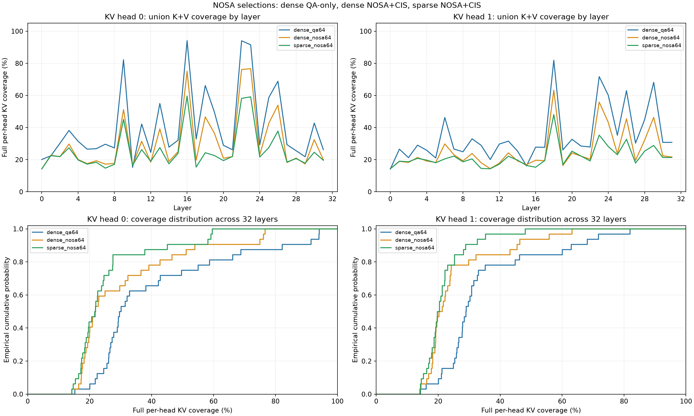
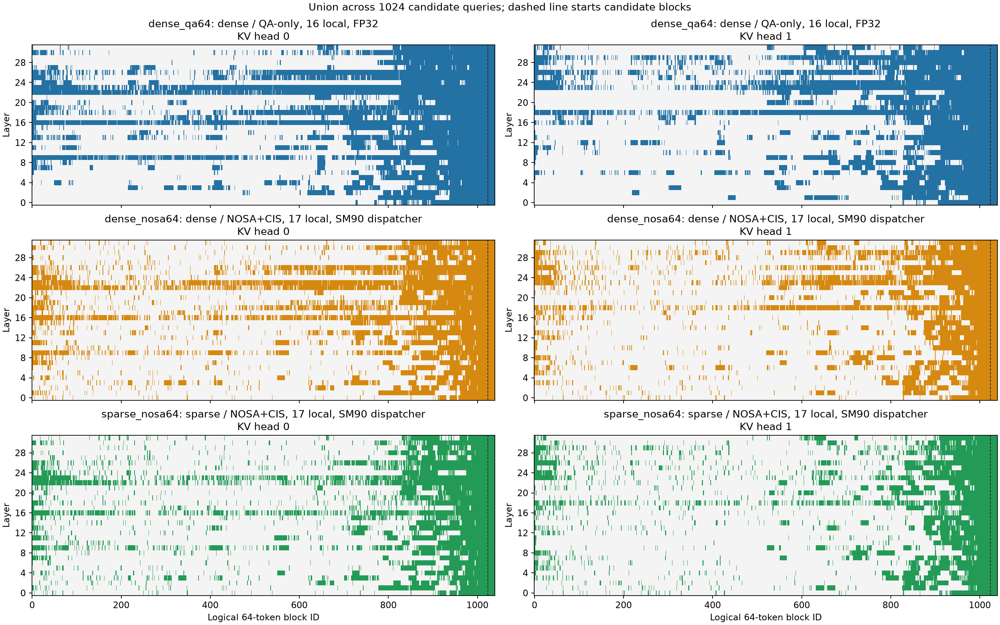
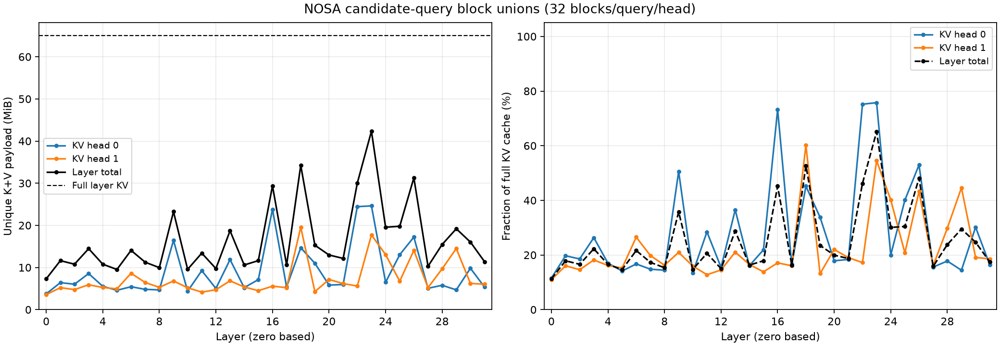
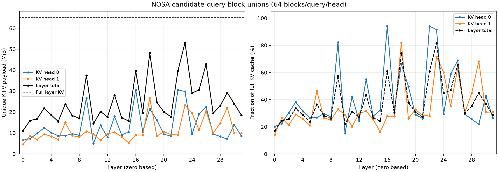
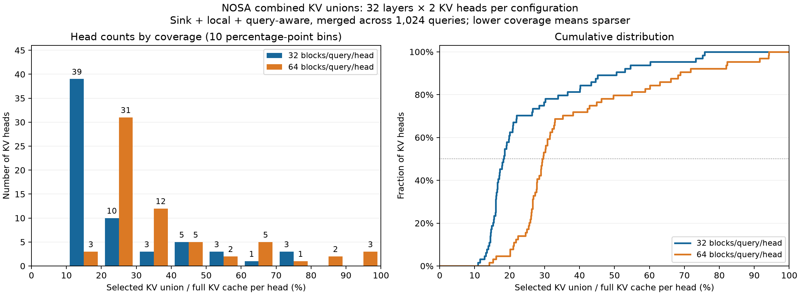
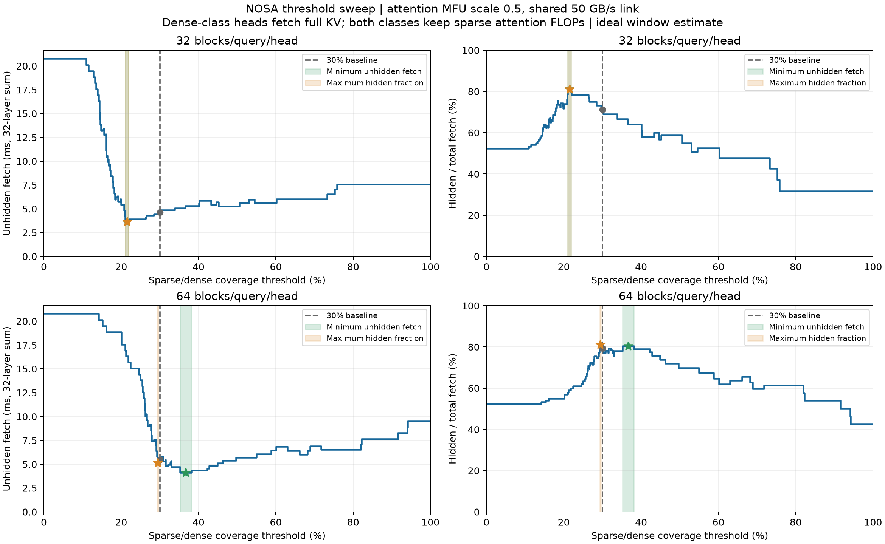

# NOSA indexer pattern：GR 65536 + 1024

## 实验目的与测量边界

测量 NOSA-8B 在同一 GR 请求上的稀疏选块并集：每个 candidate query、每层、每 KV head
先选块，再沿 1024 个 candidate queries 去重，统计 unique K+V payload。
2026-09-28 已补齐完整 NOSA 三组、QA32、QA64 重分析，以及分解、分布和依赖新 dense
性能输入的计算/传输窗口估算。完整三组的并集依次为 **788.34375 / 583.46875 /
494.875 MiB**；它们分别对应 dense QA-only、dense full NOSA、实际 sparse full NOSA。

输入为 synthetic GR 内容，user 623、visit 0、seed 42：instruction 28 + history 65508
组成 65536-token prefix，candidate suffix 为 1024 tokens，总计 66560。
三组与 QA32 读取本次 dense run 保存的请求；其原始字节与保留 QA64 请求完全一致，SHA256 为
`0bbabf07bc72f9804dbc2e9644cf708e21eafe237631f4a56c64b20f9cda7f2f`。

容量只计每个 `(layer, KV head, logical block)` 一次的 K+V；不同层/head 的同号块分别计费。
不计 CIS、indexer 读取、KV 写入、元数据、重复 fetch 或缓存命中。
本实验不测模型质量、sparse 延迟、吞吐、总线流量或 offloading；后文时间是基于新 dense
测量的离线模型。所有模型采集均不执行 LM head 或自回归生成。
模型上下文仅在实验进程内从 32768 覆盖到 66560，保留原 LongRoPE factors。

## 配置、硬件与来源

NOSA-8B：32 layers、32 Q heads / 2 KV heads、D128、BF16、64-token block；prefix 按
1024 tokens 分块，candidate 只执行一次 1024-token forward。
每个 head 的完整 KV 为 1040 blocks / 32.5 MiB，每层为 65 MiB，模型合计 **2080 MiB**。
一个块的 K+V 为 `64 × 128 × 2 × 2 = 32768 B`。

本次 GPU 采集使用 `CUDA_VISIBLE_DEVICES=1`，进程内设备为 `cuda:0`：H20Z/H200、SM90、
132 SM，PyTorch 报告 UUID `a2e4882b-3248-6018-14ab-90e45b5a5b04`，驱动 570.124.06。
PyTorch `2.12.1+cu130`（CUDA 构建版本 13.0）、Triton 3.7.1、FlashInfer 0.6.18、NumPy 2.5.0、
Matplotlib 3.11.1、safetensors 0.8.0、tokenizers 0.23.2。
checkpoint/tokenizer 为 `/mnt/ssd-wlcb/chenkaiqi/NOSA-8B`；输入、权重和源码哈希保存在 metadata。

| 内容 | Run ID | 性质 |
| --- | --- | --- |
| 完整 NOSA 三组 | `nosa_sparse_pattern_h200_gpu1_20260928_01` | 新 GPU 采集 |
| QA32 | `qa32_h200_gpu1_20260928_01` | 新 GPU 采集 |
| QA64 原始选择 | `query_aware_fp32_65536_1024_20260925_01` | 保留有效 GPU 采集 |
| QA64 图表与汇总 | `qa64_reanalysis_20260928_01` | 原始数组的新 CPU 分析 |
| 新旧环境 QA64 对照 | `qa64_environment_compare_20260928_01` | 新三组 QA64 与原始数组逐元素比较 |
| 32 / 64 分解 | `components32_pcie50_20260928_01` / `components64_pcie50_20260928_01` | CPU 分析 |
| 32 / 64 分布 | `distribution32_64_20260928_01` | CPU 分析 |
| Dense 性能来源 | `dense_h200_gpu1_20260928_01` | 新 GPU 测量，见 [dense 实验](../nosa_gr_65536_1024/README.md) |
| 32 / 64 时间估算 | `estimate32_h200_pcie50_20260928_01` / `estimate64_h200_pcie50_20260928_01` | 新 dense 输入的离线估算 |
| 原 MFU overlap | `overlap32_64_full_mfu_20260928_01` | 离线估算 |
| 半 MFU overlap | `overlap32_64_half_mfu_20260928_01` | 离线估算 |
| 半 MFU 阈值扫描 | `threshold32_64_half_mfu_20260928_01` | 离线估算 |

QA32 与三组均无计时预热、每条轨迹采集一次；三组各额外重放一次 suffix，检查 observer
不改变输出，重放不作为性能重复。离线分析无 GPU 前向或计时预热/重复。
时间来源 dense 实验每阶段预热 2 次、基准重复 5 次取中位数；模块时间来自其独立详细 nsys 区间。

保留 QA64 的采集时间为 2026-09-25 15:25 UTC，H200/SM90、132 SM，GPU UUID
`2522820c-89d9-aa17-f79c-ca8cc767fb77`，PyTorch `2.10.0+cu132` / CUDA 13.2。
它与新 QA32 的依赖不同。本次三组中的 `dense_qa64` 已在当前环境重新产生同一请求的选择；
其 `block_ids.npy`、`valid_mask.npy`、`union_mask.npy` 与保留 QA64 **逐元素完全相同**，
不一致元素均为 0，请求字节、checkpoint 哈希、模型配置也相同。
[环境对照记录](report/qa64/environment_comparison.json) 支持本请求上的 QA64 复现，
不把它推广为不同环境下一般性的逐位一致保证。
QA64 原始目录保持不变，新图表在复制的输入上生成；
[重分析来源](report/qa64/analysis_provenance.json) 与原 capture metadata 分别保留。

## 完整 NOSA 三组

补测状态（2026-09-29）：当前已接入 KDA native score、selection 和 attention
检查点，**改动后未运行本节完整 NOSA pattern 实验**。下方保留原 run ID、实现版本与结果，
待新实现验收并重采 sparse 传播后再替换；独立 QA-only dense 旁路分析不因这次 native
算子改动失效。尚未将候选局部性能或数值检查作为新的 pattern 结果。

正确性边界更新（2026-09-29）：原 `020961b` 与优化中的 native attention 均在
大 QK/CIS 抵消、或 CIS 带大公共偏移的有限输入上超出既有误差容限。原因是
缩放/加法融合的舍入差异，以及减去最大值前转换到 base-2 造成的小差值丢失。
当前已修复为先按 FP32 分别舍入 QK 缩放与 CIS 加法，再在原单位中减去最大值。
旧结果不能证明这些边界输入上的正确性，也不能作为修复后实现的性能结果；
本次确认并未表明旧运行的实际输入触发该问题。原产物保留至修复后的完整补测验收。

同日还确认 native score 在有限 QK logits 带大公共偏移时存在同类精度问题：
BF16 的独立构造用例相对 FP32 reference 偏差为 2.54%，超出既有 0.8% 相对容限。
当前 score 已改为自然单位最大值及差值后 base-2 转换，并已通过数值回归；旧 score
结果同样不能证明该输入边界的正确性，原运行是否受影响须按其实际输入另行核验。

另确认原 native attention 的未归一化 PV 累加在极大但有限的 BF16 V 上可能溢出。
当前检查点已接入按实际 token 数缩放 V、归一化后恢复尺度及最终 dtype 转换保护，
并完成 361 项 GPU 回归和 18 组完整模块归因检查。旧报告不能证明上述边界的正确性；
尚无证据表明原实验输入触发这些问题，原产物保留至受影响实验补测验收后再替换。

当前已验收实现与未完成事项见 [实现检查点](../../docs/nosa_sm90_checkpoint.md)；
完整模块 run `kda_main_bf16_pair_v3_development` 的原始摘要和源码指纹已在
[模块检查点报告](../nosa_kernel_mfu/README.md#完整模块检查点) 发布。
该三层模块测量不替代本节原实验，原表格数字及 run ID 保持原测量含义。

| 组别 | Prefix / candidate 传播 | Indexer 与选择来源 |
| --- | --- | --- |
| `dense_qa64` | 全程 dense，不加 CIS bias | FP32 QA-only：1 sink + 16 inclusive local + 47 QA；旁路记录 |
| `dense_nosa64` | 与上一组同一次 dense 前向、同一 Q/K/CIS | 完整 NOSA SM90 dispatcher：17 inclusive local，QA 阶段含 mandatory 共 33 块，再由 CIS 补满 64；旁路记录 |
| `sparse_nosa64` | 全程实际 resident block sparse，含 CIS bias | 同一完整 indexer；记录 attention 实际收到的 selection，不重新选块 |

两条传播轨迹从独立空 cache 构建完整 prefix，统一严格加载 A/delta。
dense 轨迹替换 main attention 为 dense adapter，禁用模型内 indexer；CIS 供旁路打分，
不加入 dense attention。sparse 轨迹使用原 indexer/attention 和独立 cache。
QA-only reference 按 64 queries 分批，完整 NOSA 使用 1024-query batch。

原 metadata 的 `indexer_backend="triton"` 是模型接口标签，它进入 SM90 dispatcher，
不代表纯 Triton 实现。实际启动命令未覆盖 `CXLDSAGR_SM90_BACKEND`；保存的源码默认选择
native，支持的 attention 走 CUDA/CuTe，短 score 等不满足 native 条件的调用回退 Triton。
对于 1024-query score batch，压缩窗口数至少 2047 且布局受支持时才进入 native。
两个 full-NOSA 组在同一进程使用相同设置。
[执行来源记录](report/sparse_compare/execution_provenance.json) 保存实际命令与调度源码哈希。
这是启动命令和源码证据：原运行没有完整记录继承环境，也未逐 kernel 观察 launch，
因此不能把默认调度解释写成逐次 kernel 后端实测。原 capture metadata 未修改。

| 组别 | Unique K+V MiB | 完整 KV 覆盖率 | Prefix MiB | Candidate MiB |
| --- | ---: | ---: | ---: | ---: |
| Dense QA-only64 | 788.34375 | 37.9011% | 756.34375 | 32 |
| Dense full NOSA64 | 583.46875 | 28.0514% | 551.46875 | 32 |
| Actual sparse full NOSA64 | 494.87500 | 23.7921% | 462.87500 | 32 |

从 dense QA-only 到 dense full NOSA，并集减少 204.875 MiB、覆盖率减少 9.8498 个百分点。
这同时改变 local 边界、QA/CIS 分配和评分算术，不能单独归因为 CIS。
从 dense full NOSA 到实际 sparse full NOSA，并集再减少 88.59375 MiB、4.2593 个百分点；
它反映 block mask、CIS bias 和后续激活变化组成的完整传播路径差异。
三组均覆盖全部 candidate 块。本请求中的容量缩减不直接等于延迟或带宽收益。
两条轨迹的 observer 重放输出最大绝对差均为 0，输出有限；第 0 层两组 full-NOSA 选择相同。





来源：上述三组 run 的 `comparison.json`、逐层/head CSV 与图表原样复制到 `report/sparse_compare/`。
完整 [JSON](report/sparse_compare/comparison.json)、[逐层对照](report/sparse_compare/layer_comparison.csv)、
[逐 head 对照](report/sparse_compare/head_comparison.csv) 保留精确数据。

## QA-only 的 32 / 64 blocks

该 policy 在 dense 激活的 RoPE 后 Q/K 上旁路运行，不改变 dense attention。
K 采用 32-token / stride-16 mean compression；逐 Q head FP32 softmax，再做 GQA 求和与五窗口
max pooling。TF32 关闭；相同分数优先较小 block ID。固定 1 sink + 16 local（含当前块），
其余分别选 15 / 47 个 query-aware blocks，不启用 query-agnostic/CIS。
它与完整 NOSA 的 17-local、QA 阶段保留 33 块再用 CIS 补足 64 块的 policy 分开分析。

| 预算 | Unique K+V MiB | 完整 KV 覆盖率 | Prefix MiB | Candidate MiB | 单 head 并集块数范围 |
| ---: | ---: | ---: | ---: | ---: | ---: |
| 32 | 526.65625 | 25.3200% | 494.65625 | 32 | 114–788 |
| 64 | 788.34375 | 37.9011% | 756.34375 | 32 | 147–979 |

32-block 观测并集比 64-block 少 261.6875 MiB；完整输入、模型与 QA-only policy 之外的
预算固定项相同，当前环境的 QA64 选择复现证据见前节。
两组的 65536 个 `(layer, query, KV head)` 选择均满足预算数、唯一性与因果约束。
单 query 的预算比例不能代表 1024-query 并集：部分 head 的选择覆盖了大部分历史。





数据：[QA32 汇总](report/qa32/summary.json)、[QA32 逐 head](report/qa32/head_stats.csv)、
[QA64 汇总](report/qa64/summary.json)、[QA64 逐 head](report/qa64/head_stats.csv)。
对应 `report/qa32/` 和 `report/qa64/` 还保存逐层 CSV、union heatmap 与 SVG。

### Sink/local 与 query-aware 分解

先分别跨 queries 合并固定部分与 QA 部分，再求二者交集。单个 query 的两部分不重叠，
但某块可在较早 query 中属于 local，滑出 local 窗口后在较晚 query 中被 QA 选中，
因此两种 union 不能直接相加。

| 预算 | Sink MiB | Local MiB | Fixed union MiB | QA union MiB | 交集 MiB | 额外 QA MiB | Combined MiB |
| ---: | ---: | ---: | ---: | ---: | ---: | ---: | ---: |
| 32 | 2 | 62 | 64 | 492.21875 | 29.56250 | 462.65625 | 526.65625 |
| 64 | 2 | 62 | 64 | 754.34375 | 30.00000 | 724.34375 | 788.34375 |

按 50 GB/s 计算，固定部分为 1.342177 ms，额外 QA 部分分别为 9.702605 / 15.190589 ms。
这些是 payload / 假定带宽，不是传输计时。重建 combined union 与原选择逐元素一致。
[32 分解](report/components32/decomposition.json)、[64 分解](report/components64/decomposition.json)
以及各目录的逐层/head CSV、`component_capacity_fetch.png` / `.svg` 来自本次两组分解 run。

### 所有 layer / KV heads 的分布

每个 `(layer, KV head)` 等权提供一个样本，共 64 个；分母为该 head 的完整 KV。
分位数使用线性插值。32 / 64 的均值分别为 25.32% / 37.90%，中位数为 18.27% / 29.47%，
P90 为 48.96% / 68.64%，最大值为 75.77% / 94.13%。平均值不能描述高覆盖 head 的开销。



来自 `distribution32_64_20260928_01`；
[完整统计](report/distribution/distribution.json)、[样本表](report/distribution/head_coverage.csv)、
[直方图](report/distribution/histogram.csv)。

## 基于新 dense 输入的时间与 fetch 模型

所有性能输入来自 `dense_h200_gpu1_20260928_01`，不沿用已清理的旧 dense 数字。
对 QA32/64 保持各层本次 dense attention 的 MFU，其他层内 GPU 模块保留该层实际时间。
H200 BF16 dense 分母为 989 TFLOPS，32 层 dense attention 聚合 MFU 为 **62.7828%**。
矩阵 FLOPs 按 token causal 有效对数计算；计算量由每个 query 的选择决定，跨 query union
只用于 fetch，不能拿 25.32% / 37.90% 的 union 覆盖率缩放 attention FLOPs。

| 项目，32 层合计 | QA32 | QA64 |
| --- | ---: | ---: |
| Sparse / dense attention FLOPs | 3.05306% | 6.15381% |
| Sparse attention GPU 工作估算 ms | 1.743537 | 3.514309 |
| 其他 decoder GPU 模块 ms | 23.561164 | 23.561164 |
| Decoder GPU 工作估算 ms | 25.304701 | 27.075473 |
| Unique KV fetch，50 GB/s，ms | 11.044782 | 16.532767 |
| Full KV fetch，50 GB/s，ms | 43.620762 | 43.620762 |

Embedding/final norm 另计 0.012032 ms；包含它们的模型 GPU 模块估算分别为 25.316733 /
27.087505 ms。模块时间按 nsys 活动 duration 之和，不等于 GPU 活动并集或端到端墙钟。
模型不含 indexer、host gap、fetch 或调度成本，也不假设计算与传输重叠。
50 GB/s = 50,000,000,000 B/s，两个 KV heads 共用一个带宽；每层 full KV fetch 为
1.3631488 ms。当前块按完整块计费，若只 fetch 历史 prefix，每层均减去 candidate 的
1 MiB / 0.02097152 ms；JSON 同时保存 prefix-only 口径。

[QA32 时间估算](report/estimate32/estimates.json)、[QA64 时间估算](report/estimate64/estimates.json)
与两目录的 `layer_estimates.csv`、`head_fetch_estimates.csv`、`time_estimates.png` / `.svg`
均来自本次新 estimate runs，未执行 sparse kernel 或 DMA 测量。

### 30% 分界与计算/传输窗口

每 head 按 `union / full KV < 30%` 分类为 sparse，等号归 dense。
sparse 类传 selected union，dense 类传 full KV；分类不改变 attention FLOPs。
每层可隐藏时间为 `min(sparse fetch, 当前层 attention) + min(dense fetch, 前一层非attention)`。
层 0 没有前驱预取窗口，所有 heads 共用一个带宽，每个窗口只计一次。
不计 indexer、启动开销、首块等待和资源争用，分类提前已知；这是理想窗口模型。

| 预算 | Attention MFU scale | Sparse / dense heads | Fetch ms | Hidden ms | Unhidden ms | Hidden / fetch | 计算 + 未隐藏 ms |
| ---: | ---: | ---: | ---: | ---: | ---: | ---: | ---: |
| 32 | 1 | 49 / 15 | 16.112681 | 9.918733 | 6.193948 | 61.5586% | 31.498648 |
| 64 | 1 | 34 / 30 | 26.276004 | 18.793438 | 7.482565 | 71.5232% | 34.558039 |
| 32 | 0.5 | 49 / 15 | 16.112681 | 11.470032 | 4.642649 | 71.1864% | 31.690886 |
| 64 | 0.5 | 34 / 30 | 26.276004 | 20.822433 | 5.453570 | 79.2451% | 36.043353 |

MFU scale 0.5 使 attention 时间翻倍、非 attention 不变。更多传输被隐藏来自计算变慢；
最后一列的预算反而增加，不能仅凭隐藏比例上升声称性能更好。最后一列也不是实测延迟。
[原 MFU 结果](report/overlap_full_mfu/overlap.json)、[半 MFU 结果](report/overlap_half_mfu/overlap.json)
及对应目录中的逐层 `layer_overlap.csv`、逐 head `head_classes.csv` 保存两类分别核算的数据。

### 半 MFU 下的阈值扫描

沿用 MFU scale 0.5、共享 50 GB/s，穷尽 `[0,100]%` 内所有分类区间，并另存整数阈值样本。
32 / 64 分别有 59 / 60 个分类区间。除包含 0 的首区间外均左开右闭；相同 coverage 同时切换。
阈值不改变计算时间，因此最小化未隐藏 fetch 与最小化“计算 + 未隐藏”具有相同最优区间。
最大化 `hidden / fetch` 的分母随阈值变化，目标可能不同。

| 预算 / 目标 | 最优阈值区间 | 可选阈值 | Sparse / dense | Unhidden ms | Hidden / fetch | 计算 + 未隐藏 ms |
| --- | --- | ---: | ---: | ---: | ---: | ---: |
| 32，最短预算与最高隐藏比例 | (21.057692%, 21.923077%] | 21.5% | 43 / 21 | 3.621006 | 81.0864% | 30.669244 |
| 64，最短预算 | (35.192308%, 38.173077%] | 37% | 45 / 19 | 4.125001 | 80.5150% | 34.714784 |
| 64，最高隐藏比例 | (29.326923%, 29.615385%] | 29.5% | 32 / 32 | 5.138329 | 81.1332% | 35.728112 |

区间端点分别为 `(219/1040, 228/1040]`、`(366/1040, 397/1040]`、
`(305/1040, 308/1040]`。按最短预算选取 21.5% / 37%，相较 30% 的未隐藏 fetch 分别减少
22.01% / 24.36%，计算加未隐藏预算减少 3.22% / 3.69%。这些阈值只描述本请求与当前假设。



来自 `threshold32_64_half_mfu_20260928_01`；
[完整结果](report/threshold/threshold_sweep.json)、[分类区间](report/threshold/threshold_regions.csv)、
[整数采样](report/threshold/threshold_samples.csv)、[选定方案逐层数据](report/threshold/selected_layers.csv)。

## 运行与调用模块

从仓库根目录执行，模型/分析依赖来自仓库环境，分析组为 `uv sync --group analysis`。
使用新的 run ID，GPU 编号按可用设备选择。原始 GPU 采集命令为：

```bash
CUDA_VISIBLE_DEVICES=1 PYTHONDONTWRITEBYTECODE=1 PYTHONUNBUFFERED=1 \
  bash experiments/nosa_indexer_pattern_65536_1024/scripts/sparse_compare.sh \
  nosa_sparse_pattern_h200_gpu1_20260928_01 \
  --request-file experiments/nosa_gr_65536_1024/output/data/dense_h200_gpu1_20260928_01/request.json

CUDA_VISIBLE_DEVICES=1 bash experiments/nosa_indexer_pattern_65536_1024/scripts/run.sh \
  qa32_h200_gpu1_20260928_01 --block-budget 32 \
  --request-file experiments/nosa_gr_65536_1024/output/data/dense_h200_gpu1_20260928_01/request.json
```

GPU 脚本支持 `--help`、`--request-file`、`--model-path`、`--device`，单组另支持
`--block-budget 32|64`。三组可显式加 `--baseline-data-dir` 进行保留 QA64 的附加并集核对；
原始请求字节也必须相同。要固定某次新运行的 dispatcher 设置，可显式设置
`CXLDSAGR_SM90_BACKEND=native` 或 `triton`，并为该次运行使用新 run ID。

离线链的输入变量与命令如下；实际使用的 run ID 见来源表，复现时更换输出 ID：

```bash
pattern_data=experiments/nosa_indexer_pattern_65536_1024/output/data
dense_data=experiments/nosa_gr_65536_1024/output/data/dense_h200_gpu1_20260928_01
qa32_data="$pattern_data/qa32_h200_gpu1_20260928_01"
qa64_data="$pattern_data/query_aware_fp32_65536_1024_20260925_01"
pattern_scripts=experiments/nosa_indexer_pattern_65536_1024/scripts

bash "$pattern_scripts/decompose.sh" new_components32 --pattern-data-dir "$qa32_data" --bandwidth-gbps 50
bash "$pattern_scripts/decompose.sh" new_components64 --pattern-data-dir "$qa64_data" --bandwidth-gbps 50
bash "$pattern_scripts/distribution.sh" new_distribution --pattern-data-dir "$qa32_data" --pattern-data-dir "$qa64_data"
bash "$pattern_scripts/estimate.sh" new_estimate32 --dense-data-dir "$dense_data" --pattern-data-dir "$qa32_data"
bash "$pattern_scripts/estimate.sh" new_estimate64 --dense-data-dir "$dense_data" --pattern-data-dir "$qa64_data"
bash "$pattern_scripts/overlap.sh" new_overlap_full --estimate-data-dir "$pattern_data/new_estimate32" \
  --estimate-data-dir "$pattern_data/new_estimate64" --threshold-pct 30 --bandwidth-gbps 50 --attention-mfu-scale 1
bash "$pattern_scripts/overlap.sh" new_overlap_half --estimate-data-dir "$pattern_data/new_estimate32" \
  --estimate-data-dir "$pattern_data/new_estimate64" --threshold-pct 30 --bandwidth-gbps 50 --attention-mfu-scale 0.5
bash "$pattern_scripts/threshold_sweep.sh" new_threshold --estimate-data-dir "$pattern_data/new_estimate32" \
  --estimate-data-dir "$pattern_data/new_estimate64" --baseline-threshold-pct 30 --bandwidth-gbps 50 --attention-mfu-scale 0.5
```

QA64 重分析先将保留采集完整复制到新 run 的系统临时 staging，再运行
`python -m experiments.nosa_indexer_pattern_65536_1024.src.analyze <staging/data>`，核对
union 与原数组相同后发布。原 capture metadata 保持原样，独立 `analysis_provenance.json`
记录新分析 ID、输入/分析源码哈希与依赖；不能在原有效目录直接重跑会覆盖 union 的 analyze。
新旧 QA64 的逐元素比较程序快照位于其分析 run 的 `source/`，比较本身不执行模型。

所有已有 shell 入口在系统临时目录完成后才发布成功产物，拒绝覆盖 run ID，失败诊断留在
终端提示的临时目录。输出为 `output/data/<run_id>/`（数组、metadata、JSON/CSV、图表、源码）、
`output/log/<run_id>/`（独立 stdout/stderr）、`output/profile/<run_id>/`（本实验无 profiler）。
报告素材从表中对应成功 run 的 data 目录选取后原样复制到 `report/`，上述图片也保留 SVG；
JSON 保留完整精度、假设与来源。受影响的旧性能数字不参与本次估算。

调用模块：完整三组为 [sparse_capture.py](src/sparse_capture.py) 与
[sparse_compare.py](src/sparse_compare.py)；单组为 [capture.py](src/capture.py)、[analyze.py](src/analyze.py)；
分解/分布为 [decompose.py](src/decompose.py)、[selection_parts.py](src/selection_parts.py)、
[distribution.py](src/distribution.py)；时间链为 [estimate.py](src/estimate.py)、
[dense_timing.py](src/dense_timing.py)、[overlap.py](src/overlap.py)、[threshold_sweep.py](src/threshold_sweep.py)。
模型调用 `models.nosa.model` / `models.nosa.indexer` 和 `executor.model_executor.run_chunks`，
请求校验复用 `experiments.indexer_block_sparse_profile.src.capture.validate_request`；
执行边界、源码哈希及 FLOPs 复用 dense 实验的 `execution_split`、`source_hashes`、`matrix_flops`。
