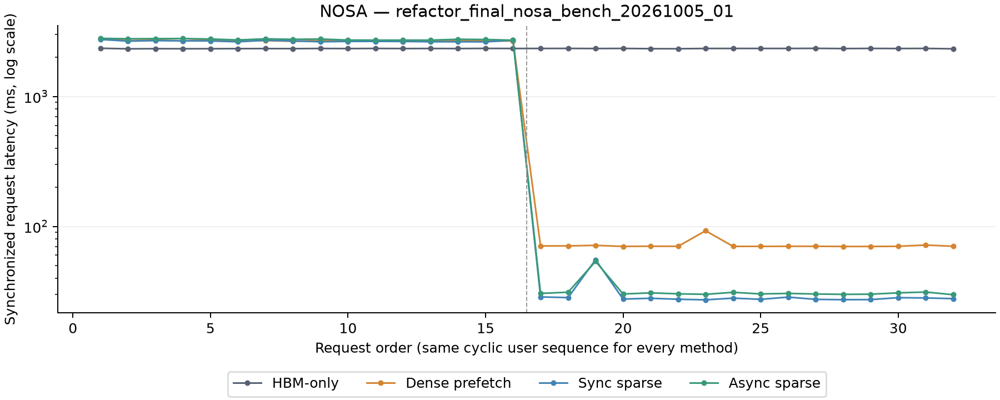
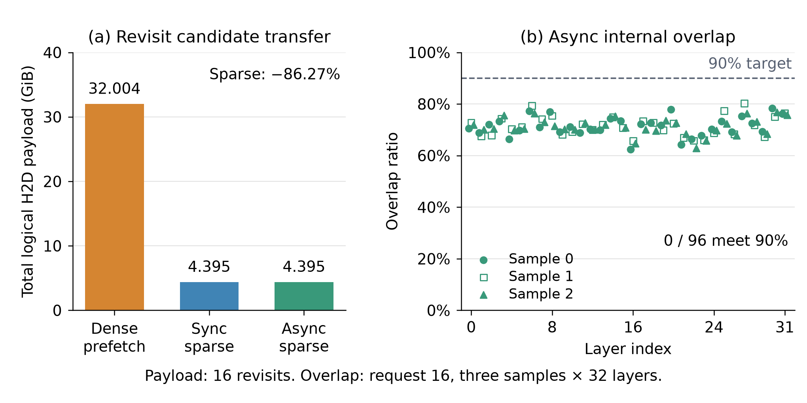

# NOSA motivation：历史保留、稀疏搬运与异步重叠

本实验属于论文 motivation。它使用完整 32 层 NOSA checkpoint，在固定 history、
变化 candidate 的负载中，比较 HBM-only、dense prefetch、sync sparse 和 async
sparse，分别检验历史保留、按需搬运和计算／搬运重叠的作用。

数值验收、正式计时与侵入式 profile 使用独立进程。当前结果同时保留三种来源：
原已发布测量、同机重新运行的重构前 P0，以及重构后的三次正式 trace。只有后两组
使用匹配的执行与计时边界来判断重构影响；原已发布结果用于交代新旧数字，不把
不同 placement 或计时入口的差值全部归因于重构。

正式计时、匹配 profile 和独立 API 参照已完成并发布。数值与测量完整性通过；
异步方案的复访加速和逐样本 90% 重叠目标均未通过。

对每轮 16 次复访先求均值，再取三轮中位数，sync sparse 为 **29.568 ms**，
dense prefetch 为 **71.980 ms**，HBM-only 为 **2342.511 ms**。
三个 offload 方案每轮均命中全部 16 次复访；P=H 的 HBM-only 在顺序访问时持续淘汰并重建。
sync 相对 dense 的复访延迟降低 **58.92%**。
async 的复访均值中位数为 **31.952 ms**，比 sync 高
**8.06%**，在该复访负载下，异步方案未降低延迟。

重构后的完整 trace 中位总耗时为 206,944.563 ms，P0 为 206,538.430 ms，
增加 406.132 ms。两组的三轮极差分别为 409.043 与 223.016 ms。准入、清理和部分
candidate／复访阶段仍有耗时增加，详见下表与独立复核；不能据此声称重构没有性能代价。
本次没有跑满显存或 NH，也没有建立真实 GR 负载代表性与任务质量结论。

## 实验问题与对照设计

| 方案 | backend scheme | 历史管理与搬运方式 |
| --- | --- | --- |
| HBM-only | `hbm` | P-token 历史配额，按用户 session LRU 淘汰，无 host KV |
| Dense prefetch | `dense_prefetch` | DRAM 保留历史，独立 stream 将下一层缺失历史页搬入该层 P 槽 |
| Sync sparse | `serial_sparse` | 一次搬入完整 query batch 的去重稀疏并集，再计算 attention |
| Async sparse | `overlap` | 搬运同一稀疏并集，同时执行 native attention |

三个 offload 方案共享逐层 P 容量，命中的历史页不重复搬运。当前 NOSA fixed 路径
要求 H≤P，history 与 prefill chunk 按 64 token 对齐；它使用直接映射，不提供
任意容量下的 token LRU。NH 按历史页准入，host backing 随 session 分配。
candidate 在 GPU 临时空间整批执行后 discard，保留的 history 不变；CIS 与派生
尾部仍计入 session storage。

| 配置 | 取值 |
| --- | --- |
| 模型与精度 | 完整 32 层 NOSA checkpoint，BF16，含 CIS 的完整 sparse policy |
| H／A／历史 chunk C | 65,536／128／1,024 tokens |
| 用户与访问 | 合成请求，16 用户固定顺序循环两轮，seed 42 |
| P／NH | 65,536／16,777,216 tokens |
| 预热 | 每方案独立访问用户 0、1、0，然后清空用户 cache |
| 正式计时 | 每方案 32 请求；P0 与当前实现各独立重复三轮 |
| 输出 | 全部 128 个 candidate token 的 normalized hidden，不执行 LM head |
| 独立 profile | 请求 0、16，各方案各 3 个样本；编号从 0 开始 |

首次／复访按用户访问次数划分，历史淘汰后再次访问仍计为复访。P/H=1 使 HBM-only
只能保留一个历史，这是指定配额的结果，不是 H200 的物理容量上限。NH/H=256
也是配额；本次只保留 16 个历史，占 6.25%，没有运行满 NH 的容量轨迹。

H/A/C、访问顺序、seed 和 P/NH 与 DeepSeek motivation 对齐。DeepSeek 使用 C10
checkpoint 工作负载替身并执行末 token LM head，NOSA 使用完整 32 层且不执行
LM head，相同 trace 参数不代表相同计算量。两者均未建立真实 GR 场景代表性或
任务质量结论。4K／16K history 暂停补测，原有有效证据保留其原始来源与范围。

## 历史保留与完整请求延迟

正式 wall time 包含 token 校验／上传、准入／淘汰、miss 时的 history 构建、candidate
执行与清理。`extend_ms` 保留 backend 内部 discard、lease drain 和原有输出 clone，
不包含另列的 runner cleanup。计时不包含权重加载、输入生成、预热、数值对照、保存
输出和侵入式诊断。默认 bench 复用已验证的收据，不在样本间重做完整参考。

下表的 P0／当前列为各轮组内均值的三轮中位数，极差来自同组三轮均值；单位为 ms。
旧发布列保留原有测量与 placement，不能把其与当前的差值直接归因于重构。

| 方案 | 访问 | 旧发布 | P0 | 当前 | 当前−P0 | P0 极差 | 当前极差 |
| --- | --- | ---: | ---: | ---: | ---: | ---: | ---: |
| hbm | 首访 | 2338.156 | 2341.024 | 2340.204 | -0.820 | 9.554 | 3.823 |
| hbm | 复访 | 2321.743 | 2339.101 | 2342.511 | +3.410 | 10.041 | 1.770 |
| dense_prefetch | 首访 | 2685.632 | 2687.375 | 2693.265 | +5.890 | 14.978 | 12.296 |
| dense_prefetch | 复访 | 71.594 | 71.786 | 71.980 | +0.195 | 0.118 | 0.098 |
| sync_sparse | 首访 | 2664.894 | 2663.782 | 2669.825 | +6.042 | 13.449 | 6.556 |
| sync_sparse | 复访 | 29.321 | 29.121 | 29.568 | +0.447 | 0.583 | 0.126 |
| async_sparse | 首访 | 2758.953 | 2744.305 | 2754.456 | +10.151 | 4.285 | 15.603 |
| async_sparse | 复访 | 31.405 | 31.971 | 31.952 | -0.019 | 0.045 | 0.210 |

三轮对照的输入、首次／复访分类、cache 计费、配额与 H2D 一致。全部 128 个匹配
请求的 cleanup 中位数增加。另用相邻的 P0→当前 pair04 复核：完整 trace 分别为
206,951.116／207,339.714 ms，增加 388.599 ms（0.18777%）；所有八个组的
cleanup 均值增加 28.648–129.511 µs。pair04 两侧总耗时都高于各自原三轮中位数，
因此该差值仍不构成完整的因果分解。

HBM 首访 candidate extend 的三轮差值为 +0.110724 ms，pair04 为 +0.109374 ms；
dense 复访完整请求分别增加 0.194520／0.745889 ms。报告保留这些残余开销，
不以总体波动或较快的个别阶段抵消它们。在通用 CPU mock 中，两次 audit 的耗时增量
与该 mock cleanup 的增量接近。这个诊断未覆盖真实 NOSA storage scan、lease 或 CUDA，
不能据此对完整 serving 的全部差值作因果归因。

三版本表格及其逐请求数值见[三版本对照](report/three_version/results.md)、
[请求样本](report/three_version/request_samples.csv)和
[配置、来源与计时边界](report/three_version/comparison.json)。这些文件保留表格重算所需的
原始数值；旧运行目录清理后，完整的旧源码／数值输出审计不能仅由这三份文件重做。
新增 pair04 保留独立 run ID，不混入预先指定的三轮中位数；其阶段与监控证据另见
[独立审计](../../docs/agents/acceptance/unified_runtime_20261005/nosa_pair04_independent_review.json)。




两图均来自 `refactor_final_nosa_bench_20261005_01`。第一张图每组包含 16 个请求；
第二张图保留全部请求和长尾，纵轴使用对数刻度。bench01 的 HBM／dense／sync／async
完整 trace 总耗时分别为 74,923.444／44,218.711／43,220.317／44,582.092 ms。

以上单次轨迹图采用预先选定的 bench01。图中均值和下文内存观测来自这一轮，
上表的均值中位数来自三轮，两者分别报告。

三轮区间用于描述同机重复测量的波动，不是统计置信区间。不删除长尾，不把独立
profile 的时间替换成正式请求时间。相对 HBM 的复访加速若主要来自避免重建，应与
同样保留历史的三种 offload 方案之间的差异分别解释。

## 稀疏搬运与内部重叠

H2D 指标是 candidate 的逻辑主 KV payload 软件计数，不是 PCIe 总线实测流量。
sync 与 async 使用同一完整 query batch 的去重并集；dense 的搬运范围更大，
attention 仍使用原稀疏选择。

| 方案 | bench01 的 16 次复访 candidate H2D（bytes） | GiB | 复访均值（ms） |
| --- | ---: | ---: | ---: |
| Dense prefetch | 34,363,932,672 | 32.003906 | 71.903 |
| Sync sparse | 4,718,657,536 | 4.394592 | 29.568 |
| Async sparse | 4,718,657,536 | 4.394592 | 31.925 |

sparse payload 比 dense 减少 86.27%。bench01 的 async 复访延迟比 sync 高 7.97%；
三轮均值中位数的差异为前述 8.06%。两种统计都未显示 async 的端到端收益。



内部区间来自独立运行 `refactor_final_nosa_profile_20261005_02`，共 24 条 timeline
记录和 12 条内部工作记录。请求 16 的 3×32 个 async 层样本均未达到两项 0.9 目标；
page／stripe ratio 逐行相同，最小值、中位数、最大值分别为
0.623384／0.711009／0.802902。请求 0 的另外 96 个样本没有 host fetch，单独记为 null。
逐样本数据见 [async_overlap.csv](report/final/async_overlap.csv)，完整性和目标分别见
[验收结果](report/final/acceptance.json)。A1024 的
[单层 overlap 实验](../nosa_offload_overlap/README.md)使用不同工作负载，不能替代这里的 A128 结果。

内部 ratio 使用 device globaltimer 记录实际 copy 与 softmax-update 工作区间。
page envelope 是本页非空 stripe 的最早开始与最晚结束；stripe-copy 指标只计
非空 stripe 的实际搬运窗口。整个 fused kernel 窗口不同时充当 copy 与 compute
区间，softmax-update 也不代表全部 attention 工作。0.9 是逐样本工程目标；
无 host fetch 的样本记为 null。测量完整性通过不表示重叠或端到端收益目标通过。

## 实现效率、数值与内存

下表使用 bench01 的 HBM 请求 0、16 作为无 profiler wall time 分母；两次都因配额
淘汰而重建 history。峰值计算率取 BF16 989.5 TFLOP/s，完整请求与 candidate 的
useful matrix FLOPs 分别为 1,166,661,887,459,328 和 2,351,618,326,528。
candidate 列使用 `extend_ms`，包含 backend discard／drain，排除准入、history 构建和
另列的 runner cleanup。

| 请求／范围 | Wall time（ms） | Wall MFU | 独立 FA3＋matrix（ms） | Wall MFU／组合参照 MFU |
| --- | ---: | ---: | ---: | ---: |
| 0／完整请求 | 2353.533356 | 50.096669% | 2347.256745 | 0.997333 |
| 16／完整请求 | 2344.728021 | 50.284801% | 2347.328041 | 1.001109 |
| 0／candidate | 16.097616 | 14.763505% | 12.129760 | 0.753513 |
| 16／candidate | 16.817585 | 14.131472% | 12.201056 | 0.725494 |

materialized QK／PV＋matrix 组合参照单列：两个完整请求分别为
4230.536234／4230.075306 ms，candidate 为 12.648416／12.187488 ms。
独立 attention 运行 `refactor_final_nosa_attention_reference_20261005_01` 捕获 2,112
次调用，复用 2,048 次历史调用；32 个最终 prefix 层的输入相同，useful FLOPs 覆盖完整。
组合与分母见 [API 对照](report/final/api_comparison.json)，逐 timeline 记录见
[profile 汇总](report/final/profile_summary.json)。这些数值不构成自动效率通过判定。

独立 GEMM／BMM 与 FA3 API 中位数之和是组合参照，不是实际执行的另一条完整请求
或理论上限。完整请求与 candidate 分别使用自己的 FLOPs 和无 profiler wall time。
必要的非矩阵工作、host 工作及执行相互影响没有被独立组合完整覆盖，不能把两者
相减直接归为 CPU launch 开销。materialized QK／PV 参照单列，不用较慢实现来
证明完整模型已经高效。

独立数值验收覆盖全部 128 个请求的完整 candidate hidden；其中 96 个 offload 请求
对照独立 HBM 结果，最大绝对差为 0。通过数值验收不表示性能目标通过。

bench01 的模型加载后 allocated／reserved／设备已用量分别为
15.246635／15.248047／15.762756 GiB。完整运行观测如下：

| 方案 | PyTorch peak allocated（GiB） | PyTorch peak reserved（GiB） | 请求后设备已用量最大采样值（GiB） |
| --- | ---: | ---: | ---: |
| hbm | 18.839923 | 24.078125 | 24.831116 |
| dense_prefetch | 19.989842 | 25.330078 | 26.147522 |
| serial_sparse | 19.989294 | 25.318359 | 26.137756 |
| overlap | 19.989294 | 25.318359 | 26.137756 |

原始值与 cache charge 见 [memory.csv](report/final/memory.csv)。cache 计费包含图的
private reservation，不能把这个 charge 直接解释为纯 tensor payload。

allocated 与 reserved 分别报告峰值，设备已用量只报告采样边界的最大值。模型
加载后的内存独立列出；普通 activation 未单独测峰，不能通过减去 cache 预留来
推算。每个 offload 用户的逻辑主 K/V 为 2 GiB，16 份 history 为 32 GiB；session
准入按 H+A 的 pinned 档位保守预留约 64 GiB，不等于实际 host allocation。
完整容量账本与模型差异见 [cache 管理报告](../cache_management/README.md)。

## 环境、来源与复现

当前测量使用 GPU 3 的 NVIDIA H200（SM90，132 SM），CPU 24–31、NUMA 0，8 线程。
环境为 Python 3.12.13、PyTorch 2.12.1+cu130、CUDA 13.0、Triton 3.7.1、
FlashInfer 0.6.18、cuBLAS 13.1.1.3。完整 checkpoint 位于本机
`/mnt/ssd-wlcb/chenkaiqi/NOSA-8B`。

| 用途 | run ID／来源 |
| --- | --- |
| 原已发布结果 | `nosa_motivation_poolscan_sm90_20261004_01`；必要比较数值保存在 `report/three_version/` |
| 重构前 P0 | `refactor_p0_nosa_bench_20261005_01`、`02`、`03` |
| 当前正式计时 | `refactor_final_nosa_bench_20261005_01`、`02`、`03` |
| 独立相邻复核 | `refactor_p0_nosa_bench_20261005_04`／`refactor_final_nosa_bench_20261005_04` |
| 当前 profile | `refactor_final_nosa_profile_20261005_02` |
| 独立 attention 参照 | `refactor_final_nosa_attention_reference_20261005_01` |
| 报告／汇总图／轨迹图 | `refactor_final_nosa_publication_20261005_02`／`refactor_final_nosa_summary_20261005_02`／`refactor_final_nosa_plots_20261005_01` |

测量源码集合 SHA-256 为
`4665ccce226af23f631e619f748369cea28d4a09b99c1947cbb6b030e58f120c`。
[独立数值收据](../../docs/agents/acceptance/unified_runtime_20261005/nosa_final/receipt.json)
的文件 SHA-256 为 `34ee0a120712d353bd57dc350c3667f5ce2f2fc2b8a1607aa1f1a9f00c405bc5`。
[正式计时记录](../../docs/agents/acceptance/unified_runtime_20261005/nosa_final_bench_ledger.json)
保存实际命令、环境和退出状态；[发布命令](report/final/command.json)保留实际分析参数。
独立 check、bench、profile 分别从以下入口运行，参数帮助可直接查看：

```bash
python -m experiments.nosa_motivation.src.measure --help
python -m experiments.nosa_motivation.src.profile --help
python -m experiments.nosa_motivation.src.profile_attention_reference --help
```

从保留数据重新生成报告和图片时使用尚未占用的输出目录：

```bash
python -m experiments.nosa_motivation.src.publish \
  --bench experiments/nosa_motivation/output/data/refactor_final_nosa_bench_20261005_01 \
  --profile-data experiments/nosa_motivation/output/data/refactor_final_nosa_profile_20261005_02 \
  --profile-dir experiments/nosa_motivation/output/profile/refactor_final_nosa_profile_20261005_02 \
  --attention-data experiments/nosa_motivation/output/data/refactor_final_nosa_attention_reference_20261005_01 \
  --output-dir /tmp/nosa_motivation_report_rebuild
python -m experiments.nosa_motivation.src.render_motivation_summary \
  --input-dir /tmp/nosa_motivation_report_rebuild \
  --output-dir /tmp/nosa_motivation_figures_rebuild
python -m experiments.nosa_motivation.src.plot \
  experiments/nosa_motivation/output/data/refactor_final_nosa_bench_20261005_01 \
  --output-dir /tmp/nosa_motivation_trajectory_rebuild
```

[最终发布清单](report/publication_manifest.json)绑定 README、选定数据、三版本对照及
图表的字节哈希。`report/final/publication.json` 保留实际生成器的原始清单；其中
`source/` 相对路径以 `output/data/refactor_final_nosa_publication_20261005_02/` 为基准。
报告进程的 helper 清单记录已加载仓库模块对应文件当时的磁盘字节，与原 GPU 执行和
native 构建身份分开保存，不将后续报告修正追认为测量时的源码。
发布后的 import 排序和换行整理另见
[源码差异记录](../../docs/agents/acceptance/unified_runtime_20261005/static_style_source_delta.json)；
该记录保留整理前后的文件，没有改写原数值收据，也没有重新测量 GPU 性能。

离散 GPU 进程监控只能说明采样时未发现其他计算进程，不能证明连续独占；它也不
记录 CPU 活动、时钟或利用率。采样间隔与未观测时段的限制随运行证据保留。

实现启用 projection／finish 的纯计算 CUDA Graph；attention 与 fetch 留在图外。
图准备不计入请求延迟，static allocation 与 private reservation 计入内存。
短 prefix guarded validation、finite 检查、numerical repair、事务与必要同步均保留。
allocator snapshot 使用 `private_cpp`，pool-referrer 使用 `cpython_native`；每次
运行检查仍获取 fresh snapshot。单条缓存仅复用不可变的分配声明与 footprint，
不复用运行审计结果或用户状态。执行与必要清理同时失败时保留全部异常，不自动
恢复请求、重试或切换 provider。

测量入口复用 `GR.workload`、`PersistentGRRunner` 和
`models.nosa.execution.fixed.NosaFixedServingBackend`，实验代码不实现模型计算。
profile 复用 `profile_audit`，内部工作区间审计使用
`experiments.nosa_offload_overlap.src.analyze`。源码、输入、native 二进制及依赖、
cache／graph 配置和精度由独立收据绑定；checkpoint 保留路径、大小和 mtime 清单，
不声称已计算全部权重的内容 hash。

bench 数据与源码快照在 `output/data/<run_id>/`，日志在 `output/log/<run_id>/`，
原始 trace 在 `output/profile/<run_id>/`。报告生成器的身份与测量源码分别记录。
表格、PNG／SVG／PDF 只从核验后的数据生成，不产生新的 GPU 性能结论。
