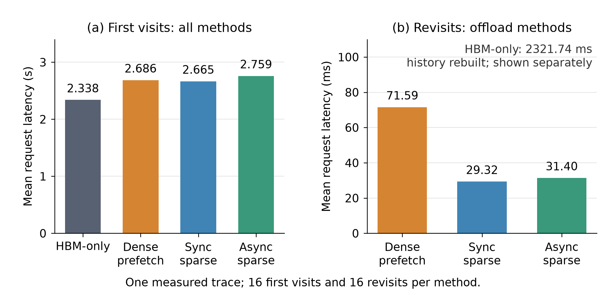
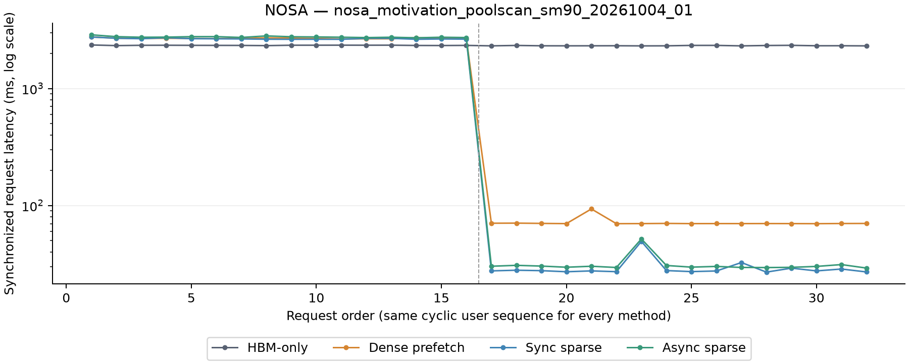

# NOSA motivation：历史保留、稀疏搬运与异步重叠

在固定 history、变化 candidate 的负载中，保留用户历史能避免复访时重新计算长前缀；
稀疏 attention 又使 candidate 只需读取部分历史 KV。本实验用完整 32 层 NOSA
checkpoint，比较 HBM-only、dense prefetch、sync sparse 和 async sparse，
分别检验历史保留、按需搬运和计算／搬运重叠带来的收益。

本目录属于论文 motivation 实验。当前入口已拆为独立 `check`、`bench` 和 `profile`：
`bench` 默认不复制、比较或保存每条请求的完整输出，必须提供匹配的独立验收收据。
**拆分后的入口尚未运行 GPU 实验**；下文所有性能数字、run ID、图表和原始数据均保留
原测量边界，不能视为新入口的测量结果。本次整理没有重跑实验。

当前 H64K、A128、16 用户两轮循环访问的结果支持前两项：三个 offload 方案都命中
16 次复访；sync sparse 的复访平均延迟为 **29.321 ms**，HBM-only 为
**2321.743 ms**，dense prefetch 为 **71.594 ms**。相对 dense prefetch，
sparse 将复访 candidate 的逻辑 H2D 搬运量减少 **86.27%**，sync 将延迟降低
**59.05%**。async 的复访延迟反而比 sync 高 **7.11%**，本次未观察到重叠带来的额外收益。

这些结论来自人为指定的 token 配额：P=H 使 HBM-only 只能保留一个用户历史，
并不表示 H200 的物理显存只能容纳一个历史。设备已用显存的边界采样约为 25–26 GiB，
本次没有跑满显存或 NH，也没有建立真实 GR 负载的代表性与任务质量结论。

本报告整理于 2026-10-05，沿用已验收的 2026-10-04 测量；新增图表只重绘已有数据。
本轮已按继续任务的要求恢复 H64K 优化诊断；4K／16K history 暂不补测，已有有效结果保留。
外部候选尚未接入正式实现，下文性能数字仍对应原 run ID。

## 实验问题与对照设计

本实验考察三个相互独立的问题。首先，在 HBM history 配额不足以保留整个访问集合时，
把历史保留在 CPU DRAM 能否减少复访重建？其次，在同样保留历史的条件下，只搬运当前
query batch 选中的历史 KV，能否降低传输量和延迟？最后，对同一份稀疏读取集合，
把搬运与 attention 重叠，能否进一步缩短完整请求？

| 方案 | backend scheme | 历史管理与搬运方式 | 对照作用 |
| --- | --- | --- | --- |
| HBM-only | `hbm` | P-token 历史配额，按用户 session LRU 淘汰，无 host KV | 配额不足时的历史重建代价 |
| Dense prefetch | `dense_prefetch` | 历史保留在 DRAM；独立 stream 将下一层缺失的历史页搬入该层 P 槽 | 保留历史、完整预取的参照 |
| Sync sparse | `serial_sparse` | 一次搬入完整 query batch 的去重稀疏并集，再计算 attention | 按需搬运的收益 |
| Async sparse | `overlap` | 搬运同一稀疏并集，同时执行 native attention | 重叠是否带来额外收益 |

三个 offload 方案共享相同的逐层 P 容量设定，使用有限历史槽位；dense 要求 H≤P，
命中的历史页不重复搬运。NH 按 64-token 对齐的历史页准入，host backing 随 session
创建而分配，**NH 是配额，不是预分配空间**。candidate 在 GPU 临时空间整批执行，
完成后 discard，保留的历史不变。session indexer、映射、执行 workspace 和实际
物理内存仍须容纳；指定 P/NH 中没有扣除旧 cache 字节子预算或历史 allocator 差额。

| 配置 | 本次取值 |
| --- | --- |
| 模型与精度 | 完整 32 层 NOSA checkpoint，BF16，含 CIS 的完整 sparse policy |
| 历史 H／候选 A／历史 chunk C | 65,536／128／1,024 tokens |
| 用户与访问 | 合成请求，16 用户固定循环两轮，seed 42 |
| HBM history 配额 P | 每层 65,536 tokens |
| 全局 host history 配额 NH | 16,777,216 tokens |
| 预热与正式测量 | 各方案独立预热用户 0、1、0；清空用户 cache 后测量 32 个请求 |
| 输出 | 全部 128 个 candidate token 的 normalized hidden，无 LM head |
| 匹配 profile | 请求 0、16，各方案各 3 个样本；请求编号从 0 开始 |

正式结果只有一条完整 trace，没有重复 trace 的统计置信区间。首次／复访按用户访问次数
划分，历史被淘汰后的再次访问仍计为复访。P/H=1；NH/H=256 是按 token 页配额计算的
用户数，本次只保留 16 份历史，占 NH 的 **6.25%**，未验证装满 256 份历史的物理可行性。

H/A/C、用户数、轮次、seed、P/NH 与 `deepseek_v32_motivation` 对齐。
DeepSeek 对照使用 checkpoint 工作负载替身且执行末 token LM head，NOSA 使用完整
32 层且不执行 LM head；相同 trace 参数不代表相同模型工作量，不能直接比较跨模型延迟。
旧通用 GR budget 实验已退出独立实验范围，见
[整理记录](../../docs/agents/system/experiment_organization.md#retired-gr-serving)。它的容量和
命中语义与本实验不同。固定历史方案能否代表真实 GR serving，仍待验证。

## 历史保留避免了复访重建

下表是同步计时的完整请求 wall time，包含准入、miss 时的历史构建、candidate 执行和
清理；每个首次／复访单元格各含 16 个请求，单位为 ms。

| 方案 | 首次平均延迟 | 复访平均延迟 | 复访命中 | 全 trace 淘汰数 | 复访相对 HBM 加速 |
| --- | ---: | ---: | ---: | ---: | ---: |
| HBM-only | 2338.156 | 2321.743 | 0/16 | 31 | 1.00× |
| Dense prefetch | 2685.632 | 71.594 | 16/16 | 0 | 32.43× |
| Sync sparse | 2664.894 | 29.321 | 16/16 | 0 | 79.18× |
| Async sparse | 2758.953 | 31.405 | 16/16 | 0 | 73.93× |



图中首次访问使用秒，offload 复访使用毫秒，两幅柱状图均从零开始。
HBM-only 的复访延迟单列为 2321.743 ms：循环再次访问某用户时，其历史已被淘汰，
必须重新构建。三个 offload 方案保留了全部 16 份历史，复访时可直接执行 candidate。
因此，相对 HBM 的数十倍加速主要体现保留历史、避免重建的收益，不能归因于异步重叠。

HBM-only 在首次访问时最快。计入首次构建成本后，32 个请求的总时间分别为
74.558 s、44.116 s、43.107 s 和 44.646 s，对应 HBM、dense、sync、async。
这些总时间只描述本次一半首次、一半复访的访问构成，收益会随复访比例和历史保留情况变化。



完整轨迹保留所有样本，纵轴使用对数刻度。dense 的第 21 个请求、sync／async 的
第 23 个请求出现复访长尾；其完整请求／candidate extend 分别为
93.415／90.496 ms、49.361／46.396 ms 和 51.793／48.827 ms。
三次均命中历史且未淘汰。candidate 延迟分别高于各方案复访 candidate 中位数
23.389、21.771、21.710 ms。profile 只覆盖零起始编号 0／16，整次 case 的
provider 计数也无法定位这些长尾，当前尚无原因归因。

数据：[逐请求结果](report/nosa_motivation_poolscan_sm90_20261004_01/per_request.csv)、
[分组结果](report/nosa_motivation_poolscan_sm90_20261004_01/summary.csv)、
[candidate 长尾](report/nosa_motivation_poolscan_sm90_20261004_01/candidate_tails.json)。

## 稀疏搬运减少传输，异步重叠尚无额外收益

在同样保留历史的三个方案之间，dense 与 sync 的比较体现按需搬运的收益。
下表累计正式 trace 的 16 次复访 candidate H2D **逻辑 payload**；这些是软件计数，
不等于测得的 PCIe 总线流量，也不包含首次构建历史时的传输。

| 方案 | 16 次复访 candidate H2D（bytes） | GiB | 复访平均延迟（ms） |
| --- | ---: | ---: | ---: |
| Dense prefetch | 34,363,932,672 | 32.003906 | 71.594 |
| Sync sparse | 4,718,657,536 | 4.394592 | 29.321 |
| Async sparse | 4,718,657,536 | 4.394592 | 31.405 |

sparse 的搬运量为 dense 的 **13.73%**，减少 **86.27%**；sync 的复访延迟为
dense 的 40.95%，降低 **59.05%**，即 **2.44×** 加速。这说明，在本次 A128
query batch 下，保留历史之后，对稀疏并集去重并按需读取还能进一步降低复访延迟。
实验没有单独分离 IO 时间，不能将全部延迟差额归为传输耗时。


左图来自无 profiler 的正式 trace，右图来自独立的匹配 profile，两者样本范围不同。
右图显示全部 **96 个有 host fetch 的 async 层样本**；page-envelope 与非空
stripe-copy 两种 overlap ratio 在本次数据中逐行相同，min／median／max 为
**0.621540／0.713207／0.790677**。每个样本的两种 ratio 都未达到 0.9。
另有 96 个无 fetch 的层样本，ratio 为 null，不纳入图中。

ratio 使用 device globaltimer 记录的实际 copy window 与 softmax-update 工作区间。
page envelope 是本页非空 stripe 的最早开始与最晚结束；stripe-copy 指标只计非空
stripe 的实际搬运窗口，不把间隙计为 copy。softmax-update 只覆盖 attention 的一部分，
整个 fused kernel 的执行窗口没有同时充当 copy 与 compute 区间。
0.9 是逐样本的工程验收目标，不代表理论最优重叠程度。

相对 sync，async 的复访平均延迟高 **7.11%**、首次高 **3.53%**、完整 trace
总延迟高 **3.57%**。当前实现既未达到内部 overlap 目标，也未带来整体延迟收益；
已有 A1024 算子级结果不能替代本次 A128 serving 对照。报告保留 async 作为合理对照，
不把“发生了部分重叠”表述为“重叠有效”。

匹配 profile 中每次稀疏复访的 candidate 逻辑主 KV payload 为 289,079,296 bytes，
不能与正式 trace 的 16 次复访总量混用。完整数据见
[全部 192 个 async 层样本](report/nosa_motivation_poolscan_sm90_20261004_01/async_overlap.csv)
和 [profile 复核](report/nosa_motivation_poolscan_sm90_20261004_01/profile_review.json)。

## 实现效率与数值、内存边界

### HBM MFU 与独立 API 参照

为检查 HBM 基线的实现效率，选取请求 0／16，与相同形状的独立 GEMM／BMM 和 FA3
sparse-attention API 计时比较。HBM 请求 16 也会重建历史。有效 FLOPs 包括实际执行
的 projection、压缩 score 矩阵以及 sparse causal QK／PV；完整请求分子为
1,166,661,887,459,328 FLOPs，candidate 为 2,351,618,326,528 FLOPs。

`MFU = useful FLOPs / (elapsed_seconds × 989.5e12)`，峰值采用声明的 H200
BF16 dense 989.5 TFLOP/s，不计硬件结构化稀疏加速。

| HBM 请求 | 完整 wall（ms） | 完整 MFU | FA3＋矩阵 API 组合（ms） | 实测 MFU／组合 MFU |
| --- | ---: | ---: | ---: | ---: |
| 0 | 2355.571 | 50.053% | 2360.927 | 100.227% |
| 16 | 2314.236 | 50.947% | 2361.004 | 102.021% |

| HBM 请求 | Candidate extend（ms） | Candidate MFU | FA3＋矩阵 API 组合（ms） | 实测 MFU／组合 MFU |
| --- | ---: | ---: | ---: | ---: |
| 0 | 16.203 | 14.667% | 12.172 | 75.118% |
| 16 | 16.643 | 14.280% | 12.249 | 73.599% |

完整请求 MFU 与组合参照接近，candidate 仍有差距。组合值是分别测量的 API 中位数
之和，含 FA3 prepare／repair，不是实际执行的另一条完整请求，也不是性能上限，
因此比例可以超过 100%。模型还包含 norm、activation、compression、selection、
cache 生命周期及 dispatch。candidate 的 4.032／4.394 ms 差额不能通过相减直接
归为 CPU launch 成本，完整请求的接近程度也不能代替 candidate 效率判断。

另保留 materialized QK／PV 参照：完整组合为 4243.858／4243.388 ms，MFU 比值
180.163%／183.360%；candidate 为 12.680／12.211 ms，比值 78.257%／73.372%。
该实现按 query 物化所选 KV 和 scores，较慢的完整组合本身不能充当效率验收依据。
两套数据均见 [API 对照](report/nosa_motivation_poolscan_sm90_20261004_01/api_comparison.json)。

当前数据也未证明“开销只剩计算与 IO”。例如 sync 请求 16 的正式 wall 为
27.613 ms，profile 外层 root 中位数为 44.341 ms，compute API 的 GPU span
中位数为 28.171 ms。API span 包含其内部 device gap，排除首个 GPU 活动之前的
host 工作；profile root 还包含诊断读取。区间与运行不同，不能相减来隔离 CPU 成本。
后续外部预提交／copy 诊断没有建立稳定的 serving 净收益，均未替换本报告实现。
descriptor 复用已完成两组 H64K 对照：相对匹配的外部 copy 实现，candidate 中位数
降低约 0.1 ms，66 份完整输出逐位一致。该候选尚未接入，局部收益不代表完整 serving
或 MFU 已达标。详见[效率诊断](../../docs/agents/system/nosa_candidate_efficiency_followup.md)、
[匹配 copy 对照](../../docs/agents/system/nosa_guarded_copy_control.md)和
[descriptor 复用结果](../../docs/agents/system/nosa_copy_descriptor_result.md)。

### 内存与容量

下表单位为 GiB，包含权重、compute graph 准备、共享资源和正式 trace。
PyTorch allocated／reserved 使用峰值，device-used 仅取记录边界采样的最大值。

| 方案 | Peak allocated | Peak reserved | Max sampled device-used |
| --- | ---: | ---: | ---: |
| HBM-only | 18.839923 | 24.078125 | 24.831116 |
| Dense prefetch | 19.989842 | 25.330078 | 26.147522 |
| Sync sparse | 19.989294 | 25.318359 | 26.137756 |
| Async sparse | 19.989294 | 25.318359 | 26.137756 |

每个 offload 方案保留 16 份历史后，逻辑 DRAM KV 为 **32 GiB**。按 32 层、
2 KV heads、head_dim 128 和 BF16 K/V 计算，每 token 每层 1,024 bytes，
一份 H64K 历史为 2 GiB。session 保守预留约 64 GiB，不是实际分配；allocator
缓存的 reserved 块仍占 HBM，device-used 边界采样也不是进程峰值。

本次比较使用明确的 token 配额，不是相同总物理字节预算下的容量前沿实验。
若将 NH 全部填满，仅逻辑主 K/V 就需 512 GiB，还须另计 indexer、映射、allocator
及 workspace；本次 16 用户结果没有验证这一满容量点。数据见
[内存表](report/nosa_motivation_poolscan_sm90_20261004_01/memory.csv)。

### 数值与测量验收

各方案从独立空 cache 构建 sparse history。重新读取全部 128 份 candidate 输出后，
96 次 offload／HBM 的完整 hidden 对照均逐值相同，max absolute error 为零，
也满足 atol=rtol=0.016。独立复核还检查了 history 身份、变化 candidate 的 discard、
LRU、源码／native 身份和实际分配／预留计费。正确性通过不代表性能目标或物理容量已通过。

24 次 timeline replay 与 12 次内部工作区间 replay 均通过完整性检查，36 份输出
与同方案正式结果完全一致。唯一读取及工作区间审计覆盖 52,932 个 page interval、
211,728 个非空 stripe interval、249,567 个 softmax interval 和全部
26,466 个 async page envelope。独立 API 复核覆盖 2,112 份 Q／selection、
64 份最终 KV payload、2,048 份 history reuse proof、17 个 replay-output hash、
44,352 次 API 计时及 88,704 个时钟样本；2,112 份完整 FA3 输出均精确匹配。
materialized QK／PV 数值检查每次抽样三个 batch row，未逐元素覆盖所有矩阵乘积。

详细证据：[正式测量复核](report/nosa_motivation_poolscan_sm90_20261004_01/measurement_review.json)、
[API 复核](report/nosa_motivation_poolscan_sm90_20261004_01/api_review.json)、
[综合验收](report/nosa_motivation_poolscan_sm90_20261004_01/acceptance.json)。

## 环境、来源与复现

本报告的三组已验收运行如下。新增汇总图不生成新的 GPU 运行结论。

| 证据 | Run ID |
| --- | --- |
| 无 profiler 的四方案测量 | `nosa_motivation_poolscan_sm90_20261004_01` |
| 各三样本的匹配 profile | `nosa_motivation_poolscan_profile_sm90_20261004_01` |
| 独立 attention／矩阵 API | `nosa_attention_poolscan_sm90_20261004_01` |

测量源码身份（118 个保存文件）：
`93061ceb297bfd27ec0bbf6ac21de13c75cc612ece1cb8b5855ec86d3548bb79`。
[发布清单](report/nosa_motivation_poolscan_sm90_20261004_01/publication.json)绑定原始源码、
输入和选定资产；原资产保留，CPU 汇总图另存于 `report/summary_20261005_01/`。

硬件为 NVIDIA H200、SM90、132 SMs、150,121,545,728 bytes，物理 GPU5，UUID
`GPU-a5cd5bab-33a4-a7e2-4a3c-78c2b08a8872`。进程绑定 CPU48–55、NUMA1；
OpenMP／MKL／OpenBLAS／PyTorch intra-op 各 8 线程，PyTorch inter-op 为 96。
软件为 Python 3.12.13、PyTorch 2.12.1+cu130、CUDA runtime 13.0、Triton 3.7.1、
FlashInfer 0.6.18、cuBLAS 13.1.1.3。native header／compiler 与实际映射库记录在
运行产物中。checkpoint shard 身份采用 size／mtime，未做全权重字节 hash；映射库
收据不标识 driver 生成的 device code。另一组 GR budget 在 GPU0／NUMA0 单独运行，
不同 placement 不保证共享节点完全没有干扰。

正式请求计时包含 token 校验／上传、准入／淘汰、miss 时历史构建、candidate 执行和
清理，candidate extend 包含 backend 执行与同步、原有公开输出 clone。
权重加载、trace 生成、预热、保存／校验输出所需的 CPU copy、数值检查、计数及诊断
读取、报告生成均在计时之外。独立 API 预热 3 次；linear GEMM 与 attention API
重复 7 次，matrix-reference BMM 重复 5 次。

已验收实现启用 projection／finish 的纯计算 CUDA graph、短 prefix 的 guarded
validation、private allocator snapshot adapter 和复用一次 current-stream 观测的
FA3 wrapper。graph 准备不计入延迟，但其分配和 private reserved 容量计入内存；
每个层／batch 都须 replay 两个 graph，无 eager fallback。attention／fetch 不在
这些 compute graph 内。

本系列验证 allocator snapshot provider 为 `private_cpp`、独立 pool-referrer
provider 为 `cpython_native`。正式、profile、API-capture 的整次 case 分别记录
12／74／5 次 filtered call，unfiltered／fallback／audit error 均为零；独立 API
benchmark 另有 build／artifact 证据，没有额外 provider-counter bracket。
这些计数不定位或计时单次请求的扫描，也不能推断其他 GR budget 运行使用的 provider。

当前命令从仓库根目录执行，须准备环境并使用新 run ID；`--compute-graphs` 仍须显式
传入。下例先做独立验收，再测性能，最后按需要采集诊断。整理期间没有执行这些命令。
相同实现和输入已有有效收据时，可直接复用，不必每次 bench 重做 check。

```bash
export CUDA_VISIBLE_DEVICES=5 CXLDSAGR_SM90_BACKEND=native
export OMP_NUM_THREADS=8 MKL_NUM_THREADS=8 OPENBLAS_NUM_THREADS=8
export PYTORCH_ALLOC_CONF=backend:native,pinned_use_cuda_host_register:True,pinned_num_register_threads:8
unset PYTORCH_CUDA_ALLOC_CONF PYTORCH_HIP_ALLOC_CONF FLASHINFER_DISABLE_JIT
export TMPDIR=/mnt/ssd-wlcb/chenkaiqi/.cxldsagr-tmp
nosa_measure_id=nosa_motivation_poolscan_sm90_YYYYMMDD_01
nosa_check_id=nosa_motivation_check_YYYYMMDD_01
nosa_profile_id=nosa_motivation_poolscan_profile_sm90_YYYYMMDD_01
nosa_api_id=nosa_attention_poolscan_sm90_YYYYMMDD_01
nosa_out=experiments/nosa_motivation/output
nosa_check_dir="$TMPDIR/cxldsagr-checks/nosa_motivation/data/$nosa_check_id"

numactl --physcpubind=48-55 --membind=1 \
  bash experiments/nosa_motivation/scripts/run.sh \
  --mode check --run-id "$nosa_check_id" --device cuda:0 \
  --model-path /mnt/ssd-wlcb/chenkaiqi/NOSA-8B \
  --history-tokens 65536 --candidate-tokens 128 --chunk-size 1024 \
  --num-users 16 --rounds 2 --sparse-pool-tokens 65536 \
  --host-arena-tokens 16777216 --seed 42 --compute-graphs

numactl --physcpubind=48-55 --membind=1 \
  bash experiments/nosa_motivation/scripts/run.sh \
  --mode bench --validation-receipt "$nosa_check_dir/receipt.json" \
  --run-id "$nosa_measure_id" --device cuda:0 \
  --model-path /mnt/ssd-wlcb/chenkaiqi/NOSA-8B \
  --history-tokens 65536 --candidate-tokens 128 --chunk-size 1024 \
  --num-users 16 --rounds 2 --sparse-pool-tokens 65536 \
  --host-arena-tokens 16777216 --seed 42 --compute-graphs --peak-bf16-tflops 989.5

numactl --physcpubind=48-55 --membind=1 \
  bash experiments/nosa_motivation/scripts/profile.sh \
  --run-id "$nosa_profile_id" --reference-run "$nosa_out/data/$nosa_measure_id" \
  --device cuda:0 --repeats 3

mkdir -p "$nosa_out/log/$nosa_api_id"
numactl --physcpubind=48-55 --membind=1 .venv/bin/python -B \
  -m experiments.nosa_motivation.src.profile_attention_reference \
  --run-id "$nosa_api_id" --device cuda:0 \
  --reference-run "$nosa_out/data/$nosa_measure_id" \
  --matrix-profile-run "$nosa_out/data/$nosa_profile_id" \
  --matrix-profile-dir "$nosa_out/profile/$nosa_profile_id" --output-root "$nosa_out" \
  >"$nosa_out/log/$nosa_api_id/stdout.log" 2>"$nosa_out/log/$nosa_api_id/stderr.log"
```

测量复用 GR 请求生成器、`PersistentGRRunner` 和
`models.nosa.fixed_serving.NosaFixedServingBackend`，实验代码不实现模型计算。
`profile`／`profile_attention_reference` 回放保存的 trace，使用 `profile_audit`；
内部工作区间验收导入 `experiments.nosa_offload_overlap.src.analyze`，
`evaluation.pool_scan_provenance` 绑定 pool provider 记录，输入由 `GR.workload` 生成。
完整执行环境、正确性命令、CPU 审计和发布检查见
[工程交接](../../docs/agents/system/nosa_pool_scan_publication.md)。

check 保存完整四方案多请求数值及正常生命周期证据，默认位于系统临时目录中的
`cxldsagr-checks/nosa_motivation/`，不生成性能报告。收据逐项匹配执行源码、实际输入、
P/NH、backend、计算图、native 二进制及依赖、精度和执行环境；checkpoint 沿用路径、
大小与 mtime 清单，不声称已计算全部权重的内容 hash。修改这些条件后须补相应验收。
运行时 finite 检查、numerical repair、事务、allocator 检查及必要同步仍保留。
profile 可以直接使用 check 目录，或从 bench 记录找到其收据；只有 check 证据时，
端到端性能门槛保持待测，wall MFU 及对应比值为空，不使用诊断时间代替正式延迟。

bench 原始数据与源码快照位于 `output/data/<run_id>/`，stdout／stderr 分别保存在
`output/log/<run_id>/`，Chrome trace 在 `output/profile/<profile_run_id>/`。
原测量表格与图表可在新目录中重建：

```bash
CUDA_VISIBLE_DEVICES= .venv/bin/python -B -m experiments.nosa_motivation.src.report \
  "$nosa_out/data/$nosa_measure_id" --output-dir /tmp/nosa_measurement_report_fresh
CUDA_VISIBLE_DEVICES= .venv/bin/python -B -m experiments.nosa_motivation.src.plot \
  "$nosa_out/data/$nosa_measure_id" --output-dir /tmp/nosa_measurement_figures_fresh
```

原图使用 `src.plot`，由外部 renderer 输入独立审计的正式行；PNG 配有 SVG。
选定 API／profile 表来自独立复核并绑定原始 hash。历史收据反映创建时的进度，
综合 `acceptance.json` 记录已完成的系列验收；性能门槛未通过仍是有效测量结果。

本次新增的两幅汇总图由 `src.render_motivation_summary` 从原
`summary.csv`／`async_overlap.csv` 重绘，使用现有 `analysis` 环境的 Matplotlib，
不加载模型或执行 GPU 计算。图源、衍生数据、PNG／SVG／PDF 和生成信息见
[汇总图 provenance](report/summary_20261005_01/provenance.json)。重绘入口：

```bash
CUDA_VISIBLE_DEVICES= .venv/bin/python -B \
  -m experiments.nosa_motivation.src.render_motivation_summary \
  --output-dir experiments/nosa_motivation/output/data/nosa_motivation_summary_YYYYMMDD_01
```

输出目录须为新目录或空目录，参数说明见该入口的 `--help`。图表同时提供
[延迟 SVG](report/summary_20261005_01/latency_focus.svg)／
[PDF](report/summary_20261005_01/latency_focus.pdf) 和
[搬运与 overlap SVG](report/summary_20261005_01/transfer_overlap.svg)／
[PDF](report/summary_20261005_01/transfer_overlap.pdf)。

实验逻辑检查入口为 `.venv/bin/python -m pytest -q experiments/nosa_motivation/tests`，
这类检查不能替代完整 checkpoint 正确性或 GPU 性能验收。
